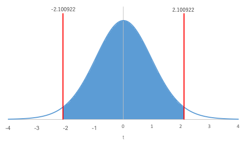
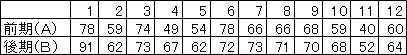

母平均の差に関する検定と推定
----------------------------

2つのグループのデータ（2つの<a href="../02/#sample">標本</a>）は、対応のないデータと対応のあるデータの2つの場合に分けることができます。2グループの母<a href="../01/#mean">平均</a>の差に関する検定や推定を行う場合、この対応の有無が重要になってきます。どちらなのか注意しましょう。

### 対応のないデータ

一方のグループのデータが他方のグループのデータとは無関係な場合のデータです。グループ内のデータの順番を入れ替えることができます。

例：2つの病棟間の最高血圧、2つのクラスの得点など

この対応のないデータの場合は、まず、2つの母集団の<a href="../01/#variance">分散</a>（母分散）同士が等しいと仮定できるか確認する、等分散性（homogeneity of variance）の検定を行います。その後、母<a href="../01/#mean">平均</a>に関する検定や推定を行いますが、等分散性を仮定できるか否かで用いる検定・推定法が異なります。

- 等分散を仮定する（Studentのt検定）
    - 2つの母平均の差に関する検定
    - 2つの母平均の差の推定
-  等分散を仮定しない（Welchのt検定）
    - 2つの母平均の差に関する検定
    - 2つの母平均の差の推定（省略）

### 対応のあるデータ

一方のグループのデータと他方のグループのデータとがペアになっている場合のデータです。グループ内のデータの順番を入れ替えることができません。

例：同一人物の最高血圧と最低血圧、同一人物の前期と後期の得点など

この対応のあるデータの場合は、<a href="#homogeneity_of_variance_test">等分散性の検定</a>を行わず、最初から母<a href="../01/#mean">平均</a>に関する検定と推定とを行うことができます。

- ２つの母平均の差に関する検定
- ２つの母平均の差の推定

等分散を仮定したときの2つの母平均の差の検定（対応のないデータ）
---------------------------------------------------------------

### 練習問題1

ある学校のＡ組とＢ組のテスト結果について調べたところ、以下のような<a href="../02/#sample">標本</a>が得られました。Ａ組とＢ組ではクラスの<a href="../01/#mean">平均</a>点に差があるといえるでしょうか。

表1：ある学校のテスト結果（点）

### 仮説の設定

* <a href="../02/#null_hypothesis">帰無仮説</a>H0：Ａ組とＢ組では<a href="../01/#mean">平均</a>点に差がない（$\mu_\text{A} = \mu_\text{B}$）
* <a href="../02/#alternative_hypothesis">対立仮説</a>H1：Ａ組とＢ組では平均点に差がないとは言えない（$\mu_\text{A} \ne \mu_\text{B}$）

ここで、$\mu_\text{A}$はＡ組全員のテスト結果を<a href="../02/#population">母集団</a>とする母平均、$\mu_\text{B}$はＢ組全員のテスト結果を母集団とする母平均です。

なお、後の<a href="#chapter9">検定統計量$t$の算出</a>では、Ａ組の<a href="../02/#sample_mean">標本平均</a>$\overline{x}\_\text{A}$とＢ組の標本平均$\overline{x}\_\text{B}$との差$\overline{x}\_\text{A} - \overline{x}\_\text{B}$を<a href="../02/#standardization">標準化</a>して$t$を求めます。そのため、$\mu_\text{A}$と$\mu_\text{B}$とを2つの値として扱うのではなく、$\mu_\text{A}$と$\mu_\text{B}$との差である$\mu_\text{A} - \mu_\text{B}$を1つの値として扱います。したがって、仮説を

* 帰無仮説H0：$\mu_\text{A} - \mu_\text{B} = 0$
* 対立仮説H1：$\mu_\text{A} - \mu_\text{B} \ne 0$

と表すほうが理解しやすいかもしれません。

### 有意水準$\alpha$の設定

<a href="../04/#chapter1">有意水準</a>$\alpha$ = 0.05とします。

### 共通分散$V_\text{AB}$の算出

Ａ組の<a href="../02/#population">母集団</a>が<a href="../01/#mean">平均</a>$\mu_\text{A}$、<a href="../01/#standard_deviation">標準偏差</a>$\sigma_\text{A}$の<a href="../02/#normal_distribution">正規分布</a>に従い、Ｂ組の母集団が平均$\mu_\text{B}$、標準偏差$\sigma_\text{B}$の正規分布に従うとすると、<a href="#difference"><q cite="#difference">Ａ組の標本平均$\overline{x}\_\text{A}$とＢ組の標本平均$\overline{x}\_\text{B}$との差$\overline{x}\_\text{A} - \overline{x}\_\text{B}$</q></a>は、平均$\mu_\text{A} - \mu_\text{B}$、標準偏差
$\displaystyle \sqrt{\frac{\sigma_\text{A}^2}{N_\text{A}} + \frac{\sigma_\text{B}^2}{N_\text{B}}}$
の正規分布に従うことがわかっています。
ここで、等分散性が成立し（$\sigma_\text{A}^2 = \sigma_\text{B}^2$）、
かつ、<a href="../02/#null_hypothesis">帰無仮説</a>（$\mu_\text{A} - \mu_\text{B} = 0$）の下では、
$\displaystyle \overline{x}\_\text{A} - \overline{x}\_\text{B}$
は平均0、分散
$\displaystyle \sqrt{\sigma^2 \left( \frac{1}{N_\text{A}} + \frac{1}{N_\text{B}} \right)}$
の正規分布に従うことになります。

なお、$\sigma^2$は$\sigma^2 = \sigma_\text{A}^2 = \sigma_\text{B}^2$であるような値です。
したがって、検定にあたっては<a href="../02/#standardization">標準化</a>した
$\displaystyle z = \frac{\overline{x}\_\text{A} - \overline{x}\_\text{B}}{\displaystyle \sqrt{\sigma^2 \left( \frac{1}{N_\text{A}} + \frac{1}{N_\text{B}} \right)}}$
を考えることになります。

しかし、$\sigma^2$も$\sigma_\text{A}^2$も$\sigma_\text{B}^2$も未知なので、<a href="../02/#sample">標本</a>から求める<a href="../01/#variance">不偏分散</a>Vで代用することになり、その結果、標準化した値は<a href="../02/#student_s_t-distribution">t分布</a>に従うことになります。さらに、算出できる不偏分散は、Ａ組の標本から求めた不偏分散$V_\text{A}$とＢ組の標本から求めた不偏分散$V_\text{B}$の2つで、必ずしも$V_\text{A} = V_\text{B}$が成立するとは限りません。そこで、$V_\text{A}$と$V_\text{B}$との平均とも言うべき共通分散$V_\text{AB}$を算出することになります。

共通分散$V_\text{AB}$は、Ａ組の標本の<a href="../01/#sum_of_squared_deviations">偏差平方和</a>$S_\text{A}$とＢ組の標本の偏差平方和$S_\text{B}$との和を、不偏分散$V_\text{A}$の自由度$\phi_\text{A}$と不偏分散$V_\text{B}$の自由度$\phi_\text{B}$との和$\phi$で割る、すなわち、以下の数式で求めることができます。
$\displaystyle V_\text{AB} = \frac{S_\text{A} + S_\text{B}}{\phi}$

* $\displaystyle S_\text{A} = \sum_{i=1}^{N_\text{A}} {\left( x_{\text{A}i} - \overline{x}\_\text{A} \right)}^2$
* $\displaystyle S_\text{B} = \sum_{j=1}^{N_\text{B}} {\left( x_{\text{B}j} - \overline{x}\_\text{B} \right)}^2$
* $x_{\text{A}i}$：Ａ組の標本の$i$番目の測定値
* $x_{\text{B}j}$：Ｂ組の標本の$j$番目の測定値
* $\overline{x}\_\text{A}$：Ａ組の標本平均
* $\overline{x}\_\text{B}$：Ｂ組の標本平均
* $\phi = \phi_\text{A} + \phi_\text{B}$：共通分散$V$の自由度
* $\phi_\text{A} = N_\text{A} - 1$
* $\phi_\text{B} = N_\text{B} - 1$
* $N_\text{A}$：Ａ組の<a href="../01/#sample_size">標本の大きさ</a>
* $N_\text{B}$：Ｂ組の標本の大きさ

### 検定統計量$t$値の算出

以下の数式で<a href="../02/#test_statistic">検定統計量</a>$t$値を求めます。
$\displaystyle t = \frac{\overline{x}\_\text{A} - \overline{x}\_\text{B}}{\sqrt{V_\text{AB} \left( \frac{1}{N_\text{A}} + \frac{1}{N_\text{B}} \right)}}$
ここで、$\overline{x}\_\text{A}$はＡ組の<a href="../02/#sample_mean">標本平均</a>、$\overline{x}\_\text{B}$はＢ組の標本平均、$V_\text{AB}$は<a href="chapter8">共通分散</a>、$N_\text{A}$はＡ組の<a href="../01/#sample_size">標本の大きさ</a>、$N_\text{B}$はＢ組の標本の大きさです。なお、この検定統計量$t$値は自由度$\phi$の<a href="../02/#student_s_t-distribution">t分布</a>に従うことがわかっています。

### p値の算出

<a href="../04/#chapter1">有意水準</a>と比較する確率p値を求めます。p値は、自由度$\phi$の<a href="../02/#student_s_t-distribution">t分布</a>において、$-t$未満の値が発生する確率と$t$より大きい値が発生する確率との和です。

### 判定

<dl>
 	<dt><a href="#p_of_t">p値</a> ≦ <a href="../04/#chapter1">有意水準</a>$\alpha$</dt>
 	<dd><a href="../02/#null_hypothesis">帰無仮説</a>H0を棄却する</dd>
 	<dt>p値 &gt; 有意水準$\alpha$</dt>
 	<dd>帰無仮説H0を受容する</dd>
</dl>

### Excelの操作

Excelを使って、<a href="#chapter5">練習問題1</a>に取り掛かりましょう。

&#9312; Ａ組のテスト結果とＢ組のテスト結果との間には<a href="#chapter2">対応がない</a>ので、まず<a href="#homogeneity_of_variance_test">等分散性の検定</a>を行います。<a href="../levene_s_test/">ここ</a>を参照して等分散性の検定を行ってください。

&#9313; 等分散性の検定を行った結果、等分散性であることがわかったので、<a href="#student_s_t-test">Studentのt検定</a>を行います。



<a href="../levene_s_test/">等分散性の検定</a>で使ったファイルに追記します。検定用の項目を入力し、既知のデータを入力します。



&#9314; 検定用のデータを算出するために、以下のように入力します。

* "N3"：<code>=AVERAGE(A3:A13)-AVERAGE(B3:B11)</code>（<a href="../02/#sample_mean">標本平均</a>の差）
* "N4"：<code>=COUNTA(A3:A13)</code>（<a href="../01/#sample_size">標本の大きさ</a>）
* "N5"：<code>=COUNTA(B3:B11)</code>（標本の大きさ）
* "N9"：<code>=(N4-1)+(N5-1)</code>（<a href="#chapter8">共通分散</a>の自由度$\phi$）
* "N6"：<code>=(DEVSQ(A3:A13)+DEVSQ(B3:B11))/N9</code>（共通分散）
* "N7"：<code>=SQRT(N6*(1/N4+1/N5))</code>（<a href="../01/#standard_error">標準誤差</a>）
* "N8"：<code>=STANDARDIZE(N3,N2,N7)</code>（<a href="../02/#standardization">標準化</a>）
* "N10"：<code>=T.DIST.2T(ABS(N8),N9)</code>（<a href="#p_of_t">p値</a>）



なお、<code>DEVSQ</code>関数は、与えられたデータの平均とそれぞれのデータとの差を二乗して合計した値、すなわち、<a href="../01/#sum_of_squared_deviations">偏差平方和</a>を求めます（<a href="https://support.office.com/ja-jp/article/DEVSQ-関数-8b739616-8376-4df5-8bd0-cfe0a6caf444"><code>DEVSQ</code>関数</a>）。また、<code>T.DIST.2T</code>関数に与える$t$値は非負数（$t$ ≧ 0）である必要があります。<code>N3</code>セルで差を求めているため、<code>N3</code>セルが負数になる可能性があり、その場合<code>N8</code>セルも負数になる可能性があるので、<code>N11</code>セルの<code>T.DIST.2T</code>関数では<code>ABS(N8)</code>としています。

#### 結果

<a href="#p_of_t">p値</a> = 0.04132が求まりました。下図の塗りつぶされた領域が全体に対してpの割合になっています。

設定した<a href="../04/#chapter1">有意水準</a>$\alpha$は0.05であるので、p値 = 0.04132 &lt; 有意水準$\alpha$ = 0.05となり、<a href="../02/#null_hypothesis">帰無仮説</a>H0は棄却されます。したがって、Ａ組とＢ組で点数の母<a href="../01/#mean">平均</a>には差があると判断します。

等分散を仮定したときの2つの母平均の差の推定（対応のないデータ）
---------------------------------------------------------------

母<a href="../01/#mean">平均</a>の差$\mu_\text{A} - \mu_\text{B}$について<a href="../02/#interval_estimation">区間推定</a>する場合、母平均の差$\mu_\text{A} - \mu_\text{B}$の(1 - $\alpha$) × 100%<a href="../02/#confidence_interval">信頼区間</a>は以下の式で与えられます。

$\displaystyle (\overline{x}_A-\overline{x}_B)-t(\phi,\alpha)\sqrt{V(\frac{1}{n_A}+\frac{1}{n_B})}<\mu_A-\mu_B<(\overline{x}_A-\overline{x}_B)+t(\phi,\alpha)\sqrt{V(\frac{1}{n_A}+\frac{1}{n_B})}$

### Excelの操作

<a href="#chapter5">練習問題1</a>のＡ組の母<a href="../01/#mean">平均</a>とＢ組の母平均との差$\mu_\text{A} - \mu_\text{B}$が取り得る範囲について、95%<a href="../02/#confidence_interval">信頼区間</a>で考えてみましょう。

&#9312; 推定用の項目を追記し、既知のデータを入力します。



&#9313; 推定用のデータを算出するために、以下のように入力します。

* "N15"：<code>=T.INV.2T((1-N14),N9)</code>（<a href="../02/#critical_value">臨界値</a>）
* "N16"：<code>=N3-N15*N7</code>（<a href="../02/#lower_confidence_limit">下側信頼限界</a>）
* "N17"：<code>=N3+N15*N7</code>（<a href="../02/#upper_confidence_limit">上側信頼限界</a>）



### 結果

Ａ組の母<a href="../01/#mean">平均</a>とＢ組の母平均との差$\mu_\text{A} - \mu_\text{B}$の95%<a href="../02/#confidence_interval">信頼区間</a>は0.813116 &lt; $\mu_\text{A} - \mu_\text{B}$ &lt; 36.21719と求まりました。<a href="../02/#lower_confidence_limit">下側信頼限界</a>は0.813116、<a href="../02/#upper_confidence_limit">上側信頼限界</a>は36.21719で、下図の塗りつぶされた領域が全体の95%になっています。

等分散を仮定しないときの2つの母平均の差の検定・推定（対応のないデータ）
-----------------------------------------------------------------------

等分散を仮定しないときは、検定のみ説明し、推定に関しては省略します。

### 練習問題2

ある学校のＣ組とＤ組のテスト結果について調べたところ、以下のような<a href="../02/#sample">標本</a>が得られました。Ｃ組とＤ組ではクラスの<a href="../01/#mean">平均</a>点に差があるといえるでしょうか。

表2：ある学校のテスト結果（点）

### 仮説の設定

* <a href="../02/#null_hypothesis">帰無仮説</a>H0：Ｃ組とＤ組では<a href="../01/#mean">平均</a>点に差がない（$\mu_\text{C} = \mu_\text{D}$）
* <a href="../02/#alternative_hypothesis">対立仮説</a>H1：Ｃ組とＤ組では平均点に差がないとは言えない（$\mu_\text{C} \ne \mu_\text{D}$）

ここで、$\mu_\text{C}$はＣ組全員のテスト結果を<a href="../02/#population">母集団</a>とする母平均、$\mu_\text{D}$はＤ組全員のテスト結果を母集団とする母平均です。

なお、<a href="#chapter4">等分散を仮定したとき</a>と同様に、<a href="#chapter21">検定統計量$t^*$値の算出（Welchのt検定）</a>では、Ｃ組の<a href="../02/#sample_mean">標本平均</a>$\overline{x}\_\text{C}$とＤ組の標本平均$\overline{x}\_\text{C}$との差$\overline{x}\_\text{C} - \overline{x}\_\text{D}$を扱います。同様に、<a href="#chapter6">2つの母平均を扱うのではなく、差を1つの値として扱う</a>ので、ここでも

* 帰無仮説H0：$\mu_\text{C} - \mu_\text{D} = 0$
* 対立仮説H1：$\mu_\text{C} - \mu_\text{D} \ne 0$

と表すほうが理解しやすいかもしれません。

### 有意水準$\alpha$の設定

<a href="../04/#chapter1">有意水準</a>$\alpha$ = 0.05とします。

### 検定統計量$t^*$値の算出（Welchのt検定）

以下の数式で<a href="../02/#test_statistic">検定統計量</a>$t^*$値を求めます。

$\displaystyle t_0=\frac{\overline{x}\_C-\overline{x}\_D}{\sqrt{\frac{V_C}{n_C}+\frac{V_D}{n_D}}}$

<a href="#chapter4">等分散を仮定したとき</a>と同様に、Ｃ組の<a href="../02/#population">母集団</a>が<a href="../01/#mean">平均</a>$\mu_\text{C}$、<a href="../01/#standard_deviation">標準偏差</a>$\sigma_\text{C}$の<a href="../02/#normal_distribution">正規分布</a>に従い、Ｄ組の母集団が平均$\mu_\text{D}$、標準偏差$\sigma_\text{D}$の正規分布に従うとすると、Ｃ組の<a href="../02/#sample_mean">標本平均</a>$\overline{x}\_\text{C}$とＤ組の標本平均$\overline{x}\_\text{C}$との差$\overline{x}\_\text{C} - \overline{x}\_\text{D}$は、平均$\mu_\text{C} - \mu_\text{D}$、標準偏差

$\displaystyle \sqrt{\frac{\sigma_\text{C}^2}{N_\text{C}} + \frac{\sigma_\text{D}^2}{N_\text{D}}}$

の正規分布に従うことがわかっています。ここで、<a href="../02/#null_hypothesis">帰無仮説</a>の下（$\mu_\text{C} - \mu_\text{D} = 0$）では、$\overline{x}\_\text{C} - \overline{x}\_\text{D}$は平均0、標準偏差

$\displaystyle \sqrt{\frac{\sigma_\text{C}^2}{N_\text{C}} + \frac{\sigma_\text{D}^2}{N_\text{D}}}$

の正規分布に従うことになり、検定にあたっては<a href="../02/#standardization">標準化</a>した

$$\displaystyle z=\frac{\overline{x}_C-\overline{x}_D}{\sqrt{\frac{\sigma_\text{C}^2}{N_\text{C}} + \frac{\sigma_\text{D}^2}{N_\text{D}}}$$

を考えることになります。しかし、母<a href="../01/#variance">分散</a>$\sigma_\text{C}^2$、$\sigma_\text{D}^2$は未知なので、<a href="#t*">上の$t^*$の式</a>ではそれぞれ<a href="../01/#variance">不偏分散</a>$V_\text{C}$、$V_\text{D}$を用いています。なお、<a href="#welch_s_t-test">Welchのt検定</a>では、この検定統計量$t^*$が<a href="#chapter22">等価自由度$\phi^*$</a>の<a href="../02/#student_s_t-distribution">t分布</a>に近似的に従うことがわかっています。

### 等価自由度$\phi^*$の算出

以下の数式で、等価自由度$\phi^*$を求めます。

$\displaystyle \phi^* = \frac{\displaystyle {\left( \frac{V_\text{C}}{N_\text{C}} + \frac{V_\text{D}}{N_\text{D}} \right)}^2}{\displaystyle \frac{V_\text{C}}{N_\text{C}^2} \frac{V_\text{C}}{\phi_\text{C}} + \frac{V_\text{D}}{N_\text{D}^2} \frac{V_\text{D}}{\phi_\text{D}}}$

* $V_\text{C}$：Ｃ組の<a href="../01/#variance">不偏分散</a>
* $V_\text{D}$：Ｄ組の不偏分散
* $N_\text{C}$：Ｃ組の<a href="../01/#sample_size">標本の大きさ</a>
* $N_\text{D}$：Ｄ組の標本の大きさ
* $\phi_\text{C} = N_\text{C} - 1$：Ｃ組の不偏分散の自由度
* $\phi_\text{D} = N_\text{D} - 1$：Ｄ組の不偏分散の自由度

### p値の算出

<a href="../04/#chapter1">有意水準</a>と比較する確率p値を求めます。p値は、自由度$\phi^*$の<a href="../02/#student_s_t-distribution">t分布</a>において、$-t$未満の値が発生する確率と$t$より大きい値が発生する確率との和です。

### 判定

<dl>
 	<dt><a href="#p_of_t*">p値</a> ≦ <a href="../04/#chapter1">有意水準</a>$\alpha$</dt>
 	<dd><a href="../02/#null_hypothesis">帰無仮説</a>H0を棄却する</dd>
 	<dt>p値 &gt; 有意水準$\alpha$</dt>
 	<dd>帰無仮説H0を受容する</dd>
</dl>

### Excelの操作

Excelを使って、<a href="#chapter18">練習問題2</a>に取り掛かりましょう。

&#9312; Ｃ組のテスト結果とＤ組のテスト結果との間には<a href="#chapter2">対応がない</a>ので、まず<a href="#homogeneity_of_variance_test">等分散性の検定</a>を行います。<a href="../levene_s_test/">ここ</a>を参照して等分散性の検定を行ってください。

&#9313; 等分散性の検定を行った結果、p = 0.011952 ≦ <a href="../04/#chapter1">有意水準</a>$\alpha$ = 0.05となり、等分散性でないことがわかったので、<a href="#welch_s_t-test">Welchのt検定</a>を行います。



等分散性の検定で使ったファイルに追記します。検定用の項目を入力し、既知のデータを入力します。



&#9314; 検定用のデータを算出するために、以下のように入力します。

* "N3"：<code>=AVERAGE(A3:A13)-AVERAGE(B3:B11)</code>（<a href="../02/#sample_mean">標本平均</a>の差）
* "N4"：<code>=VAR.S(A3:A13)</code>（<a href="../01/#variance">不偏分散</a>）
* "N5"：<code>=VAR.S(B3:B11)</code>（不偏分散）
* "N6"：<code>=COUNTA(A3:A13)</code>（<a href="../01/#sample_size">標本の大きさ</a>）
* "N7"：<code>=COUNTA(B3:B11)</code>（標本の大きさ）
* "N8"：<code>=SQRT(N4/N6+N5/N7)</code>（<a href="../01/#standard_error">標準誤差</a>）
* "N9"：<code>=STANDARDIZE(N3,N2,N8)</code>（<a href="../02/#standardization">標準化</a>）
* "N10"：<code>=N8^4/(N4/N6^2*N4/(N6-1)+N5/N7^2*N5/(N7-1))</code>（<a href="#chapter21">等価自由度</a>）
* "N11"：<code>=T.DIST.2T(ABS(N9),N10)</code>（<a href="#p_of_t*">p値</a>）



#### 結果

<a href="#p_of_t*">p値</a> = 0.02537が求まりました。 よって、p値 = 0.02537 &lt; <a href="../04/#chapter1">有意水準</a>$\alpha$ = 0.05であるので、Ｃ組とＤ組では点数の母<a href="../01/#mean">平均</a>に違いがあると判断されたことになります。下図の塗りつぶされた領域が全体に対してpの割合になっています。

2つの母平均の差の検定（対応のあるデータ）
-----------------------------------------

### 練習問題3

次のデータはある通年授業における、受講生12人の前期試験と後期試験の評点を示したものです。後期試験の成績（Ｂ）は、前期試験の成績（Ａ）よりも向上していると考えられるでしょうか。

表3：試験の評点（点）

### 仮説の設定

* <a href="../02/#null_hypothesis">帰無仮説</a>H0：後期の成績と前期の成績では<a href="../01/#mean">平均</a>点に差がない（$\mu_\text{A} = \mu_\text{B}$）
* <a href="../02/#alternative_hypothesis">対立仮説</a>H1：後期の成績と前期の成績では平均点に差がないとは言えない（$\mu_\text{A} \ne \mu_\text{B}$）

ここで、$\mu_\text{A}$はある通年授業における受講生全員の前期評定を<a href="../02/#population">母集団</a>とする母平均、$\mu_\text{B}$はある通年授業における受講生全員の後期評定を母集団とする母平均です。

なお、後の<a href="#chapter31">各ペアの差の算出</a>では、<i>i</i>番目の大学生の前期評定<i>x</i>A<i>i</i>と後期評定<i>x</i>B<i>i</i>を2つの値として扱うのではなく、両者の差<i>x</i>B<i>i</i> - <i>x</i>A<i>i</i>を1つの値として扱います。すなわち、<a href="#chapter2">対応のないデータ</a>（<a href="#chapter4">等分散を仮定したとき</a>、<a href="#chapter17">等分散を仮定しないとき</a>）のように、<a href="#chapter6">2つの母平均を扱うのではなく、差を1つの値として扱う</a>ことになるため、仮説を

* 帰無仮説H0：$\mu_\text{B} - \mu_\text{A} = 0$
* 対立仮説H1：$\mu_\text{B} - \mu_\text{A} \ne 0$

と表すほうが理解しやすいかもしれません。

### 有意水準$\alpha$の設定

<a href="../04/#chapter1">有意水準</a>$\alpha$ = 0.05とします。

### 各ペアの差の算出

前期の評点と後期の評点を1つのペアとして扱います。

<i>d</i><i>i</i><i></i> = <i>x</i>B<i>i</i> - <i>x</i>A<i>i</i>

この式から、各ペアの差を求めます。ここで、<i>x</i>A<i>i</i>は<i>i</i>番目の受講生の前期評定、<i>x</i>B<i>i</i>は同じ受講生の後期評定であり、<i>d</i><i>i</i>は同じ受講生の前期評定と後期評定との差になります。さらに、差<i>d</i><i>i</i>を<a href="../02/#sample">標本</a>として、その<a href="../01/#mean">平均</a>$\overline{d}$と<a href="../01/#variance">不偏分散</a>$V_d$との算出を行います。

### 検定統計量$t$値の算出

今回は、以下の式で<a href="../02/#test_statistic">検定統計量</a>$t$値が求まります。

$\displaystyle t = \frac{\overline{d}}{\sqrt{\frac{V_d}{N_d}}}$

ここで、$\overline{d}$はペアごとの差<i>d</i><i>i</i>の<a href="../01/#mean">平均</a>、$V_d$はペアごとの差<i>d</i><i>i</i>の<a href="../01/#variance">不偏分散</a>、$N_d$はペアの<a href="../01/#sample_size">標本の大きさ</a>です。

$\overline{d}$は、平均$\mu_\text{B} - \mu_\text{A}$、<a href="../01/#standard_deviation">標準偏差</a>
$\displaystyle \sqrt{\frac{\sigma_d^2}{N_d}}$
の<a href="../02/#normal_distribution">正規分布</a>に従うことがわかっています。ここで$\sigma_d^2$は、ある通年授業における大学生の前期評定と後期評定との差を<a href="../02/#population">母集団</a>とする母<a href="../01/#variance">分散</a>です。<a href="../02/#null_hypothesis">帰無仮説</a>（$\mu_\text{B} - \mu_\text{A} = 0$）下では、平均0、標準偏差
$\displaystyle \sqrt{\frac{\sigma_d^2}{N_d}}$
の正規分布に従うことになりますが、$\sigma_d^2$は未知です。そこで、代わりに不偏分散$V_d$を用いて、かつ、<a href="../02/#standardization">標準化</a>した$t$を考えると、自由度$\phi_d = N_d - 1$の<a href="../02/#student_s_t-distribution">t分布</a>に従うことがわかっています。

### p値の算出

<a href="../04/#chapter1">有意水準</a>と比較する確率p値を求めます。 p値は、自由度$\phi_d$の<a href="../02/#student_s_t-distribution">t分布</a>において、$-t$未満の値が発生する確率と$t$より大きい値が発生する確率との和です。

### 判定

<dl>
 	<dt><a href="#p_of_t_d">p値</a> ≦ <a href="../04/#chapter1">有意水準</a>$\alpha$</dt>
 	<dd><a href="../02/#null_hypothesis">帰無仮説</a>H0を棄却する</dd>
 	<dt>p値 &gt; 有意水準$\alpha$</dt>
 	<dd>帰無仮説H0を受容する</dd>
</dl>

### Excelの操作

Excelを使って、<a href="#chapter28">練習問題3</a>に取り掛かりましょう。

&#9312; <a href="#table3">表3</a>のデータをExcelに入力します。



&#9313; <a href="#chapter31">各ペアの差の算出</a>のために、項目を入力し、"D2"セルに<code>=B2-A2</code>と入力します。





&#9314; <a href="../01/#autofill">オートフィル</a>を使って、全員の点差を求めます。





&#9315; 検定用の項目を入力し、既知のデータを入力します。



&#9316; 検定用のデータを算出するために、以下のように入力します。

* "G3"：<code>=COUNTA(D2:D13)</code>（<a href="../01/#sample_size">標本の大きさ</a>）
* "G4"：<code>=AVERAGE(D2:D13)</code>（<a href="../01/#mean">平均</a>）
* "G5"：<code>=VAR.S(D2:D13)</code>（<a href="../01/#variance">不偏分散</a>）
* "G6"：<code>=SQRT(G5/G3)</code>（<a href="../01/#standard_error">標準誤差</a>）
* "G7"：<code>=STANDARDIZE(G4,G2,G6)</code>（<a href="../02/#standardization">標準化</a>）
* "G8"：<code>=G3-1</code>（自由度）
* "G9"：<code>=T.DIST.2T(ABS(G7),G8)</code>（<a href="#p_of_t_d">p値</a>）



#### 結果

<a href="#p_of_t_d">p値</a> = 0.007292が求まりました。下図の塗りつぶされた領域が全体に対してpの割合になっています。

よって、p値 = 0.007292 &lt; <a href="../04/#chapter1">有意水準</a>$\alpha$ = 0.05であるので、<a href="../02/#null_hypothesis">帰無仮説</a>H0は棄却されます。前期の母平均と後期の母平均とには有意差があることがわかり、また、前期の<a href="../02/#sample_mean">標本平均</a>$\overline{x}\_\text{A}$ = 62.58333で後期の標本平均$\overline{x}\_\text{B}$ = 68.75であることから、後期試験の成績（Ｂ）は、前期試験の成績（Ａ）よりも向上していると判断できます。

2つの母平均の差の推定（対応のあるデータ）
-----------------------------------------

母<a href="../01/#mean">平均</a>の差$\mu_\text{B} - \mu_\text{A}$について<a href="../02/#interval_estimation">区間推定</a>する場合、母平均の差$\mu_\text{A} - \mu_\text{B}$の(1 - $\alpha$) 100%<a href="../02/#confidence_interval">信頼区間</a>は以下の式で与えられます。

$\displaystyle \overline{d} - t_{\phi_d}(\alpha) \sqrt{ \frac{V_d}{N_d}} &lt; \mu_\text{B} - \mu_\text{A} &lt; \overline{d} + t_{\phi_d}(\alpha) \sqrt{ \frac{V_d}{N_d}}$

### Excelの操作

<a href="#chapter28">練習問題3</a>で使ったファイルに追記します。

&#9312; 推定用の項目を入力し、既知のデータを入力します。



&#9313; 推定用のデータを算出するために、以下のように入力します。

* "J3"：<code>=T.INV.2T((1-J2),G8)</code>（<a href="../02/#critical_value">臨界値</a>）
* "J4"：<code>=G4-J3*G6</code>（<a href="../02/#lower_confidence_limit">下側信頼限界</a>）
* "J5"：<code>=G4+J3*G6</code>（<a href="../02/#upper_confidence_limit">上側信頼限界</a>）

### 結果

前期評定の母<a href="../01/#mean">平均</a>と後期評定の母平均との差$\mu_\text{B} - \mu_\text{A}$の95%<a href="../02/#confidence_interval">信頼区間</a>は2.032693 &lt; $\mu_\text{B} - \mu_\text{A}$ &lt; 10.30064と求まりました。<a href="../02/#lower_confidence_limit">下側信頼限界</a>は2.032693、<a href="../02/#upper_confidence_limit">上側信頼限界</a>は10.30064で、下図の塗りつぶされた領域が全体の95%になっています。

課題1
-------

Ａ、Ｂの両地方で収穫した同種の大豆のタンパク質の含有率を調べたところ、次の結果が得られました。 含有率の正規性を仮定して、地方差が認められるか、<a href="../04/#chapter1">有意水準</a>5％で検定してください。

表4：Ａ、Ｂ地方の大豆のタンパク質含有率（％）

課題2
-------

次のデータはＡ市内のあるレストランとＢ市内のあるレストランのアルバイトの時給を示しています。2地域のレストランのアルバイトの時給に差はあるでしょうか。<a href="../04/#chapter1">有意水準</a>5％で検定してください。

表5：Ａ市、Ｂ市のあるレストランのアルバイトの時給（円）

課題3
-------

次のデータは7人があるダイエット法によりダイエットを行った前後の体重を表しています。このダイエット法で体重の変化は見られたと言って良いでしょうか。<a href="../04/#chapter1">有意水準</a>5％で検定してください。また、2つの母<a href="../01/#mean">平均</a>の差を<a href="../02/#confidence_coefficient">信頼係数</a>95％で<a href="../02/#section4.1">区間推定</a>してください。

表6：あるダイエット法の前後の体重(kg)

