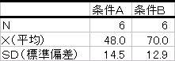
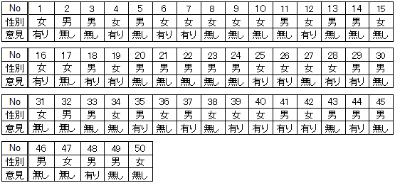

今回使うファイルです。ダウンロードしてください。必要に応じてご利用ください。（ダウンロード後、ファイルが保護ビューで開かれた場合は、[編集を有効にする]をクリックしてください。）
<ul>
<li><a href="04_1.xlsx">ある地域の愛着に対する意見(04_1.xlsx)</a></li>
<li><a href="04_2.xlsx">A店とB店における各商品の売り上げ数の結果(04_2.xlsx)</a></li>
</ul>

有意水準について
----------------

例えば、<a href="../03/">2つの平均値の差を検討する</a>場合、まず<a href="../03/#section2.2">「2つの母平均に差はない」と仮定を立てます</a>。これを<a href="../02/#null_hypothesis">帰無仮説</a>と呼んでいます。その後、<a href="../02/#sample">標本</a>から<a href="../02/#test_statistic">検定統計量</a>（z値やt値など）を<a href="../03/#section2.5">算出し</a>て、<a id="p-value" href="../03/#section2.6">その検定統計量より大きな値が発生する確率p値を求めます</a>。その際、その確率と比較する基準値を設けますが、これを有意水準（significance level）と呼んでいます。

<q cite="#p-value">求めた検定統計量より大きな値が発生する確率p値</q>がこの有意水準よりも小さいとき、2つの<a href="../02/#population">母集団</a>から抽出された標本の平均（<a href="../02/#sample_mean">標本平均</a>）の差が偶然生じたわけではなく、まれなことが起こった、すなわち統計的に有意なことが起こったと考え、帰無仮説が誤りだったと考えます。したがって、この場合、帰無仮説は棄却され、2つの母平均に差はない<strong>とはいえない</strong>という結論に至ります。有意水準は、一般的には5％を用います。より小さな1％を用いる場合もあります。5％に比べて、1％の方が条件としてはよりシビアになります。

検定統計量より大きな値が発生する確率（出現確率）と有意水準との関係、その関係を論文に記すための表現をまとめると以下のようになります。

検定統計量より大きな値の出現確率と論文記載のための表現

### 論文表現

論文中で、母<a href="../01/#mean">平均</a>の差に関する検定について書くとこのようになります。

表

> <a href="#table">表</a>は、条件Ａと条件Ｂの平均および<a href="../01/#standard_deviation">標準偏差</a>を示したものである。t検定の結果、両条件の平均の差は有意であった（t(10) = 2.53, p &lt; .05）。したがって、条件Ａより条件Ｂの方が優れた成績をあげるといえる。

ここで、t(10) = 2.53は、自由度が10の<a href="../02/#student_s_t-distribution">t分布</a>に従う<a href="../02/#test_statistic">検定統計量</a>t値が2.53であったことを示し、また、p &lt; .05はt = 2.53に対応するp値が0.05未満であったことを示しています。

分割表（クロス集計表）の分析
----------------------------

### 分割表

分割表（contingency table）とは、縦横の各項目について、別々に考える表のことです。横方向に一塊の項目を行（row）と呼び、縦方向に一塊の項目を列（column）と呼びます。縦の項目がＬ個、横の項目がＭ個ある表のことをＬ行Ｍ列分割表と呼びます。簡単にＬ×Ｍ分割表と呼ぶこともあります。

Ｌ行Ｍ列分割表（Ｌ×Ｍ分割表）

例えば、男性1000人、女性1000人にラグビーとバレーのどちらが好きか聞いたとします。男性は600 人がラグビー、400人がバレーと答えました。女性は300がラグビー、700人がバレーと答えました。その回答を分割表にするとこのようになります。

性別とスポーツ競技との２行２列分割表

|  | ラグビー | バレー |
| -- | -- | -- |
| 男性 | 600 | 400 |
| 女性 | 300 | 700 |

これは縦に性別、横にスポーツ競技をとった２行２列分割表です。この表を見れば、男性と女性でどれだけの人数がラグビーを好きか、バレーを好きかがわかります。なお、この例のとおり、違いの元になると思われる条件（この例では性別）を行として、具体的に選択される<a href="../01/#category">カテゴリー</a>を列として、それぞれ配置することが一般的です。この場合、行に配置された条件を独立変数（independent variable）、列に配置されたカテゴリーを従属変数（dependent variable）と呼びます。あるいは、前者を説明変数（explanatory variable）、後者を目的変数（target variable）、と呼ぶこともあります。

また、分割表はクロス集計表（cross table）と言われることもあります。

### 練習問題1

次のデータは、ある地域の成人男性25人、女性25人の合計50人に、今住んでいる地域に愛着が有るか無いかの意見を聞き、その結果を表にしたものです。このデータを集計し、<a href="#contingency_table">分割表</a>に整理しましょう。

表1：ある地域の愛着に対する意見

### Excelの操作

Excelを使って、<a href="#chapter5">練習問題1</a>に取り掛かりましょう。

&#9312; <a href="#table1">表1</a>のデータをExcelに入力します。すでにデータを入力してある　<a href="04_1.xlsx">ある地域の愛着に対する意見(04_1.xlsx)</a>　を利用しても構いません。



&#9313; [挿入]タブをクリックし、「<a href="https://www.microsoft.com/ja-jp/office/2013/tips/excel/excel09.aspx">おすすめピボットテーブル</a>」をクリックします。



&#9314; 「おすすめピボットテーブル」ウィンドウで「データの個数 / No」が選択されていることを確認して[OK]ボタンをクリックします。



&#9315; <a href="#contingency_table">分割表</a>が作成されました。





このように、Excelなどの表計算アプリに備わっている<a href="https://support.office.com/ja-jp/article/ピボットテーブルを作成してワークシート-データを分析する-a9a84538-bfe9-40a9-a8e9-f99134456576">ピボットテーブル（pivot table）機能</a>を利用して、データから分割表を作成することができます。

分割表の検定
------------

2行2列分割表

|  | B1 | B2 | 計 |
| -- | -- | -- | -- |
| A1 | $ a$ | $ b$ | $ l_1$ |
| A2 | $ c$ | $ d$ | $ l_2$ |
| 計 | $ m_1$ | $ m_2$ | $ N$ |

2行2列<a href="#contingency_table">分割表</a>は条件が異なる2つの母集団におけるカテゴリ間の比（母比）の違いで分析します。すなわち、検定で設定される仮説は以下のとおりです。

* <a href="../02/#null_hypothesis">帰無仮説</a>H0：カテゴリーB1とカテゴリーB2との度数の比は母集団A1と母集団A2とで等しい
* <a href="../02/#alternative_hypothesis">対立仮説</a>H1：カテゴリーB1とカテゴリーB2との度数の比は母集団A1と母集団A2とで等しくない

<a href="#table_example">上の2行2列分割表</a>では、

* <a href="#independent_variable">独立変数</a>である条件A1における<a href="#dependent_variable">従属変数</a>であるカテゴリーB1の<a href="../01/#frequency">度数</a>：$ a$
* 独立変数である条件A1における従属変数であるカテゴリーB2の度数：$ b$
* 独立変数である条件A2における従属変数であるカテゴリーB1の度数：$ c$
* 独立変数である条件A2における従属変数であるカテゴリーB2の度数：$ d$

が実際に測定されたデータの度数になっています。一方、行周辺度数（row marginal frequency）$ l_1$、$ l_2$、列周辺度数（column marginal frequency）$ m_1$、$ m_2$、および、総計（grand total）$ N$から、

* 独立変数である条件A1における従属変数であるカテゴリーB1の期待値：$ l_1 \times m_1 \div N$
* 独立変数である条件A1における従属変数であるカテゴリーB2の期待値：$ l_1 \times m_2 \div N$
* 独立変数である条件A2における従属変数であるカテゴリーB1の期待値：$ l_2 \times m_1 \div N$
* 独立変数である条件A2における従属変数であるカテゴリーB2の期待値：$ l_2 \times m_2 \div N$

のように、期待値（theoretical frequency）を計算することもできます。分割表の検定は、実際に測定された度数とこれら期待値との関係を用いて行われます。ここで、この期待値の計算は、独立変数と従属変数とが互いに独立している前提の計算となっています。このことから分割表の検定を「独立性の検定」とも言います。

母比の差の検定と独立性の検定とは区別されることもあります。
あらかじめ定められた複数の母集団に対してそれぞれ標本を取得する場合は母比の差の検定、標本を取得した後に要因に基づいて分割する場合は独立性の検定と区別することがあります。

主な検定法に、ピアソンの$ \chi^2$検定（Pearson's $ \chi^2$-test）があります。

分割表の検定（集計結果型のデータの場合）
----------------------------------------

### 練習問題2

Ａ店とＢ店とは、ある食品会社のある冷凍食品とあるカップラーメンとを販売しています。食品会社は、Ａ店とＢ店において、1ヶ月の各商品の売り上げ数に差があるかどうか調査を行いました。その結果を整理したのが、次の2行2列<a href="#contingency_table">分割表</a>です。Ａ店とＢ店とで冷凍食品とカップラーメンとの売り上げ数に違いがあるか検定してください。

表2：Ａ店とＢ店における各商品の売り上げ数の結果（個）

|  | 冷凍食品 | カップラーメン | 計 |
| -- | -- | -- | -- |
| A店 | 327 | 223 | 550 |
| B店 | 412 | 238 | 650 |
| 計 | 739 | 461 | 1200 |

### 仮説の設定

* <a href="../02/#null_hypothesis">帰無仮説</a>H0：Ａ店とＢ店とで冷凍食品とカップラーメンとの売上数の比は同じである
* <a href="../02/#alternative_hypothesis">対立仮説</a>H1：Ａ店とＢ店とで冷凍食品とカップラーメンとの売上数の比は同じではない

### 有意水準αの設定

<a href="#chapter1">有意水準</a>α = 0.05とします。

### 検定統計量$ \chi^2$（カイじじょう）値の算出

以下の数式で<a href="../02/#test_statistic">検定統計量</a>$ \chi^2$値を求めます。

$ \displaystyle \chi^2 = \frac{\{(ad - bc)\}^2 \times N}{l_1 \times l_2 \times m_1 \times m_2}$

<a href="../02/#null_hypothesis">帰無仮説</a>H0、すなわち、<q>カテゴリーB1とカテゴリーB2との<a href="../01/#frequency">度数</a>の比は母集団A1と母集団A2とで等しい</q>が成立する場合、<a href="#independent_variable">独立変数</a>と<a href="#dependent_variable">従属変数</a>とは互いに独立です。この条件下では、

* 独立変数である条件A1における従属変数であるカテゴリーB1の度数と<a href="#theoretical_frequency">期待値</a>との差：$ a - l_1 \times m_1 \div N$
* 独立変数である条件A1における従属変数であるカテゴリーB2の度数と期待値との差：$ b - l_1 \times m_2 \div N$
* 独立変数である条件A2における従属変数であるカテゴリーB1の度数と期待値との差：$ c - l_2 \times m_1 \div N$
* 独立変数である条件A2における従属変数であるカテゴリーB2の度数と期待値との差：$ d - l_2 \times m_2 \div N$

はすべて0になります。ここで、度数と期待値との差を
$ \displaystyle \chi^2 = \frac{\displaystyle {\left(a - \frac{l_1 m_1}{N} \right)}^2}{\displaystyle \frac{l_1 m_1}{N}} + \frac{\displaystyle {\left(b - \frac{l_1 m_2}{N} \right)}^2}{\displaystyle \frac{l_1 m_2}{N}} + \frac{\displaystyle {\left(c - \frac{l_2 m_1}{N} \right)}^2}{\displaystyle \frac{l_2 m_1}{N}} + \frac{\displaystyle {\left(d - \frac{l_2 m_2}{N} \right)}^2}{\displaystyle \frac{l_2 m_2}{N}}$
で表すとすると、<a href="#chi2">検定統計量の式</a>のように整理され、検定統計量$ \chi^2$は自由度1の$ \chi^2$分布（chi squared-distribution）に近似的に従うことがわかっています。

### p値の算出

<a href="#chapter1">有意水準</a>と比較する確率p値を求めます。p値は、自由度1の<a href="#chi_squared-distribution">$ \chi^2$分布</a>において、<a href="../02/#test_statistic">検定統計量</a>$ \chi^2$値より大きい値が発生する確率です。

### 判定

$ \chi^2$分布はこのようなグラフを描きます。 このグラフで、<a href="#p_of_chi2">p値</a>を表す面積が<a href="#chapter1">有意水準</a>の確率を表す面積より大きいか小さいかで<a href="../02/#null_hypothesis">帰無仮説</a>の棄却を決定します。なお、図のとおり、自由度によって、この$ \chi^2$分布のグラフは変わります。

<dl>
 	<dt>p値 ≤ 有意水準α</dt>
 	<dd>帰無仮説H0を棄却する</dd>
 	<dt>p値 &gt; 有意水準α</dt>
 	<dd>帰無仮説H0を受容する</dd>
</dl>

### Excelの操作

Excelを使って、<a href="#chapter9">練習問題2</a>に取り掛かりましょう。

&#9312; <a href="#table2">表2</a>のデータをExcelに入力します。すでにデータを入力してある　<a href="04_2.xlsx">A店とB店における各商品の売り上げ数の結果(04_2.xlsx)</a>　を利用しても構いません。



&#9313; <a href="#chapter5">練習問題1</a>に対する<a href="#chapter6">Excelの操作</a>を参考に、<a href="#contingency_table">分割表</a>を作成します。



&#9314; 検定用の項目を入力し、既知のデータを入力します。



&#9315; 検定用のデータを算出するために、以下のように入力します。

* "G5"：<code>=CHISQ.DIST.RT(G3,G4)</code>（<a href="#p_of_chi2">p値</a>）



<code>CHISQ.DIST.RT(</code>$ \chi^2$<code>,φ)</code>は、自由度φの$ \chi^2$分布において、$ \chi^2$値より大きい値が発生する確率を与えます（<a href="https://support.office.com/ja-jp/article/CHISQ-DIST-RT-関数-dc4832e8-ed2b-49ae-8d7c-b28d5804c0f2"><code>CHISQ.DIST.RT</code>関数</a>）。なお、"G3"は<a href="#chapter12">$ \chi^2$値</a>となるように<a href="#chi2">式</a>を参考に入力してみてください。

なお、<q cite="#chapter12"><a href="../01/#frequency">度数</a>と<a href="#theoretical_frequency">期待値</a>とをそれぞれ求めている</q>場合、"G5"セルは<a href="https://support.office.com/ja-jp/article/CHISQ-TEST-関数-2e8a7861-b14a-4985-aa93-fb88de3f260f"><code>CHISQ.TEST</code>関数</a>を利用することも可能です。

### 結果

<a href="#p_of_chi2">p値</a> = 0.16313が求まりました。下図の塗りつぶされた領域が全体に対してpの割合になっています。

p値 = 0.16313 &gt; <a href="#chapter1">有意水準</a>α = 0.05であるので、<a href="../02/#null_hypothesis">帰無仮説</a>H0は棄却されません。よって、Ａ店とＢ店とで冷凍食品とカップラーメンとの売り上げ数の比に違いがあるとはいえません。

### 論文では

論文中では、このようになります。
> <a href="#table2">表2</a>に関して$ \chi^2$検定を行ったところ、有意差は認められなかった($ \chi^2$(1) = 1.944968, p &gt; .05）。 よって、Ａ店とＢ店とで冷凍食品とカップラーメンとの売り上げ数の比に違いがあるとはいえない。

なお、$ \chi^2$(1) = 1.944968は、自由度1の<a href="#chi_squared-distribution">$ \chi^2$分布</a>において<a href="../02/#test_statistic">検定統計量</a>$ \chi^2$値が1.944968であったことを示し、また、p &gt; .05は$ \chi^2$ = 1.944968に対応する<a href="#p_of_chi2">p値</a>が0.05より大きかったことを示しています。

分割表の検定（生データの場合）
------------------------------

<a href="#chapter5">練習問題1</a>が生データに相当します。練習問題1の<a href="#contingency_table">分割表</a>に対して検定してみましょう。

### 仮説の設定

* <a href="../02/#null_hypothesis">帰無仮説</a>H0：男性と女性とである地域への愛着に対する意見の比は同じである
* <a href="../02/#alternative_hypothesis">対立仮説</a>H1：男性と女性とである地域への愛着に対する意見の比は同じではない

### Excelの操作

<a href="#chapter5">練習問題1</a>で使ったファイルに追記します。

&#9312; 検定用の項目を入力し、既知のデータを入力します。



&#9313; 検定用のデータを算出するために、以下のように入力します。

* "G5"：<code>=CHISQ.DIST.RT(G3,G4)</code>（p値）



"G3"は<a href="#chapter12">$ \chi^2$値</a>となるように<a href="#chi2">式</a>を参考に入力してください。

### 結果

p値 = 0.083265が求まりました。下図の塗りつぶされた領域が全体に対してpの割合になっています。

p値 = 0.083265 &gt; 有意水準α = 0.05 であるので、帰無仮説H0<q>男性と女性とである地域への愛着に対する意見の比は同じである</q>は棄却できません。よって、男性と女性とで地域の愛着に違いがあるとはいえません。

### 論文では

論文中では、このようになります。
> <a href="#table1">表1</a>をクロス集計した後、$ \chi^2$検定を行ったところ、有意差は認められなかった（$ \chi^2$(1) = 3.00, p &gt; .05）。よって、男性と女性とで地域の愛着に違いがあるとはいえない。

フィッシャーの正確確率検定
-----------------------------------

これまで、<a href="#chapter7">分割表の検定</a>に<a href="#pearson_s_chi2-test">ピアソンの$ \chi^2$検定</a>を用いましたが、<a href="#grand_total">総計</a>や<a href="#theoretical_frequency">期待値</a>の値によっては<q cite="chi_squared-approximation">検定統計量$ \chi^2$は自由度1の<a href="#chi_squared-distribution">$ \chi^2$分布</a>（chi squared-distribution）に近似的に従う</q>わけではないため、ピアソンの$ \chi^2$検定を行うことが適切ではない場合もあります。例えば、

* 1未満の期待値が1つ以上ある
* 5未満の期待値が期待値の個数ＬＭの20%以上ある
* 総計が20以下

などの場合は、ピアソンの$ \chi^2$検定を行うことが適切ではないと言われています。

ピアソンの$ \chi^2$検定を行うことが適切ではない場合、<a href="../fisher_s_exact_test/#fisher_s_exact_test">フィッシャーの正確確率検定</a>を用いて分割表の検定を行います。なお、ピアソンの$ \chi^2$検定を行うことが適切な場合でもフィッシャーの正確確率検定を行って構いません。検定の方法は<a href="../fisher_s_exact_test/">ここ</a>を参照してください。

課題1
------

次の表は、2つのメーカーのデジタルカメラの5年後の状況を追跡調査した結果です。Ａ社、Ｂ社それぞれに使用ができなくなったカメラが存在しています。どちらのメーカーのデジタルカメラを購入したほうが長持ちする傾向があるのでしょうか、有意水準5％で検定しなさい。ただし、不良品や事故により壊れた台数は除いてあります。

表4：5年後のデジタルカメラの使用状況（個）

|  | ５年後使用可（個） | ５年後使用不可（個） | 計 | 
| -- | -- | -- | -- |
| Ａ社 | 10533 | 31 | 10564 |
| Ｂ社 | 8896 | 167 | 9063 |
| 計 | 19429 | 198 | 19627 |

