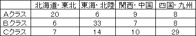
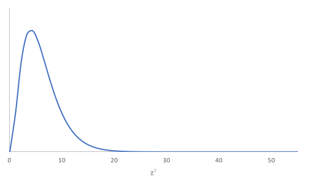
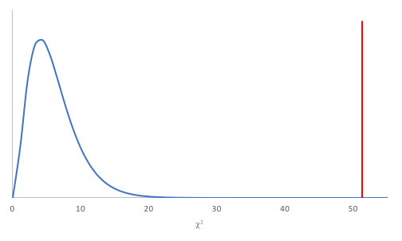
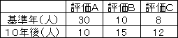

今回使うファイルです。ダウンロードしてください。必要に応じてご利用ください。
<ul>
<li><a href="05_1.xlsx">修学旅行先の希望調査(05_1.xlsx)</a></li>
</ul>

Ｌ行Ｍ列分割表の検定
--------------------

### 練習問題1

都内のある学校で、修学旅行先の希望調査を行いました。クラスは、Ａ、Ｂ、Ｃの3クラスあります。調査結果を整理したのが、次の3行4列<a href="../04/#contingency_table">分割表</a>です。各クラスの希望の傾向は同じといえるでしょうか。検定してください。

表1：各クラスの修学旅行先の希望数（人）

### 検定の手順

Ｌ行Ｍ列<a href="../04/#contingency_table">分割表</a>の検定には、<a href="../04/#section3">2行2列分割表の検定</a>と同様に<a href="../04/#pearson_s_chi2-test">ピアソンの$ \chi^2$検定</a>を用いることができます。

#### 仮説の設定

* <a href="../02/#null_hypothesis">帰無仮説</a>H0：修学旅行先の希望の傾向はクラスによらず同じである
* <a href="../02/#alternative_hypothesis">対立仮説</a>H1：修学旅行先の希望の傾向はクラスによって異なる

#### 有意水準αの設定

<a href="../04/#chapter1">有意水準</a>α = 0.05とします。

#### 検定統計量$ \chi^2$値の算出

今回、<a href="../02/#test_statistic">検定統計量</a>$ \chi^2$は以下の数式で求まります。

$
\displaystyle \chi^2 = \sum_{i=1}^L\sum_{j=1}^L\frac{( f_{ij} - t_{ij})^2}{t_{ij}}
$

ここで、$ f_{ij}$は以下の表のとおり、Ｌ行Ｍ列分割表における$ i$行$ j$列の<a href="../01/#frequency">度数</a>です。一方、$ t_{ij}$は$ f_{ij}$に対する<a href="../04/#theoretical_frequency">期待値</a>で、

$ \displaystyle t_{ij} = \frac{l_i m_j}{N}$

で与えられます。なお、L = 2、M = 2を代入し、展開すると<a href="../04/#original_chi2">2行2列分割表の場合の式</a>になります。

|  | 項目B1 | 項目B2 | … | 項目Bj | … | 項目BM-1 | 項目BM| 計 |
| -- | -- | -- | -- | -- | -- | -- | --| -- |
| 項目A | $ f_{11}$ | $ f_{12}$ | … | $ f_{1j}$ | … | $ f_{1M-1}$ | $ f_{1M}$ | $ l_1$ |
| 項目A2 | $ f_{21}$ | $ f_{22}$ | … | $ f_{2j}$ | … | $ f_{2M-1}$ | $ f_{2M}$ | $ l_2$ |
| ⋮ | ⋮ | ⋮ | ⋱ | ⋮ | ⋱ | ⋮ | ⋮ | ⋮ |
| 項目Ai | $ f_{i1}$ | $ f_{i2}$ | … | $ f_{ij}$ | … | $ f_{iM-1}$ | $ f_{iM}$ | $ l_i$ |
| ⋮ | ⋮ | ⋮ | ⋱ | ⋮ | ⋱ | ⋮ | ⋮ | ⋮ |
| 項目AL-1 | $ f_{L-11}$ | $ f_{L-12}$ | … | $ f_{L-1j}$ | … | $ f_{L-1M-1}$ | $ f_{L-1M}$ | $ l_{L-1}$ |
| 項目AL | $ f_{L1}$ | $ f_{L2}$ | … | $ f_{Lj}$ | … | $ f_{LM-1}$ | $ f_{LM}$ | $ l_L$ |
| 計 | $ m_1$ | $ m_2$ | … | $ m_j$ | … | $ m_{M-1}$ | $ m_M$ | $ N$ |

#### 自由度の算出

また、<a href="../02/#test_statistic">検定統計量</a>$ \chi^2$は自由度φの$ \chi^2$分布に従うことがわかっています。自由度φは以下の式で求まります。
φ = (L - 1)×(M - 1)
<a href="../04/#chapter12">2行2列分割表の場合</a>、<q cite="../04/#chapter12">検定統計量$ \chi^2$は自由度1の$ \chi^2$分布に近似的に従うことがわかっています</q>が、これも<a href="#phi_of_chi2">上式</a>にL = 2、M = 2を代入した結果に一致します。

#### p値の算出

<a href="../04/#chapter1">有意水準</a>と比較するp値を求めます。p値は、自由度φの$ \chi^2$分布において、<a href="../02/#test_statistic">検定統計量</a>$ \chi^2$値より大きい値が発生する確率です。

#### 判定

自由度φ = 6の$ \chi^2$分布はこのようなグラフを描きます。このグラフで、p値を表す面積が<a href="../04/#chapter1">有意水準</a>の確率を表す面積より大きいか小さいかで<a href="./02/#null_hypothesis">帰無仮説</a>の棄却を決定します。

<dl>
 	<dt>p値 ≤ 有意水準α</dt>
 	<dd>帰無仮説H0を棄却する</dd>
 	<dt>p値 &gt; 有意水準α</dt>
 	<dd>帰無仮説H0を受容する</dd>
</dl>

### Excelの操作

Excelを使って、<a href="#chapter2">練習問題1</a>に取り掛かりましょう。

&#9312; <a href="#table1">表1</a>のデータをExcelに入力します。すでにデータを入力してある　<a href="05_1.xlsx">修学旅行先の希望調査(05_1.xlsx)</a>　を利用しても構いません。



&#9313; 今回は、<a href="../04/#chapter6">2行2列分割表を作成する操作</a>では<a href="../04/#contingency_table">分割表</a>をうまく作成できません。そこで、<a href="../04/#pivot_table">ピボットテーブル</a>機能を使って、分割表を手動で作成します。[挿入]タブをクリックし、「ピボットテーブル」をクリックします。



&#9314; 「ピボットテーブルの作成」ウィンドウが開いたらOKをクリックし、ピボットテーブル用のシートを作成します。





&#9315; ピボットテーブル用シートの右端の「ピボットテーブルのフィールド」で、クラスをドラッグして行へドロップします。





&#9316; 同様に、修学旅行先を列へ、人数を値へドラッグドロップし、分割表を完成させます。





&#9317; 検定のために<a href="../04/#theoretical_frequency">期待値</a>用の項目を入力します。



&#9318; 期待値用のデータを入力します。

* "B12"：<code>=$F5*B$8/$F$8</code>





&#9319; <a href="../01/#autofill">オートフィル</a>で他のセルにもデータを入力します。









&#9320; 念のため<a href="../04/#row_marginal_total">行周辺度数</a>も求めます。

* "F12"：<code>=SUM(B12:E12)</code>





&#9321; オートフィルで他のセルにもデータを入力します。





&#9322; 同様に<a href="../04/#column_marginal_total">列周辺度数</a>も求めます。

* "B15"：<code>=SUM(B12:B14)</code>



&#9323; 検定のために<a href="../01/#deviation">偏差</a>用の項目を入力します。



&#9324; 偏差用のデータを入力します。

* "B19"：<code>=B5-B12</code>



&#9325; 平方偏差を期待値で割った調整平方偏差用の項目を入力します。



&#9326; 調整平方偏差用のデータを入力します。

* "B26"：<code>=B19^2/B12</code>



&#9327; 検定用の項目を入力し、既知のデータを入力します。



&#9328; 検定用のデータを算出するために、以下のように入力します。

* "I3"：<code>=SUM(B26:E28)</code>（検定統計量$ \chi^2$値）
* "I4"：<code>=(COUNTA(A5:A7)-1)*(COUNTA(B4:E4)-1)</code>（自由度φ）
* "I5"：<code>=CHISQ.DIST.RT(I3,I4)</code>（p値）



なお、<a href="#chapter7">次々項</a>で偏差について考察するために、ここでは偏差用のデータを求め、それに基づいて検定していますが、"I5"セルは<a href="https://support.office.com/ja-jp/article/CHISQ-TEST-関数-2e8a7861-b14a-4985-aa93-fb88de3f260f"><code>CHISQ.TEST</code>関数</a>を使って度数と期待値とから直接<code>=CHISQ.TEST(B5:E7,B12:E14)</code>と求めることも可能です。

### 結果

<a href="#p_of_chi2">p値</a> = 2.51009×10-09が求まりました。下図の塗りつぶされた領域が全体に対してpの割合になっています。

p値 = 2.51009×10-09 &lt; <a href="../04/#chapter1">有意水準</a>α = 0.05 なので、<a href="../02/#null_hypothesis">帰無仮説</a>H0は棄却されます。 よって、修学旅行先の希望の傾向はクラスによって異なるといえます。

### 論文では

論文では以下のような文章になります。

> <a href="#table1">表1</a>に関して、$ \chi^2$検定を行ったところ、有意差が認められた（$ \chi^2$(6) = 51.35790831, p &lt; .05）。よって、修学旅行先の希望の傾向はクラスによって異なるといえる。

### Ｌ行Ｍ列分割表の偏差（残差）のチェック

<a href="../01/#frequency">度数</a>と<a href="../04/#theoretical_frequency">期待値</a>との差である<a href="../01/#deviation">偏差</a>（残差）を見てみましょう。残差の絶対値が大きいところが特徴的であるといえます。



残差を見てみると、Ａクラスは北海道・東北が10.96178344と高く、Ｂクラスは東海・北陸が14.77070064、Ｃクラスは四国・九州が11.80254777とそれぞれ高い数値を出しています。このことから、Ａクラスは北海道・東北、Ｂクラスは東海・北陸、Ｃクラスは四国・九州に行きたいという傾向があることがわかりました。

このような分析を残差分析と呼びます。

Ｌ行Ｍ列分割表のグラフ表現
--------------------------

<a href="#chapter2">練習問題1</a>のグラフを作成します。

### Excelの操作

<a href="#chapter2">練習問題1</a>のファイルを使います。

&#9312; "A4"から"E7"を選択します。



&#9313; [挿入]タブをクリックし、「おすすめグラフ」をクリックします。



&#9314; 「グラフの挿入」ウィンドウが開いたらOKボタンをクリックします。



&#9315; 希望先のグラフがクラスごとに作成されました。



グラフにすることで各項目ごとのパターンの違いを把握できます。ここでも、Ａクラスは北海道・東北、Ｂクラスは東海・北陸、Ｃクラスは四国・九州が多いということがわかりました。

なお、以上の手順はグラフ作成の一般的な方法になっています。<a href="../04/#pivot_table">ピボットテーブル</a>に対しては、ピボットテーブルのどこかをクリックすることで、下図のように現れる[ピボットテーブル ツール]の[分析]タブの「ピボットグラフ」をクリックする方法があります。それによって、「グラフの挿入」ウィンドウが開き、ピボットテーブルを適切に視覚化したグラフを作成することができます。



課題1
------

次の表は、ある年とその10年後に同じ小学校で体力測定を行った際の総合評価の結果です。この10年の間に、体力測定結果に違いはあるでしょうか。また、違いがある場合は<a href="#chapter7">残差分析</a>を行い、それに基づいた違いの特徴を述べてください。
なお、評価は体力測定の各項目を合成した数値による絶対評価で、この10年間に基準の変更はなく、全て同じ項目を用いた結果とします。（表中の数値は人数、評価はＡが最も高い）

表2：ある年と10年後の体力測定の結果（人）

課題2
------

Ａ大学にて、パソコンを持っている学生を対象に、自宅でのパソコンの使用に関する調査を行いました。 その結果が次の表です。パソコンの使用頻度が高い学生とそうでない学生には所属学部に傾向の違いがあるのでしょうか。<a href="../04/#chapter1">有意水準</a>5％で検定してください。

表3：Ａ大学のパソコンの使用状況（人）

|  | 使用頻度が高い（人） | 使用頻度が低い（人） | 計 |
| -- | -- | -- | -- |
| 文学部 | 15 | 22 | 37 |
| 経済学部 | 30 | 36 | 66 |
| 理工学部 | 60 | 37 | 97 |
| 計 | 105 | 95 | 200 |
