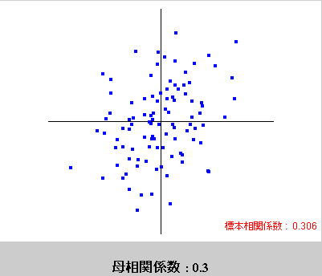
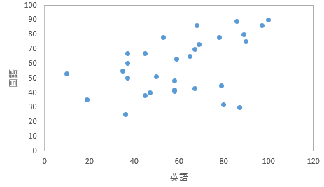

今回使うファイルです。必要に応じてご利用ください。（ダウンロード後、ファイルが保護ビューで開かれた場合は、[編集を有効にする]をクリックしてください。） 
<ul>
<li><a href="06_1.xlsx">ある小学校の児童30人の身長、体重(06_1.xlsx)</a></li>
<li><a href="06_2.xlsx">ある小学校の児童30人の身長、体重、性別(06_2.xlsx)</a></li>
<li><a href="06_3.xlsx">ある小学校の児童30人の英語、国語の成績(06_3.xlsx)</a></li>
</ul>

相関分析
--------

### 相関関係

2つの変数$ x$と$ y$があるときに、$ x$の変化に伴って$ y$も変化するような関係を「相関関係（correlation）」といいます。相関関係を調べるには<a href="#chapter3">散布図</a>や<a href="#chapter7">相関係数</a>を用います。相関関係は正の相関関係と負の相関関係、無相関に分けられます。この正負は後で述べる相関係数によって決まります。
<dl>
 	<dt id="positive_correlation">正の相関関係（positive correlation）</dt>
 	<dd>$ x$が増加していったとき、$ y$も増加している。$ x$と$ y$が比例している関係。</dd>
 	<dt id="negative_correlation">負の相関関係（negative correlation）</dt>
 	<dd>$ x$が増加していったとき、$ y$は減少している。$ x$と$ y$が比例（傾きが負）している関係。</dd>
 	<dt id="uncorrelated">無相関（uncorrelated）</dt>
 	<dd>$ x$と$ y$に（比例）関係が見出せない。</dd>
</dl>

散布図
------

散布図（scatter plot）は<a href="#correlation">相関関係</a>の有無を視覚的に表す図です。2つの変数の内、一方を横軸にとり他方を縦軸にとって、対応するデータを1点ずつプロットしていきます。

### 散布図の分析

散布図の分析では以下のような点に着目します。

* はずれ点がないか
* 2つの変数$ x$と$ y$との間にはどのような関係があるか
    * 直線
    * 曲線
    * 無関係
* グループが形成されているか

<a href="#scatter_plot_example">上図</a>を見てみると、ある程度の点が身長145～170、体重40～70の範囲でグループを形成しているように見えます。そのグループは左下から右上がりになっていて、身長と体重とには比例の関係があるように思われます。体重80以上に幾つかはずれ点が見らますが、大幅に外れているとはいえなさそうです。

このようにデータの分布を視覚的に見ることによって、$ x$と$ y$の2変数の関係に方向性が見えてきます。その方向性がデータをよく表しているかどうか、計算によって判定します。

### 練習問題1

次のデータは、ある小学校の児童30人の身長（$ x$）と体重（$ y$）とを測定したものです。このデータをグラフで表現し、身長$ x$と体重$ y$の関係を把握してください。

表1：30人の身長と体重

<a href="http://www.mext.go.jp">文部科学省</a><cite>平成20年度学校保健統計調査</cite>の結果を基に作成した仮想データ

### Excelの操作

Excelを用いて<a href="#chapter5">練習問題1</a>に取り掛かりましょう。

&#9312; <a href="#table1">表1</a>のデータをExcelに入力します。すでにデータを入力してある　<a href="06_1.xlsx">ある小学校の児童30人の身長、体重(06_1.xlsx)</a>　を利用しても構いません。



&#9313; <a href="../05/#chapter9">ここ</a>の操作を参考に、おすすめグラフ（散布図になっています）を作成します。



&#9314; 「+」ボタンを押して、グラフに付加する項目を選択します。





&#9315; 横軸ラベルを「身長」に、縦軸ラベルを「体重」に、それぞれ設定します。



&#9316; 軸の範囲を設定します。横軸の数字をクリックし、[グラフツール]の[書式]タブを選択し、「選択対象の書式設定」ボタンをクリックして、書式設定作業ウィンドウを出します。





横軸の範囲を115〜155に設定します。



縦軸の数字をクリックすることで作業ウィンドウを縦軸の書式設定に切り替え、縦軸の範囲を20〜55に設定します。



&#9317; グラフの枠をつけます。グラフの本体をクリックすることで作業ウィンドウをプロットエリアの書式設定に切り替え、バケツアイコンをクリックして、枠線をクリックして、「線(単色)」をクリックして、色で軸の色と同様の灰色を選択します。



出力された散布図を見ると、左下から右上がりに点が分布しているように見えます。身長と体重には<a href="#positive_correlation">正の相関関係</a>があるのかもしれません。それを確かめるために、<a href="#chapter7">次の項</a>で<a href="#chapter7">相関係数</a>を求めます。

相関係数
--------

相関係数（correlation coefficient）は、<a href="#correlation">相関関係</a>の有無を数量的に調べるために用います。

<a href="../02/#sample">標本</a>に基づく相関係数（標本相関係数、sample correlation coefficient）$ r$の範囲は-1 ≤ $ r$ ≤ 1です。

* $ r$が正数（0より大きい数）のとき、<a href="#positive_correlation">正の相関関係</a>があるといいます
* $ r$が負数（0より小さい数）のとき、<a href="#negative_correlation">負の相関関係</a>があるといいます
* $ r$が0に近い場合は、<a href="#uncorrelated">無相関</a>であるといいます

標本相関係数$ r$は以下の数式で求めることができます。

$ \displaystyle r = \frac{V_{xy}}{s_x s_y}$

* *$ \displaystyle V_{xy} = \frac{1}{N - 1} \sum_{i = 1}^N \left( x_i - \overline{x} \right) \left( y_i - \overline{y} \right)$：$ x$と$ y$の不偏共分散
* $ \displaystyle s_x = \sqrt{ \frac{1}{N - 1} \sum_{i = 1}^N {\left( x_i - \overline{x} \right)}^2 }$：$ x$の<a href="../01/#standard_deviation">標準偏差</a>（<a href="../01/#variance">不偏分散</a>の平方根）
* $ \displaystyle s_y = \sqrt{ \frac{1}{N - 1} \sum_{i = 1}^N {\left( y_i - \overline{y} \right)}^2 }$：$ y$の標準偏差（不偏分散の平方根）
* $ \displaystyle \overline{x} = \frac{1}{N} \sum_{i = 1}^N x_i$：$ x$の<a href="../class01/#mean">平均</a>
* $ \displaystyle \overline{y} = \frac{1}{N} \sum_{i = 1}^N y_i$：$ y$の平均

また、標本相関係数の絶対値によって、その相関の強さがわかります。

* 0.7 ≤ $ \left| r \right|$：強い相関あり

強い正の相関の例

強い負の相関の例

  

* 0.4 ≤ $ \left| r \right|$ &lt; 0.7：中程度の相関あり

中程度の相関の例

  

* 0.2 ≤ $ \left| r \right|$ &lt; 0.4：弱い相関あり

弱い相関の例

  

* $ \left| r \right|$ &lt; 0.2：ほとんど相関なし

無相関の例

  

### 練習問題2

次のデータは、<a href="#chapter5">練習問題1</a>のデータに性別（1：男、2：女）の情報を追加したものです。性別の違いがわかるような散布図を作成してください。

表2：児童30人の身長と体重

### Excelの操作

Excelを用いて<a href="#chapter8">練習問題2</a>に取り掛かりましょう。<a href="#chapter5">練習問題1</a>で用いたファイルに追記します。すでにデータを追加入力してある　<a href="06_2.xlsx">ある小学校の児童30人の身長、体重、性別(06_2.xlsx)</a>　を利用しても構いません。

&#9312; <a href="#table2">表2</a>の性別データを追加入力します。



&#9313; 男児データの散布図を作成します。男児に対応する身長データと体重データとを選択します。



<a href="../05/#chapter9">ここ</a>の操作を参考に、おすすめグラフ（散布図になっています）を作成します。



&#9314; 同様に、女児データの散布図を作成します。





&#9315; 男児データの散布図と女児データの散布図とを合成する準備をします。男児データの散布図を選択し、[グラフツール]の[デザイン]タブから「データの選択」をクリックします。





凡例項目(系列)内の編集ボタンをクリックして、系列名を1に設定し、OKボタンをクリックします。







OKボタンをクリックして散布図に戻ります。



同様に、女児データの散布図も系列名を2に設定します。



&#9316; 男児データの散布図を女児データの散布図へ合成します。男児データの散布図をクリックし、[ホーム]タブのコピーボタンをクリックします。



女児データの散布図をクリックし、[ホーム]タブの貼り付けボタンをクリックします。





&#9317; <a href="#chapter6">ここ</a>の手順を参考に、グラフに含める項目を選択し、軸ラベルや軸範囲を設定します。



&#9318; 女児データのマーカーを変更します。合成された散布図で女児データをクリックします。



バケツのアイコンをクリックし、マーカーをクリックし、マーカーのオプションをクリックし、組み込みをクリックし、種類を「+」に変更します。



&#9319; 凡例を散布図に追加します。「+」ボタンをクリックし、凡例をクリックします。



&#9320; さらに、相関係数も算出します。相関係数算出用の項目を入力します。



&#9321; データを算出するために、以下のように入力します。

* "F2"：<code>=COVARIANCE.S(A2:A31,B2:B31)</code>（$ x$と$ y$の<a href="#covariance">不偏共分散</a>）
* "F3"：<code>=STDEV.S(A2:A31)</code>（$ x$の<a href="../01/#standard_deviation">標準偏差</a>（<a href="../01/#variance">不偏分散</a>の平方根））
* "F4"：<code>=STDEV.S(B2:B31)</code>（$ y$の標準偏差（不偏分散の平方根））
* "F5"：<code>=F2/F3/F4</code>（<a href="#sample_correlation_coefficient">標本相関係数</a>$ r$）



相関係数$ r$ = 0.937538が求まりました。ここから、身長と体重には強い正の相関関係が成り立つということがわかります。 すなわち、身長が高くなるにつれて、体重は重くなっていくようだということがわかりました。

なお、"F5"セルは<a href="https://support.office.com/ja-jp/article/CORREL-関数-995dcef7-0c0a-4bed-a3fb-239d7b68ca92"><code>CORREL</code>関数</a>を用いて、<code>=CORREL(A2:A31,B2:B31)</code>と求めることもできます。

### 論文では

論文では下記のようになります。

> <a href="#table2">表2</a>に関して、<a href="#section3">相関係数</a>を求めたところ、強い<a href="#positive_correlation">正の相関関係</a>が認められた（$ r$ = 0.937538）。よって、身長が高くなるにしたがって、体重は重くなる傾向があるといえる。

**なお、<a href="#correlation">相関関係</a>が見られたからといって、一方が他方の原因になっている、という因果性（causality、因果関係とも）が示されたわけではありませんので、注意しましょう。**

相関係数の検定
--------------

### 練習問題3

次のデータは、ある学校の生徒の国語と英語の期末テストの結果を30人分示したものです。国語と英語の<a href="#chapter7">相関係数</a>を求め、<a href="#chapter13">無相関の検定</a>をしてください。

表3：生徒30人分の国語と英語の期末テストの結果（点）

### 無相関の検定

<a href="#chapter7">前項</a>では、<a href="../02/#sample">標本</a>に基づいて<a href="#sample_correlation_coefficient">標本相関係数</a>$ r$を求めましたが、これとは別に<a href="../02/#population">母集団</a>の相関係数（母相関係数）ρ（ロー）が存在します。

<dl>
 	<dt>母集団の相関係数</dt>
 	<dd>母相関係数ρ</dd>
 	<dt>標本の相関係数</dt>
 	<dd>標本相関係数$ r$</dd>
</dl>

標本は母集団全体を表しているわけではないので、母相関係数ρ = 相関係数$ r$とは言えません。母相関係数ρ = 0であっても、抽出された標本によっては相関がある場合もあります。

そこで、母相関係数ρが0かを検定します。これを無相関の検定と言います。

#### 仮説の設定

* <a href="../02/#null_hypothesis">帰無仮説</a>H0：母<a href="#chapter7">相関係数</a>は0である（ρ = 0）
* <a href="../02/#alternative_hypothesis">対立仮説</a>H1：母相関係数は0ではない（ρ ≠ 0）

#### 有意水準αの設定

<a href="../04/#chapter1">有意水準</a>α = 0.05とします。

#### 検定統計量$ t$値の算出

今回は以下の数式で<a href="../02/#test_statistic">検定統計量</a>$ t$値を求められます。

$ \displaystyle t = \frac{r}{\sqrt{\frac{1 - r^2}{N - 2}}}$

この$ t$値は自由度がφ = $ N - 2$の<a href="../02/#student_s_t-distribution">$t$分布</a>に従うことがわかっています。これは、<a href="#sample_correlation_coefficient">標本相関係数</a>$ r$が平均ρ、標準偏差
$ \displaystyle \sqrt{\frac{1 - r^2}{N - 2}}$
の分布に従うと解釈すれば、他の検定同様<a href="../02/#standardization">標準化</a>でき、さらに、<a href="../02/#null_hypothesis">帰無仮説</a>の条件下ではρ = 0なので、<a href="#t_equation">上式</a>のようになると考えることもできます。

#### $p$値の算出

<a href="../04/#chapter1">有意水準</a>と比較する確率$p$値を計算します。$p$値は、自由度φの<a href="../02/#student_s_t-distribution">$t$分布</a>において、$ -t$未満の値が発生する確率と$ t$より大きい値が発生する確率との和です。

#### 判定

<dl>
 	<dt><a href="#p_of_t">$p$値</a> ≦ <a href="../04/#chapter1">有意水準</a>α</dt>
 	<dd><a href="../02/#null_hypothesis">帰無仮説</a>H0を棄却する</dd>
 	<dt>$p$値 &gt; 有意水準α</dt>
 	<dd>帰無仮説H0を受容する</dd>
</dl>

### Excelの操作

Excelを使って、<a href="#chapter12">練習問題3</a>に取り掛かりましょう。

&#9312; <a href="#table3">表3</a>のデータをExcelに入力します。すでにデータを入力してある　<a href="06_3.xlsx">ある小学校の児童30人の英語、国語の成績(06_3.xlsx)</a>　を利用しても構いません。



&#9313; 検定用の項目を入力し、既知のデータを入力します。



&#9314; 検定用のデータを算出するために、以下のように入力します。

* "E2"：<code>=CORREL(A2:A31,B2:B31)</code>（<a href="#sample_correlation_coefficient">標本相関係数</a>$ r$）
* "E4"：<code>=COUNTA(A2:A31)</code>（<a href="../01/#sample_size">標本の大きさ</a>）
* "E5"：<code>=E4-2</code>（自由度）
* "E6"：<code>=SQRT((1-E2^2)/E5)</code>（標準誤差）
* "E7"：<code>=STANDARDIZE(E2,E3,E6)</code>（標準化）
* "E8"：<code>=T.DIST.2T(E7,E5)</code>（<a href="#p_of_t">$p$値</a>）



&#9315; <a href="#chapter5">ここ</a>の手順を参考に、散布図も作成します。



#### 結果

<a href="#p_of_t">$p$値</a> = 0.010477が求まりました。下図の塗りつぶされた領域が全体に対してpの割合になっています。

$p$値 = 0.010477 &lt; <a href="../04/#chapter1">有意水準</a>α = 0.05 なので<a href="../02/#null_hypothesis">帰無仮説</a>H0は棄却されます。すなわち、国語の点数と英語の点数の間には、<a href="#chapter2">相関関係</a>が存在するということがわかりました。また、<a href="#chapter7">相関係数</a>は 0.460322と中程度の<a href="#positive_correlation">正の相関</a>が認められたので、国語の点数が高ければ英語の点数も高いと判断されました。

### 論文では

論文では以下のような形になります。

> 

> この表は、<a href="#table3">表3</a>の国語の点数と英語の点数の<a href="../01/#mean">平均</a>および<a href="../01/#standard_deviation">標準偏差</a>を示したものである。また、下図はその散布図である。

> 

> <a href="#chapter7">相関係数</a> = 0.460322 であり、$t$検定を行ったところ有意であった（$p$ &lt; .05）。よって、国語の点数が高ければ英語の点数も高いといえる。

課題
----

次の表は、あるクラスの生徒10名を対象に行った家庭での書籍数と国語の試験結果（得点）の調査をまとめた表です。書籍数と国語の得点には<a href="#chapter1">相関関係</a>が見られるでしょうか。<a href="#chapter7">相関係数</a>を求め、<a href="#chapter13">無相関検定</a>をし、相関関係を考察してください。

表4：書籍数（冊）と得点（点）

