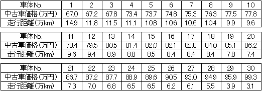
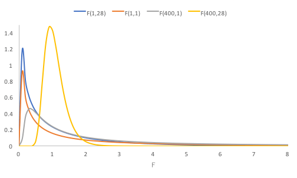
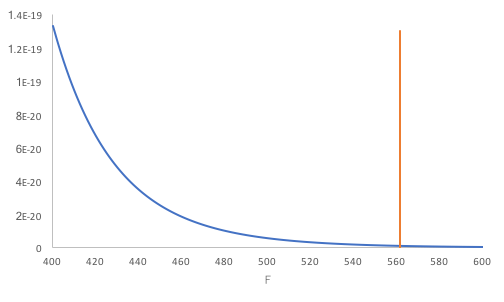

回帰分析
--------

### 変数の関係を探る流れ

<a href="../06/">相関分析</a>では、2変数の<a href="../06/#chapter2">相関関係</a>がわかりました。この関係を式で表すことで、一方の変数から他方の変数を予測したりすることができます。この式を求めることなどを回帰分析（regression analysis）と呼び、求められた式を回帰式（regression equation）と呼びます。

回帰分析では、例えば、$ x$、$ y$の2変数について、$ x$を<a href="../04/#explanatory_variable">説明変数</a>、$ y$を<a href="../04/#target_variable">目的変数</a>として、その関係を表す式（$ y$の$ x$への回帰式（regression equation of $ y$ on $ x$））を求めます。なお、回帰式は$ x$と$ y$の関係を完全には表しきれていない（$ x$から$ y$の<a href="##chapter11">予測の精度</a>が高くない）場合もあることに注意してください。

|  | 線形回帰（linear regression） | 非線形回帰（nonlinear regression） |
| -- | -- | -- |
| 単回帰分析（simple regression analysis） 説明変数が1つ | $ y = a + bx$ など | $ y = ax^b$ など |
| 重回帰分析（multiple regression analysis） 説明変数が2つ以上 | $ y = a + bx_1 + cx_2$ など | $ y = ax_1^{x_2}$ など |

ここでは特に、説明変数が1つである単回帰分析、かつ、2変数の関係を1次式で表現する線形回帰、つまり、$ y = a + bx$と表す線形単回帰分析（simple linear regeression）について扱います。

線形単回帰分析
----------

線形単回帰分析では2つの変数の関係は1次式で表され、図示すると直線になります。この、<a href="../04/#explanatory_variable">説明変数</a>の値から<a href="../04/#target_variable">目的変数</a>の値を予測する直線を、単回帰直線（simple regression line）といいます。

#### 回帰式の求め方

対になったデータ$ x_i$と$ y_i$（$ i$ = 1, 2, … , $ N$）から<a href="#regression_equation">回帰式</a>$ y = a + bx$を求めるには以下の数式を用います。

&#9312; $ \displaystyle b = \frac{S_{xy}}{S_x}$：回帰係数（regression coefficient）

&#9313; $ a = \overline{y} - b\overline{x}$：切片（intercept）

* $ \displaystyle S_{xy} = \sum_{i = 1}^N \left( x_i - \overline{x} \right) \left( y_i - \overline{y} \right)$：$ x$と$ y$との<a href="../01/#deviation">偏差</a>積和
* $ \displaystyle S_x = \sum_{i = 1}^N {\left( x_i - \overline{x} \right)}^2$：$ x$の<a href="../01/#sum_of_squared_deviations">偏差平方和</a>
* $ \displaystyle \overline{x} = \frac{1}{N} \sum_{i = 1}^N x_i$：$ x_i$の<a href="../01/#mean">平均</a>
* $ \displaystyle \overline{y} = \frac{1}{N} \sum_{i = 1}^N y_i$：$ y_i$の平均

$ i$番目の<a href="../04/#explanatory_variable">説明変数</a>$ x_i$に対する<a href="../04/#target_variable">目的変数</a>$ y_i$とある直線$ y = a + bx$との距離（<a href="#residual">残差</a>）を$ Q_i$で表すと，その二乗値は

$ \displaystyle Q_{i}^2 = {\\{y_{i} - (a + bx_{i})\\}}^2$

で与えられます。この$ Q_i^2$の合計（残差平方和）
$ \displaystyle \sum_{i = 1}^N Q_i^2$
を最小にすることによって、2変数$ x$と$ y$との関係を表すのに最も適した回帰式を求めることができる、とする方法を最小二乗法（least squares method）と呼びます。最小二乗法で求めた$ a$と$ b$が<a href="#equation_derivation">上式</a>の切片$ a$と回帰係数$ b$になっています。ここで、説明変数$ x_i$に対して求めた回帰式によって予測した目的変数の値を$\hat{y}\_i = a + bx_i$で表すと、<a href="#intercept">切片を求める式</a>から$ \hat{y}_i$の平均$\displaystyle \frac{1}{N} \sum\_{i = 1}^N \hat{y}\_i$は$\overline{y}$と等しくなることがわかります。

なお、$ x$と$ y$とをそれぞれ<a href="../02/#standardization">標準化</a>して回帰係数$ b$を求めると，$ b$は<a href="../06/#chapter7">相関係数</a>rと等しくなります。

### 練習問題

次のデータは、ある車種における中古車の価格と走行距離について30台分示したものです。走行距離（$ x$）から中古車の価格（$ y$）を予測する<a href="#regression_equation">回帰式</a>を<a href="#chapter3">線形単回帰分析</a>で求めてください。

表1：ある車種30台の中古車価格と走行距離

#### Excelの操作

Excelを用いて<a href="#chapter5">練習問題</a>に取り掛かりましょう。

&#9312; <a href="#table1">表1</a>のデータをExcelに入力します。



&#9313; 回帰式導出用の項目を入力します。



&#9314; 価格平均と<a href="../01/#deviation">偏差</a>を求め、それぞれの偏差を求めるために、以下のように入力し、"G2"セルと"H2"セルとを選択します。

* "D2"：<code>=AVERAGE(A2:A31)</code>（<a href="../01/#mean">平均</a>）
* "E2"：<code>=AVERAGE(B2:B31)</code>（平均）
* "G2"：<code>=A2-D$2</code>（偏差）
* "H2"：<code>=B2-E$2</code>（偏差）

なお、"E2"は"D2"の<a href="../01/#autofill">オートフィル</a>で、"H2"は"G2"のオートフィルで、それぞれ入力することも可能です。



オートフィルで残りの偏差を求めます。



&#9315; 回帰式を導出するために、以下のように入力します。

* "K1"：<code>=SUMPRODUCT(G2:G31,H2:H31)</code>（偏差積和）
* "K2"：<code>=SUMSQ(H2:H31)</code>（走行距離の<a href="../01/#sum_of_squared_deviations">偏差平方和</a>）
* "K3"：<code>=K1/K2</code>（<a href="#regression_coefficient">回帰係数</a>$ b$）
* "K4"：<code>=D2-K3*E2</code>（<a href="#intercept">切片</a>$ a$）



なお、<code>SUMPRODUCT(配列1,配列2)</code>は配列1と配列2との対応する要素の積和を求めます（<a href="https://support.office.com/ja-jp/article/SUMPRODUCT-関数-16753e75-9f68-4874-94ac-4d2145a2fd2e"><code>SUMPRODUCT</code>関数</a>）。<code>SUMSQ(配列)</code>は配列要素の平方和を求めます（<a href="https://support.office.com/ja-jp/article/SUMSQ-関数-e3313c02-51cc-4963-aae6-31442d9ec307"><code>SUMSQ</code>関数</a>）。

回帰式$ y$ = 110.4715 - 3.31499$ x$が求まりました。

なお、<a href="https://support.office.com/ja-jp/article/DEVSQ-関数-8b739616-8376-4df5-8bd0-cfe0a6caf444"><code>DEVSQ</code>関数</a>を用いて、"K2"を<code>=DEVSQ(B2:B31)</code>と、入力データから直接求めることもできます。また、<a href="https://support.office.com/ja-jp/article/SLOPE-関数-11fb8f97-3117-4813-98aa-61d7e01276b9"><code>SLOPE</code>関数</a>と<a href="https://support.office.com/ja-jp/article/INTERCEPT-関数-2a9b74e2-9d47-4772-b663-3bca70bf63ef"><code>INTERCEPT</code>関数</a>とを用いて、"K3"を<code>=SLOPE(A2:A31,B2:B31)</code>と、"K4"を<code>=INTERCEPT(A2:A31,B2:B31)</code>と、入力データから直接求めることもできます。

また、Excelでは散布図に回帰直線を描くと同時に回帰式を求めることもできます。<a href="../06/#chapter6">ここ</a>を参考におすすめグラフを挿入します。ただし、横軸が中古車価格、縦軸が走行距離になるので、<a href="../06/#chapter9">ここ</a>を参考に「系列の編集」ウィンドウを表示し、「系列 X の値(<u>X</u>):」を<code>=Sheet1!$B$2:$B$31</code>に、「系列 Y の値(<u>Y</u>):」を<code>=Sheet1!$A$2:$A$31</code>に、それぞれ変更します。また、点（マーカー）の間に線が描かれているので、<a href="../06/#chapter9">ここ</a>を参考にデータ系列の書式設定作業ウィンドウを表示し、バケツのアイコンをクリックし、線をクリックし、なしを選択します。ここまで設定した散布図は以下の図のようになります。



回帰直線を描くために、「+」ボタンをクリックして「近似曲線」をチェックします。



回帰式を求めるために、近似曲線の書式設定作業ウィンドウを表示し、「グラフに数式を表示する」をチェックします。



回帰式と回帰直線とを含む散布図ができました。



### 回帰式の吟味

<a href="#regression_equation">回帰式</a>によって予測した$ y$の値と、実際の$ y$の値との差を残差（residual）といいます。この残差を用いて、求めた回帰係数$ b$が予測に役立っているかを検定することができます。

#### 仮説の設定

* <a href="../02/#null_hypothesis">帰無仮説</a>H0：回帰係数$ b$は予測に役立っていない（極端に言えば$ b$ = 0）
* <a href="../02/#alternative_hypothesis">対立仮説</a>H1：回帰係数$ b$は予測に役立っている（$ b$ ≠ 0）

#### 有意水準αの設定

<a href="../04/#chapter1">有意水準</a>α = 0.05とします。

#### 検定統計量$ F$値の算出

今回、<a href="../02/#test_statistic">検定統計量</a>$ F$値は以下の数式で求めることができます。

$ \displaystyle F = \frac{V_{\hat{y}}}{V_Q}$

* $ \displaystyle V_{\hat{y}} = \frac{1}{1} \sum_{i = 1}^N {\left( \hat{y}_i - \overline{y} \right)}^2$：予測値$ \hat{y}$の<a href="../01/#variance">不偏分散</a>（自由度1）
* $ \displaystyle V_Q = \frac{1}{N - 2} \sum_{i = 1} Q_i^2$：<a href="#residual">残差</a>の不偏分散（自由度$ N - 2$）
* $ \displaystyle \overline{y} = \frac{1}{N} \sum_{i = 1}^N y_i = \frac{1}{N} \sum_{i = 1}^N \hat{y}_i$：$ y$の<a href="../01/#mean">平均</a>、<a href="#same_mean">予測値$ \hat{y}$の平均</a>

残差$ Q_i$は<a href="../04/#target_variable">目的変数</a>の値$ y_i$と<a href="#estimated_value">回帰式によって予測した値$ \hat{y}_i$</a>とを用いて$ Q_i = y_i - \hat{y}_i$と表すことができます。これを$ y_i = \hat{y}_i + Q_i$と変形し、左辺から$ y$の平均$ \overline{y}$を、右辺から$ \hat{y}_i$の平均$ \overline{y}$を、それぞれ引くと$ y_i - \overline{y} = \left( \hat{y}_i - \overline{y} \right) + Q_i$となります。これは、左辺の目的変数$ y$の偏差$ y_i - \overline{y}$が右辺第1項の$ x_i$への回帰で表される（予測値$ \hat{y}_i$の偏差で説明できる）部分$ \hat{y}_i - \overline{y}$と右辺第2項の回帰で表されない部分$ Q_i$とから成り立つことを意味します。この$ y$の散らばり具合を不偏分散を用いて表せば、$V_y = V\_{\hat{y}} + V_Q$となります。

* $ \displaystyle V_y = \frac{1}{N - 1} \sum_{i = 1}^N {\left( y_i - \overline{y} \right)}^2$：$ y$の不偏分散（自由度$ N - 1$）

検定統計量$ F$は<a href="#explained">回帰式で説明できる部分</a>の不偏分散と<a href="#unexplained">説明できない部分</a>の不偏分散との比で、<a href="../02/#null_hypothesis">帰無仮説</a>が成立する場合、$ F$は自由度が(1, $ N - 2$)の<a href="../levene_s_test/#f-distribution">F分布</a>に従うことがわかっています。

#### p値の算出

<a href="../04/#chapter1">有意水準</a>と比較する確率p値を計算します。p値は、自由度が(1, $ N - 2$)の<a href="../levene_s_test/#f-distribution">F分布</a>において$ F$値より大きい値が発生する確率です。<a href="../02/#null_hypothesis">帰無仮説</a>が成立する場合、$ V_{\hat{y}}$が$ V_Q$より小さくなるため、結果として$ F$値は小さくなり、p値は大きくなります。逆に帰無仮説が成立しない場合は、$ F$値は大きいためp値は小さくなります。

#### 判定

<a href="../levene_s_test/#f-distribution">F分布</a>はこのようなグラフを描きます。このグラフで<a href="#p_of_F">p値</a>を表す面積が<a href="../04/#chapter1">有意水準</a>の確率を表す面積より大きいか小さいかで<a href="../02/#null_hypothesis">帰無仮説</a>の受容か棄却かを決定します。なお、図のとおり、自由度によって、このF分布のグラフは変わります。
<dl>
 	<dt>p値 ≦ 有意水準α</dt>
 	<dd>帰無仮説H0を棄却する</dd>
 	<dt>p値 &gt; 有意水準α</dt>
 	<dd>帰無仮説H0を受容する</dd>
</dl>

### Excelの操作

ここまで検定の理論について説明してきましたが、Excelを用いて検定を行ってみましょう。<a href="#chapter5">練習問題</a>で用いたファイルに追記します。

&#9312; 検定用の項目を入力し、既知のデータを入力します。



&#9313; 予測値$ \hat{y}_i = a + bx_i$を求めるために、以下のように入力し、"M2"セルを選択して<a href="../01/#autofill">オートフィル</a>で他のセルも入力します。

* "M2"：<code>=K$4+K$3*B2</code>（予測値$ \hat{y}_i$）



&#9314; 検定用のデータを算出するため、以下のように入力します。

* "P2"：<code>=DEVSQ(M2:M31)</code>（予測値$ \hat{y}$の<a href="../01/#sum_of_squared_deviations">偏差平方和</a>）
* "P3"：<code>=SUMXMY2(A2:A31,M2:M31)</code>（<a href="#residual">残差</a>平方和）
* "P4"：<code>=COUNTA(A2:A31)-2</code>（残差平方和の自由度）
* "P5"：<code>=P2/(P3/P4)</code>（<a href="../02/#test_statistic">検定統計量</a>$ F$値）
* "P6"：<code>=F.DIST.RT(P5,1,P4)</code>（<a href="#p_of_F">p値</a>）



<code>SUMXMY2(配列1,配列2)</code>は配列1と配列2の対応する要素の差の平方和を求めます（<a href="https://support.office.com/ja-jp/article/SUMXMY2-関数-9d144ac1-4d79-43de-b524-e2ecee23b299"><code>SUMXMY2</code>関数</a>）。

なお、<a href="https://support.office.com/ja-jp/article/FORECAST-関数-50ca49c9-7b40-4892-94e4-7ad38bbeda99"><code>FORECAST</code>関数</a>を用いて、"M2"を<code>=FORECAST(B2,A$2:A$31,B$2:B$31)</code>と、入力データから直接求めることもできます。

### 結果

<a href="#p_of_F">p値</a> = 4.55826 × 10-20が求まりました。下図の塗りつぶされた領域が全体に対してpの割合になっています。

p値 = 0.010477 &lt; <a href="../04/#chapter1">有意水準</a>α = 0.05 なので<a href="../02/#null_hypothesis">帰無仮説</a>H0は棄却されます。したがって、回帰係数$ b$は予測に役立っていることになります。

### 論文では

論文では以下のようになります。

> <a href="#regression_equation">回帰式</a>に関してF検定を行ったところ、有意であった（F(1,28) = 561.4005, p &lt; .05）。よって、回帰式は統計的に意味がある。

### 決定係数

<a href="#regression_equation">回帰式</a>は統計的に意味があることはわかりましたが、<a href="../04/#explanatory_variable">説明変数</a>$ x$は<a href="../04/#target_variable">目的変数</a>$ y$の変動をどれくらい説明できるのでしょうか。

<a href="#section2.4.3">検定統計量$ F$値の算出</a>で述べたとおり、<q cite="#section2.4.3">左辺の目的変数$ y$の偏差$ y_i - \overline{y}$が<a href="#explained">右辺第1項の$ x_i$への回帰で表される（予測値$ \hat{y}_i$の偏差で説明できる）部分$ \hat{y}_i - \overline{y}$と</a><a href="#unexplained">右辺第2項の回帰で表されない部分$ Q_i$とから成り立</a></q>っています。そこで、$ x_i$への回帰で表される部分$ \hat{y}_i - \overline{y}$が$ y$の散らばり具合$ y_i - \overline{y}$をどの程度表しているかを比で表します。回帰で表される部分に対する<a href="../01/#sum_of_squared_deviations">偏差平方和</a>

$ \displaystyle S_{\hat{y}} = \sum_{i = 1}^N {\left( \hat{y}_i - \overline{y} \right)}^2$

と目的変数$ y$の偏差平方和

$ \displaystyle S_y = \sum_{i = 1}^N {\left( y_i - \overline{y} \right)}^2$

とを用いて比を取った

$ \displaystyle R^2 = \frac{S_{\hat{y}}}{S_y}$

を考えます。

この$ R^2$は決定係数（coefficient of determination）と呼ばれ、0 ≤ $ R^2$ ≤ 1です。予測値$ \hat{y}\_i$の散らばり具合が大きければ$ S\_{\hat{y}}$が大きくなり、$ R^2$は大きくなるので、$ R^2$が1に近ければ予測値の散らばり具合は目的変数$ y$の散らばり具合に近く、説明変数$ x$が目的変数$ y$の変動を説明できていることになります。なお、<a href="#simple_regression_analysis">単回帰分析</a>では決定係数と<a href="../06/#chapter7">相関係数</a>rの二乗値とが等しい、すなわち、$ R^2$ = r2です。

Excelで実際に求めてみましょう。

* "P9"：<code>=P2/DEVSQ(A2:A31)</code>（決定係数$ R^2$）



$ R^2$ = 0.952494102が求まりました。求めた回帰式はよく説明できていることがわかりました。これは<a href="#scatter_with_regression">散布図</a>で<a href="#regression_line">回帰直線</a>が多くのデータ点と接していることに現れています。

課題
----

次の表は、あるアミューズメント施設の入場者数と前売り券の販売枚数を10日にわたり調査した結果です。 入場者数を<a href="../04/#target_variable">目的変数</a>（$ y$）、前売り券の販売枚数を<a href="../04/#explanatory_variable">説明変数</a>（$ x$）として、<a href="#regression_equation">回帰式</a>を求め、<a href="#regression_line">回帰直線</a>を図示し、その後、回帰式の検定を行ってください。また、回帰式が有意である場合、前売り券が700枚売れたとき、当日入場者数はどのくらい見込めると予測できるでしょうか？

表2：入場者数と前売り券販売枚数

