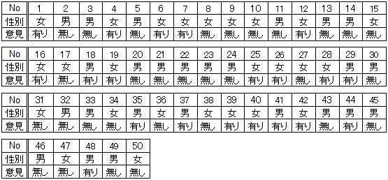
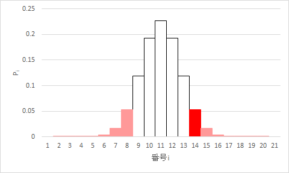

分割表の検定
--------------

<a href="../04/#chapter7">分割表の検定</a>に<a href="../04/#pearson_s_chi2-test">ピアソンの$ \chi^2$検定</a>を用いることができるのは、基本的に<a href="../04/#grand_total">総数</a>が大きい場合です。その他の場合は、フィッシャーの正確確率検定（Fisher's exact test）を用いて検定します。なお、ピアソンの$ \chi^2$検定を用いることができる場合でも、フィッシャーの正確確率検定を用いて構いません。

フィッシャーの正確確率検定
-----------

### 練習問題1

ここでは、例として、<a href="../04/#chapter3">分割表（クロス集計表）の分析</a>の<a href="../04/#chapter5">練習問題1</a>を利用します。

> 次のデータは、ある地域の成人男性25人、女性25人の合計50人に、今住んでいる地域に愛着が有るか無いかの意見を聞き、その結果を表にしたものです。このデータを集計し、<a href="../04/#contingency_table">分割表</a>に整理しましょう。

> 表1：ある地域の愛着に対する意見

> 

> 

この分割表に対して、母比の差を検定してみましょう。

### 仮説の設定

* <a href="../02/#null_hypothesis">帰無仮説</a>H0：愛着ありと愛着なしとの度数の比は男性と女性とで等しい
* <a href="../02/#alternative_hypothesis">対立仮説</a>H1：愛着ありと愛着なしとの度数の比は男性と女性とで等しくない

### 有意水準αの設定

<a href="../04/#chapter1">有意水準</a>α = 0.05とします。

### $ p_i$値の算出

<a href="../04/#row_marginal_total">行周辺合計</a>と<a href="../04/#column_marginal_total">列周辺合計</a>とを固定した分割表

|  | 有り | 無し | 総計 |
| -- | -- | -- | -- |
| 女性 | $ a$ | $ b$ | 25 |
| 男性 | $ c$ | $ d$ | 25 |
| 総計 | 30 | 20 | 50 |

を考えたとき、観測された

|  | 有り | 無し | 総計 |
| -- | -- | -- | -- |
| 女性 | 12 | 13 | 25 |
| 男性 | 18 | 7 | 25 |
| 総計 | 30 | 20 | 50 |

になる確率$ P_o$は$\frac{ _\{25\} C _{12} \times _\{25\} C _{18} }{ _\{50\} C _{30}}$で求められます。ここで、$ {_n}C_k$は相異なる$ n$種のものから重複なく$ k$種選ぶような組合せが何通りあるかを表します。

<a href="#fixed_marginal">周辺合計を固定した分割表</a>は、観測された分割表（$ a$=12、$ b$=13、$ c$=18、$ d$=7）を含め多数存在し得ます。周辺合計の中で最小である愛着無しの列周辺合計20に着目すると、$ b + d$=20、0≦$ b$≦20、0≦$ d$≦20を満たす21の分割表が考えられます。21のうちいくつかの分割表を以下に示します。

$ b$=0、$ d$=20の場合

|  | 有り | 無し | 総計 |
| -- | -- | -- | -- |
| 女性 | 25 | 0 | 25 |
| 男性 | 5 | 20 | 25 |
| 総計 | 30 | 20 | 50 |

$ b$=1、$ d$=19の場合

|  | 有り | 無し | 総計 |
| -- | -- | -- | -- |
| 女性 | 24 | 1 | 25 |
| 男性 | 6 | 19 | 25 |
| 総計 | 30 | 20 | 50 | 

$ b$=10、$ d$=10の場合

|  | 有り | 無し | 総計 |
| -- | -- | -- | -- |
| 女性 | 15 | 10 | 25 |
| 男性 | 15 | 10 | 25 |
| 総計 | 30 | 20 | 50 |

$ b$=19、$ d$=1の場合

|  | 有り | 無し | 総計 |
| -- | -- | -- | -- |
| 女性 | 6 | 19 | 25 |
| 男性 | 24 | 1 | 25 |
| 総計 | 30 | 20 | 50 |

$ b$=20、$ d$=0の場合

|  | 有り | 無し | 総計 |
| -- | -- | -- | -- |
| 女性 | 5 | 20 | 25 |
| 男性 | 25 | 0 | 25 |
| 総計 | 30 | 20 | 50 |

21の分割表を$ a$、$ b$、$ c$、$ d$とその分割表になる確率について$ b$が0から20まで変化するようにまとめると、以下のようになります。なお、便宜上、番号$ i$を1から21まで与えてあります。

<table id="possibilities" style="width:auto;border-collapse:collapse;">
<caption style="text-align:center;border:none;">$ a$、$ b$、$ c$、$ d$とその確率$ P_i$についてのまとめ</caption>
<thead>
<tr>
<th style="text-align:center;border:1px solid black;">番号$ i$</th>
<th style="text-align:center;border:1px solid black;">$ a$</th>
<th style="text-align:center;border:1px solid black;">$ b$</th>
<th style="text-align:center;border:1px solid black;">$ c$</th>
<th style="text-align:center;border:1px solid black;">$ d$</th>
<th style="text-align:center;border:1px solid black;">確率$ P_i$</th>
<th style="text-align:center;border:1px solid black;">備考</th>
</tr>
</thead>
<tbody>
<tr style="background-color:pink;">
<th style="text-align:right;border:1px solid black;">1</th>
<td style="text-align:right;border:1px solid black;">25</td>
<td style="text-align:right;border:1px solid black;">0</td>
<td style="text-align:right;border:1px solid black;">5</td>
<td style="text-align:right;border:1px solid black;">20</td>
<td style="text-align:left;border:1px solid black;">$ P_1 = {}_{25}C_{25}\times{}_{25}C_5\div{}_{50}C_{30}$</td>
<td style="text-align:left;border:1px solid black;"><a href="#i=1">$ b$=0、$ d$=20の場合</a></td>
</tr>
<tr style="background-color:pink;">
<th style="text-align:right;border:1px solid black;">2</th>
<td style="text-align:right;border:1px solid black;">24</td>
<td style="text-align:right;border:1px solid black;">1</td>
<td style="text-align:right;border:1px solid black;">6</td>
<td style="text-align:right;border:1px solid black;">19</td>
<td style="text-align:left;border:1px solid black;">$ P_2 = {}_{25}C_{24}\times{}_{25}C_6\div{}_{50}C_{30}$</td>
<td style="text-align:left;border:1px solid black;"><a href="#i=2">$ b$=1、$ d$=19の場合</a></td>
</tr>
<tr style="background-color:pink;">
<th style="text-align:right;border:1px solid black;">3</th>
<td style="text-align:right;border:1px solid black;">23</td>
<td style="text-align:right;border:1px solid black;">2</td>
<td style="text-align:right;border:1px solid black;">7</td>
<td style="text-align:right;border:1px solid black;">18</td>
<td style="text-align:left;border:1px solid black;">$ P_3 = {}_{25}C_{23}\times{}_{25}C_7\div{}_{50}C_{30}$</td>
<td style="text-align:left;border:1px solid black;"></td>
</tr>
<tr style="background-color:pink;">
<th style="text-align:right;border:1px solid black;">4</th>
<td style="text-align:right;border:1px solid black;">22</td>
<td style="text-align:right;border:1px solid black;">3</td>
<td style="text-align:right;border:1px solid black;">8</td>
<td style="text-align:right;border:1px solid black;">17</td>
<td style="text-align:left;border:1px solid black;">$ P_4 = {}_{25}C_{22}\times{}_{25}C_8\div{}_{50}C_{30}$</td>
<td style="text-align:left;border:1px solid black;"></td>
</tr>
<tr style="background-color:pink;">
<th style="text-align:right;border:1px solid black;">5</th>
<td style="text-align:right;border:1px solid black;">21</td>
<td style="text-align:right;border:1px solid black;">4</td>
<td style="text-align:right;border:1px solid black;">9</td>
<td style="text-align:right;border:1px solid black;">16</td>
<td style="text-align:left;border:1px solid black;">$ P_5 = {}_{25}C_{21}\times{}_{25}C_9\div{}_{50}C_{30}$</td>
<td style="text-align:left;border:1px solid black;"></td>
</tr>
<tr style="background-color:pink;">
<th style="text-align:right;border:1px solid black;">6</th>
<td style="text-align:right;border:1px solid black;">20</td>
<td style="text-align:right;border:1px solid black;">5</td>
<td style="text-align:right;border:1px solid black;">10</td>
<td style="text-align:right;border:1px solid black;">15</td>
<td style="text-align:left;border:1px solid black;">$ P_6 = {}_{25}C_{20}\times{}_{25}C_{10}\div{}_{50}C_{30}$</td>
<td style="text-align:left;border:1px solid black;"></td>
</tr>
<tr style="background-color:pink;">
<th style="text-align:right;border:1px solid black;">7</th>
<td style="text-align:right;border:1px solid black;">19</td>
<td style="text-align:right;border:1px solid black;">6</td>
<td style="text-align:right;border:1px solid black;">11</td>
<td style="text-align:right;border:1px solid black;">14</td>
<td style="text-align:left;border:1px solid black;">$ P_7 = {}_{25}C_{19}\times{}_{25}C_{11}\div{}_{50}C_{30}$</td>
<td style="text-align:left;border:1px solid black;"></td>
</tr>
<tr style="background-color:pink;">
<th style="text-align:right;border:1px solid black;">8</th>
<td style="text-align:right;border:1px solid black;">18</td>
<td style="text-align:right;border:1px solid black;">7</td>
<td style="text-align:right;border:1px solid black;">12</td>
<td style="text-align:right;border:1px solid black;">13</td>
<td style="text-align:left;border:1px solid black;">$ P_8 = {}_{25}C_{18}\times{}_{25}C_{12}\div{}_{50}C_{30}$</td>
<td style="text-align:left;border:1px solid black;"></td>
</tr>
<tr>
<th style="text-align:right;border:1px solid black;">9</th>
<td style="text-align:right;border:1px solid black;">17</td>
<td style="text-align:right;border:1px solid black;">8</td>
<td style="text-align:right;border:1px solid black;">13</td>
<td style="text-align:right;border:1px solid black;">12</td>
<td style="text-align:left;border:1px solid black;">$ P_9 = {}_{25}C_{17}\times{}_{25}C_{13}\div{}_{50}C_{30}$</td>
<td style="text-align:left;border:1px solid black;"></td>
</tr>
<tr>
<th style="text-align:right;border:1px solid black;">10</th>
<td style="text-align:right;border:1px solid black;">16</td>
<td style="text-align:right;border:1px solid black;">9</td>
<td style="text-align:right;border:1px solid black;">14</td>
<td style="text-align:right;border:1px solid black;">11</td>
<td style="text-align:left;border:1px solid black;">$ P_{10} = {}_{25}C_{16}\times{}_{25}C_{14}\div{}_{50}C_{30}$</td>
<td style="text-align:left;border:1px solid black;"></td>
</tr>
<tr>
<th style="text-align:right;border:1px solid black;">11</th>
<td style="text-align:right;border:1px solid black;">15</td>
<td style="text-align:right;border:1px solid black;">10</td>
<td style="text-align:right;border:1px solid black;">15</td>
<td style="text-align:right;border:1px solid black;">10</td>
<td style="text-align:left;border:1px solid black;">$ P_{11} = {}_{25}C_{15}\times{}_{25}C_{15}\div{}_{50}C_{30}$</td>
<td style="text-align:left;border:1px solid black;"><a href="#i=11">$ b$=10、$ d$=10の場合</a></td>
</tr>
<tr>
<th style="text-align:right;border:1px solid black;">12</th>
<td style="text-align:right;border:1px solid black;">14</td>
<td style="text-align:right;border:1px solid black;">11</td>
<td style="text-align:right;border:1px solid black;">16</td>
<td style="text-align:right;border:1px solid black;">9</td>
<td style="text-align:left;border:1px solid black;">$ P_{12} = {}_{25}C_{14}\times{}_{25}C_{16}\div{}_{50}C_{30}$</td>
<td style="text-align:left;border:1px solid black;"></td>
</tr>
<tr>
<th style="text-align:right;border:1px solid black;">13</th>
<td style="text-align:right;border:1px solid black;">13</td>
<td style="text-align:right;border:1px solid black;">12</td>
<td style="text-align:right;border:1px solid black;">17</td>
<td style="text-align:right;border:1px solid black;">8</td>
<td style="text-align:left;border:1px solid black;">$ P_{13} = {}_{25}C_{13}\times{}_{25}C_{17}\div{}_{50}C_{30}$</td>
<td style="text-align:left;border:1px solid black;"></td>
</tr>
<tr style="color:white;background-color:red;">
<th style="text-align:right;border:1px solid black;">14</th>
<td style="text-align:right;border:1px solid black;">12</td>
<td style="text-align:right;border:1px solid black;">13</td>
<td style="text-align:right;border:1px solid black;">18</td>
<td style="text-align:right;border:1px solid black;">7</td>
<td style="text-align:left;border:1px solid black;">$ P_{14} = {}_{25}C_{12}\times{}_{25}C_{18}\div{}_{50}C_{30}$</td>
<td style="text-align:left;border:1px solid black;">$ P_o$</td>
</tr>
<tr style="background-color:pink;">
<th style="text-align:right;border:1px solid black;">15</th>
<td style="text-align:right;border:1px solid black;">11</td>
<td style="text-align:right;border:1px solid black;">14</td>
<td style="text-align:right;border:1px solid black;">19</td>
<td style="text-align:right;border:1px solid black;">6</td>
<td style="text-align:left;border:1px solid black;">$ P_{15} = {}_{25}C_{11}\times{}_{25}C_{19}\div{}_{50}C_{30}$</td>
<td style="text-align:left;border:1px solid black;"></td>
</tr>
<tr style="background-color:pink;">
<th style="text-align:right;border:1px solid black;">16</th>
<td style="text-align:right;border:1px solid black;">10</td>
<td style="text-align:right;border:1px solid black;">15</td>
<td style="text-align:right;border:1px solid black;">20</td>
<td style="text-align:right;border:1px solid black;">5</td>
<td style="text-align:left;border:1px solid black;">$ P_{16} = {}_{25}C_{10}\times{}_{25}C_{20}\div{}_{50}C_{30}$</td>
<td style="text-align:left;border:1px solid black;"></td>
</tr>
<tr style="background-color:pink;">
<th style="text-align:right;border:1px solid black;">17</th>
<td style="text-align:right;border:1px solid black;">9</td>
<td style="text-align:right;border:1px solid black;">16</td>
<td style="text-align:right;border:1px solid black;">21</td>
<td style="text-align:right;border:1px solid black;">4</td>
<td style="text-align:left;border:1px solid black;">$ P_{17} = {}_{25}C_9\times{}_{25}C_{21}\div{}_{50}C_{30}$</td>
<td style="text-align:left;border:1px solid black;"></td>
</tr>
<tr style="background-color:pink;">
<th style="text-align:right;border:1px solid black;">18</th>
<td style="text-align:right;border:1px solid black;">8</td>
<td style="text-align:right;border:1px solid black;">17</td>
<td style="text-align:right;border:1px solid black;">22</td>
<td style="text-align:right;border:1px solid black;">3</td>
<td style="text-align:left;border:1px solid black;">$ P_{18} = {}_{25}C_8\times{}_{25}C_{22}\div{}_{50}C_{30}$</td>
<td style="text-align:left;border:1px solid black;"></td>
</tr>
<tr style="background-color:pink;">
<th style="text-align:right;border:1px solid black;">19</th>
<td style="text-align:right;border:1px solid black;">7</td>
<td style="text-align:right;border:1px solid black;">18</td>
<td style="text-align:right;border:1px solid black;">23</td>
<td style="text-align:right;border:1px solid black;">2</td>
<td style="text-align:left;border:1px solid black;">$ P_{19} = {}_{25}C_7\times{}_{25}C_{23}\div{}_{50}C_{30}$</td>
<td style="text-align:left;border:1px solid black;"></td>
</tr>
<tr style="background-color:pink;">
<th style="text-align:right;border:1px solid black;">20</th>
<td style="text-align:right;border:1px solid black;">6</td>
<td style="text-align:right;border:1px solid black;">19</td>
<td style="text-align:right;border:1px solid black;">24</td>
<td style="text-align:right;border:1px solid black;">1</td>
<td style="text-align:left;border:1px solid black;">$ P_{20} = {}_{25}C_6\times{}_{25}C_{24}\div{}_{50}C_{30}$</td>
<td style="text-align:left;border:1px solid black;"><a href="#i=20">$ b$=19、$ d$=1の場合</a></td>
</tr>
<tr style="background-color:pink;">
<th style="text-align:right;border:1px solid black;">21</th>
<td style="text-align:right;border:1px solid black;">5</td>
<td style="text-align:right;border:1px solid black;">20</td>
<td style="text-align:right;border:1px solid black;">25</td>
<td style="text-align:right;border:1px solid black;">0</td>
<td style="text-align:left;border:1px solid black;">$ P_{21} = {}_{25}C_5\times{}_{25}C_{25}\div{}_{50}C_{30}$</td>
<td style="text-align:left;border:1px solid black;"><a href="#i=21">$ b$=20、$ d$=0の場合</a></td>
</tr>
</tbody>
</table>

なお、この例では$ P_o = P_{14}$です。

### p値の算出

<a href="../04/#chapter1">有意水準</a>αと比較する確率p値を算出します。フィッシャーの正確確率検定では、$ P_i \le P_o$を満たす$ P_i$の総和がp値となります。<a href="#possibilities">$ a$、$ b$、$ c$、$ d$とその確率$ P_i$についてのまとめの表</a>の赤い行が$ P_o$の行、ピンクの行が$ P_i \le P_o$を満たす$ P_o$以外の行で、これらの$ P_i$の総和がp値となります。

### 判定

<a href="#p-value">p値</a>が<a href="../04/#chapter1">有意水準</a>より大きいか小さいかで<a href="../02/#null_hypothesis">帰無仮説</a>の受容か棄却かを決定します。
<dl>
 	<dt>p値 ≦ 有意水準α</dt>
 	<dd>帰無仮説H0を棄却する</dd>
 	<dt>p値 &gt; 有意水準α</dt>
 	<dd>帰無仮説H0を受容する</dd>
</dl>

### Excelの操作

ここまで検定の理論について説明してきましたが、Excelを用いて<a href="#chapter3">練習問題1</a>に取り掛かりましょう。<a href="../04/#chapter6">分割表の作成</a>は済んでいるとします。

&#9312; <a href="#fixed_marginal">行周辺合計と列周辺合計とを固定した分割表</a>をExcelで追記します。ここで、"B10"、"B11"、"C10"、"C11"は文字を直接入力する必要がありますが、それ以外のセルは例えば"B9"セルに<code>=B4</code>と入力するなど、参照を活用してすでに入力されている情報を再利用しましょう。



&#9313; <a href="#possibilities">$ a$、$ b$、$ c$、$ d$とその確率$ P_i$についてまとめた表</a>を入力します。番号$ i$と<q cite="#focus_on_b">0から20まで変化する</q>$ b$とは数値を直接入力する必要がありますが、<a href="../01/#autofill">オートフィル</a>を使って入力しましょう。



&#9314; $ a$は$25 - b$、$d$は$20 - b$なので、<a href="http://infolit.uec.tmu.ac.jp/lit/contents/office2013/excel/01/#chapter17">数式</a>として入力します。なお、25は<code>D$10</code>として、20は<code>C$12</code>として、それぞれ参照することが可能です。同様に、$ c$は30 - $ a$あるいは25 - $ d$で求められます。ここで25は<code>D$11</code>になります。



&#9315; $ P_i$を求めます。$ P_i$は$\_{25}C_a \times \_{25}C_c \div \_{50}C\_{30}$で求めることができます。ここで、$\_nC\_k$は<code>COMBIN</code>関数を使って<code>COMBIN(</code>$ n$<code>,</code>$ k$<code>)</code>と求めることができます（<a href="https://support.office.com/ja-jp/article/COMBIN-関数-12a3f276-0a21-423a-8de6-06990aaf638a"><code>COMBIN</code>関数</a>）。$ a$は<code>J2</code>など、$ c$は<code>L2</code>など、$\_{25}C\_a$の25は<code>D$10</code>、$\_{25}C\_c$の25は<code>D$11</code>、50は<code>D$12</code>、30は<code>B$12</code>と、参照を活用してすでに入力されている情報を再利用しましょう。



&#9316; <q cite="#deriving_p-value">$ P_i \le P_o$を満たす$ P_i$の総和</q>を求めるために、$ P_i \le P_o$を満たせば1、満たさなければ0を入力します。ここで$ P_o$は"N15"セルに入力されているので、"O2"セルに<code>=IF(N2&lt;=N$15,1,0)</code>と入力し、<a href="../01/#autofill">オートフィル</a>を使ってその他のセルにも入力します。



&#9317; p値を<q cite="#deriving_p-value">$ P_i \le P_o$を満たす$ P_i$の総和</q>として求めるために、以下のように入力します。

* "P23"：<code>=SUMPRODUCT(N2:N22,O2:O22)</code>



#### 結果

<a href="#p_of_W">p値</a> = 0.14816が求まりました。<a href="#possibilities">$ a$、$ b$、$ c$、$ d$とその確率$ P_i$についてのまとめの表</a>の行の色を踏まえて、番号$ i$と対応する確率$ P_i$とをグラフにすると図のようになります。

設定した<a href="../04/#chapter1">有意水準</a>αは0.05です。p値 = 0.14816 &gt; 有意水準α = 0.05であるので、<a href="../02/#null_hypothesis">帰無仮説</a>H0は棄却されません。したがって、男性と女性とで地域の愛着に違いがあるとはいえません。

