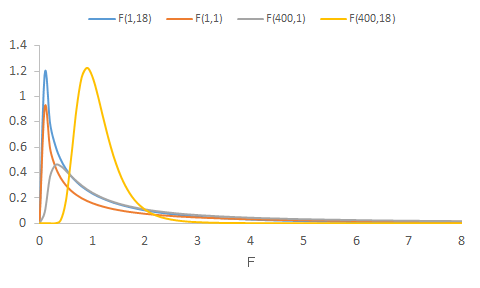
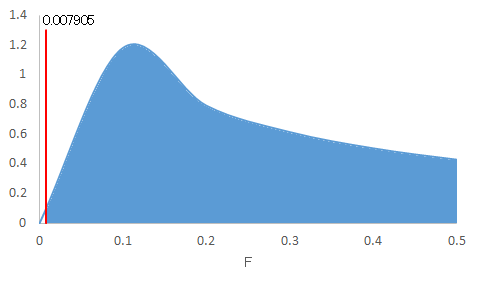

等分散性の検定
--------------

<a href="../03/">2つのグループの母平均の差に関する検定</a>を行う場合、<a href="../03/#chapter2">対応のないデータ</a>に対しては、まず、2つのグループ（群、水準）の母<a href="../01/#variance">分散</a>が等しいかを調べる<a href="../03/#homogeneity_of_variance_test">等分散性（homogeneity of variance）の検定</a>を行う必要があります。ここでは、等分散性の検定法としてルビーン検定（Levene's test）を行います。

ルビーン検定
-----------

### 練習問題1

ここでは、例として、<a href="../03/#chapter4">対応のないデータに対して等分散を仮定したときの2つの母平均の差の検定</a>の<a href="../03/#chapter5">練習問題1</a>を利用します。
> ある学校のＡ組とＢ組のテスト結果について調べたところ、以下のような標本が得られました。

> 表1：ある学校のテスト結果（点）

> 

この2グループに対して、等分散性を検定してみましょう。

### 仮説の設定

* <a href="../02/#null_hypothesis">帰無仮説</a>H0：両グループの母<a href="../01/#variance">分散</a>は等しい（μA = μB）
* <a href="../02/#alternative_hypothesis">対立仮説</a>H1：両グループの母分散は異なる（μA ≠ μB）

### 有意水準αの設定

<a href="../04/#chapter1">有意水準</a>α = 0.05とします。

### 検定統計量$ W$値の算出

Ａ組とＢ組の2グループの等分散性の検定の場合、<a href="../02/#test_statistic">検定統計量</a>$ W$は以下の数式で求まります。

$ \displaystyle W = \frac{N_\text{A}{\left( \overline{Z}\_\text{A} - \overline{Z} \right)}^2 + N_\text{B}{\left( \overline{Z}\_\text{B} - \overline{Z} \right)}^2}{\frac{ S_{Z_\text{A}} + S_{Z_\text{B}}}{\left( N_\text{A} - 1 \right) + \left( N_\text{B} - 1 \right)}}$

* $ N_\text{A}$：Ａ組の<a href="../01/#sample_size">標本の大きさ</a>
* $ N_\text{B}$：Ｂ組の標本の大きさ
* $ \displaystyle \overline{Z}\_\text{A} = \frac{1}{N_\text{A}} \sum_{i=1}^{N_\text{A}} Z_{\text{A}i}$：Ａ組の標本の絶対偏差（<a href="../01/#deviation">偏差</a>の絶対値）の<a href="../01/#mean">平均</a>
* $ \displaystyle \overline{Z}\_\text{B} = \frac{1}{N_\text{B}} \sum_{j=1}^{N_\text{B}} Z_{\text{B}j}$：Ｂ組の標本の絶対偏差の平均
* $ \displaystyle \overline{Z} = \frac{1}{N_\text{A} + N_\text{B}} \left( \sum_{i=1}^{N_\text{A}} Z_{\text{A}i} + \sum_{j=1}^{N_\text{B}} Z_{\text{B}j} \right)$：Ａ組の<a href="../02/#sample">標本</a>の絶対偏差とＢ組の標本の絶対偏差全体の平均
* $ \displaystyle S_{Z_\text{A}} = \sum_{i = 1}^{N_A} {\left( Z_{\text{A}i} - \overline{Z}\_\text{A} \right)}^2$：Ａ組の標本の絶対偏差の<a href="../01/#sum_of_squared_deviations">偏差平方和</a>
* $ \displaystyle S_{Z_\text{B}} = \sum_{j = 1}^{N_B} {\left( Z_{\text{B}j} - \overline{Z}\_\text{B} \right)}^2$：Ｂ組の標本の絶対偏差の偏差平方和
* $ Z_{\text{A}i} = \left| x_{\text{A}i} - \overline{x}\_\text{A} \right|$：Ａ組の標本の$ i$番目の測定値の絶対偏差
* $ Z_{\text{B}j} = \left| x_{\text{B}j} - \overline{x}\_\text{B} \right|$：Ｂ組の標本の$ j$番目の測定値の絶対偏差
* $ x_{\text{A}i}$：Ａ組の標本の$ i$番目の測定値
* $ x_{\text{B}j}$：Ｂ組の標本の$ j$番目の測定値
* $ \displaystyle \overline{x}\_\text{A} = \sum_{i=1}^{N_\text{A}} x_{\text{A}i}$：Ａ組の<a href="../02/#sample_mean">標本平均</a>
* $ \displaystyle \overline{x}\_\text{B} = \sum_{i=j}^{N_\text{B}} x_{\text{B}j}$：Ｂ組の標本平均

検定統計量$ W$は標本の絶対偏差に基づくグループ間の<a href="../01/#variance">不偏分散（偏差平方和を自由度で割った値）</a>$ \displaystyle N_\text{A}{\left( \overline{Z}\_\text{A} - \overline{Z} \right)}^2 + N_\text{B}{\left( \overline{Z}\_\text{B} - \overline{Z} \right)}^2$と標本の絶対偏差に基づくグループ内の不偏分散

$ \displaystyle \frac{\displaystyle \sum_{i=1}^{N_\text{A}} {\left( Z_{\text{A}i} - \overline{Z}\_\text{A} \right)}^2 + \sum_{j=1}^{N_\text{B}} {\left( Z_{\text{B}j} - \overline{Z}\_\text{B} \right)}^2}{\left( N_\text{A} - 1 \right) + \left( N_\text{B} - 1 \right)}$

との比で、<a href="../02/#null_hypothesis">帰無仮説</a>が成立する場合、$ W$は自由度が(1, $ N_\text{A} - 1 + N_\text{B} - 1$)のF分布に従うことがわかっています。

### p値の算出
<a href="../04/#chapter1">有意水準</a>αと比較する確率p値を算出します。p値は、自由度が(1, $ N_\text{A} - 1 + N_\text{B} - 1$)の<a href="#f-distribution">F分布</a>において$ W$より大きい値が発生する確率です。<a href="../02/#null_hypothesis">帰無仮説</a>（<q>両グループの母分散は等しい（μA =&nbsp;μB）</q>）が成立していれば、<a href="../02/#sample">標本</a>の<a href="#absolute_deviation">絶対偏差</a>に基づくグループ間の<a href="../01/#variance">不偏分散</a>（グループ間のばらつき、$ W$の分子）は小さくなり、結果として$ W$も小さくなるため、p値は大きくなります。逆に帰無仮説が成立しない場合は、$ W$は大きいためp値は小さくなります。

### 判定

<a href="#f-distribution">F分布</a>はこのようなグラフを描きます。このグラフで<a href="#p_of_W">p値</a>を表す面積が<a href="../04/#chapter1">有意水準</a>の確率を表す面積より大きいか小さいかで<a href="../02/#null_hypothesis">帰無仮説</a>の受容か棄却かを決定します。なお、図のとおり、自由度によって、このF分布のグラフは変わります。

<dl>
 	<dt>p値 ≦ 有意水準α</dt>
 	<dd>帰無仮説H0を棄却する</dd>
 	<dt>p値 &gt; 有意水準α</dt>
 	<dd>帰無仮説H0を受容する</dd>
</dl>

### Excelの操作

ここまで検定の理論について説明してきましたが、Excelを用いて<a href="#chapter3">練習問題1</a>に取り掛かりましょう。

&#9312; <a href="#table1">表1</a>のデータをExcelに入力します。



&#9313; グループごとにデータの<a href="#absolute_deviation">絶対偏差</a>を求めるための項目を入力します。



&#9314; "D3"セルに<code>=ABS(A3-AVERAGE(A$3:A$13))</code>と入力し、<a href="../01/#autofill">オートフィル</a>を使ってＡ組の標本のすべての測定値に対して絶対偏差を求めます。









<code>ABS</code>関数によって絶対偏差を求めています（<a href="https://support.office.com/ja-jp/article/ABS-関数-3420200f-5628-4e8c-99da-c99d7c87713c"><code>ABS</code>関数</a>）。

&#9315; 同様に、"E3"セルに<code>=ABS(B3-AVERAGE(B$3:B$11))</code>と入力し、オートフィルを使ってＢ組の標本のすべての測定値に対して絶対偏差を求めます。



&#9316; ルビーン検定用の項目を入力し、既知のデータを入力します。



&#9317; ルビーン検定用のデータを算出するために、以下のように入力します。

* "H8"：<code>=AVERAGE(D3:D13)</code>（Ａ組の標本の絶対偏差の平均）
* "I8"：<code>=AVERAGE(E3:E11)</code>（Ｂ組の標本の絶対偏差の平均）
* "J8"：<code>=AVERAGE(D3:D13,E3:E11)</code>（標本全体の絶対偏差の平均）
* "H9"：<code>=COUNTA(D3:D13)*(H8-J8)^2</code>（Ａ組の標本の絶対偏差の平均と標本全体の絶対偏差の平均との<a href="../01/#sum_of_squared_deviations">偏差平方和</a>）
* "I9"：<code>=COUNTA(E3:E11)*(I8-J8)^2</code>（Ｂ組の標本の絶対偏差の平均と標本全体の絶対偏差の平均との偏差平方和）
* "K9"：<code>=SUM(H9:I9)</code>（グループ間の偏差平方和）
* "J10"：<code>1</code>（グループ間の<a href="../01/#variance">不偏分散</a>の自由度）
* "J11"：<code>=K9/J10</code>（グループ間の不偏分散）
* "H15"：<code>=DEVSQ(D3:D13)</code>（Ａ組の標本の絶対偏差の偏差平方和）
* "I15"：<code>=DEVSQ(E3:E11)</code>（Ｂ組の標本の絶対偏差の偏差平方和）
* "K15"：<code>=SUM(H15:I15)</code>（グループ内の偏差平方和）
* "H16"：<code>=COUNTA(D3:D13)-1</code>（Ａ組の不偏分散の自由度）
* "I16"：<code>=COUNTA(E3:E11)-1</code>（Ｂ組の不偏分散の自由度）
* "K16"：<code>=SUM(H16:I16)</code>（グループ内の不偏分散の自由度）
* "J17"：<code>=K15/K16</code>（グループ内の不偏分散）
* "H2"：<code>=J11/J17</code>（<a href="#chapter6">検定統計量$ W$</a>）
* "H3"：<code>=F.DIST.RT(H2,J10,K16)</code>（<a href="#p_of_W">p値</a>）



なお、<code>DEVSQ</code>関数は、与えられたデータの平均とそれぞれのデータとの差を二乗して合計した値、すなわち、偏差平方和を求めます（<a href="https://support.office.com/ja-jp/article/DEVSQ-関数-8b739616-8376-4df5-8bd0-cfe0a6caf444"><code>DEVSQ</code>関数</a>）。また、<code>F.DIST.RT(</code>$ W$<code>,1,</code>$ N_\text{A} - 1 + N_\text{B} - 1$<code>)</code>は、自由度(1, $ N_\text{A} - 1 + N_\text{B} - 1$)のF分布において、$ W$より大きい値が発生する確率を与えます（<a href="https://support.office.com/ja-jp/article/F-DIST-RT-関数-d74cbb00-6017-4ac9-b7d7-6049badc0520"><code>F.DIST.RT</code>関数</a>）。

### 結果

<a href="#p_of_W">p値</a> = 0.930135が求まりました。下図の塗りつぶされた領域が全体に対してpの割合になっています。

設定した<a href="../04/#chapter1">有意水準</a>αは0.05です。p値 = 0.930135 &gt; 有意水準α = 0.05であるので、<a href="../02/#null_hypothesis">帰無仮説</a>H0は棄却されません。したがって、Ａ組のテスト結果とＢ組のテスト結果とは等<a href="../01/#variance">分散</a>を仮定できます。

