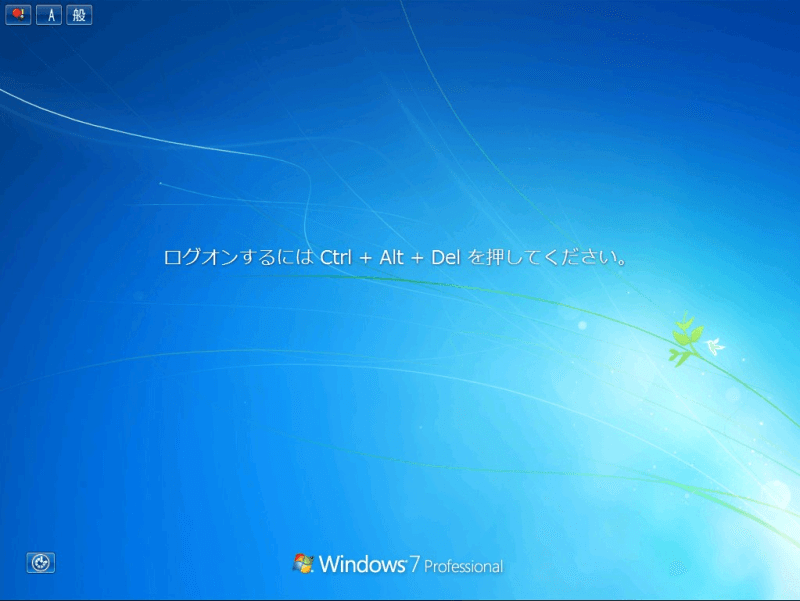
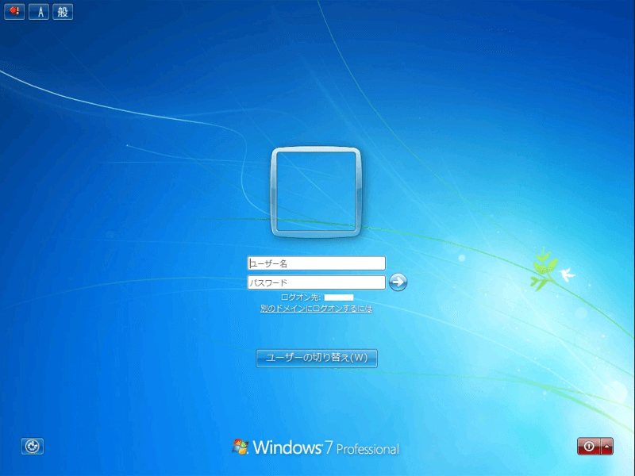
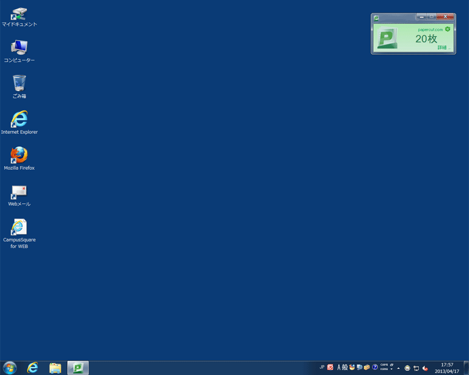
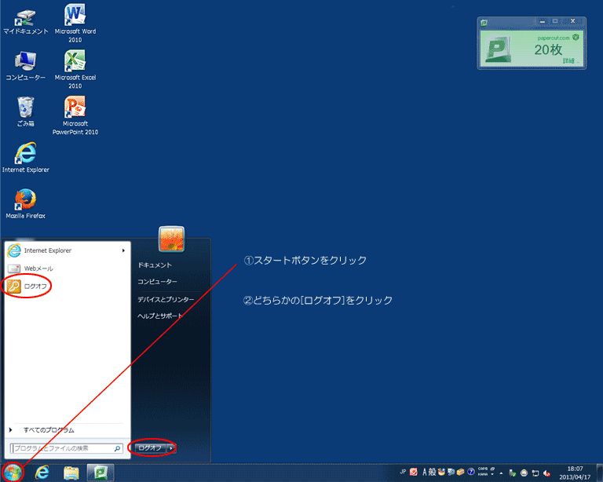
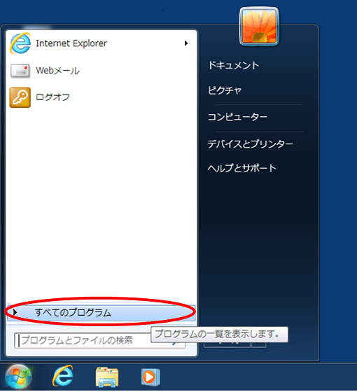
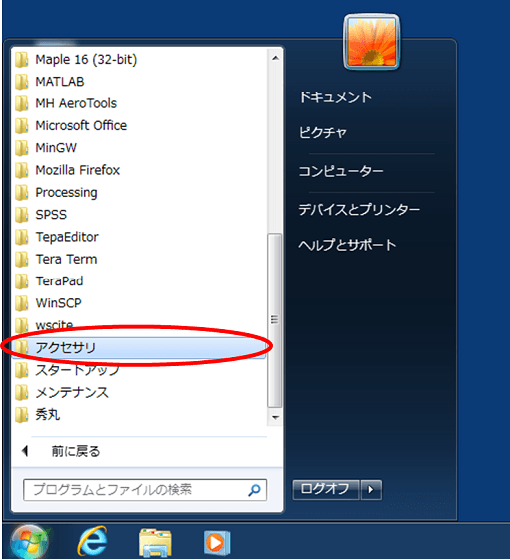
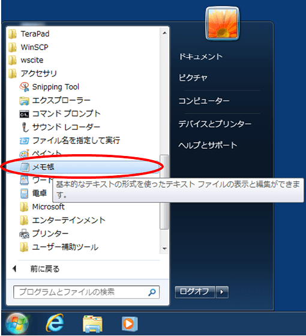

情報倫理講習会
--------------

**本学のコンピュータ・ネットワークシステムを利用するまえに、学生は全員「情報倫理講習会」を受講しなければなりません。**

今回は初回授業となるため、各クラスで担当教員がここでお話します。今日の授業に出席し、「情報倫理講習会」を受講した人は自動的にシステム利用権を獲得でき、在学期間中は学内のコンピュータ・ネットワークシステムを自由に使うことができます。
授業における利用だけではなく、レポート作成やメールの使用、インターネットを用いた情報収集、課題解決のためのプログラミングなど、さまざまな用途で使用することになります。

**本日（第１回目）の授業に欠席した人は、そのままでは大学のシステムを利用できません。**また次回以降の授業にも出席できなくなってしまいます。次回の授業前までに、開放利用中の情報処理教室でチューターに申し出て「情報倫理講習会」を受講してください。

*   [情報倫理講習会資料](/lit/infoethics/rinrikosyu.ppt)

授業ガイダンス
--------------

この授業で学ぶこと、成績評価などについてお話します。配布済のシラバス・履修の手引きも参照して下さい。

-   [情報リテラシー実践Iシラバス](/lit/1/syllabus.pdf)
-   [履修の手引き](/lit/curriculum.pdf)

### 授業の目標

この授業は、みなさんが次の４項目を習得できるように進めていきます。

1.   オペレーティングシステム (OS) の操作と、基本的なファイル操作についての知識を身につける
1.   アプリケーションソフトウェアの操作方法について習熟する
1.   正しい情報収集・分析・判断・編集・発信・共有の能力を身に付ける
1.   アプリケーションソフトウェアを活用して、具体的な課題解決をする

### 受講上の注意

この授業を受講するにあたり、以下の点に注意してください。

-   定刻に開始して、その日の目標まで説明をしたら、残りは実習時間とします。
-   授業中には携帯電話の電源を切り、使用しないでください。
-   授業中にやむを得ず入室・退室する場合は教員やチューターに一言断るようにしてください。

### 成績評価

この授業の成績は、以下の基準に基づいて評価します。

-   毎回出席をとります。出席の確認方法は教員によって異なるので、指示に従ってください。
-   原則として、４回以上の欠席で不合格とします。
-   遅刻の扱いは、この授業では10分以内なら出席点の8割、30分以内なら出席点の5割、それ以上は欠席扱いとします。
-   成績にかかわる提出・発表は３回程度行います（担当教員によって異なります）。このほか、最初の実習課題の提出状況や出席も含め総合的に成績判定します。

### 授業予定

最初４回の基本部分は全クラス共通です。
次に、標準コースでは「ワープロソフトによる文書編集と整形」および「表計算ソフトによる各種演算とデータ視覚化」、
「プレゼンテーションソフトによるスライド作成と発表」を扱っていきますが、第５回目以降ではクラスによって内容が異なる場合があります。

-   情報処理教室の使い方と授業ガイダンス
    -    [レディネス調査](./readiness/student.html)
-   [コンピュータの基本操作と構造](../02/index.html)
-   [ネットワークの仕組みと情報検索](../03/index.html)
-   [情報の活用と情報倫理](../04/index.html)
-   [ワードプロセッサによる文書編集（１）](../../office2010/word/01/index.html)
-   [ワードプロセッサによる文書編集（２）](../../office2010/word/02/index.html)
    -   [ワードプロセッサによる文書編集（発展例）](../../office2010/word/03/index.html)
    -   [課題提出のための実習時間](../../office2010/word/04/index.html)
-   [表計算ソフトによるデータ処理（１）](../../office2010/excel/01/index.html)
-   [表計算ソフトによるデータ処理（２）](../../office2010/excel/02/index.html)
-   [表計算ソフトによるデータ処理（３）](../../office2010/excel/03/index.html)
    -   [課題提出のための実習時間](../../office2010/excel/04/index.html)
-   [プレゼンテーションの概要と実習](../../office2010/powerpoint/01/index.html)
    -   [課題提出のための実習時間](../../office2010/powerpoint/02/index.html)
-   [プレゼンテーション実演](../../office2010/powerpoint/03/index.html)
-   [HTML（１）](../../html/01/index.html)
-   [HTML（２）](../../html/02/index.html)
-   [動画編集（１）](../../moviemaker/01/index.html)
-   [動画編集（２）](../../moviemaker/02/index.html)

### 教材

授業は、このホームページでの連絡と教材を利用して行います。

また、アプリケーションは以下のものを用います。教室によってオペレーティングシステムなどに違いがありますが、基本操作に大きな差はありません。このホームページでは、一般的なWindows環境に基づいて解説しますが、操作が異なる場合は補足説明に目を通してください。

#### Windows環境： 情報処理教室（320〜350教室）

-   Windows 7 （オペレーティングシステム）
-   Microsoft Word 2010 （ワープロソフト）
-   Microsoft Excel 2010 （表計算ソフト）
-   Microsoft PowerPoint 2010 （プレゼンテーションソフト）
-   Microsoft InternetExplorer 10 （ブラウザ）
-   メモ帳 （テキストエディタ）
-   Type Trainer （タイピング練習ソフト）

#### Mac環境： 320教室のみ

-   MacOS X （オペレーティングシステム）
-   Microsoft Word 2011 （ワープロソフト）
-   Microsoft Excel 2011 （表計算ソフト）
-   Microsoft PowerPoint 2011 （プレゼンテーションソフト）
-   Safari 5.0.6 （ブラウザ）
-   mi （テキストエディタ）
-   Typist （タイピング練習ソフト）

情報処理教室のシステムと利用方法
--------------------------------

情報処理教室のシステムについて、簡単に説明します。

1号館3階にある320室・330室・340室・350室の4つの教室をまとめて「情報処理教室」と呼びます。この教室は、情報リテラシーなどの授業で利用されるほか、授業が行われていない時間帯には自習のために自由に利用することができます。また、授業などで情報処理教室が利用できない場合に、自習をするための教室として情報処理施設1階115室があります。さらに、パソコンを持ち込んで自習することができる1号館3階の306室や団体での会議・勉強会等の利用を目的とした305室があります。そのほか、ノートパソコンの貸し出しも行っています。

-   [情報処理教室のシステム概要図](http://www.comp.tmu.ac.jp/manual/info/network.pdf)

320室はMac環境となっています。設置されているパソコンがiMacなので、最初に表示されるのはMacOS
Xです。しかし、パラレルスデスクトップによりWindows環境を利用することができます。

-   [Windows起動・ログオン・ログオフについて](http://www.comp.tmu.ac.jp/tmuner/pc/mac_riyou7.html)（TMUNER内）

330室・340室・350室、および115室・貸出ノートパソコンはWindows環境となっています。Windowsのバージョンは教室によって異なりますが、基本操作は同じです。

これらのパソコンごとの違いやインストールされているアプリケーションなど、教室ごとの環境の違いについては[パソコン室・ノートパソコン ハードウェア・ソフトウェア一覧](http://www.comp.tmu.ac.jp/tmuner/pc/minami_pc.html)参考にしてください。

-   [TMUNER](http://www.comp.tmu.ac.jp/tmuner/)
    -   [Windows利用ガイド](http://www.comp.tmu.ac.jp/tmuner/pc/riyou2.html)
    -   [Macintosh利用ガイド](http://www.comp.tmu.ac.jp/tmuner/pc/mac_riyou3.html)
-   [パソコン室・ノートパソコン ハードウェア・ソフトウェア一覧](http://www.comp.tmu.ac.jp/tmuner/pc/minami_pc.html)

### 注意

情報処理教室では、使用している端末だけではなく、オペレーティングシステム（OS）の種類にも関係なく同じ作業をすることができます。たとえば、Windows環境で作成してマイドキュメントに保存したデータをMac環境から開くこと、あるいはその逆の操作をすることができます。

自習のために開放されている教室はいつも同じとは限りません。しかし、どの教室でも同じ作業ができることを知っておいてください。

教室パソコンの利用方法
----------------------

教室のパソコンを使用する際には、ログオンして使用できるようにしなければなりません。
ここでは、Windows 7環境を使用する際の基本操作、ログオン・ログオフの方法について説明します。Mac環境の場合は、[Macintosh利用ガイド](http://www.comp.tmu.ac.jp/tmuner/pc/mac_riyou3.html) を参照してください。

### ログオンとログオフ

&#9312; パソコンの電源がオンになっていることを確認してください。モニタに下の画像のような画面が表示されていない場合は、チューターに申し出てください。

&#9313; ダイアログの指示に従い、キーボードの[Ctrl]キー、[Alt]キー、[Del]キーの３つを同時に押します。そうすると、以下のような画面がでてきます。

&#9314; ユーザー名やパスワードを入力し、[OK]をクリックします。

1.  "ユーザー名"：
     大学の教育研究用システムを利用する際のユーザー名を入力します。**学修番号の最初にある"1"を"u"に置き換えたもの**（学修番号が12345678ならば、ユーザー名はu2345678）になります。
1.  "パスワード"：
    入学時の書類に記入して提出したものです（アルファベット4文字、数字4文字）。パスワードを忘れてしまった場合は、初回授業時に限り、この場でSEさんに対応していただけるので申し出てください。
1.  "ログオン先"：
    "SPCTMU"となっていることを確認してください。

&#9315; Windowsにログオンすると、このような画面（デスクトップ）になります。左上にあるマイドキュメントのアイコンをダブルクリックして開いてみましょう。

参考資料 [マウスの操作方法](../appendix/mouse.html)

マイドキュメントは、パソコンを使って皆さんが作成したデータを保存しておく場所です。情報処理教室のシステムでは、一人500MBまで使用することができます。この容量を超えてしまうと、パソコンが使えなくなってしまうことがあります。不要なファイルはUSBメモリなどにバックアップを取った後削除するなどして、各自で整理するようにしてください。

&#9316; 続いて、コンピュータからJドライブ（jyugyo）を開いてみましょう。この中は授業用のフォルダが入っています。授業で使用するデータや、あるいは課題提出時に利用します。

&#9317; 最後に、[スタート]ボタンをクリックして、[ログオフ]を選びます。

鍵のアイコンのついた方を選んだ場合、「ログオフしますか？」というダイアログボックスが現れるので、[はい]をクリックします。

&#9318; これでパソコンはログオフされた状態になり、あなたが使い始める前の画面に戻ります。教室でパソコンを使用した後は、かならずログオフするようにしてください。

### 注意

ここでは、Windows環境（Windows7）に基づいて説明しています。教室によって、端末にインストールされているオペレーティングシステムが違い、画面が説明画像と異なる場合がありますので、注意してください。

情報処理教室では、"マイドキュメント"のデータは端末ではなくファイルサーバに保存されるような設定になっています。そのため、どの端末からログインしてもすべて同じ"マイドキュメント"に繋がり、どの端末からでも前回の続きを行うことができます。

また、Windows環境ではデスクトップに保存されたファイルはログアウト時に消去される設定になっています。**ファイルを保存するときは、必ずマイドキュメントに保存するような習慣をつけましょう。**

### パスワードの変更

学生の場合のパスワード変更操作が以下のPDFファイルに示されていますので、手順に従って変更操作を行ってください。\
なお、パスワードの有効期限は180日です。パスワードの失効に注意してください。

-   [利用者メニュー パスワード変更操作手順](./change_passwd.pdf)

アプリケーションの起動と終了
----------------------------

### アプリケーションの起動

アプリケーションとは、ある目的のために作られたソフトウェアです。パソコンで作業をする時には、その目的にあったアプリケーションを使用します。
ここでは、Windows 7環境を使用する際のアプリケーションの起動と終了の方法について説明します。
ここでは、例として"メモ帳"を使用します。[スタート]ボタンをクリックしてスタートメニューを開き、[すべてのプログラム]-[アクセサリ]とポイントし、[メモ帳]をクリックします。

パソコンにアプリケーションをインストールすると、基本的にはスタートメニューに登録されます。そのため、何かアプリケーションを使いたいときはスタートメニューからたどって起動します。

### アプリケーションの終了

アプリケーションを終了する際には、以下の２通りの方法があります。いずれの方法でもかまいません。

-   アプリケーションウィンドウの右上にある×ボタン（閉じる）をクリック
-   アプリケーションウィンドウのメニューバーで、[ファイル(F)]-[終了(X)]をクリック。

アプリケーションを使用してデータを作成した際には、終了する前に保存することを忘れないでください。

教材や参考資料の参照方法
------------------------

授業の教材や今後の予定はこのサイトやkibacoを通じて行います。そのほか、レポート提出に関する情報（要項、提出期限）や休講情報、その他のさまざまな連絡も掲載してきます（担当教員によって異なります）。休講情報については、教務を通じて掲示を行います。次回からは、教室にきたらログオン（ログイン）して、授業前にこのサイトを通読しておいてください。

-   [kibaco](https://kibaco.tmu.ac.jp/portal)

情報処理教室に関するページは、学外（たとえば自宅など）からも閲覧することができます。また、本学のネットワークやシステムのさまざまな情報に関しては、TMUNERに掲載されています。こまめにチェックするようにしてください。

-   [TMUNER](http://www.comp.tmu.ac.jp/tmuner/)

タイピング練習
--------------

みなさんがパソコンを利用するとき、文字を入力すること、特に日本語を入力するという機会が非常に多いと思います。ここでは、タイピングの練習をしていきます。
日本語入力の方法については以下のページを参照してください。

参考資料 [日本語入力について](../appendix/japanese.html)

### テキストエディタの選択

Windowsベースの情報教育システムでは以下の3つのテキストエディタが利用可能です。
テキストエディタとはテキスト(各種の漢字コード、ASCIIコードなど)のみがデータとして入力されている(あるいは入力しようとしている)ファイルの編集するものです。
例えばワードプロセッサなどによって作られるファイルにはテキスト以外にさまざまな付加情報が含まれているのでテキストファイルではありません。

メモ帳 
マイクロソフト製、Windows系には必ず付いている、別名notepad

秀丸 
<a href="http://hide.maruo.co.jp/">サイトー企画</a>製 シェアウェア

TeraPad 
<a href="http://www5f.biglobe.ne.jp/~t-susumu/">寺尾 進</a>氏製 フリーウェア

<dl>
<dt>シェアウェア</dt>
<dd>ソフトウェア流通形態の一つ。試用期間が与えられ、気に入ったら購入できるという仕組みのものもある。</dd>
<dt>フリーウェア</dt>
<dd>無償で誰でも利用できるソフトウェア</dd>
</dl>

### 実習

上のエディタのいずれかひとつを用いて日本語入力実習をします。指示に従い(あるいは自分が気に入った)エディタを起動させてください。そのエディタを使って以下の問題１〜４を日本語入力してください。これらの問題はそれぞれ約３５０字ですが、１０分で入力すること(担当教員によって異なります)。

-   [問題１](./typing_1R.pdf)
-   [問題２](./typing_2R.pdf)
-   [問題３](./typing_3R.pdf)
-   [問題４](./typing_4R.pdf)

各例文ごとに別のファイルに保存しましょう。
なお例文だけ打ち込んであとでプリントすると、どのプリントが誰のであるかわからなくなります。またファイルを提出する場合もファイル名だけでは認証が面倒となります。例文に先立ち自分の**学修番号**と**名前**および自分だけ判るメッセージを入れてください。

参考資料 [印刷の注意](../appendix/print.html)

練習問題1
---------

1.   次のような場合、あなたならどうしますか。理由とともに、簡単に述べてください。
    1.   チューターから、課題管理の為にパスワードを教えて欲しいと言われた場合
    1.   担当教員から、課題管理の為にパスワードを教えて欲しいと言われた場合
1.   授業終了後、利用した端末をログオフ（ログアウト）しないで帰宅した場合に、どのような危険があるでしょうか。理由とともに、簡単に述べてください。
1.   授業担当教員のホームページと、そこからリンクされている各種のページをたどって見ておいて下さい。

練習問題2
---------

次の言葉をローマ字入力するには、どのように入力すればよいでしょうか。

1.   ウォッシュレット
1.   ヴァイオリン
1.   鼻血
1.   戦々恐々
1.   情報リテラシー実践

次の文章を入力して変換してください。

1.   きしゃのきしゃはきしゃできしゃした （貴社の記者は汽車で帰社した）
1.   みんなはしってた （みんな走ってた / みんなは知ってた）

タイピング練習ソフトなどを活用して、キーボード入力の練習をしてください。

-   Windows環境（320〜350教室）：Type Trainer
-   Mac環境（320教室）：Typist
-   Webサイト
    -   [e-typing](http://www.e-typing.ne.jp/)
    -   [Flashタイピング 【寿司打 - SushiDA -】](http://typing.sakura.ne.jp/sushida/)

参考リンク
----------

### 学内サイト

-   [TMUNER](http://www.comp.tmu.ac.jp/tmuner/)
    -   [Windows利用ガイド](http://www.comp.tmu.ac.jp/tmuner/pc/riyou2.html)
    -   [Macintosh利用ガイド](http://www.comp.tmu.ac.jp/tmuner/pc/mac_riyou3.html)
    -   [パソコン室・ノートパソコン ハードウェア・ソフトウェア一覧](http://www.comp.tmu.ac.jp/tmuner/pc/minami_pc.html)

### 学外サイト

-   [著作権のひろば](http://cozylaw.com/copy.html)
-   [秀まるおのホームページ(サイトー企画)](http://hide.maruo.co.jp/)
-   [ToClip for Windows](http://www5f.biglobe.ne.jp/~t-susumu/)
-   [Flashタイピング 【寿司打 - SushiDA -】](http://typing.sakura.ne.jp/sushida/)
-   [e-typing](http://www.e-typing.ne.jp/)
