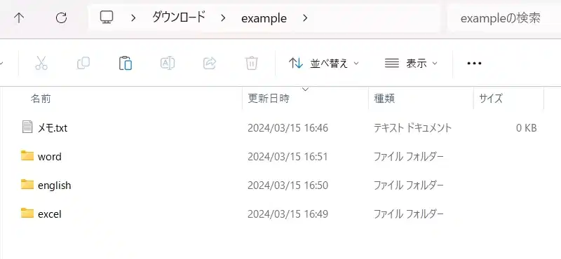

前回の授業を欠席した場合
------------------------

<strong>本学のコンピュータ・ネットワークシステム（教育研究用情報システム）を利用するためには、<a href="https://youtu.be/Krs2PHPCuEU" target="_blank">情報倫理講習</a>を受講する必要があります。</strong>

<strong>情報倫理講習が未受講かつ前回の授業に欠席した人は、大学の教育研究用情報システムを利用できません。教員またはチューターに申し出て、受講してください。</strong>

    

    
本講に関する学習動画

        

            
本講の授業内容に関する【説明動画】が1つあります。ハードウェアとソフトウェア、コンピュータでの情報表現、処理速度と記憶容量など、コンピュータの仕組みについてわかりやすく解説されています。

            
注意：大人数が一斉に動画を再生すると動画が再生されないことがあります。時間をずらして視聴してください。

            

                

                    <button type="button" class="btn btn-info pull-right" data-toggle="modal" data-target="#overviewModal">
                        <!--
<button type="button" class="btn btn-info" data-toggle="modal" data-target="#overviewModal">-->
                        <i class="fa fa-play-circle-o fa-lg"></i>&nbsp;説明動画
                    </button>
                    

                        

                            

                                <button type="button" class="close" data-dismiss="modal" aria-label="Close">&times;</button>
                                授業内容
                            

                            

                                

                                    <video>
                                        <source type="video/mp4" src="https://lit.fpark.tmu.ac.jp/mov/02_computer.mp4">
                                    </video>
                                

                            

                        

                    

                

        

    

コンピュータの仕組み
--------------------

コンピュータを利用する際、コンピュータに関する基本的知識があれば、様々な問題にも柔軟に対応できます。
ここでは、コンピュータがどのような仕組みで動いているのかを学んでいきましょう。

### コンピュータの基本構造

人が命令を与えることでコンピュータは様々な仕事をこなしてくれます。この時、コンピュータが仕事を行うことを「処理」と呼びます。

コンピュータがある仕事を処理するためには、人から仕事を受け取るための「入力装置」、実際に仕事を処理するための「処理装置」、そして処理し終わった仕事の結果を提示する「出力装置」の３つの機能が必要不可欠です。

これらの装置は人間にも例えることができます。人間は、目や耳などの「入力装置」から得た情報を、脳という「処理装置」に送り、処理した（考えた）結果を手足や口などの「出力装置」で表現します。
このとき、脳では計算したり記憶したり、手足を動かすように命令したりしています。
同じように、コンピュータの脳に当たる「処理装置」にも、計算を行う「演算装置」、計算手順や結果などを記憶する「記憶装置」、各装置に命令を送る「制御装置」が備わっています。

<dl>
<dt>入力装置</dt>
<dd>外部から処理装置へプログラムやデータを入力する装置。キーボードやマウス、マイクなどがあります。</dd>
<dt>出力装置</dt>
<dd>処理装置によって得られた結果をモニターや出力用紙などに出力する装置。ディスプレイやプリンター、スピーカーなどがあります。</dd>
<dt>処理装置</dt>
<dd>演算装置、記憶装置、制御装置をまとめて処理装置といいます。</dd>
<ul>
<li>演算装置 : 四則演算や大小の比較判断などを行う装置。CPUやGPUなどがあります。</li>
<li>主記憶装置 : 制御装置と直接結び付けられてプログラムやデータを記憶する装置。RAMなどがあります。</li>
<li>制御装置 : プログラムの命令に従って、入力装置・処理装置・出力装置の各装置の働きをコントロールする装置。CPUなどがあります。</li>
</ul>
<dt>補助記憶装置
<dd>主記憶装置を補助する形で使われる記憶装置。大量のデータを記憶する事を得意とします。ハードディスクドライブやCD、DVD、ブルーレイディスク、USBメモリなどがあります。</dd>
</dl>



このような構造を持つコンピュータをプログラム内蔵式（ノイマン型）コンピュータといいます。
 ノイマン型コンピュータは、1940年代にジョン・エッカート、ジョン・モークリー、ジョン・フォン・ノイマンらによって構想されました。
 現代のコンピュータは、ほとんどこのノイマン型と呼ばれる構造に基づき作られているといっても過言ではありません。

ノイマン型コンピュータの特徴は、コンピュータがさまざまな仕事を処理するための「命令」と「データ」が主記憶装置に置かれていることです。
 ノイマン型コンピュータ以前のコンピュータは、「命令」が既にコンピュータ内の演算・制御装置に組み込まれているために、ある目的に対しては非常に素早い処理が可能であるのに対して、
 その他の目的にはほとんど使えないというものでした。しかし、ノイマン型では、「命令」と「データ」を主記憶装置に置き、常に「命令」を変えていくことで、
 様々な目的に使用できるといった柔軟性をもつことが可能になったのです。

### ハードウェアとソフトウェア

また、ノイマン型のような機能上の分類以外にも、コンピュータを「ハードウェア」と「ソフトウェア」という分類に分けることができます。
 「ハードウェア」とは、ノイマン型でいう処理装置や入力装置などにあたるもので、実際にコンピュータを構成する物理的な機械のことを表します。
 一方、「ソフトウェア」とはコンピュータ上で動く無形の機能のことです。例えば、演算装置自体はハードウェアですが、演算の行為そのものや方法はソフトウェアに分類されます。

### 32bit OSと64bit OS

最近、Windows 32bit版やWindows 64bit版といったOSを店頭でよく見かけることがあります。これはそれぞれ32bit OS、64bit OSと呼ばれており、対応する数値のCPUに最適化されたOSであるという意味です。

コンピュータの根幹を司るCPUには、一度に処理できるデータ量というものが決められています。そのデータ量を冠することによって、そのCPUの性能を表す一つの指標として見ることができます。つまり、32bit CPUであれば、そのCPUが一度に処理できるデータ量が32bitまでであり、64bit CPUであれば、一度に処理できるデータ量は64bitであるという意味になります。

もちろん、一度に処理できるデータ量が多い方が処理速度も早いのですが、その速度に対応した処理を行うOSを使用しなければ、性能を発揮することができません。例えば、64bit CPUと32bit OSの組み合わせでは、コンピュータ自体は正常に稼働しますが、64bit CPUの性能をフルに発揮することはできません。一方で、32bit CPUと64bitOSの組み合わせの場合、そもそも稼働しません。

OSの処理速度(bit数)はCPUの処理速度(bit数)よりも小さくなければなりませんが、その中で最も効率的にCPUの性能を引き出すためには、そのCPUの処理速度(bit数)に最適化されたOSを使用する必要があります。32bit CPUには32bit OSを、64bit CPUには64bit OSを用いて使用することが求められます。これらをそれぞれ32bitマシン、64bitマシンと呼ぶことがありますが、実際には64bit CPUを搭載していても32bit OSで稼働しているコンピュータを32bitマシン、64bit OSで稼働しているコンピュータを64bitマシンと呼んでいます。

オペレーティングシステムの役割
------------------------------

コンピュータは、いくつものハードウェア（装置）が組み合わさって作られています。これらのハードウェアの機能は、「演算」「制御」「記憶」「入力」「出力」という５つに分類できます。コンピュータを使う場合、使用者は「入力」の機能を通じてコンピュータにデータや指示を与えます。そして、コンピュータは自分自身を「制御」しながら与えられた指示通りに「演算」します。そして、結果は「記憶」されたり、使用者が見ることができるよう「出力」されたりします。

これらハードウェアの機能をまとめているものが、"オペレーティングシステム（OS）"と呼ばれるソフトウェアです。今回は代表的なオペレーティングシステムである"Windows"を例として、オペレーティングシステムの画面表示と操作方法について説明します。Macの場合は、画面の構成や名称が異なりますので、操作方法については次のリンクを参照してください。

-   [Mac利用ガイド](https://tmuner.cpark.tmu.ac.jp/tmuner/ja/study/pc/mac.html) (TMUNER内)

Windows環境における説明を進めます。まず、コンピュータにサインインして使用できる状態にしましょう。サインインの方法については前回説明を行ったので、忘れてしまった人は前回の資料を参照してください。

マウスとキーボードの操作
------------------------

コンピュータに指示を伝えるために、マウスやキーボードなどの入力装置を使います。

### マウスの操作

オペレーティングシステムでは、マウスを操作してマウスカーソルを画面上で自由に動かすことで、視覚的に操作を行うことができます。マウスの操作方法については以下のページを参照してください。



### キーボードの操作

キーボードは、文字入力などのマウスではできない操作を行うときに使用します。現在、日本語のWindows環境では、"109配列"と呼ばれるキーボードが使用されています。キーボードによってキーの位置が違う場合や一部のキーが少ない場合がありますが、基本的な操作は同じです。

詳しいキー操作や入力方法については、参考資料を参照してください。



画面各部の名称と操作
--------------------

デスクトップやウィンドウなどの名称について、以下のページにまとめました。一通り目を通しておきましょう。



ファイルとフォルダ
------------------

次にファイルとフォルダの機能を簡単に説明します。

ここでは、Windows 10環境を使用する際のファイルとフォルダについて説明します。

### ファイル

パソコンにおいて、文書や画像、音楽などのデータを"ファイル"と呼びます。

現実の世界での文書や画像ならば媒体となる紙が、音楽ならばそれを保存しているＣＤというものがありますが、パソコンの中のファイルというものには形がありません。

代わりに、ファイルには必ず名前がついています。

### ファイルの種類

メモ帳を開いて文字を入力し、その文書に名前をつけて保存してみます。

すると、そのファイルは「（自分のつけた名前）＋.txt」という形で保存されることになります。この `.txt` という部分を拡張子と呼びます。
拡張子は、そのファイルがどのようなアプリケーションで作成されたかを表すもので、一般的に"."＋アルファベット3〜5文字からなります。
この拡張子によって、オペレーティングシステムがそのファイルの種類を自動的に判断し、"アイコン"として表示します。

代表的な拡張子と、対応するアプリケーションを紹介します。

<table>
<thead>
<tr>
<th>種類</th>
<th>アイコン</th>
<th>拡張子</th>
<th>使用例</th>
<th>代表的なアプリケーション</th>
</tr>
</thead>
<tbody>
<tr>
<td rowspan="4">テキストファイル リッチテキスト ファイルなど</td>
<td></td>
<td>.txt</td>
<td>文書作成</td>
<td>メモ帳 秀丸</td>
</tr><tr>
<td></td>
<td>.docx</td>
<td>レポートなど高次の文書作成</td>
<td>Microsoft Word</td>
</tr><tr>
<td></td>
<td>.pdf</td>
<td>マニュアルやカタログなどの印刷物の電子版の配布</td>
<td>Adobe Acrobat Adobe Acrobat Reader</td>
</tr><tr>
<td></td>
<td>.htm .html</td>
<td>インターネットによるウェブページの公開</td>
<td>Microsoft InternetExplorer Mozilla Firefox、Google Chrome</td>
</tr><tr>
<td>表計算ファイル</td>
<td></td>
<td>.xlsx</td>
<td>名簿などの表や、計算シートの作成</td>
<td>Microsoft Excel</td>
</tr><tr>
<td>プレゼンテーション ファイル</td>
<td></td>
<td>.pptx</td>
<td>プレゼンテーションスライドの作成</td>
<td>Microsoft PowerPoint</td>
</tr><tr>
<td rowspan="2">画像ファイル</td>
<td></td>
<td>.bmp</td>
<td>ペイントで作成した画像をそのまま保存</td>
<td>ペイント</td>
</tr><tr>
<td></td>
<td>.jpg</td>
<td>画像ファイルを圧縮して保存</td>
<td>ペイント</td>
</tr><tr>
<td rowspan="2">映像ファイル</td>
<td></td>
<td>.wmv</td>
<td>Windows のみ再生可能な映像</td>
<td>Windows Media Player</td>
</tr><tr>
<td></td>
<td>.mp4</td>
<td>広く再生可能な映像</td>
<td>Windows Media Player</td>
</tr>
</tbody>
</table>

### フォルダ

自分で作成したファイルは"マイドキュメント"に保存します。しかし、ファイルを単に保存していくだけでは、自分が探しているファイルが見つからなくなってしまうこともあります。そこで、保存したファイルを自分の使いやすいように整理することが重要となります。

そして、ファイルを整理するためにあるのが、ファイルケースの形をしたアイコンのフォルダというものです。フォルダはファイルをまとめて入れる箱のようなもので、ディレクトリとも呼ばれます。

### フォルダを使ったファイルの整理

ファイル整理の鉄則は、以下の図のようにファイル・フォルダを階層的に整理することです。この階層構造を**木構造（ツリー構造）**と呼びます。



具体的に、どのような構造になっているのかを紹介します。

次に示した例では、"ダウンロード" 内のフォルダ "example" の中に、`word`  `english` `excel` といった仕分けがされています。

<!-- 
以下３つのスクリーンショットを上記のアニメーションwebpで代用しました(2024.3.16 北畠)



-->

自分一人が使う分には、ファイルの場所さえ覚えていれば散らかっていても問題はありませんが、ファイルの数が増えてくると大変です。やはり片付いているに越したことはありません。

ちなみに、このツリー構造は"¥"を使った文字列で表すこともできます。例えば、上記の例の `word` フォルダの場所は

>    ダウンロード¥example¥word

と表すことができます。この表現方法をパス名といい、上部のアドレスバーをクリックすると確認することができます。

エクスプローラーを使ったファイル・フォルダの管理と操作
------------------------------------------------------

それでは実際に、エクスプローラー(File Explorer)を使ってファイルやフォルダを操作してみましょう。

### ファイルの作成・保存

ファイルはアプリケーションなどで作業を行ったとき、その結果を保存しておくためのものです。
 そのため、多くの場合は保存を行うことで初めてファイルが作成されます。
 ほとんどのアプリケーションでは、以下の方法で保存ができます。



初めて保存する場合や "名前を付けて保存" を押した場合は、下部の "ファイル名" に好きな名前を入力し、
 保存したい場所（マイドキュメントなど）を開いた状態で "保存" をクリックします。



なお、 `¥` `/` `?` `:` `\*` `"` `\>` `\<` `|` はコンピュータが使う大切な記号なので、禁止文字となっていて**ファイル名に使用することはできません**。



この他にも、`.`や` `（半角スペース）をファイル名の先頭にするのも禁じられています。（既に先頭に`.`のあるファイル名を、`.`のないファイル名に変更することは可能です。）

また、`.`以降の拡張子を指定されたもの以外に変更すると、ファイルが開けなくなることがあります。

ここでは、メモ帳を使ってテキストファイルを作成し、適当な名前でマイドキュメントに保存してみましょう。メモ帳は画面下部の検索バーなどに "メモ帳" や "note" と入力すると起動できます。

### 既存ファイルの閲覧・更新

ファイルのアイコンをダブルクリックで開くと、そのファイル名につけられた拡張子に応じてアプリケーションが開かれます。

ここでは、先程作成したテキストファイルを開く場合を説明します。

先程のテキストファイルは、".txt"という拡張子がつけられているため、Windowsではメモ帳が起動します。他のアプリケーションで開く場合は、次のような手順で開くことができます。

1.  自分の利用したいアプリケーションを起動する。
1.  開いたアプリケーションのウィンドウに、開きたいファイルアイコンをドラッグ＆ドロップする。（左ボタンを押したままマウスを移動させ、移動先で離す）



この方法によって、".txt"の拡張子がつけられたテキストファイルを、メモ帳以外のアプリケーションで開いてみましょう。メモ帳以外でテキストファイルを開くことができるアプリケーションには、秀丸などがあります。

### 新規フォルダの作成

実際にフォルダを作成してみましょう。ここではマイドキュメントに"infolit"というフォルダを作ってみます。

1.  ウィンドウ内空白部分で右クリックメニューを表示する
1.  [新規作成] - [フォルダー] をクリック
1.  フォルダ名に"infolit"と入力する



### ファイル・フォルダの移動とコピー

ファイルを別のフォルダに移動あるいはコピーする操作について説明します。
ここでは，`infolit` にある `practice.txt` を サブフォルダ `reports` に移動させます。

1.  移動/コピーしたいファイル `practice.txt` を選択し、右クリックメニューを表示する
1.  [切り取り]または[コピー]をクリックする
    -   切り取り：　完全に移動する場合
    -   コピー：　今のところにもファイルを残したまま複製したい場合
1.  移動/コピー先のフォルダ `reports` をダブルクリックする
1.  ウィンドウ内の空白部分で右クリックメニューを表示し、[貼り付け]を選択する





このほか、マウスでドラッグすることで移動する方法もあります。

1.  エクスプローラーのウィンドウを２つ開いておく
1.  一方のウィンドウで `infolit` フォルダ、もう一方では `reports` フォルダを表示する
1.  移動/コピーしたいファイル `practice.txt` を選択し、左ボタンを押しながらドラッグしてもう一方のウィンドウにもっていく

この場合、上の[切り取り]操作で移動したときと同じ状態になります。

フォルダを開かずに `reports` フォルダにドラッグ&ドロップしても同じ操作となります。

### ファイルの削除

ファイルの削除も、基本的にはファイルの移動やコピーと同じ操作で行います。
削除したファイルは"ごみ箱"で一時的に保管されます。削除の方法は何種類かあります。

-   削除したいファイルをごみ箱にドラッグ＆ドロップ等で移動する
-   削除したいファイルの右クリックメニューを表示し、[削除]を選択する



ごみ箱に入ったファイルは、このままではまだ完全に削除されてはいません。完全に削除したい場合は、マウスをごみ箱にポイントして右クリックメニューから [ごみ箱を空にする] を選択します。ごみ箱に入っているファイルは元に戻せますが、完全に削除してしまったファイルは元に戻せないので注意してください。

なお、Windowsの仕様では、ハードディスク以外の場所（USBメモリなど）から消去したファイルはゴミ箱に入らず完全削除されてしまいます。

マイドキュメントの仕組み
------------------------

### マイドキュメントの概要

デスクトップ上に、マイドキュメント（Hドライブ）へのショートカットがあります。ここは皆さんが自分で作ったデータを保存するための場所です。



これをダブルクリックするとマイドキュメントを開くことができます。



情報処理教室では、マイドキュメントはエクスプローラー内の `PC` からも見ることができるようになっています。
[PC]-[H:¥]と開いた中身はマイドキュメントの中身と同じになっているはずです。

<strong>情報処理教室における制約事項</strong>

ファイルやフォルダの名前には、できるだけ日本語名を使わないようにしましょう。学内にはWindowsだけでなく、MacやUNIXといったさまざまなOSが混在しています。OSごとに文字コードが異なる場合があり、場合によっては文字化けを引き起こす原因となります。

Windowsの仕様では、ハードディスク以外の場所（USBメモリなど）から消去したファイルはゴミ箱に入らず完全削除されてしまいます。
これらの場所からファイルを消去するためごみ箱にドラッグすると、消去の確認ダイアログが表示されます。
ここで[OK]を選択すると、ファイルはゴミ箱に入らずそのまま完全消去されてしまいます。誤って重要なファイルを削除しないように注意してください。

情報処理教室の端末では、デスクトップに保存したデータはログオフ時に削除される仕組みとなっています。自分で作成したデータは必ずマイドキュメントに保存する習慣を身に付けましょう。

### マイドキュメントの利用とデータの持ち運び

Hドライブ（マイドキュメント）に保存したファイルは、教育研究用情報システムのコンピュータであればどこでも閲覧できます。

-   Hドライブのファイルは、自分自身にしか見えません。
-   Hドライブの容量上限は 5GB です。

自宅のコンピュータや、私物のノートパソコン等では、Hドライブは利用できません。

大学と自宅で相互にファイルを持ち運ぶ方法として、以下の2通りがあります。

#### &#9312; USB メモリの利用 ： USB メモリにファイルをコピー・移動して持ち運ぶ

##### USBメモリの接続
1. USBメモリを差し込む。
   -   モニターの後ろに本体があります。
   -   USB接続端子にUSBメモリを差し込みます。
        
        

1. USBメモリの中身を確認する。
   -   デスクトップの PC をダブルクリックすると、エクスプローラーが起動します。
   -   接続したUSBメモリが表示されているので、ダブルクリックします。


##### USBメモリの取り外し
1. 利用後に USB メモリを取り外す。
   -   USBメモリを端子から抜く前に、取り外しの処理をする必要があります。
   -   画面右下のタスクトレイからUSBメモリの形のアイコンを探します。
   -   非表示になっている場合は、をクリックしてもっと多くのアイコンを表示させます。
   -   USBメモリの形のアイコンをクリックし、表示されたメニューから "取り出し" を選びます。
   -   メッセージが表示されるので取り外します。

 
#### &#9313; kibaco の利用 ： kibaco のマイページにある 「資料」 を利用する

   -   大学のPCから kibaco に資料をアップロードする。
   -   自宅のPCで kibaco から資料をダウンロードする。

##### kibacoへのファイルアップロード
1. マイページの[資料]をクリックします。
1. アップロード先のフォルダにある[アクション]をクリックします。

1. [ファイルをアップロード]をクリックします。

1. [アップロードするファイルをドロップするか、参照するためにここをクリックしてください。]をクリックします。

1. アップロードするファイルを選択します。**※1回でアップロードできる上限は150MBとなっています。**
1. [開く] をクリックします。

1. アップロードするファイルが表示されたら、[続ける]をクリックします。

1. ファイルがアップロードされます。


##### マイページ「資料」の利用容量

マイページ「資料」の容量は1GBになっています。使用している容量は以下の手順で確認することができます。

1. [クォータを確認]をクリックします。

このようにして、使用している容量が表示されます。


##### ファイルの差し替えと削除

差し替えの際には、一度アップロードしたファイルを削除し、ファイルをアップロードし直してください。

1. [資料]をクリックします。
1. 削除したいファイルの[アクション]を選択します。
1. [削除]をクリックします。

1. [削除]をクリックします。


##### kibacoからのファイルダウンロード
1. [マイページ]をクリックします。
1. [資料]をクリックします。
1. ダウンロードしたいファイルをダウンロードします。


GUIとCUI
------------------

ファイルの操作は、GUI（Graphical User Interface）であるWindows Explorerではなく、CUI（Character User Interface）であるコマンドプロンプトを用いて行うことも可能です。

CUIとは、コマンドライン、つまりは文字のみで表現されたコンピュータ画面のことです。UNIXやMS-DOSといったOSがコンピュータに組み込まれていた時代は、現在のように多彩な能力は期待されておらず、計算機、電算機と呼ばれたような専ら計算をする為の道具としてコンピュータは存在していました。さらに、当時のコンピュータには、現在のようにグラフィカルなコンピュータ画面を長時間表示できるような能力はありませんでした。テキストデータと画像データではどちらの方がファイルとして容量を必要とするか、一概に比べられないもののファイル容量を見れば一目瞭然かと思います。

そんな中、1984年に開発されたMacOSと1986年に開発されたWindowsによりGUIがもたらされます。GUIとは、今日皆さんが見慣れているグラフィカルなコンピュータ画面のことです。この頃から、コンピュータの能力の向上、低価格化にともなって、高度な画像編集や動画など多彩な用途にコンピュータは用いられるようになりました。

しかし、CUIはなくなったわけではありません。CUIの最大の特徴は、なんといってもコンピュータに負荷をかけないことです。そのため、コンピュータの起動時には、まずCUIを起動してから、GUIを起動するという段階を踏みます。コンピュータが故障した際や自分で組み立てる際など、CUIからコンピュータ操作をすることもあります。また、プログラムも基本的にはコマンドラインであるため、UNIXやその発展系のLinux、ターミナルやコマンドプロンプトといったCUIを用いて動かすケースも少なくはありません。よって、現在でもコンピュータの基礎知識として、CUIを学ぶ意義があると言えるでしょう。

以下の参考資料にコマンドプロンプトやターミナルの使い方が書いてありますので、学習してみると良いでしょう。





電子メールの利用方法
------------------

大学のメールはWebメールシステムを導入しているため、ブラウザがあればどこからでも閲覧することができます。  
利用方法は以下のPDFファイルを確認してください。

-    [メール講習(学生メールの利用方法)](./o365.pdf)



&#9312; "TMUNER" にアクセスし、左のメニューから [Webメール（学生） 新] をクリックします。



&#9314; ログイン画面が表示されますので、"ユーザID"に教育研究用システムのユーザー名（学修番号の最初にある"1"を"u"に置き換えたもの）、"パスワード"にはパスワードを入力します。



&#9315; ログインすると Outlook WebApp が起動し、次のような受信トレイ画面が表示されます。メール本文を読むときは、件名をクリックします。"優先"と"その他"で自動的にメールが振り分けられていますので注意してください。



&#9316; 新規にメールを作成し送信する場合、画面上部の [新規作成] をクリックすることで新規作成画面が表示されます。



&#9317; 操作を終える場合は、右上の [自分の名前] をクリックし，表示されたマイアカウントメニューより [サインアウト] をクリックします。





電子メール利用時の注意事項
--------------------------

### メールアドレス

東京都立大学では、学生のメールアドレスは"姓-名@ed.tmu.ac.jp"（例えばtoritsu-masaru@ed.tmu.ac.jp）として設定されています。大学のメールアドレスに含まれている"@ed.tmu.ac.jp"という文字列は、東京都立大学の関係者であることを示しています。このアドレスを使ってメールを送受信できるのは東京都立大学の関係者だけなので、受信者には送信者が東京都立大学の関係者であることがわかります。つまり、大学のメールアドレスは身元が保証されているのです。このような公的な保証は、みなさんが個人で使うパソコンやスマートフォン・携帯電話のメールアドレスでは得られません。その意義を十分に理解し、適切に大学のメールアドレスを利用してください。

また、在学中は大学のメールアドレス宛のメールを頻繁にチェックするようにしてください。教員や事務から必要な連絡が届く場合があります。また、メールチェックをしないでいると、サーバに大量のメールが溜まり、大学のシステムに重大な影響を及ぼします。

本学のWebメールは、大学以外の場所（自宅や携帯電話など）からでもインターネットにつながっていれば利用することができます。また、自分がメインで利用しているメールアドレスに転送するように設定することもできます。自分にとって使いやすい方法でメールをチェックして、大学のメールアドレスを有効に活用してください。

### メールのマナー

電子メールはとても重要な連絡手段となっています。大学における研究や課外活動のほか、就職活動でも電子メールが使われています。そのため、電子メールの使い方を身に着けるだけではなく、正しいマナーで使うことが求められています。メールに関して決められたルールというものはありませんが、マナーとして重要になるポイントをいくつか紹介します。

#### 宛名、署名を必ずつける

宛名や署名は、手紙を送るときと同様に、電子メールを送るときにも必要です。いつでも相手が、送られてきた電子メールのメールアドレスを把握しているとは限りません。 見ず知らずのメールアドレスから電子メールが届いたら驚きますが、宛名や署名があればその混乱を防ぐことができます。

 また、電子メールを送ることは簡単ですが、間違いを犯しやすく、またその間違いに気がつきにくいという側面があります。 宛名や署名を書いておけば、いざ間違って送ってしまった場合にも、送られた相手は「この電子メールは自分宛のものではない」と気がつくことができるでしょう。 このように、宛名や署名を付けることは色々とメリットがあるので、必ずメールの本文には誰から（送信者）誰に（受信者）送ったものなのかを書く習慣を身に付けましょう。



#### 内容のわかる件名を心がける

電子メールが普及する一方で、迷惑メール（スパムメール）が問題となっています。みなさんの携帯電話にも届いたことがあるかもしれませんが、スパムメールは人の目を引くために"はじめまして"、"こんにちは"など誰からでも届き得る件名を使っていることがあります。知らないアドレスからこのような件名のメールが届いた場合、スパムメールと疑って削除されてしまう可能性があるわけです。特に、初めて電子メールを送る相手にはこのような件名を使わず、自分の名前を入れたり、あるいは本文の内容がわかるような件名をつけるように心がけましょう。

#### 添付ファイル、HTMLメールを濫用しない

電子メールではファイルを添付し、文章とともに送ることができます。しかし、大きいサイズの添付ファイルは相手のメールボックスの容量を圧迫することになります。メールボックスがいっぱいになるとメールは受信できなくなってしまうため、相手に迷惑をかけてしまうことにつながります。また、コンピュータウィルスがメールに添付されたファイルとして感染していくケースも多く見受けられます。これらの理由から、必要以上に添付ファイルをつけることは避けましょう。特に、サイズの大きなファイル（メガバイト単位のデータ）については、相手に確認を取ってから送信するようにしましょう。



また、メールのなかにはメールマガジンやダイレクトメールなどに多い背景や画像がついた"HTMLメール"と呼ばれる種類のものがあります。HTMLメールは一見華やかですが、伝えたい用件以外の余分なデータがつくことになり、相手が迷惑に感じることもあります。またHTMLメールの場合、メールを開くと同時に添付されていたコンピュータウィルスに感染してしまうケースもあります。

Office365では、新規作成メールはHTMLメールとして作成される初期設定になっています。この設定を変更して標準をテキスト形式にするためには、「MicrosoftOffice365 情報リテラシー実践⽤説明資料」を参考に変更してください。

情報倫理講習と情報セキュリティ研修
--------

本学では、**情報倫理講習**を受講し、事前に情報倫理講習チェックテストを受験することによって、大学が提供する教育研究用情報システムを利用することができるようになります。

これは、本学の教育研究用情報システムを正しく使うために必要な情報を学んでもらうためです。

情報倫理講習で扱った内容は、本学の教育研究用情報システムのみならず、現代社会を生きていく上でも重要な内容が含まれていますので、十分に理解しておきましょう。

しかし、高度情報化された現代社会では、情報技術の発展はすばやいものとなっています。よって、最低限の情報を安全に扱えるための情報をみなさん自身でも入手し、学習することが重要です。

情報リテラシー実践Iの授業内容として、kibacoに**情リテ情報倫理テスト**が配置されておりますので、必ず受験し、合格するようにしてください。

**情リテ情報倫理テスト**の実施時期に関しては、授業を担当する教員によって違いますので、授業を担当する教員の指示に従ってください。

 

さらに本学では、情報リテラシー実践Iの授業とは別に、<u>最低でも年に1回は、情報を安全に扱えるようになるために**情報セキュリティ研修**を受講し、テストに合格することが必須</u>となっています。

<!--
情報セキュリティについては、以下の参考資料を確認した上で、必ず受講し、ミニテストに合格するようにしてください。

-    [情報セキュリティ研修について](./ahzsecuri.pdf) 

**情報セキュリティ研修**は、**kibaco内に情報リテラシー実践Iとは別のコース**として設置されます。<u>上記の参考資料を参考にアクセスしてみてください</u>。

-->

**情報セキュリティ研修**は、**kibaco内に情報リテラシー実践Iとは別のコース**として設置されます。

<u>合格する必要のあるミニテストは、情報セキュリティ研修のコースの「テスト/アンケート」内に設置されています</u>。

 

以下の表に情報倫理及び情報セキュリティに関係するテストをまとめました。しっかりとやり終えるようにしましょう。

それでは、情報を安全に扱えるようになり、今後の現代社会においても情報を活かしていけるように技能を高めていきましょう。

| テスト名 | 実施時期 | 設置場所 | 説明 | 合格点 |
| --- | --- | --- | --- | --- |
| 情報倫理講習チェックテスト | 授業開始前 | kibaco- 情報リテラシー実践Iコース内 | 情報倫理講習を受けたことを証明するためのテスト | 特になし。 受験によって教育研究用情報システムの利用が許可される。 |
| 情リテ情報倫理テスト | 第2講授業内または授業後一週間以内 | kibaco- 情報リテラシー実践Iコース内 | 情報リテラシー実践Iにおける情報倫理が身に付いていることを確認するためのテスト | 80点以上が取れるまで何回でも受験する。 |
| 情報セキュリティ研修 | 4月末日まで | kibaco- 情報セキュリティ研修コース内 | 本学全体における情報セキュリティの確認のための研修とテスト | 100点が取れるまで何回でも受験する。 |

課題
--------

1.  "infolit"フォルダに新規フォルダ"nihongo"を作ってみましょう。
1.  フォルダ"infolit"の中のすべてのファイルを、その新しいフォルダに移動させましょう。
1.  すべてのファイルの移動操作を1回で行うにはどうしたらいいか考えてみましょう。
1.  現在普及している補助記憶装置をいくつか取り上げ、その特徴（最大容量，利用場所，利点，欠点等）についてまとめてください。

参考リンク
----------

### 学内サイト

-   [TMUNER](https://tmuner.cpark.tmu.ac.jp/tmuner/ja/)
    -   [Windows利用ガイド](https://tmuner.cpark.tmu.ac.jp/tmuner/ja/study/pc/windows.html)
    -   [Mac利用ガイド](https://tmuner.cpark.tmu.ac.jp/tmuner/ja/study/pc/mac.html)

### 学外サイト

-   [国民のための情報セキュリティサイト](https://www.soumu.go.jp/main_sosiki/joho_tsusin/security/)（総務省）
