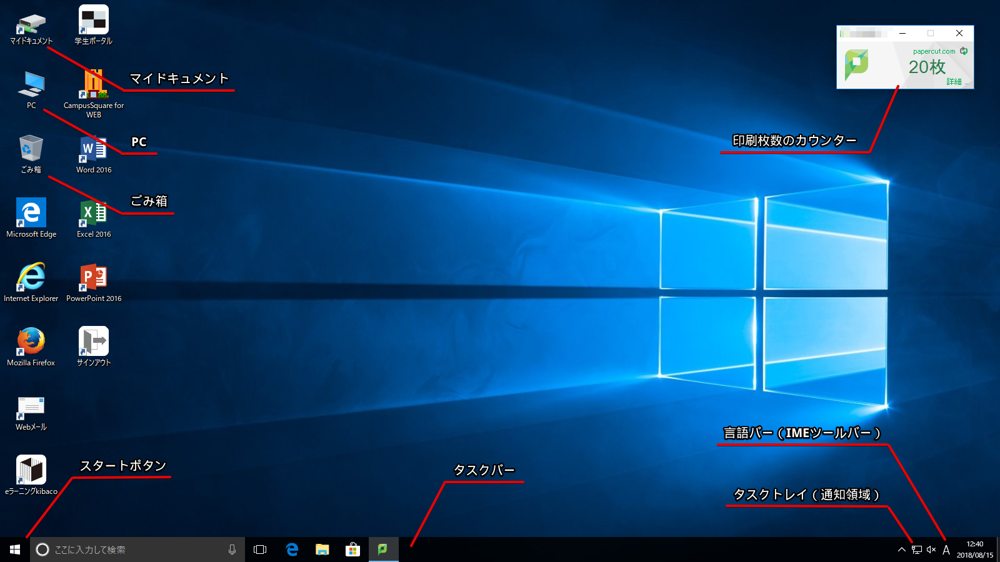
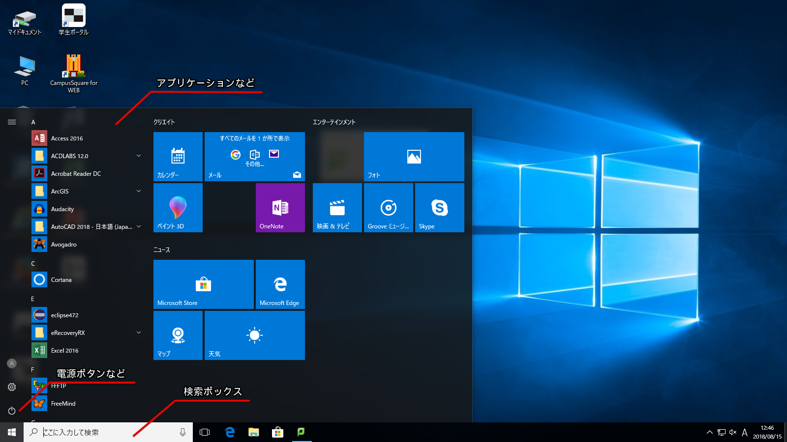
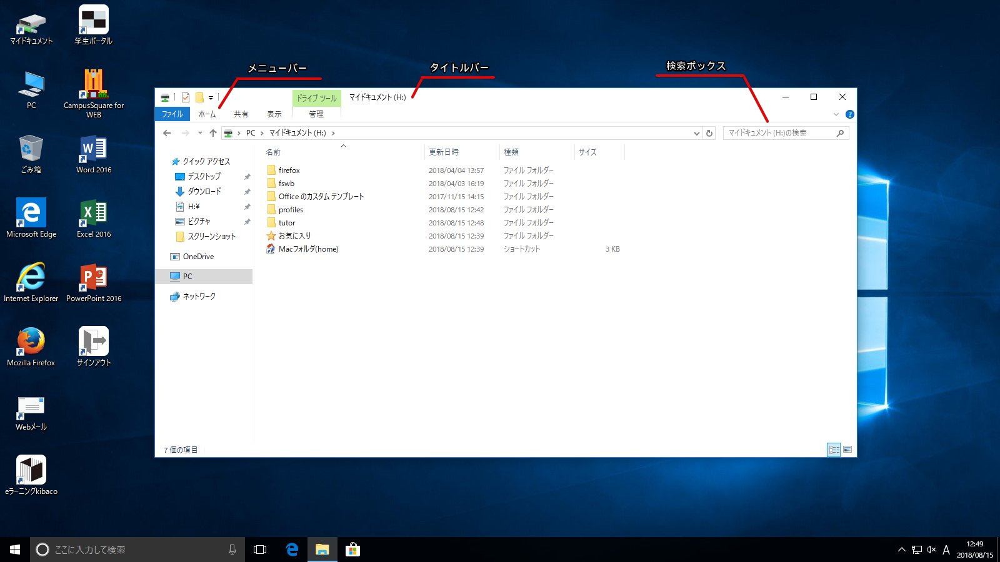

デスクトップ
------------

Windowsにログオンすると、最初は次のような画面になります。この画面全体をデスクトップと呼びます。

画面各部の名称と役割について簡単に説明します。

<dl>
<dt>デスクトップ</dt>
<dd>デスクトップとは、Windowsを起動して、最初に表示される [ごみ箱] アイコンやスタートボタンなどが表示される画面のことです。デスクトップは机の上のようにファイルやアプリケーションなどの作業を行うことができます。</dd>
<dt>タスクバー</dt>
<dd>タスクバーは画面下部にある帯状の部分で、スタートボタン、タスクトレイなどが表示されています。起動しているプログラムがある場合は、ボタンとなって表示されます。</dd>
<dt>スタートボタン</dt>
<dd>スタートボタンは画面左下にあるボタンで、クリックするとスタートメニューが表示されます。アプリケーションの起動を行う場合などに使用します。</dd>
<dt>クイック起動ツールバー</dt>
<dd>スタートボタンの横にあるアプリケーションなどのショートカットボタンです。スタートメニューを表示する必要がないので、素早くアプリケーションの起動を行うことができます。</dd>
<dt>タスクトレイ（通知領域）</dt>
<dd>通知領域はタスクバーの右端の部分のことで、Windowsの起動と同時に起動したプログラムが表示されます。時計のほか、USBメモリなどを取り付けている場合は[ハードウェアの安全な取り外し]アイコンなどが表示されます。</dd>
<dt>言語バー（IMEツールバー）</dt>
<dd>言語の切り替えや日本語入力の操作をするにはこの言語バーを使用します。他にも半角英数やひらがななどの入力モードを切り替えたり、さらに詳細な設定を行うためのツールを表示することができます。</dd>
<dd>[言語バーとIMEツールバー](../01/japanese.html#4-1)</dd>
<dt>マイコンピュータ</dt>
<dd>マイコンピュータは、使用しているコンピュータの中身を確認する場合に使用します。コンピュータに接続されているハードディスクやリムーバブルディスク（取り外すことのできるディスク）に保存されているファイルを確認したり、ディスクの空き容量を確認したりすることができます。</dd>
<dt>マイドキュメント</dt>
<dd>マイドキュメントは、現在ログインしているユーザー専用のスペースです。つまり、ここは皆さんが自分で作ったデータを保存するための場所です。</dd>
<dt>ごみ箱</dt>
<dd>ごみ箱は、いらなくなったファイルやフォルダを一時的に保管しておく場所です。完全に削除するためには右クリック - [ごみ箱を空にする]を選ぶことで削除することができます。<strong>情報基礎教室のPCでは、削除したデータがごみ箱に入らないで消えてしまう場合もあるので注意してください</strong>。</dd>
</dl>

### 印刷枚数のカウンター

学生は一日の情報教室での印刷枚数は20枚までと制限されていますが、このウィンドウは「その日にあと何枚印刷できるか」を表示するウィンドウです。ログインすると自動的に立ち上がります。
[詳細]をクリックし、学内PCに使用するユーザー名とパスワードでログインすると以下のようなウィンドウが現れます。

ウィンドウの各項目について簡単に説明します。

<dl>
<dt>概要</dt>
<dd>ユーザー名、プリントした回数(=プリントジョブ総数)、プリントした枚数(=ページ総数)が表示されます。</dd>
<dt>最近のプリント・ジョブ</dt>
<dd>最近行った印刷の詳細が表示されます。</dd>
<dt>保留されたジョブのリリース</dt>
<dd>失敗した印刷の詳細と再印刷が出来ます。</dd>
<dt>ログアウト</dt>
<dd>ログアウトします。</dd>
</dl>

スタートメニュー
----------------

スタートメニューでは、アプリケーションの起動からファイルやフォルダの検索、Windowsのシャットダウンやログオフと、様々な動作を行うことができます。

[スタートボタン]をクリックするとスタートメニューが出現します。スタートメニューにある[すべてのプログラム]をクリックするとアプリケーション等の一覧が表示されるようになります。

スタートメニュー各部の名称と役割について簡単に説明します。

<dl>
<dt>マイコンピュータ</dt>
<dd>デスクトップにあったものと同じものです。</dd>
<dd>マイコンピュータは、使用しているコンピュータの中身を確認する場合に使用します。コンピュータに接続されているハードディスクやリムーバブルディスク（取り外すことのできるディスク）に保存されているファイルを確認したり、ディスクの空き容量を確認したりすることができます。</dd>
<dt>マイドキュメント</dt>
<dd>デスクトップにあったものと同じものです。</dd>
<dd>マイドキュメントは、現在ログインしているユーザー専用のスペースです。つまり、ここは皆さんが自分で作ったデータを保存するための場所です。</dd>
<dt>検索ボックス</dt>
<dd>ファイルやアプリケーションなどを検索するためのボックスです。ここに検索したいキーワードを入力すると、インデックスが作成されているフォルダからそのキーワードを含むファイルを検索できます。</dd>
<dt>電源ボタンなど</dt>
<dd>ここにあるボタンを使ってWindowsをシャットダウンしたりログオフを行ったりすることができます。</dd>
</dl>

ウィンドウ
----------

Windowsでは、ウィンドウと呼ばれる領域ごとに別々の作業が行えるようになっています。複数のウィンドウを同時に開いていても、切り替えて作業を行うことができます。一番手前にあって作業をしている状態のウィンドウを"アクティブウィンドウ"、後ろに隠れていてタイトルバーが少し薄い色になっているウィンドウを"非アクティブウィンドウ"と呼びます。

ウィンドウ右上には３つのボタンが並んでいて、左から順に"最小化"、"最大化"（最大化している場合は"縮小"）、"ウィンドウを閉じる"という機能が割り当てられています。ウィンドウのサイズ変更はウィンドウ左下をポイントし、カーソルの形が変わった状態でドラッグします。また、ウィンドウを動かしたい場合はタイトルバーをドラッグします。

ウィンドウ各部の名称と役割について簡単に説明します。

<dl>
<dt>タイトルバー</dt>
<dd>タイトルバーはウィンドウの上部にあり、ソフト名や開いているファイル名が表示されます。ウィンドウが非アクティブの場合は少し薄い色に変化します。</dd>
<dt>検索ボックス</dt>
<dd>ファイルやアプリケーションなどを検索するためのボックスです。ここに検索したいキーワードを入力すると、現在表示されているフォルダからそのキーワードを含むファイルを検索できます。</dd>
<dt>ツールバー</dt>
<dd>ツールバーは操作・機能を示すアイコンが並んでいる部分です。メニューから選んで実行できる操作のうち、よく使われるものが並んでいます。プログラムによって表示されるアイコンはさまざまです。</dd>
<dt>メニューバー</dt>
<dd>[Alt]キーを押すと出てくるメニューバーは、文字で書かれたメニューが並んでいる部分で、クリックすると細かい操作項目（コマンド）が現れます。プログラムによって表示されるメニューはさまざまです。<strong>普段は表示されていません</strong>。</dd>
<dt>ステータスバー</dt>
<dd>ステータスバーはウィンドウ下部にあり、プログラムの状態や、操作に関するガイドなどが表示されます。</dd>
</dl>
