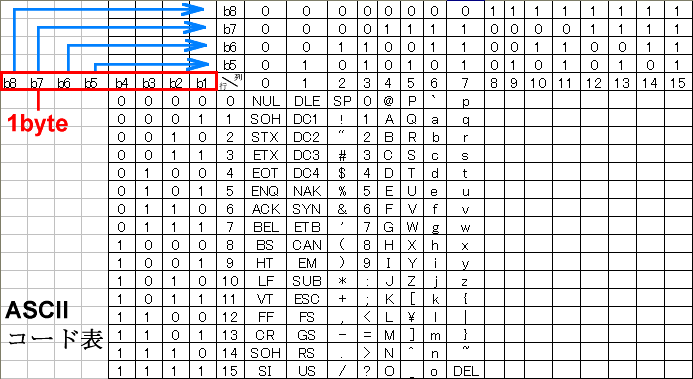
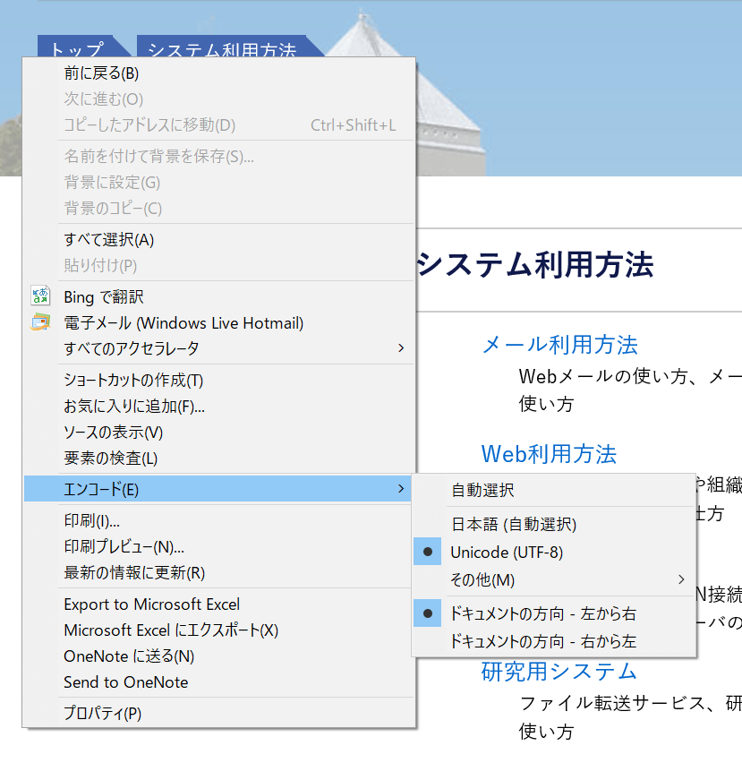
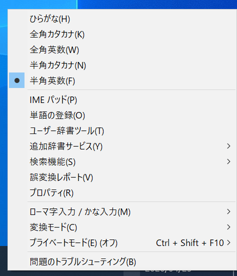
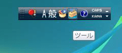
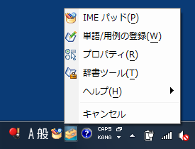
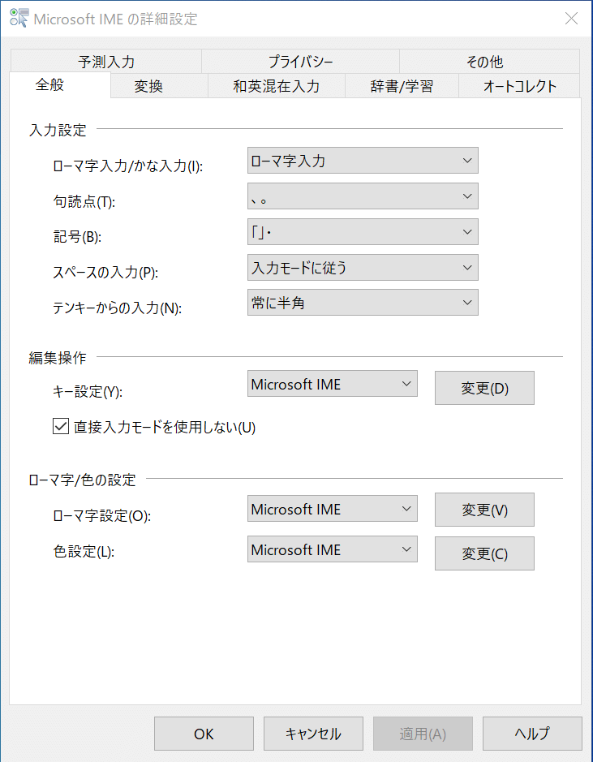

ここでは、日本語の入力についてをより詳しく解説していきます。

日本語入力
----------

みなさんがパソコンを利用するとき、文字を入力すること、特に日本語を入力するという機会が非常に多いと思います。ここでは、文字の入力、特に日本語入力について学びます。

すでに説明してあるマウスやキーボードの操作が重要となります。忘れてしまった人は確認しておいてください。

参考資料 [マウスの操作方法](./mouse.html)

参考資料 [キーボードの操作方法](./keyboard.html)

まずはメモ帳を起動して下さい。起動の仕方を忘れてしまった人は第一講を確認しておきましょう。

-   [情報処理教室の使い方と授業ガイダンス](./index.html)

### 入力モード

日本語を入力する際には、マイクロソフト社製の日本語入力システムMicrosoft IME(Microsoft Input Method Editor、以下MS-IME) を利用します。また、同社が出しているMicrosoft Office IME 2007（2007 Microsoft Office Service Pack 1に搭載）も、基本的には使い方は変わりません。

言語バーの、(あ)あるいは( A)と表示されている部分をクリックすると、入力モードを変更することができます。入力モードには、「ひらがな(あ)」、「全角カタカナ(カ)」、「全角英数(Ａ)」、
「半角カタカナ( ｶ)」、「半角英数( A)」、「直接入力( A)」があります。

通常日本語は「ひらがな(あ)」、アルファベットは「直接入力( A)」を利用しましょう。これはキーボードの「半角/全角」キーで切り替えられます。入力モードの「半角英数」は用いないほうが良いでしょう。

コンピュータでは半角文字と全角文字は別の文字として扱われます。

### 日本語入力

<dl>
<dt>ポインタ/カーソル</dt>
<dd>現在の操作の対象となる文章の位置を示すもの。通常■や | や、それらのブリンクで表示される。</dd>
<dt>訂正</dt>
<dd>バックスペースキーでの文章の修正: ポインタの左側から消去</dd>
<dd>デリートキーでの文章の修正: ポインタの右側から消去</dd>
<dt>操作の取り消し</dt>
<dd>編集&rarr;元に戻す、またはCtrl+Zキー</dd>
<dt>文字の入力(ローマ字入力)</dt>
<dd>kikounokawarimenihachuuishimashou</dd>
<dd><u>きこうのかわりめにはちゅういしましょう</u></dd>
<dt>入力文字の変換</dt>
<dd>入力した文字の確定前(Enterキー打鍵)に入力し操作対象になっている文字列の型を変えられます。変換の途中で Esc キーや Ctrl+Z キーにより途中の状態に戻れます。</dd>
</dl>

<table>
<thead>
<tr>
<th>機能キー</th><th>変換される文字型</th>
</tr>
</thead>
<tbody>
<tr>
<td>スペースバー</td><td>漢字</td>
</tr><tr>
<td>F6</td><td>全角ひらがな</td>
</tr><tr>
<td>F7</td><td>全角カタカナ</td>
</tr><tr>
<td>F8</td><td>半角カタカナ</td>
</tr><tr>
<td>F9</td><td>全角英数</td>
</tr>
</tbody>
</table>

<dl>
<dt>文節長、文節きりの調節と自分の意図する文章への仕上げ</td>
<dd>
文全部を入力し一括変換するか、文節ごとの変換か、漢字一文字ごとの変換か、 
&rarr;、&larr;キーによる変換修正対象文節への移動と文(節)入力 
shift+&rarr;、&larr;による変換修正対象文節の長さ変更  
変換キー(スペースバー)打鍵 
確定(enter)
</dd>
<dt>文字変換のやりなおし</dt>
<dd>きこうのかわりめにはちゅういしましょう。 &rarr; きこうのかわりめにはけんこうにちゅういしましょう。 &rarr; 気候の変わり目には健康に注意しましょう。</dd>
<dd>かれはいしゃかな、またはいしゃかな。&rarr; 彼歯医者かな、または医者かな。</dd>
</dl>

MS-IMEでは、様々な機能や細かな設定を行うこともできます。その一部を以下に紹介しておきます。

* [日本語入力システムMicrosoft IME](#chapter7)

半角文字と全角文字
------------------

コンピュータでは半角文字と全角文字は別の文字として扱われます。日本語の文字は全角文字です。
つまり通常の「英数字直接入力モード」は「半角入力状態」ですので入力できません。それを「日本語変換モード」(ひらがな)にすると「全角入力状態」になります。
こうして日本語(いまの場合はひらがな)の入力ができますが、この状態では記号や数字も全角になります。これらは画面上では半角文字の倍の横幅で表示されます。

全角

>   ！＠＃＄％＾＆＊（）＿＋＝－０９８７６５４３２１

半角

>   !@\#\$%\^&\*()\_+=-0987654321

また、英字にも全角文字があります。

全角

>   ＡＳＤＦＧＨＪＫＬ：”～‘’；ｌｋｊｈｇｆｄｓａ

半角

>   ASDFGHJKL:\~\`';lkjhgfdsa

スペースにも「全角スペース」と「半角スペース」があります。

### 注意

全角文字を使う場合には複数の方法 (文字コード) があり、あるシステムで作成したもの (テキスト文章やファイル名・フォルダ名) を別のシステムで利用しようとすると、うまく表示されないことがあります。いわゆる文字化 (もじばけ) / 字化 (じばけ) です。その様な可能性があるときは、できるだけファイル名・フォルダ名などは英字にしておく方が無難でしょう。

文字コード
----------

文字コードとは、コンピュータ上で文字を表示するために用いられる方式です。

コンピュータ内部では、0 もしくは 1 のいずれかを用いる二進法によって情報のやりとりがされています。

しかし、人間にはこの二進法でやりとりされる情報を解読することは困難なので、文字コードによって文字化します。

文字コードの代表的な例としては、ASCIIコードやEBCDIC、JISコード、Unicodeなどが上げられます。

本来、ASCIIコードやEBCDICでは、文字を 1 バイトの情報として扱います。

1 バイトは二進法で 28 ＝ 256 種類の情報を表すことができ、"a"や"A"などのアルファベットの大文字・小文字と"!"や"\#"などの記号文字に"NUL"などの制限コードを合わせても 256 種類ないため、 1 バイトを使用するだけで文字を表すことができます。

しかし、日本語では元々のアルファベットや記号文字、制限コードに加えて、"あ"や"ア"、"阿"などのひらがな、カタカナ、漢字を追加したことによって、文字が 256 種類を超えてしまいました。そこで、JIS漢字コードやUnicodeなどでは、文字を 2 バイトの情報として扱うことによって 216 ＝ 65536 種類の文字を表すことができるようにしました。文字を 2 バイトの情報として見ることによって、日本語を表しているわけです。

しかし、それでも文字は収まりきらなかったため、旧字体や機種依存文字は表示されないものがあります。

<table>
<thead>
<tr>
<th>サイズ</th><th>コード名</th><th>説明</th>
</tr>
</thead>
<tbody>
<tr>
<td rowspan="5">1 byte</td>
<td>ASCIIコード</td>
<td>最も基本的な文字コードです。英数字、記号文字、制限コードを表す 7 bitのコードです。（※上図の通りに 8 bitの最初の 1 bitは使用していません。最初の 1 bitは"パリティビット（誤り検出符号）"として使用しています。）</td>
</tr><tr>
<td>ISOコード</td>
<td>ASCIIコードをもとにした国際規格の 7 bitコードです。</td>
</tr><tr>
<td>JIS7コード</td>
<td>ISOコードをもとにした半角文字コードです。ISOコードとほぼ同じ内容です。</td>
</tr><tr>
<td>JIS8コード</td>
<td>JIS7コードに半角カタカナを追加した 8 bitコードです。</td>
</tr><tr>
<td>EBCDIC</td>
<td>英数字、記号文字、制限コードを表す 8 bitコードです。最も基本的な文字コードはASCIIコードですが、汎用コンピュータで最も使われている文字コードです。</td>
</tr><tr>
<td rowspan="3">2 byte</td>
<td>JIS漢字コード</td>
<td>英数字、記号文字、ひらがな、カタカナ、漢字を表す 16 bitコードです。</td>
</tr><tr>
<td>シフトJISコード</td>
<td>JIS漢字コードでは、他の文字コードと混合してしまうため、JIS漢字コードを配置し直した 16 bitコードです。日本では最もよく使われています。</td>
</tr><tr>
<td>Unicode</td>
<td>世界中の文字で表した国際規格の 16 bitコードです。</td>
</tr><tr>
<td>1 ～ 3 byte</td>
<td>日本語EUC</td>
<td>UNIXで使用される 1 ～ 3 byteのマルチバイトコードです。</td>
</tr>
</tbody>
</table>

InternetExplorerを開き、[表示] - [エンコード]で、各国の多様な文字コードの種類を見ることができます。

ホームページを見ているときの文字化けは、文字コードの変換ミスである場合が多く、ほとんどの場合においてエンコードによって適切な文字コードを選択することで修正できます。

日本語入力システムMicrosoft IME
-------------------------------

Windowsでは主にマイクロソフト社製の日本語入力システムIME(Input Method Editor) を利用します。ほかにATOKというのもWindowsシステムでは広く使われています。

IMEの詳細については [使用条件](http://www.microsoft.com/japan/misc/cpyright.aspx)の中の「このサイトで入手可能なドキュメントに関する注意」を読んで参照してください。

また、MS-IMEとMicrosoft Office IME 2007（2007 Microsoft Office Service Pack 1に搭載）との違いについては、 [「Microsoft IME - WindowsとOffice、バージョンによる違いと使い分けについて」](http://windowshelp.microsoft.com/Windows/ja-JP/help/0da40747-e928-468b-913b-601f1b93cdda1041.mspx) を参照してください。

### 言語バーとIMEツールバー

日本語入力可能な状態になっていると、以下のような2つの小さなウィンドウ
(ツールバー)がデスクトップ上にあります(下左図)。場合によっては2つが1つにまとまっている場合もあります(下右図)。また、タスクバーの右隅に押し込まれている場合もあります。もちろん、このように設定を変更することもできます。

以下の図とその下の表の対応を見てください。

<dl>
<dt>日本語入力方式</dt><dd>MS-IMEかナチュラルインプットの選択</dd>
<dt>入力モード</dt><dd>半角、全角、ひらがな、カタカナ、英数字の設定変更</dd>
<dt>変換モード</dt><dd>漢字(無)変換方式の設定</dd>
<dt>IMEパッド</dt><dd>特殊文字、難読漢字の入力のアシスト</dd>
<dt>プロパティ・環境設定</dt><dd>動作環境の設定</dd>
<dt>ツール</dt><dd>単語・用語登録（辞書に新単語登録）やプロパティ（環境設定）などが入っている。</dd>
<dt>ヘルプ</dt><dd>使い方の説明</dd>
<dt>最小化</dt><dd>言語バーをタスクバーにしまいます。</dd>
<dt>CAPS、カナキー</dt><dd>キーボードの状態表示: Caps Lockキー設定、かな文字入力設定(Alt+カタカナひらがなキー)</dd>
<dt>オプション</dt><dd>言語バーの設定</dd>
</dl>

なお上の右図でIMEパッドの右のアイコンは単ににツールと呼ばれています。
ここをポイントしてクリックすると以下の左図から右図のように変化しプロパティや単語･用語登録が選択できます。さらに辞書ツールもここから直接選択できます。

そしてツールをクリックすると

　&rarr;　

### 日本語入力方法の変更

この部分は、ネットワークファイルシステムに特有の事情で、設定したものが次回には適用されません。個人のパソコンなどで通用するものとして理解して下さい。

MS-IMEツールバー&rarr;入力方式&rarr;プロパティでダイアログ画面より設定

ローマ字入力/かな入力の切替、句読点やスペースの種類など。自分の好みの環境にして下さい。再ログオンが必要になる場合があります。
