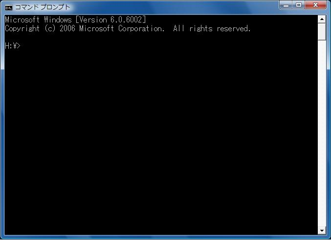

コマンドプロンプトの概要
------------------------

### コマンドプロンプトの起動

スタートメニューから、[プログラム] - [アクセサリ] - [コマンドプロンプト] をクリックします。
すると、以下のような画面が表示されます。

ここに様々なコマンドを入力し、実行させます。

よく使うコマンド - ディレクトリ関連
-----------------------------------

### 自分の居場所を調べる

コマンドプロンプトに、以下のように入力してみましょう。

    cd

すると、例えば以下のように表示されます。

    H:\

ここが、今コマンドプロンプトが参照しているディレクトリとなります。

### ディレクトリの一覧表示

今参照しているディレクトリにどのようなファイルやディレクトリがあるか見てみましょう。

    dir

すると、例えば以下のように表示されます。

    2015/10/01  13:34   <DIR>   java
    2015/10/01  13:40           memo.txt

### ディレクトリの作成・削除

ディレクトリを作成することもできます。

    md infolit2b

`md` コマンドは、`md 作成するディレクトリ名` というかたちで使います。

きちんと作成できているかどうか、`dir` コマンドを使って確認してみましょう。

    2015/10/02  10:32   <DIR>   infolit2b
    2015/10/01  13:34   <DIR>   java
    2015/10/01  13:40           memo.txt

きちんと作成できていますね。

次に、ディレクトリの削除をしてみましょう。そのために、もう１つディレクトリ `test` を作り、作成できたかどうか確認してみましょう。

    md test

    dir

では、今作った `test` を削除してみましょう。

    rd test

これも `md` と同様に、`rd 削除するディレクトリ名` というかたちで使います。

### ディレクトリの中への移動

それでは、先ほど作った `infolit2b` の中に移動してみましょう。

    cd infolit2b

きちんと移動できたかどうか、`pwd` を使って確認してみましょう。

    cd
    H:\infolit2b

先ほどとは違うパスが表示されていますね。きちんと移動できたようです。

よく使うコマンド - ファイル操作
-------------------------------

### ファイルの中身を表示する

何か適当なエディタを起動し、適当に何か入力して、先ほど作成した `infolit2b` に `test.txt` として保存しましょう。
できたら、`dir` コマンドでファイルがきちんと保存されているか確認し、次のコマンドを入力してみましょう。

    type test.txt

うまくいけば、ファイルの中身がコマンドプロンプト上に表示されるはずです。

同じような機能のコマンドとして、`more` があります。

### ファイルをコピーする

次に、先ほど作成した `test.txt` をコピーしてみましょう。

    copy test.txt aaa.txt

このコマンドは、`copy コピー元のファイル名 コピー先ファイル名` という形式になっています。もちろん他のディレクトリにコピーすることもできます。
実行したら`dir`コマンドを使って確認してみましょう。

### ファイルの移動・ファイル名の変更

では、今コピーした `aaa.txt` のファイル名を変更してみましょう。

    move aaa.txt test2.txt

このコマンドは、`move 元のファイル名 変更後のファイル名` という形式になっています。
変更後のファイル名をディレクトリ名にすると、ファイルの移動となります。

### ファイルの削除

先ほどファイル名の変更をした `test2.txt` を削除してみましょう。

    del test2.txt

きちんと削除されているか `dir` コマンドを用いて確認してみましょう。
