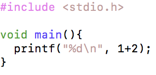
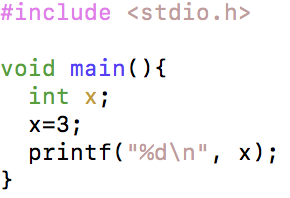
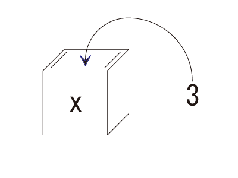
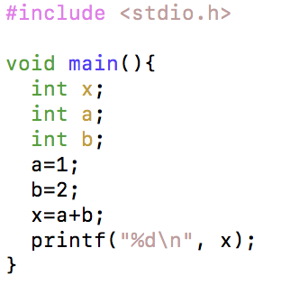

四則演算
--------

### Keisan1.c

まず、以下のソースコードを打ち込み、コンパイルをして実行しましょう。

コンパイルの方法は、以下を参考にしましょう。

参考資料 [コンパイルと実行（Windows コマンドプロンプト）](../../appendix/win_gcc.html)

参考資料 [コンパイルと実行（Mac ターミナル）](../../appendix/mac_gcc.html)

*Keisan1.c* 

実行すると、以下のような結果が表示されます。

*実行結果*

    3

### 算術演算子

算術演算子には、以下のようなものがあります。

<table>
<thead>
<tr>
<th>演算子</th>
<th>意味</th>
<th>使い方の例</th>
<th>結果</th>
</tr>
</thead>
<tbody>
<tr>
<td>+</td>
<td>和</td>
<td>5+2</td>
<td>7</td>
</tr>
<tr>
<td>-</td>
<td>差</td>
<td>5-2</td>
<td>3</td>
</tr>
<tr>
<td>* </td>
<td>積</td>
<td>5*2</td>
<td>10</td>
</tr>
<tr>
<td>/</td>
<td>商</td>
<td>5/2</td>
<td>2</td>
</tr>
<tr>
<td>%</td>
<td>剰余</td>
<td>5%2</td>
<td>1</td>
</tr>
</tbody>
</table>

演算子には優先順位があります。基本的には、数学の優先順位と同じです。

参考資料 [演算子の優先順位](../../appendix/priority_order.html)

変数と基本データ型
------------------

### Keisan2.c

次に、以下のソースコードを打ち込み、コンパイルをして実行しましょう。
前の`Keisan1.c`を少し修正しただけです。

*Keisan2.c* 

### 変数とは

プログラムで扱う値を入れておくための **箱** だと考えればよいでしょう。

### 変数宣言

変数を使うためには、**変数宣言** をする必要があります。これにより、メモリ上に領域が確保されます。

変数宣言

    データ型 変数名;

例えば、上のプログラムの3行目が変数宣言です。

変数宣言の例（１）

    int x;

さらに、以下のように宣言と同時に初期値を入力することもできます。

変数宣言の例（２）

    int x=3;

変数宣言は、プログラムの任意の場所で行えますが、特にプログラム全般で使う変数は**先頭にまとめる**ほうが良いでしょう。
また、変数名は基本的には自由につけることができますが、**予約語** と呼ばれる単語は使用することができません。

参考資料 [C言語における予約語](../../appendix/keyword.html)

### 代入

5行目の `x=3;` の `=` は、**値の代入**をせよという意味です。記号は同じでも、数学でいう **等号** とは意味が少し違います。
きちんと言い換えるならば、**左辺の変数に右辺の値を代入** せよ、という意味です。

### 基本データ型

上の例では、整数型 `int` を使いました。Cではこの他にも様々なデータ型を扱うことができます。

<table>
<thead>
<tr>
<th>型</th>
<th>サイズ</th>
<th>内容</th>
<th>値の範囲</th>
</tr>
</thead>
<tbody>
<tr>
<th>char</th>
<td>1 byte</td>
<td>文字型</td>
<td>0 ～ 255</td>
</tr>
<tr>
<th>short</th>
<td>2 byte</td>
<td>整数型</td>
<td>-32768 ～ +32767</td>
</tr>
<tr>
<th>int</th>
<td>4 byte</td>
<td>整数型</td>
<td>-2147483648 ～ +2147483647</td>
</tr>
<tr>
<th>long</th>
<td>4 byte</td>
<td>整数型</td>
<td>-2147483648 ～ +2147483647</td>
</tr>
<tr>
<th>float</th>
<td>4 byte</td>
<td>浮動小数点型</td>
<td>-3.40282e+38 ～ -1.17549e-38 
    1.17549e-38 ～ 3.40282e+38</td>
</tr>
<tr>
<th>double</th>
<td>8 byte</td>
<td>浮動小数点型</td>
<td>-1.79769e+308 ～ -2.22507e-308 
    2.22507e-308 ～ 1.79769e+308</td>
</tr>
</tbody>
</table>

浮動小数点型の `e` は、**（e以前の数）×10の（e以降の数）乗** という意味です。

様々な変数の使い方
------------------

### Keisan3.c

次に、以下のソースコードを打ち込み、コンパイルをして実行しましょう。

*Keisan3.c* 

このように別の名前をつければ、複数の変数を使うこともできます。

7行目を見てみましょう。このように、代入するものは **数式** でも使えます。
正確には、変数xに **数式の計算結果の値** を代入することになります。

練習問題
--------

上の `Keisan3.c` を参考にして、他の演算を行うプログラムを作成してみましょう。
その際、値もいろいろ変えて試してみましょう。
