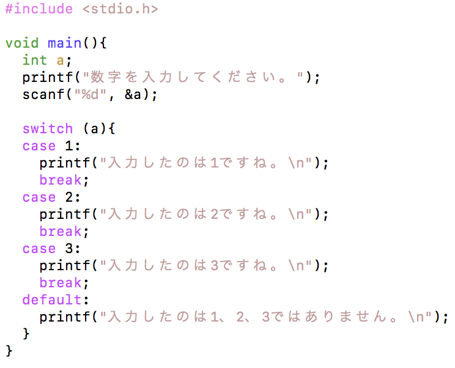

条件分岐 - if文（１）
----------------------------
### 最も基本的な条件分岐
条件分岐とは、条件によって実行する内容を変更する方法です。条件を作成し、その条件に当てはまるか否かを判断して、指定した処理内容を実行するプログラムを作成します。

まず、以下のソースコードを入力し、コンパイルして実行してみましょう。その際、入力する値をいろいろ試してみましょう。

実行結果は、以下のどちらかになります。

*実行結果（１）*

    数字を入力してください。
    1
    入力したのは１ですね。

*実行結果（２）*

    数字を入力してください。
    2

「1」を入力した場合には実行結果（１）となり、それ以外の値を入力した場合は（２）となります。
ある条件により実行結果を変えたい場合、if文を使います。

*if文（１）*

    if(条件){
      条件が当てはまった場合に実行する内容;
    }

### 比較演算子
比較演算子には、以下のようなものがあります。
<table>
<thead>
<tr>
<th>演算子</th>
<th>意味</th>
</tr>
<tr>
<td><</td>
<td>小さい</td>
</tr>
<tr>
<td>></td>
<td>大きい</td>
</tr>
<tr>
<td><=</td>
<td>以下</td>
</tr>
<tr>
<td>>=</td>
<td>以上</td>
</tr>
<tr>
<td>==</td>
<td>等しい</td>
</tr>
<tr>
<td>!=</td>
<td>等しくない</td>
</tr>
</tbody>
</table>

### 論理演算子
論理演算子には、以下のようなものがあります。

<table>
<thead>
<tr>
<th>演算子</th>
<th>意味(not)</th>
</tr>
<tr>
<td>!</td>
<td>否定</td>
</tr>
<tr>
<td>&amp;&amp;</td>
<td>かつ(and)</td>
</tr>
<tr>
<td>||</td>
<td>または(or)</td>
</tr>
</tbody>
</table>

条件分岐 - if文（２）
----------------------------
### if-else
では、前のソースコードに少し付け加えてみましょう。

*ForkSample.c* 

実行結果は、以下のどちらかになります。

*実行結果（１）*

    数字を入力してください。
    1
    入力したのは１ですね。

*実行結果（２）*

    数字を入力してください。
    2
    入力したのは１ではありません。

「1」を入力した場合には実行結果（１）となり、それ以外の値を入力した場合は（２）となります。
elseを使うと、if文の条件に合わなかった場合に実行する内容を書くことが出来ます。

*if文（２）*

    if(条件){
      条件が当てはまった場合に実行する内容;
    }else{
      条件に当てはまらなかった場合に実行する内容;
    }

### if-else if
さらに複数の分岐をさせてみましょう。

*ForkSample.c* 

1,2,3を入力した場合はその値が表示され、それ以外の場合は1,2,3ではないと表示されます。
else ifを使うと、さらに分岐を増やすことができます。

*if文（３）*

    if (条件１) {
       条件１に当てはまった場合に実行する内容;
    } else if (条件２) {
        "条件１に当てはまらずに"条件２に当てはまった場合に実行する内容;
    } else {
      上のすべての条件に当てはまらなかった場合に実行する内容;
    }
    
    // 例
    if (a == 1){
        printf("入力したのは１ですね。");
    } else if(a==2){
        printf("入力したのは２ですね。");
    } else {
        printf("入力したのは１、２ではありません。");
    }

else if文は、いくつでも追加することができます。

条件分岐 - switch文
----------------------------
### switch文
上のソースコードを、以下のように書き直して見ましょう。

*Bunkiswitch.c*

前のプログラムと同じ動作をしているはずです。

*switch文*

    switch(式) {
        case 値１:
            式が値１の時に実行したい内容;
            break;
        case 値２:
            式が値２の時に実行したい内容;
            break;
        default:
            上の値すべてと異なる場合に実行する内容;
    }

`case` 文のラベルに指定できる値は、`int` 型です。
この条件下では、switch文とif文は相互に書き換えが可能です。上の条件を守れば、switch文とif文は相互に書き換えが可能です。

<h2 id="part-2dfb3ce61a160f4e">練習問題</h2>

<ol>
<li>以下のような結果を表示するプログラムを書きましょう。

<em>実行結果（１）</em>

<pre><code class="language-" data-lang="">１つめの値を入力してください。
5
２つめの値を入力してください。
2
計算方法を指定してください。
１：足し算　２：引き算　３：掛け算　４：割り算
2
5 - 2 = 3
</code></pre>

ただし、１から４以外の数字が入力された場合は、以下のように表示させるようにしましょう。

<em>実行結果（２）</em>

<pre><code class="language-" data-lang="">１つめの値を入力してください。
5
２つめの値を入力してください。
2
計算方法を指定してください。
１：足し算　２：引き算　３：掛け算　４：割り算
5
計算方法には1から4までの数字を入力してください。
</code></pre>

</li>
<li>２つの数を入力し、２つの数が等しい場合は <code>２つの数は等しいです。</code> と出力し、異なる場合は、<code>○○のほうが大きいです。</code>と出力するプログラムを書きましょう。

<em>実行結果（１）</em>

<pre><code class="language-" data-lang="">１つめの値を入力してください。
5
２つめの値を入力してください。
2
5のほうが大きいです。
</code></pre>

<em>実行結果（２）</em>

<pre><code class="language-" data-lang="">１つめの値を入力してください。
1
２つめの値を入力してください。
1
２つの数は等しいです。
</code></pre>

</li>
<li>
絶対値を求めるプログラムを作成しましょう。なお、絶対値は数字の大きさを表します。
例えば、
<code>|4| = 4</code>, <code>|-4| = 4</code>

</li>
<li>
変数gradeの値が、 
90以上から100以下なら「5」 
80以上から90未満までなら「4」 
70以上から80未満までなら「3」 
60以上から70未満までなら「2」 
それ以外なら「1」 
を出力するプログラムを作成しましょう。
</li>
<li>
変数xの値で100を割るプログラムを作成しましょう。もしxの値が0ならば、”error”と出力しましょう。
</li>
<li>
変数monthの値に対応する月の英語名を表示しましょう。
</li>
<li>
西暦を入力すると十二支を出力するプログラムを作成し、来年の十二支を表示するプログラムを作成しましょう。
ヒント: 十二支は、子丑寅卯辰巳午未申酉戌亥の順。
</li>
<li>
2次方程式 ax^2+bx+c=0 の解を求めるプログラムを作成しましょう。なお、平方根の計算にはライブラリを用いて良い。
</li>
<li>
正の整数をキーボードから3つ入力すると、大きい順に並び替えて出力するプログラムを書きましょう。

<em>実行例</em>

<pre><code class="language-" data-lang="">値を3つ入力してください
    入力1&gt;&gt; 10
    入力2&gt;&gt; 23
    入力3&gt;&gt; 65
    結果&gt;&gt; 65, 23, 10
</code></pre>

</li>
</ol>
