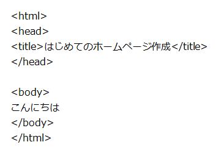
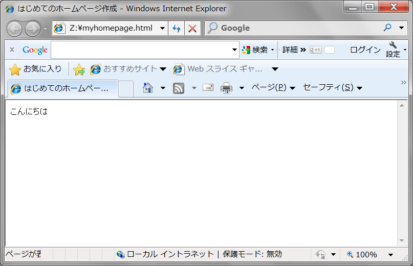
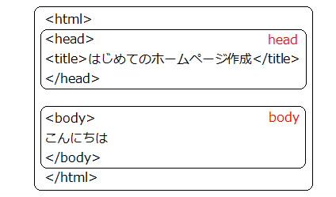
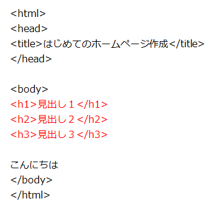
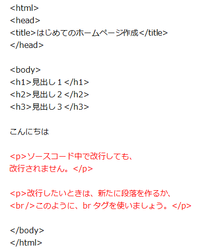
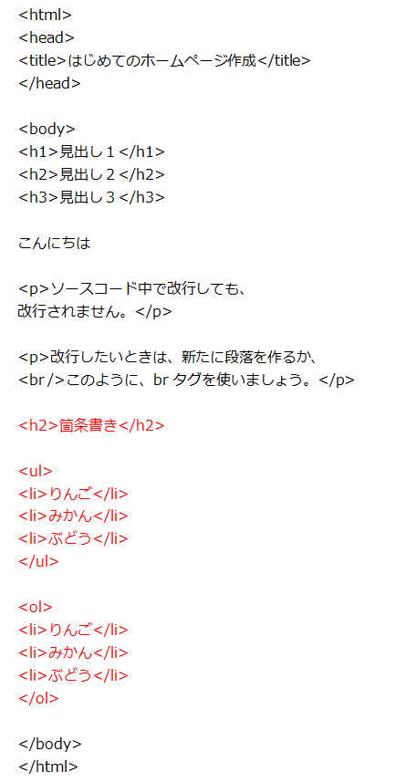
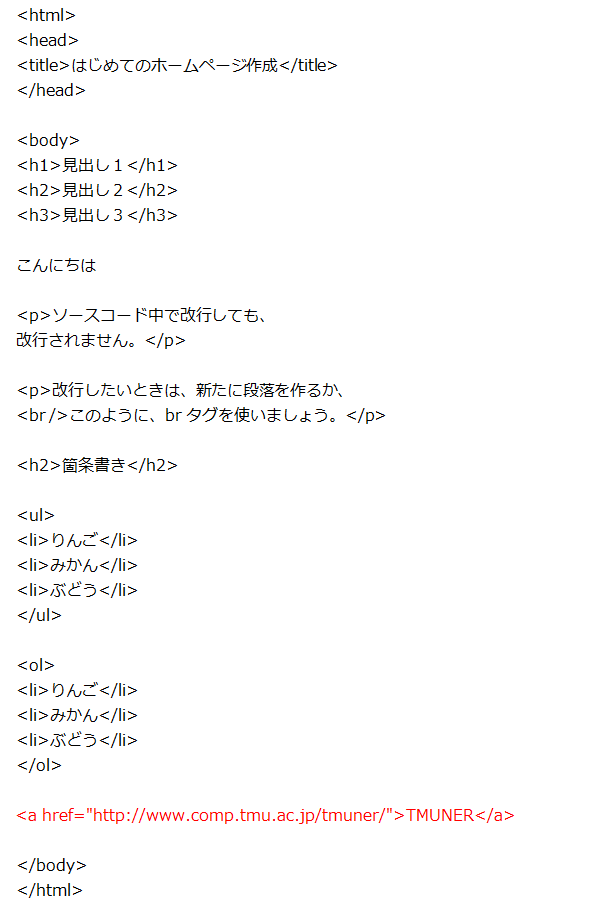
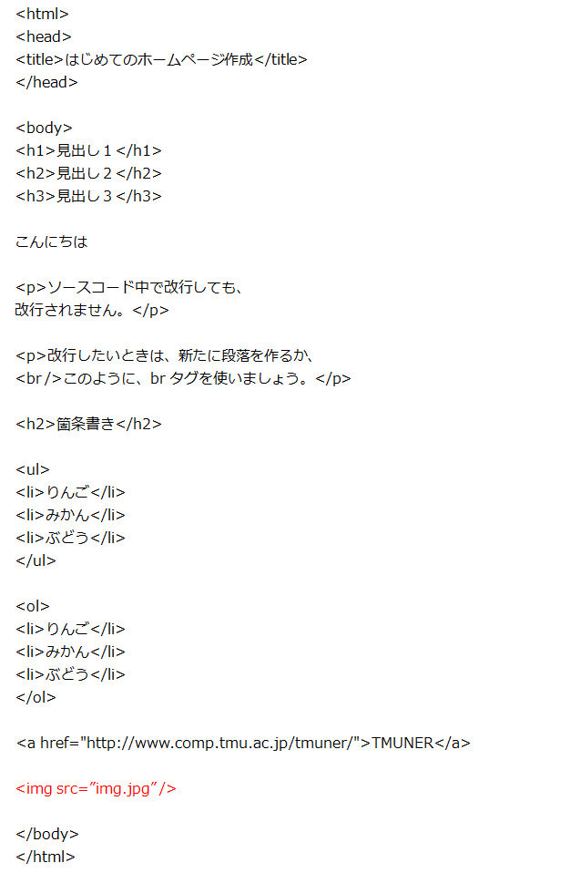

HTMLの基本知識
--------------

### HTMLとは

HTMLとは、Hyper Text Markup Languageの略で、主にホームページを作る際に利用する言語です。
このテキストも、HTMLで書かれています。

また、HTMLはテキストファイルであるため、通常はテキストエディタを用いて編集します。
DreamweaverなどのWebページを作成するためのソフトや、Microsoft Wordでも作成する事が出来ます。

ここでは、テキストエディタを用いて作成することにします。

HTMLの書き方（１）
------------------

### 基本的な書き方

まず、以下のコードを適当なエディタを使って作成してみましょう。

打ち終わったら、`myhomepage.html` として保存しましょう。

*myhomepage.html*

それでは、今作成したファイルを適当なブラウザで開いてみましょう。

HTMLは、**タグ**と呼ばれる目印で文章を構成していきます。
例えば、`<html>` や `<title>` などがタグです。

タグには例えば以下のような決まりがあります。

-   HTMLタグ
    -   HTMLタグは必ず**半角**で書く
    -   HTMLタグは必ず**閉じる**
-   開始タグと終了タグ
    -   `<...>` を開始タグ、`</...>` を終了タグという

例えば、`<html>` には `</html>` が、`<title>` は `</title>` が対応しています。

titleタグで囲まれた「はじめてのホームページ作成」という文章が、ブラウザのタイトルに表示されています。
このように、タグで囲まれた文章に、タグのスタイルを適用することができます。

つまり、開始タグと終了タグをきちんと書かないと、どこまでそのタグのスタイルを適用していいかわからなくなり、エラーの原因となります。

### HTMLの基本的な構造

HTMLには大きく分けて２つの部分から成り立っています。それがheadとbodyです。

headは文章のタイトルなど、文章自身の情報を書く部分です。bodyは文章の本体となります。

また、文章全体を `<html>` タグで囲みます。

HTMLはタグによるツリー構造をしています。

HTMLの書き方（２）
------------------

### タイトルと見出し

先ほど作ったファイルを、以下のように編集してみましょう。

このようにして、見出しをつけることができます。

このテキストも、h1、h2、h3が使われています。

#### 見出し

    <h1> </h1>

-   数字によって見出しのレベルが変わります
-   レベル 1 〜 6 まで使用できます

#### タイトル

タイトルとは、ブラウザのタイトルバーにつく名前のことです。

    <title> </title>

-   このタグは**<head> タグの内側**に書きます

### 段落と改行

先ほど作ったファイルを、以下のように編集してみましょう。

このようにして、段落と改行を行うことができます。

このコードの13行目を見ても分かるように、ソースコード中の空白や改行は本文には反映されません。

#### 段落

    
 

#### 改行

     

改行は同じ内容だけれども、1行で書くと見にくい時などに使うと良いでしょう。

ただ単に ` ` と書いてもエラーは起きませんが、XHTML1.0以降では `<br />` あるいは `  ` と書くことが推奨されています。

-   [XHTML 1.0: The Extensible HyperText Markup Language (Second Edition)](http://www.w3.org/TR/xhtml1/#h-4.6)

### 箇条書き

先ほど作ったファイルを、以下のように編集してみましょう。

*myhomepage.html*

このように、箇条書きを行う事も出来ます。

    <ul>
    <li> </li>
    <li> </li>
    </ul>

また、番号付きの箇条書きを行う事も出来ます。

    <ol>
    <li> </li>
    <li> </li>
    </ol>

### ハイパーリンク

次に、HTMLの特徴とも言える、リンクを作成してみましょう。

先ほど作ったファイルを、以下のように編集してみましょう。

*myhomepage.html*

このようにしてハイパーリンクを行うことができます。

    

同じディレクトリのファイルを参照する場合は、ファイル名のみをリンク先に指定します。

### 画像の貼り付け

今回は次の画像を使用します。
画像を右クリックして「名前を付けて画像を保存」をしておきましょう。
名前は `img.jpg` としてください。

先ほど作ったファイルを、以下のように編集してみましょう。

*myhomepage.html*

このようにして画像を貼りつけることができます。

    

これもハイパーリンクと同様に、同じディレクトリの画像を張り付ける場合は、ファイル名のみを書きます。

練習問題
--------

HTMLを用いて、自己紹介のページを作成してみましょう。

