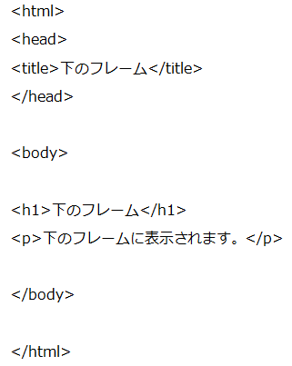

フレームの使い方
----------------

### フレームの基本的な使い方

まず、以下のコードを適当なエディタを使って作成しましょう。

ファイル名は、`frame.html`、`ue.html`、`shita.html` としましょう。

*frame.html*

*ue.html*

*shita.html*

`frame.html` を適当なブラウザで表示させると、以下のようになります。

ここで、それぞれのファイルの役割について説明しましょう。
まず、`frame.html` によって、フレームの配置や大きさ等が指定されています。

#### フレームの分割

縦に分割されたフレームを作成します。

    <frameset rows="フレームの大きさ１,・・・"> </frameset>

横に分割する場合は、下のように修正します。

    <frameset cols="フレームの大きさ１,・・・"> </frameset>

また、その分割されたフレームに、どのファイルを表示させるかも指定します。

#### フレームに表示するファイルの指定

フレームに表示するファイルを指定します。

    <frame src="ファイル名">

フレームはいくつでも分割することができます。
また、縦横の分割を同時に使うこともできます。

### リンク

先ほど作成した `frame.html`、`ue.html` を、以下のように修正してみましょう。

*frame.html*

*ue.html*

前と同じように、`frame.html` を適当なブラウザで開いてみましょう。
上のフレームのリンクをクリックすると、下のフレームに表示されているページが変わるはずです。

#### フレームに名前をつける

    <frame src="ファイル名" name="フレームの名前">

#### フレームでのハイパーリンク

    

フレームの名前に `_top` を入れると、フレームを解除して表示させることができます。
また `_blank` を入れると、新規ウィンドウで開きます。

