# Java

### インストール手順
1. EclipseをPleiadesのサイトからダウンロード

    Pleiades  
    https://mergedoc.osdn.jp/  
    上記サイトにアクセスし、最新版の「Eclipse 2020」を選択します。
    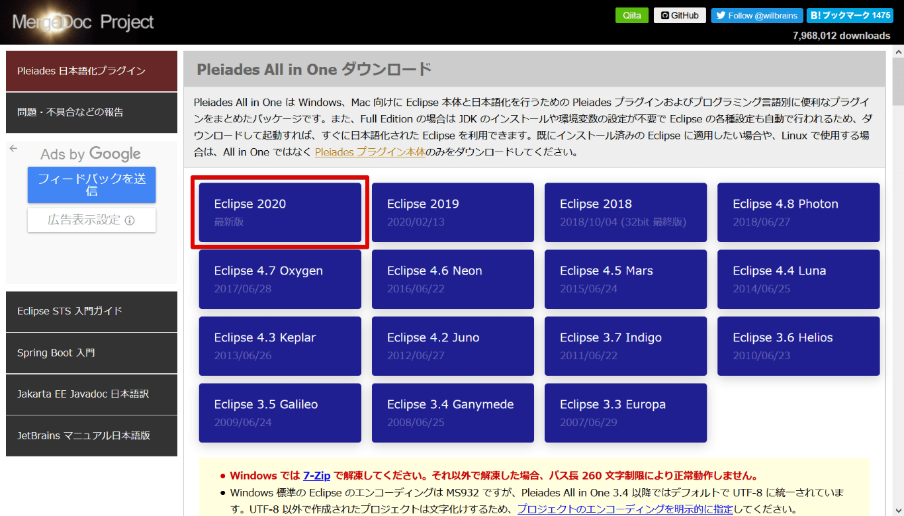

    次に使用しているOSを確かめ、 Java列にある Full Edition をダウンロードします。
    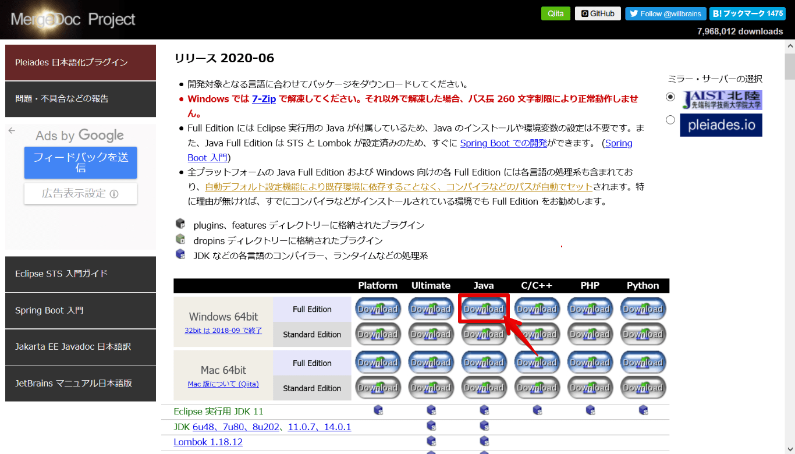

    ダウンロードしたzipファイルはパスの浅いところに配置します。
    ファイルの展開には7-Zipを用います。zipファイルを右クリックで選択し、7-Zip > ここで展開 
    を選択するとzipファイルが展開できます。
    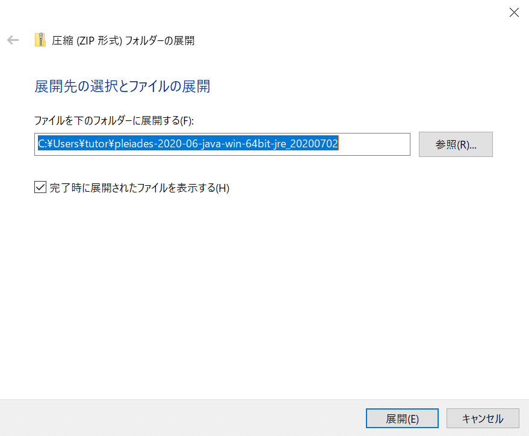

    7-Zip  
    https://sevenzip.osdn.jp/  
    上記サイトにアクセスし、自身のパソコンに適したものをダウンロードします。
    

    パス（path）はファイルやフォルダの場所を示す情報です。詳細は
    - [パス（path）とは |「分かりそう」で「分からない」でも「分かった」気になれるIT用語辞典](https://wa3.i-3-i.info/word1166.html)

    などを参考にしてください。

2. Eclipseの起動

    先ほど展開したpleiadesフォルダ内にあるeclipseフォルダを開き、eclipse.exeを起動します。

    Eclipseを起動すると次のようなワークスペース選択画面が表示されます。ワークスペースはEclipseの設定フォルダや、その設定を用いた複数のプロジェクト（プログラム）をまとめたものです。参照からユーザーホーム内の適切なフォルダを指定し、ワークスペースを配置します。
    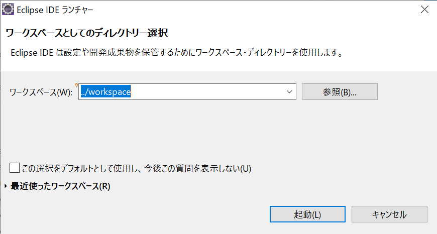
    ワークスペースを指定したら、Eclipseを起動します。

    Eclipseが起動すると次の画面が表示されます。
    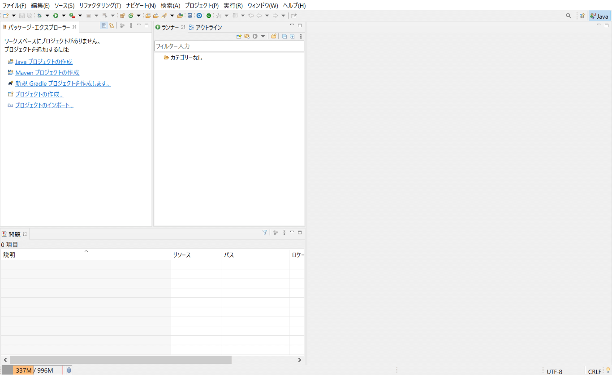

3. Eclipseの画面構成

    Eclipseの画面は「ビュー」と「エディタ領域」から構成されています。表示されているタブのことをビュー、白紙の領域をエディタ領域といいます。これらの配置などをまとめてパースペクティブと呼びます。
    パースペクティブをJavaプログラミングに適したものにします。
    ウインドウ右上にある をクリックし、「パースペクティブを開く」ダイアログからJavaを選択し、開くをクリックするとパースペクティブが切り替わります。
    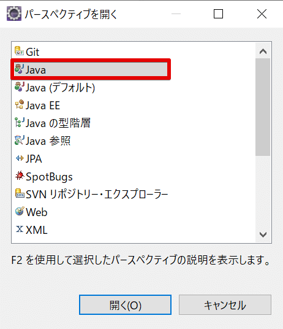

    ビューを追加する場合は、ウィンドウ > ビューの表示 から追加したいビューをクリックします。
    削除する場合はそれぞれの削除したいビュータブの上にある×をクリックします。
    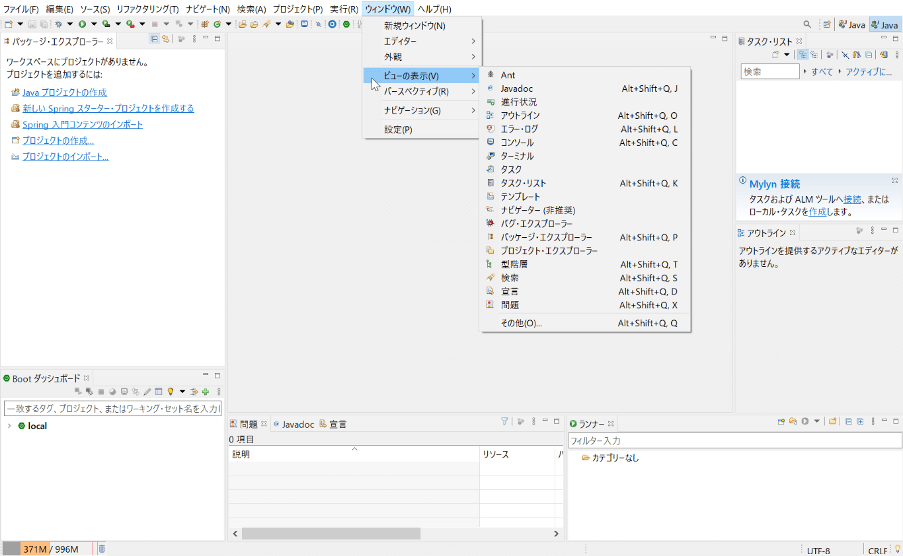

### プロジェクトファイルの作成と実行
1. プロジェクトの作成

    プロジェクトファイルを作成します。ファイル > 新規 > Javaプロジェクト の順にクリックすると新規Javaプロジェクトのダイアログが表示されます。
    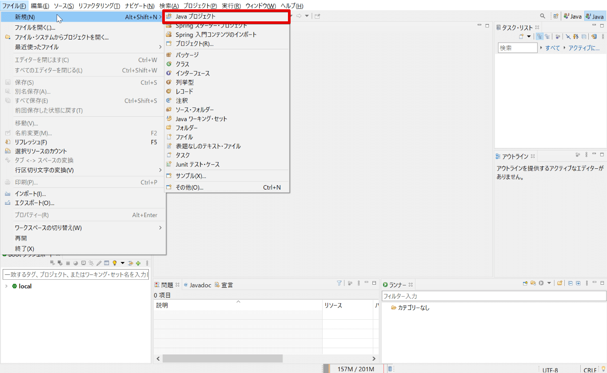
    プロジェクト名に任意の名前を入力して次へをクリックします。「module-info.javaファイルの作成」のチェックを外し、完了をクリックします。
    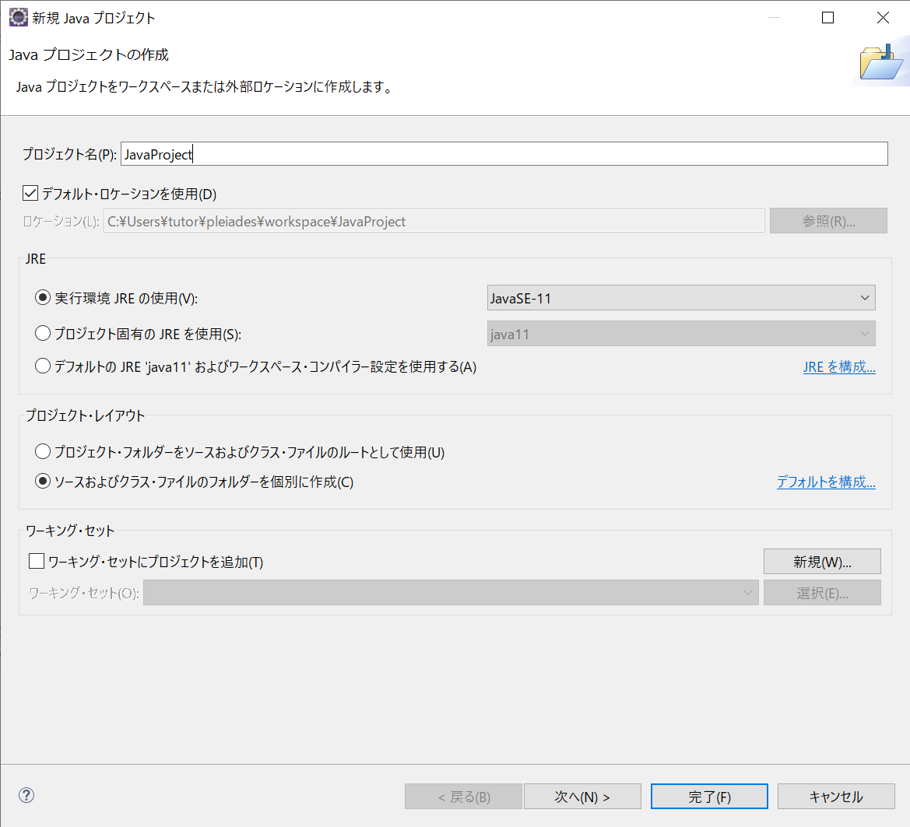
    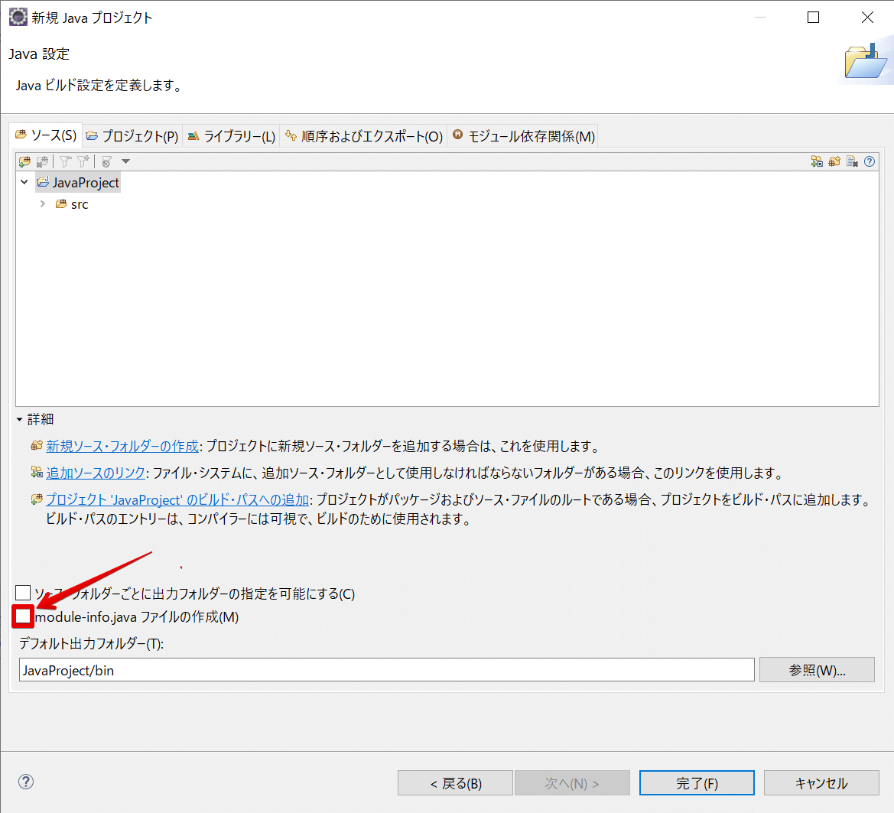
    「パッケージ・エクスプローラー」ビューに作成したプロジェクトが表示されます。

2. クラスファイルの作成

    作成したプロジェクトファイル内にあるsrcフォルダにJavaのソースコードを作成します。Javaのソースコードはクラスファイルという形式です。srcフォルダを右クリックし、新規 > クラス を選択すると「新規Javaクラス」ダイアログが表示されます。「名前」の部分に任意のクラス名を入力して完了をクリックするとソースコードが入力できるようになります。
    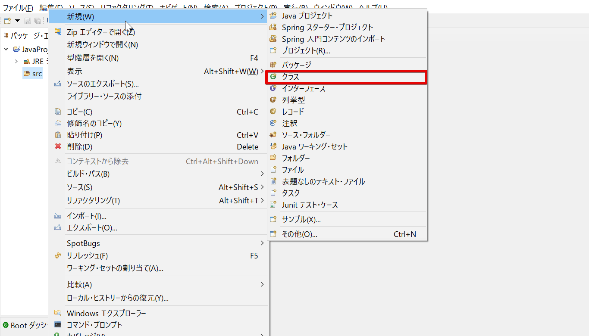
    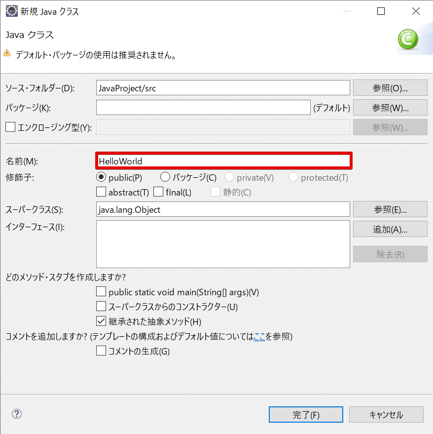

3. クラスファイルの実行

    ソースコードの入力が完了したら、プログラムを実行します。
    エディタ領域の空白部分かパッケージ・エクスプローラーの実行したいファイル上で右クリックをします。実行 > Javaアプリケーション の順に選択するとコンソールビューに標準出力の結果が表示されます。
    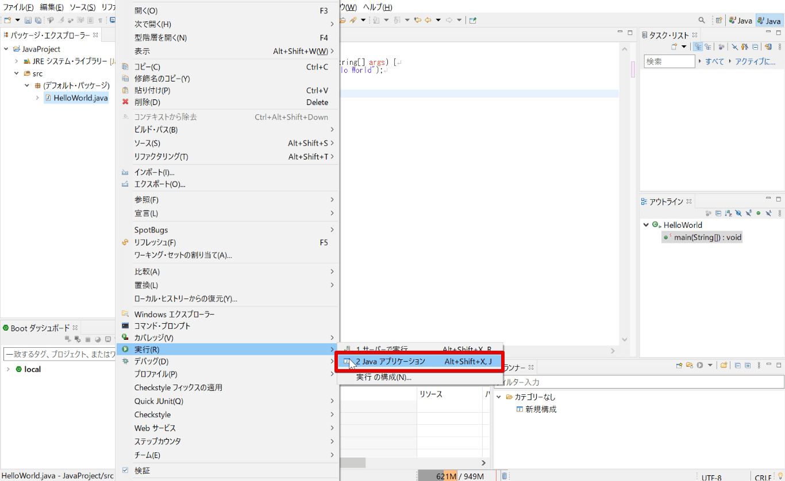

### 参考にしたサイト
  - [Eclipse、はじめの一歩 - インストールから便利な日本語化プラグインの導入まで](https://employment.en-japan.com/engineerhub/entry/2020/03/19/103000)
