基本的な使い方
--------------

### 起動

まず、[スタート] - [すべてのプログラム] - [Eclipse] から起動します。
Macの場合は、Dockのアイコンをクリックしてください。

すると、以下のようなウィンドウが表示されます。

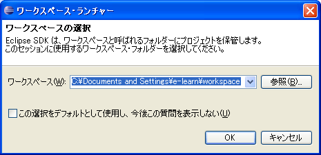

### プロジェクトの作成

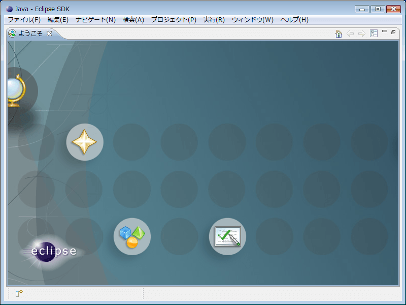

まず、**プロジェクト** を作成しましょう。
[ファイル] - [新規作成] - [プロジェクト] をクリックします。

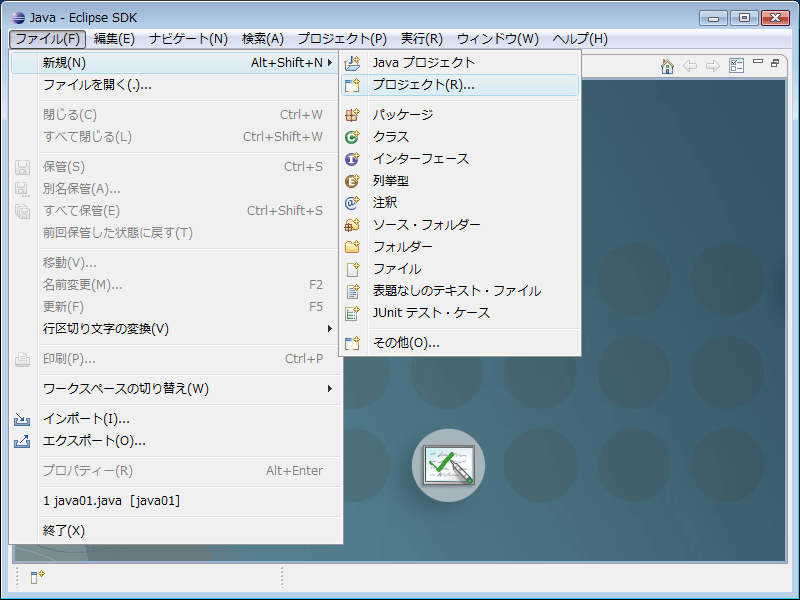

すると、以下のようなウインドウが開きます。

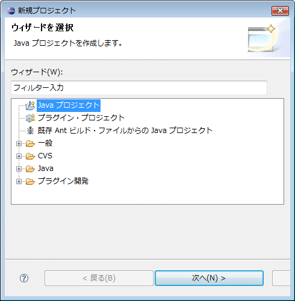

ここでは、"Javaプロジェクト" を選択して、[次へ] をクリックしましょう。

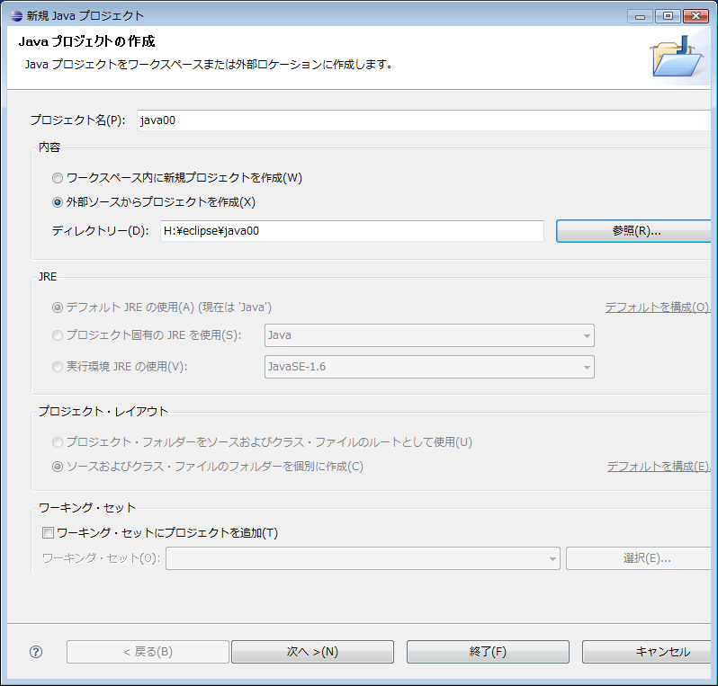

自分の分かりやすいプロジェクト名を入力します。
次の "内容" では、"外部ソースからプロジェクトを作成" を選択し、自分のマイドキュメント内の任意のフォルダを指定しましょう。

この際、１つのプロジェクトに対して１つのフォルダを割り当てるようにしましょう。
一度他のプロジェクトで指定したフォルダは指定できない場合もあるので注意しましょう。

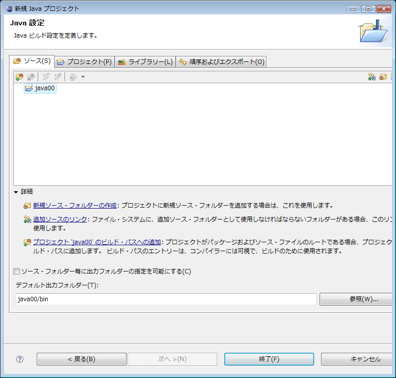

ここでは何もしないで「終了」をクリックします。

これでプロジェクトが作成されました。

### ソースファイルの作成

次に、ソースファイルの作成をします。
[ファイル] - [新規] - [クラス] をクリックします。

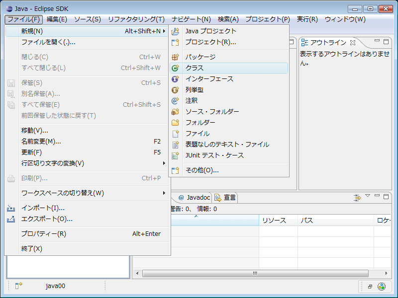

すると、以下のようなウィンドウが開きます。

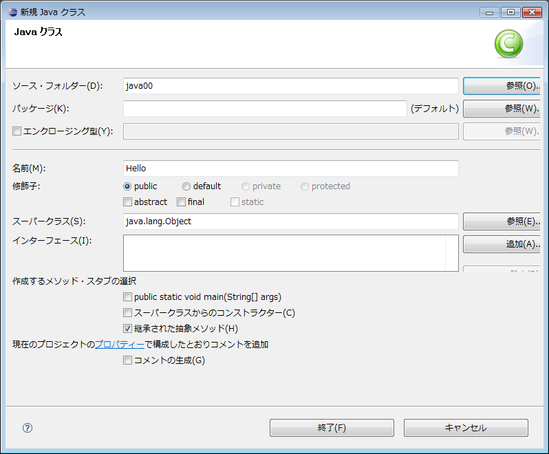

ここの "名前" には、クラス名を入力します。
そして [終了] をクリックします。

ビルドと実行
------------

### ビルド

[プロジェクト] - [プロジェクトのビルド] をクリックします。

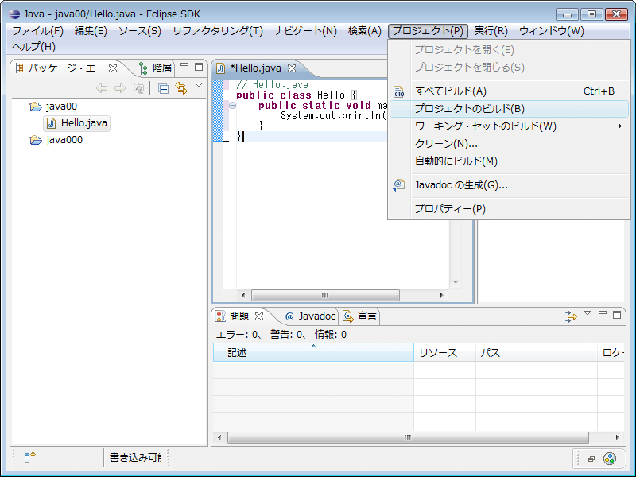

もし "自動的にビルド" にチェックが入っている場合は、はずしておきましょう。

何もエラーが出なければ、きちんとビルドされています。
構文にエラーがある場合はエディターエリアの右側にマーカーが表示されています。 
ここにカーソルをあわせると、詳細を見ることができます。

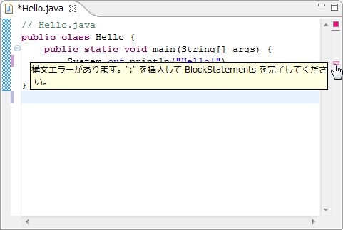

### 実行

[実行] - [実行] - [Javaアプリケーション] をクリックします。

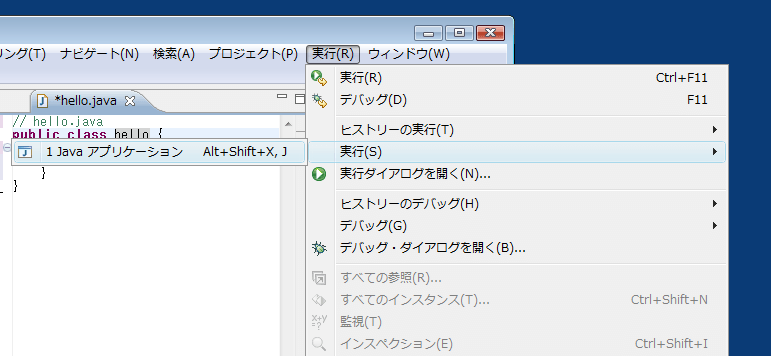

すると、コンソールに結果が表示されます。

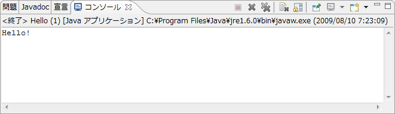

エラーが残っている場合は "問題" タブに表示されます。

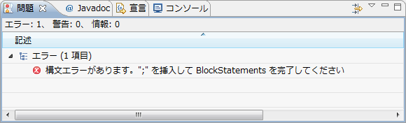

これをヒントにソースコードを修正してみましょう。
