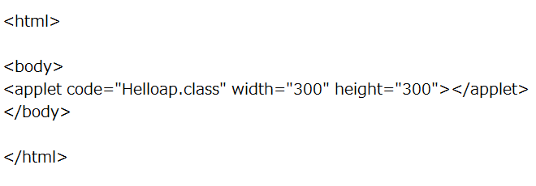
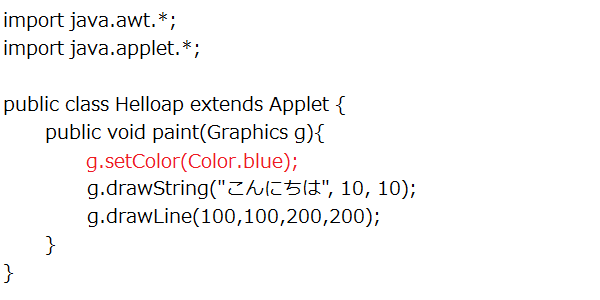

練習で使ったデータは必ず保存するようにしましょう

アプレットの基礎
--------------
### Javaアプレットの基本知識

Javaアプレットとは、Webブラウザなどに埋め込まれて実行されるJavaアプリケーションのことです。

### 文字を表示する

まず、以下のようなソースコードを打ち込み、コンパイルしてみましょう。

Helloap.java

次に、以下のようなhtmlファイルを作成します。

Helloap.html

今作成したhtmlファイルを適当なブラウザで開いてみましょう。もしくは、以下のようなコマンドを入力してください。

~~~~
appletviewer Helloap.html
~~~~
すると、画面に「こんにちは」と表示されているはずです。

では、プログラムの説明を簡単にしてみましょう。

最初の2行のimport文では、ユーザーインターフェースのパッケージawtと、アプレットの作成に必要なappletを読み込んでいます。

4行目を見てみましょう。

~~~~
public class Helloap extends Applet
~~~~

これは、クラスの*継承*というものです。

詳しくは説明しませんが、Appletというクラスを基にして新たなクラスHelloapを作っている、と思っておいてください。

アプレットはブラウザによってインスタンス化されて実行するため、外部から参照可能とするpublic修飾子が必要です。

また、プログラムよく見るとメインメソッドがないことに気がつくと思います。

アプレットの場合、ブラウザがメインメソッドと同じような働きをするため、メインメソッドは不要です。

### 直線を描画する

では、上のプログラムに1行追加してみましょう。

追加できたら、上と同様にコンパイルして実行しましょう。

Helloap.java

文字と共に直線が表示されましたね。

**直線を描画する**

~~~~
drawLine(始点のx座標, 始点のy座標, 終点のx座標, 終点のy座標);

例：
g.drawLine(10,10,20,20);
~~~~
**文字列を描画する**

~~~~
drawString(表示する文字列, x座標, y座標);

例：
g.drawString("こんにちは",10,10);
~~~~
これらのメソッドは、awtパッケージ内のGraphicsクラス内のメソッドです。他にも様々なものがあります。

それらについては、以下を参照してください。

主なGraphicクラスのメソッド

Oracle Technology Network for Java Developers（英語）

注意

アプレット内の座標とは、ウィンド左上を原点とし、右をx軸の正の向き、下をy軸の正の向きとしたものです。

### 色を変える

さらに、上のプログラムに1行追加してみましょう。

追加できたら、上と同様にコンパイルして実行しましょう。

Helloap.java

このようにして、色を変えることもできます。

**色を変える（１）**

~~~~
setColor(Color.色);

例：
g.setColor(Color.blue);
~~~~
**色を変える（２）**

~~~~
setColor(new Color(赤の値, 緑の値, 青の値));

例：
g.setColor(new Color(0,0,255));
~~~~
前の例でも分かるように、デフォルトでは黒です。

また、一度色を指定すると、他の色を変えるか、paint()メソッドが終了するまで、その色を用いて描画されます。

また、（１）の方法で色を指定する場合、以下のようなものが使えます。

Oracle Technology Network for Java Developers（英語）

練習問題
--------------
### 問題１

市松模様を描きましょう。クラス名は「Ichimatsu」とします。

### 問題２

drawLineを用いて、以下のような模様を書いてみましょう。クラス名は「Colorap」とします。

