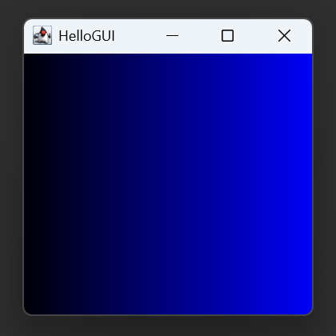

GUIプログラミングの基礎
----------------

### GUIプログラミングの基本知識

図形や画面などを表示でき、グラフィカルな出力を比較的簡単に表現できます。

Javaでデスクトップアプリを開発する際に使用される主要なGUI開発フレームワークには、以下の 3つをあげることができます。 
これらを用いると、GUIアプリを作成することができます。

1. **AWT (Abstract Windowing Toolkit)** 
   Javaで初期から提供されているGUIライブラリです。 
   軽量でシンプルなGUIを作ることができます。 
   シンプルで基本的なUIコンポーネント（ボタン、テキストフィールド）などを提供しますが、 高度なカスタマイズには向かず、機能が限られます。

2. **Swing** 
   AWTの上に構築された、よりモダンで柔軟なGUIフレームワークです。 
   軽量でカスタマイズ性が高く、 豊富なUIコンポーネントを提供（JTable、JTreeなど）しています。 
   また、プラットフォーム（OS）に依存しない統一されたUIであることも利点です。

3. **JavaFX**  
   Javaで最新のGUIアプリケーションを構築するためのフレームワークです。 
   2D/3Dグラフィックス、 アニメーション、ビデオ、WebビューなどのモダンなUIデザイン及び、リッチなマルチメディア機能をサポートしています。 
   反面、AWTやSwingに比べて初学者にはコーディングが難しいところがあります。

本授業では、この内、初学者がGUIを扱うにあたり初めの一歩となるよう、基本的なAWTを用いて学習を進めます。

### 文字を表示する

まず、以下のようなソースコードを打ち込み、コンパイルしてみましょう。

*HelloGUI.java* 

すると、画面に `こんにちは` と表示されているはずです。



では、プログラムの説明を簡単にしてみましょう。

まず、インポート文ですが、`java.awt`と`java.awt.event`は別のパッケージとなりますので、 2つとも記載する必要があります。

ウィンドウを表示させ描画するため、`Frame`クラスを使用します。つまり、`java.awt`パッケージの`Frame`クラスを拡張したクラス（ここでは`MyFrame`）を定義する必要があります。 このクラスを`main`メソッドの中で呼び出して、コンストラクタを使ってインスタンスを作成します。

 【`class MyFrame extends Frame` について】

- `setTitle("HelloGUI");`　→　ウィンドウのタイトルを「HelloGUI」と設定

- `setSize(600, 400);`　→　ウィンドウのサイズを設定

- `setVisible(true);`　→　ウィンドウの表示

- `addWindowListener(new WinListener());` 　→　ウィンドウに対して、処理が行えるようリスナーオブジェクトを登録する。 

 【`class WinListener extends WindowAdapter`について】

- `windowClosing`メソッド　→　ウィンドウがクローズ処理中であるときに呼び出される。クローズオペレーションはこのメソッドに記載。

- `System.exit`メソッド　→　実行中のJavaバーチャルマシンを終了する命令  

### 直線を描画する

では、上のプログラムに1行追加してみましょう。
追加できたら、上と同様にコンパイルして実行しましょう。

*HelloGUI.java* 

文字と共に直線が表示されましたね。

直線を描画する

    drawLine(始点のx座標, 始点のy座標, 終点のx座標, 終点のy座標);
    
    // 例
    g.drawLine(10,10,20,20);
文字列を描画する

    drawString(表示する文字列, x座標, y座標);
    
    // 例
    g.drawString("こんにちは",10,10);

これらのメソッドは、awtパッケージ内のGraphicsクラス内のメソッドです。他にも様々なものがあります。
それらについては、以下を参照してください。

参考資料 [主なGraphicクラスのメソッド](../../appendix/graphics.html)

ウィンドウ内の座標とは、左上を原点とし、右をx軸の正の向き、下をy軸の正の向きとしたものです。

### 色を変える

さらに、上のプログラムに1行追加してみましょう。
追加できたら、上と同様にコンパイルして実行しましょう。

*HelloGUI.java* 

このようにして、色を変えることもできます。

色を変える（１）

    setColor(Color.色);
    
    // 例
    g.setColor(Color.blue);

色を変える（２）

    setColor(new Color(赤の値, 緑の値, 青の値));
    
    // 例
    g.setColor(new Color(0,0,255));

前の例でも分かるように、デフォルトでは黒です。
また、一度色を指定すると、他の色に変えるか、`paint()` メソッドが終了するまで、その色を用いて描画されます。

（１）の方法で色を指定する場合、以下のようなものが使えます。

参考資料 [Color (Java Platform SE 8)](https://docs.oracle.com/javase/jp/8/docs/api/java/awt/Color.html)

練習問題
--------

### 問題１

市松模様を描きましょう。
クラス名は `DrawCheckedPatternGUI` とします。

### 問題２

`drawLine` を用いて、以下のようなグラデーション模様を書いてみましょう。
クラス名は `DrawGradationGUI` とします。

