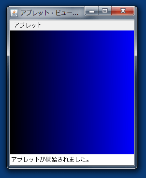

アプレットの基礎
----------------

### Javaアプレットの基本知識

Javaアプレットとは、Webページの一部に埋め込み実行できるJavaアプリケーションのことです。

### 文字を表示する

まず、以下のようなソースコードを打ち込み、コンパイルしてみましょう。

*HelloApplet.java* 

次に、以下のようなhtmlファイルを作成します。

*hello.html* 

今作成したhtmlファイルを、アプレットビューアで開きます。
以下のコマンドを入力してください。

    appletviewer hello.html

すると、画面に `こんにちは` と表示されているはずです。

では、プログラムの説明を簡単にしてみましょう。

最初の2行の `import` 文では、ユーザーインターフェースのパッケージ `awt` と、アプレットの作成に必要な `applet` を読み込んでいます。

4行目を見てみましょう。

    public class HelloApplet extends Applet

これは、クラスの **継承** というものです。
詳しくは説明しませんが、`Applet` というクラスを基にして新たなクラス `HelloApplet` を作っている、と思っておいてください。

アプレットはアプレット実行環境（アプレットビューア）によってインスタンス化されて実行するため、外部から参照可能とする `public` 修飾子が必要です。

また、プログラムをよく見るとメインメソッドがないことに気がつくと思います。
アプレットの場合、アプレット実行環境（アプレットビューア）がメインメソッドと同じような働きをするため、メインメソッドは不要です。

### 直線を描画する

では、上のプログラムに1行追加してみましょう。
追加できたら、上と同様にコンパイルして実行しましょう。

*HelloApplet.java* 

文字と共に直線が表示されましたね。

直線を描画する

    drawLine(始点のx座標, 始点のy座標, 終点のx座標, 終点のy座標);
    
    // 例
    g.drawLine(10,10,20,20);
文字列を描画する

    drawString(表示する文字列, x座標, y座標);
    
    // 例
    g.drawString("こんにちは",10,10);

これらのメソッドは、awtパッケージ内のGraphicsクラス内のメソッドです。他にも様々なものがあります。
それらについては、以下を参照してください。

参考資料 [主なGraphicクラスのメソッド](../../appendix/graphics.html)

参考資料 [Graphics (Java Platform SE 8)](https://docs.oracle.com/javase/jp/8/docs/api/java/awt/Graphics.html)

アプレット内の座標とは、ウィンド左上を原点とし、右をx軸の正の向き、下をy軸の正の向きとしたものです。

### 色を変える

さらに、上のプログラムに1行追加してみましょう。
追加できたら、上と同様にコンパイルして実行しましょう。

*HelloApplet.java* 

このようにして、色を変えることもできます。

色を変える（１）

    setColor(Color.色);
    
    // 例
    g.setColor(Color.blue);

色を変える（２）

    setColor(new Color(赤の値, 緑の値, 青の値));
    
    // 例
    g.setColor(new Color(0,0,255));

前の例でも分かるように、デフォルトでは黒です。
また、一度色を指定すると、他の色を変えるか、`paint()` メソッドが終了するまで、その色を用いて描画されます。

（１）の方法で色を指定する場合、以下のようなものが使えます。

参考資料 [Color (Java Platform SE 8)](https://docs.oracle.com/javase/jp/8/docs/api/java/awt/Color.html)

練習問題
--------

### 問題１

市松模様を描きましょう。
クラス名は `DrawCheckedPatternApplet` とします。

### 問題２

`drawLine` を用いて、以下のようなグラデーション模様を書いてみましょう。
クラス名は `DrawGradationApplet` とします。

