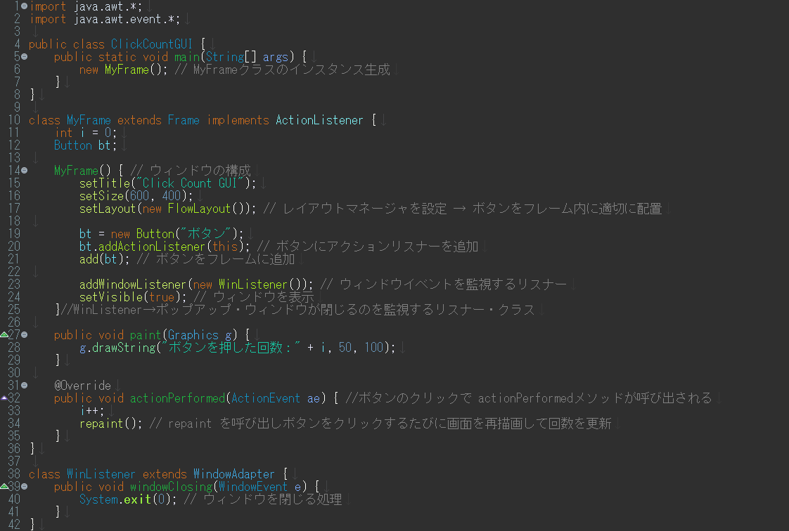
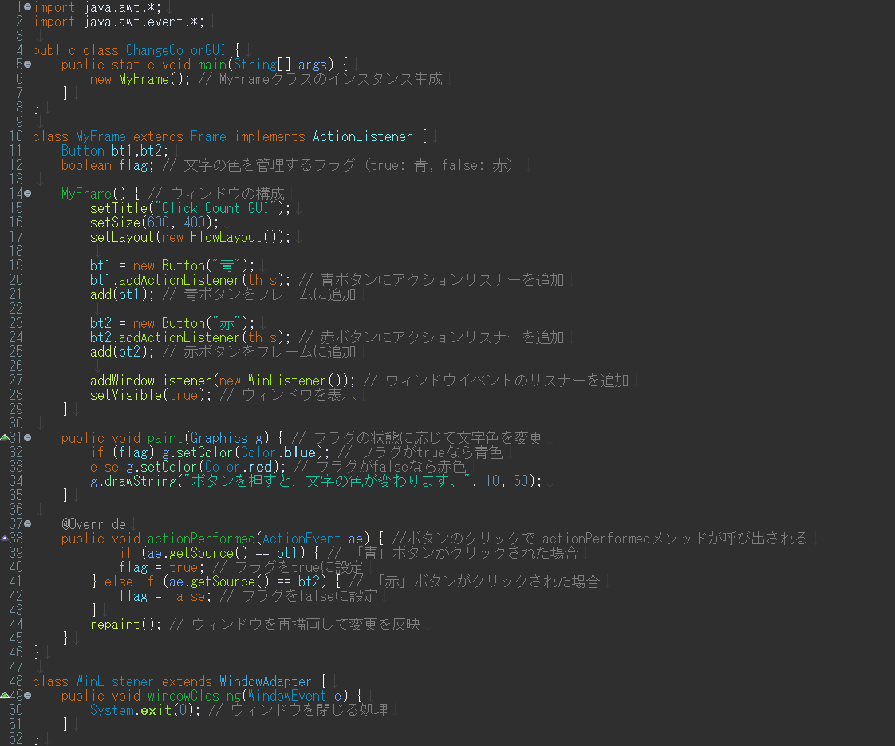
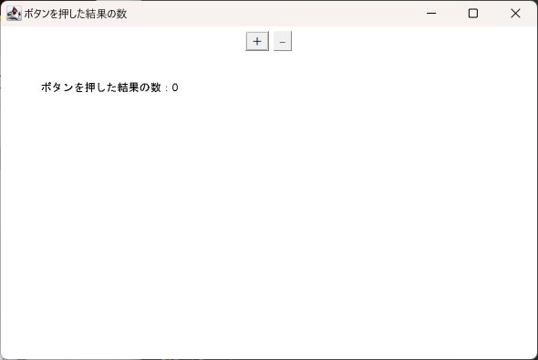

リスナーの追加
--------------

### ボタンの作成

次のようなプログラムを実行してみましょう。

*ClickCountGUI.java* 

**※Eclipseの場合**、最後まで書ききるまではエラーが表示され続けます。

ボタンを押した回数を表示するプログラムです。

上記プログラムでは、インタフェースの実装をしています。 
`ActionListener` を実装したら、必ず `actionPerformed()` メソッドを作成します。
これは、イベントが起きた場合に実行されるメソッドです。この場合、ボタンがクリックされた時にあたります。

`repaint()` は、もう一度 `paint()` を呼び出し再描画するコマンドです。
（正確には、`update()` が呼ばれ、その過程で `paint()` が呼ばれます）

### 複数のボタンを使う

それでは、以下のようなプログラムを実行してみましょう。

*ChangeColorGUI.java* 

`actionPerformed()` には、引数として `ActionEvent` というクラスのデータが**自動的に**渡されます。 
このデータは、何をクリックしたのか、またクリック時のマウスカーソルの座標など、便利な情報をたくさん持っています。

今回は、その `ActionEvent` 型データの変数を `ae` と名付け、`ae.getSource()` というメソッドを用いてどのボタンをクリックしたかの情報を取得しています。

練習問題
--------

### 問題１

上の `ClickCountGUI.java` に、押すと数を減らすボタンを追加しましょう。

### 問題２

３つのボタンを作成し、それぞれのボタンを押すと、三角形・四角形・円が表示されるプログラムを書きましょう。
クラス名は`DrawFigureGUI`とします。
