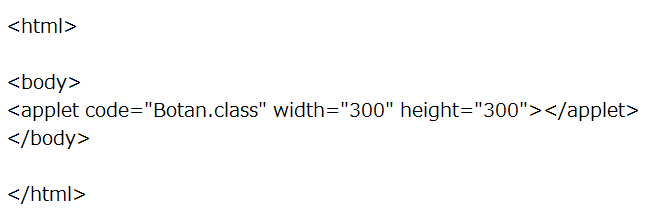

練習で使ったデータは必ず保存するようにしましょう

リスナーの追加
--------------

### ボタンの作成

次のようなプログラムを実行してみましょう。

Botan.java

Botan.html

ボタンを押した回数を表示するだけのプログラムです。

では、プログラムを少し細かく見ていきましょう。

まず、5行目を見てみましょう。

    public class Botan extends Applet implements ActionListener

これは、インタフェースの実装と呼ばれるものです。
ActionListenerは、ボタンが押された等のイベントを監視するものです。

次に、クラスBotanにあるメソッドを見てきましょう。

    public void init() {
    	bt = new Button("ボタン");		//ボタンクラスのインスタンスの生成
    	this.add(bt);				//アプレットにボタンを追加する
    	bt.addActionListener(this);		//ボタンをリスナーに追加
    }

このメソッドinit()は、初期化のためのメソッドです。ライフタイムの1つです。

この他に、stop(),start(),destroy()等があります。すべてオーバーライドして用います。

次に、19行目以降を見てみましょう。

    public void actionPerformed(ActionEvent ae) {
    	i++;
    	repaint();	//paint()を呼び出して再描画する
    }

ActionListenerを実装したら、必ずこのメソッドは必要です。

これは、イベントが起きた場合に実行されるメソッドです。この場合、ボタンがクリックされた時にあたります。

repaint()は、もう一度paint()を呼び出し再描画するコマンドです。
（正確には、update()が呼ばれ、その過程でpaint()が呼ばれます）

### 複数のボタンを使う

それでは、以下のようなプログラムを実行してみましょう。

htmlファイルは上の例を参考に自分で作成してみましょう。

Botan2.java

ボタンが複数ある場合、getSource()を用いて、どのボタンが押されたかを認識します。

練習問題
--------------

### 問題１

上のBotan.javaに、押すと数を減らすボタンを追加しましょう。

### 問題２

３つのボタンを作成し、それぞれのボタンを押すと、三角形・四角形・円が表示されるプログラムを書きましょう。

クラス名は`Zukei_select`とします。
