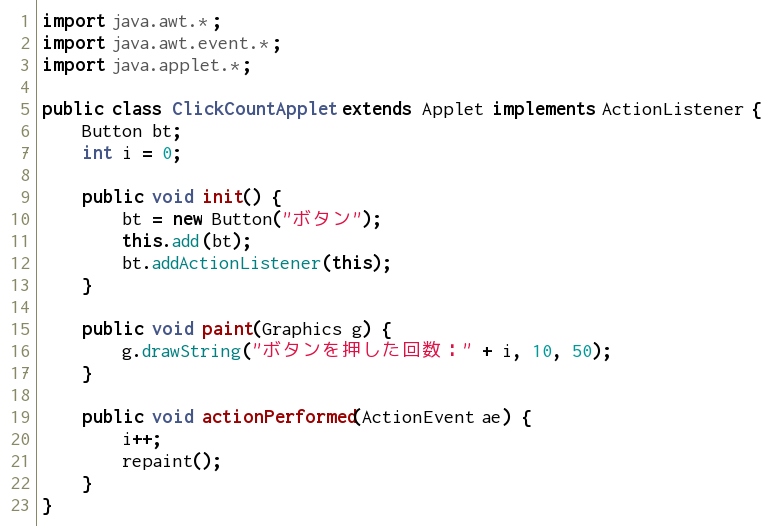
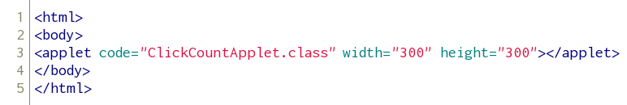

リスナーの追加
--------------

### ボタンの作成

次のようなプログラムを実行してみましょう。

*ClickCountApplet.java* 

*click_count.html* 

ボタンを押した回数を表示するだけのプログラムです。

では、プログラムを少し細かく見ていきましょう。

まず、5行目を見てみましょう。

    public class ClickCountApplet extends Applet implements ActionListener

これは、インタフェースの実装と呼ばれるものです。
`ActionListener` は、ボタンが押された等のイベントを監視するものです。

次に、クラス `ClickCountApplet` にあるメソッドを見てきましょう。

    public void init() {
    	bt = new Button("ボタン");		//ボタンクラスのインスタンスの生成
    	this.add(bt);				    //アプレットにボタンを追加する
    	bt.addActionListener(this);		//ボタンをリスナーに追加
    }

このメソッド `init()` は、初期化のためのメソッドです。ライフタイムの1つです。
この他に、`stop()`, `start()`, `destroy()` 等があります。すべてオーバーライドして用います。

次に、19行目以降を見てみましょう。

    public void actionPerformed(ActionEvent ae) {
    	i++;
    	repaint();	//paint()を呼び出して再描画する
    }

`ActionListener` を実装したら、必ずこのメソッドを作成します。
これは、イベントが起きた場合に実行されるメソッドです。この場合、ボタンがクリックされた時にあたります。

`repaint()` は、もう一度paint()を呼び出し再描画するコマンドです。
（正確には、`update()` が呼ばれ、その過程で `paint()` が呼ばれます）

### 複数のボタンを使う

それでは、以下のようなプログラムを実行してみましょう。
htmlファイルは上の例を参考に自分で作成してみましょう。

*ChangeColorApplet.java* 

ボタンが複数ある場合、`getSource()` を用いて、どのボタンが押されたかを認識します。

練習問題
--------

### 問題１

上の `ClickCountApplet.java` に、押すと数を減らすボタンを追加しましょう。

### 問題２

３つのボタンを作成し、それぞれのボタンを押すと、三角形・四角形・円が表示されるプログラムを書きましょう。
クラス名は`DrawFigureApplet`とします。
