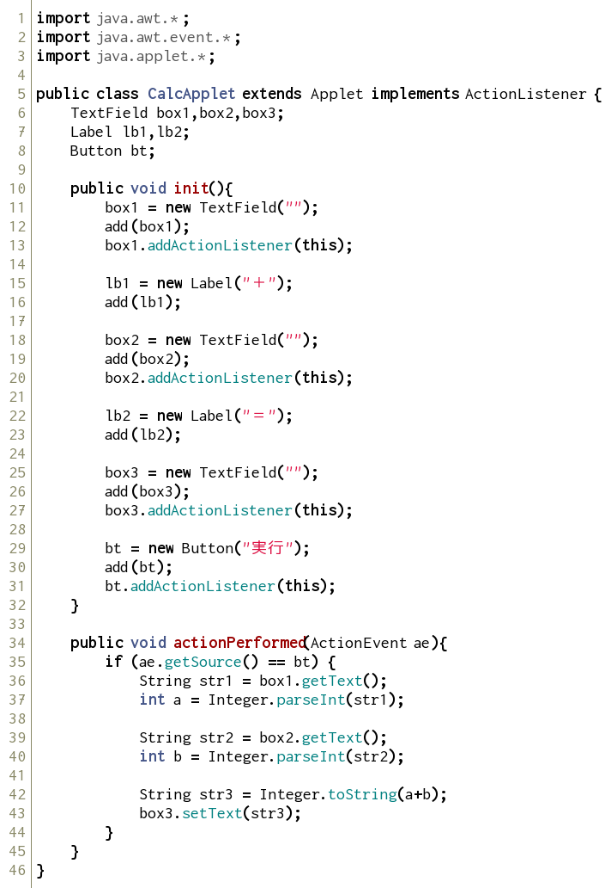
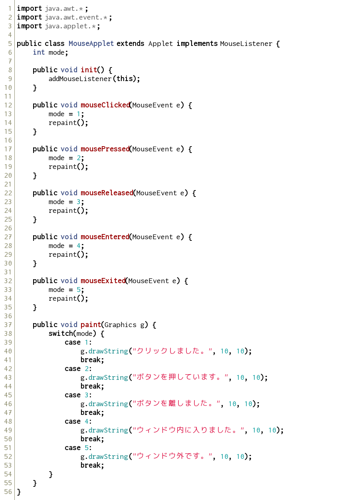
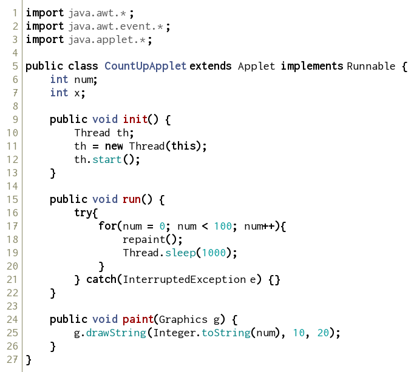

練習で使ったデータは必ず保存するようにしましょう

さまざまな部品とリスナー
--------------

### テキストボックスとラベル

前回と同様に、ソースコードを打ち込み、実行してみましょう。

htmlファイルは自分で作成してください。

CalcApplet.java

左の2つのテキストボックスに数字を入力しボタンをクリックすると、その和が表示されます。

この他にもawtでは様々な部品を用いることができます。

### マウスリスナー

以下のソースコードを入力・実行し、マウスをいろいろと操作してみましょう。

MouseApplet.java

このように、マウスの動きを捉えるリスナーもあります。

awtには他にもいろいろなものが用意されています。

アニメーション
--------------

### スレッドを用いたアニメーション

ソースコードを打ち込み、実行してみましょう。

CountUpApplet.java

練習問題
--------------

### 問題１

半径を入力すると、その大きさの円を書くプログラムを書きましょう。
クラス名は、`DrawCircleApplet`とします。

### 問題２

上の問題１のプログラムを、クリックした場所を中心とする円を描くプログラムになるように改良しましょう。
クラス名は、`DrawCircleWithClickApplet`とします。

座標は、getX()、getY()で得ることができます。
