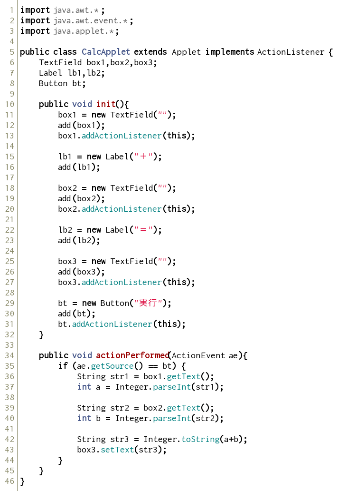
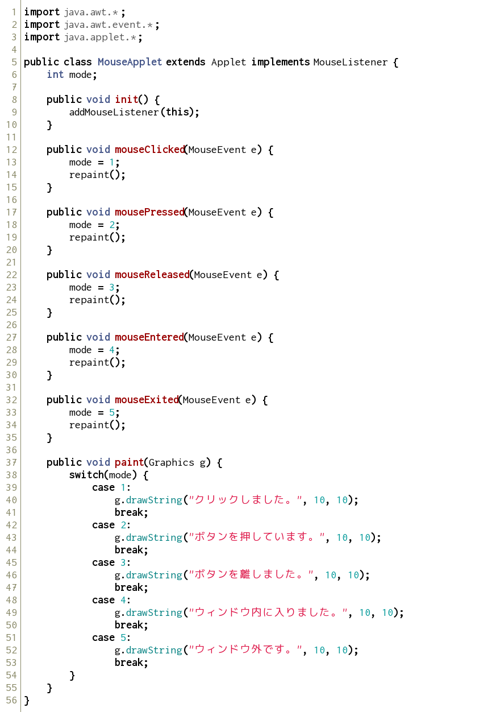
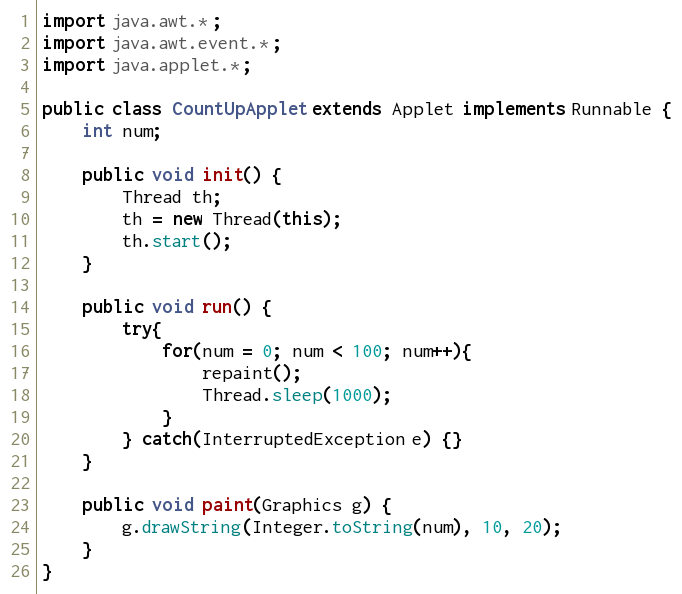

さまざまな部品とリスナー
------------------------

### テキストボックスとラベル

前回と同様に、ソースコードを打ち込み、実行してみましょう。
htmlファイルは省略します。

*CalcApplet.java* 

左の2つのテキストボックスに数字を入力しボタンをクリックすると、その和が表示されます。

この他にもawtでは様々な部品を用いることができます。

### マウスリスナー

以下のソースコードを入力・実行し、マウスをいろいろと操作してみましょう。

*MouseApplet.java* 

`mouseClicked` や `mousePressed` など、特定の名前のメソッドを記述することで、このような柔軟な対応が可能になります。

また、`(MouseEvent e)` というのは、マウス系のメソッドに**自動的に**渡される引数です。これはMouseEventクラスの変数で、今回は `e` と名付けているという意味です。 
この引数は、クリックした座標などの便利なデータを持っています。

アニメーション
--------------

### スレッドを用いたアニメーション

ソースコードを打ち込み、実行してみましょう。

*CountUpApplet.java* 

Threadを利用することで、`run()` メソッドが高速で繰り返されるようになります。

Threadでは、処理を途中で止めて少し待つなどといった動作が容易です。 
`Thread.sleep(1000)` で1000ミリ秒間＝1秒間 動きを止めています。

※ `try{}catch(){}` は、tryの中身の実行に挑戦し、もし失敗したらcatchの中身に移動するという構文です。

課題
--------

### 課題 １

半径を入力すると、その大きさの円を書くプログラムを書きましょう。
クラス名は、`DrawCircleApplet` とします。

### 課題 ２

上の問題１のプログラムを、クリックした場所を中心とする円を描くプログラムになるように改良しましょう。
クラス名は、`DrawCircleWithClickApplet`とします。

**ヒント** 
座標は、`MouseEvent` のインスタンス・メソッド `getX()`, `getY()` で得ることができます。 
例として、引数に(MouseEvent e)と記述した場合、 `e.getX()` がマウスカーソルのX座標になります。

参考資料 [MouseEvent (Java Platform SE 8)](https://docs.oracle.com/javase/jp/8/docs/api/java/awt/event/MouseEvent.html)
