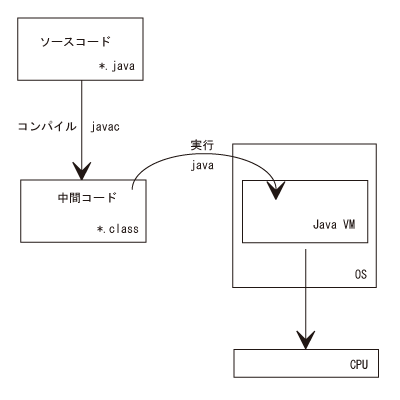
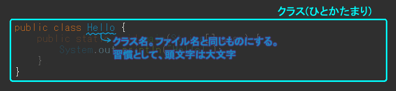
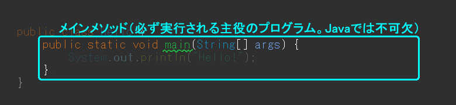
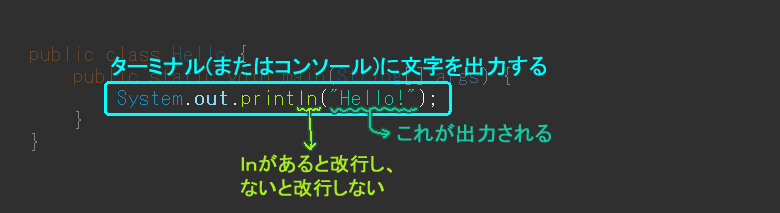

情報倫理講習会
--------------

担当教員の指示に従って受講し、終了後は「テスト/アンケート」より、情リテ情報倫理テストを受験してください。

*   [情報倫理講習会資料](/lit/infoethics/information_ethics_ja.pdf)
*   [情報倫理講習会資料(英語版)](/lit/infoethics/information_ethics_en.pdf)

Javaを実行できる環境の準備
--------------

Javaでプログラミングを行う場合、OSがWindowsのパソコンを利用することを仮定しています。
タブレットやMacOSでもプログラミングを学習することはできますが、機種やOSによって手順・内容が変わる可能性がありますので、もしトラブルが生じたら授業担当者にご相談ください。
なお、スマートフォンでもプログラミングをすることは出来ますが、**推奨しません**。

以下に、みなさんのパソコンでプログラミングをするために必要な準備を記載します。
プログラミングを行う場合はインターネット上で無料で使えるサービス（オンライン実行環境）を利用する、ソフトウェアをパソコンにインストールする、のいずれかを行う必要があります。
もしインターネットを常に利用できるなら、オンライン実行環境を使えばすぐにプログラミングを行えます。
もしインターネットへの接続が無くてもプログラミングをしたい場合にはソフトウェアをインストールしてください。

### オンライン実行環境
[paiza.IO](https://paiza.io/ja)は無料でプログラムをすぐに実行できる環境を提供しているサービスです。

無料でプログラミングをインターネット上でできる同様のサービスとして[ideone](https://ideone.com/)もあります。
サービスごとに実行できるプログラミング言語が異なりますので、学習したいプログラミング言語に合わせてサービスを選んでください。

### ソフトウェアのインストール
1. EclipseをPleiadesのサイトからダウンロード

    PleiadesのWebサイト[https://willbrains.jp/](https://willbrains.jp/)にアクセスし、「Eclipse 2023」を選択します。

    

    次に使用しているOSを確かめ、 Java列のダウンロードボタンをクリックします。
     ※ファイルサイズは約1GBで、ダウンロードに10分程度かかります。

    

    次に、ダウンロードしたファイルをダブルクリックします。
     少し待つと、以下のようなウィンドウが表示されます。

    

    解凍する場所を変えたい場合のみ [参照] から編集します。ショートカットなどは作成されないため、必要であれば場所を覚えておきましょう。
     準備ができたら [解凍] をクリックします。
     ※解凍には数分かかります。

    解凍が終わったら、解凍されたフォルダを開き、 [eclipse] フォルダ内にがあることを確認します。
     初期設定では`C:\pleiades\2023-12\eclipse`にあります。

2. Eclipseの起動

    をダブルクリック、または検索バーを使い、eclipse.exeを起動します。

    **自宅のPC**の場合は、最初に次のような画面が表示されます。

    

    ワークスペースとは、Eclipseの設定に関するファイルや、今後みなさんが作成するjavaファイルが収納される場所のことです。
     初期設定の`../workspace`では  [eclipse] フォルダの隣となっています。分かりにくければ変更しても良いでしょう。

    ※**学内PC**の場合は`H:\eclipse2023-12\workspace`に自動で作成されます。**誤って削除しないよう注意しましょう。**

    ワークスペースを指定したら、 [起動] をクリックします。

    Eclipseが起動すると次の画面が表示されます。

    

3. Eclipseの画面構成

    Eclipseの画面は「ビュー」と「エディタ領域」から構成されています。表示されているタブのことをビュー、白紙の領域をエディタ領域といいます。

    これらの配置などをまとめて**パースペクティブ**と呼びます。

    

    パースペクティブをJavaプログラミングに適したものにします。
     ウインドウ右上にある をクリックし、「パースペクティブを開く」ダイアログからJavaを選択し、開くをクリックするとパースペクティブが切り替わります。

    

    ビューを追加する場合は、ウィンドウ > ビューの表示 から追加したいビューをクリックします。
     削除する場合はそれぞれの削除したいビュータブの上にある×をクリックします。

    

### プロジェクトファイルの作成と実行
1. プロジェクトの作成

    プロジェクトファイルを作成します。ファイル > 新規 > Javaプロジェクト の順にクリックします。

    

    新規Javaプロジェクトのダイアログが表示されます。
     「プロジェクト名」に任意の名前を入力し、「module-info.java ファイルの作成」のチェックが外れていることを確認し、 [完了] をクリックします。

    

    「パッケージ・エクスプローラー」ビューに作成したプロジェクトが表示されます。

2. クラスファイルの作成

    Javaのソースコードを作成します。Javaのソースコードはクラスファイルという形式です。
     先ほど作成したプロジェクトフォルダを右クリックし、新規 > クラス を選択します。

    
    
    「新規Javaクラス」ダイアログが表示されます。
     「名前」の部分に任意のクラス名を入力して [完了] をクリックします。

    

    画面左のビューで、プロジェクトフォルダ > src > プロジェクト名のパッケージ > javaファイル という階層ができていることを確認します。
     これで準備完了です。画面右のエディタにソースコードを入力していきます。

    

3. クラスファイルの実行

    ソースコードの入力が完了したら、ウィンドウ左上のをクリックしてプログラムを実行できます。
     コンソールビューに標準出力の結果が表示されます。

### 参考サイト
  - [Eclipse、はじめの一歩 - インストールから便利な日本語化プラグインの導入まで](https://en-ambi.com/itcontents/entry/2020/03/19/103000/)

最も基本的なプログラム
----------------------

### Hello.java

上記の通り、JavaのコードはEclipseで実行することができますが、実はコマンドプロンプト（ターミナル）でも実行することができます。ここではその方法を紹介します。

以下のソースコードを、適当なエディタを用いて入力してみましょう。すべて**半角英数で入力**してください。

*Hello.java*

    public class Hello {
    	public static void main(String[] args) {
    		System.out.println("Hello!");
    	}
    }

ファイル名は、**Hello.java**とし、**マイドキュメント**に保存してください。
 次に、コマンドプロンプト（ターミナル）を起動しましょう。そして、次のように入力します。

    javac Hello.java

うまくいくと、自動的に改行され、再度コマンド入力ができるようになります。



次は以下のように入力します。

    java Hello

うまくいくと、以下のように表示されます。

    Hello!
    


文字化けする場合、以下を参照してください。

参考資料 [コンパイルと実行 文字化けする場合](../../appendix/win_javac.html#chapter4)

コマンドプロンプト・ターミナルの詳しい使い方は以下を参照してください。

参考資料 [コマンドプロンプトの使い方](../../../common/appendix/win_cmd_prompt.html)

参考資料 [ターミナルの使い方](../../../common/appendix/mac_terminal.html)

Java言語の基本
--------------

### Java言語とは

Javaは、サン・マイクロシステムズによって開発された、プログラミング言語の一つです。
オブジェクト指向プログラミング言語の一種であり、プラットフォームに依存しないという特徴を持っています。
アプリケーションはもちろん、Webサービスや携帯電話等でも使われています。
サン・マイクロシステムズは、2010年1月27日にオラクルジャパンにより買収されました。

### Java言語の簡単な仕組み

Java言語は、作成したソースコードをコンパイルし、中間コード（バイトコード）を作成します。
その中間コードをJavaVM (Java Virtual Machine)によってインタプリタ型言語として実行されています。
JavaVMを用いることにより、どの環境でもほぼ同様の実行結果を得ることができます。
C言語などのコンパイル型言語と比較すると、Java言語等のインタプリタ型言語は
逐次機械語に翻訳しながら実行されるので、実行速度は遅くなります。

<dl>
<dt>コンパイル</dt>
<dd>ソースコードを、コンピュータが直接実行可能な機械語に翻訳する操作のこと。
この操作を行うソフトウェアの事を<strong>コンパイラ</strong>という。</dd>
<dt>JavaVM (Java Virtual Machine)</dt>
<dd>Java言語を実行するための環境のこと。
これを各環境に移植することにより、すべての環境で同じ動作をさせることができる。</dd>
<dt>インタプリタ</dt>
<dd>ソースコードを逐次機械語に翻訳しながら実行するソフトウェアのこと。</dd>
</dl>

Hello.javaの解説 - コンパイルから実行まで
-----------------------------------------

### javac

ソースコードを入力・保存したあと、次のようなコマンドを実行しました。

    javac Hello.java

この `javac` が、**コンパイル**するためのコマンドです。
これにより、中間コードの `Hello.class` が作成されます。

### java

コンパイル後、次のコマンドを実行しました。

    java Hello

これは、コンパイルで作成された中間コード `Hello.class` を実行しています。

Hello.javaの解説 - ソースコード
-------------------------------

### class

さて、先ほど作成した `Hello.java` を見てみましょう。

１行目の `public class Hello` は、**クラス**と呼ばれるものです。ひとまず**プログラムの大きなかたまり**だと考えてください。

クラス名は**ファイル名と同じ**ものにしましょう。この理由も後々わかるかと思います。

また、習慣として**クラス名の頭文字は大文字**にしています。

### main()

２行目は、`public static void main(String[] args)` となっています。
この**main**と書かれた部分が**メインメソッド**と呼ばれる部分です。

プログラムを実行すると、この後の中括弧 `{ }` の中に書かれていることが**必ず実行**されます。

Javaプログラミングでは、このメインメソッドが**必要**です。プログラムの最も大事な部分になります。

### System.out.println()

３行目の`System.out.println("Hello")` は、「ターミナルに文字を出力せよ」という命令です。

ですから `java` コマンドで実行すると、ターミナルに "Hello." と表示されます。よく使うので覚えておきましょう。

`ln` を除くと（つまり、`System.out.println()` を `System.out.print()` とすると）改行をしません。
`ln` を除いたものも実行してみましょう。

練習問題
--------

`System.out.println("Hello")` を `System.out.print("Hello")` に書き換え、動作の違いを確認してみましょう。
また、`System.out.println("Hello")` を参考に、別の文字列を出力させてみましょう。
