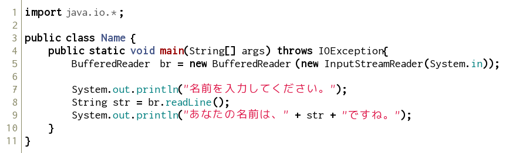
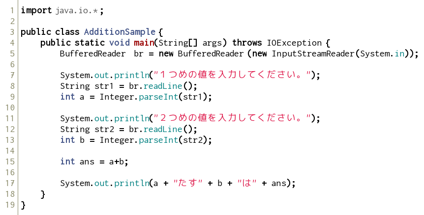
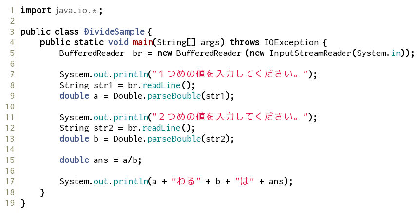
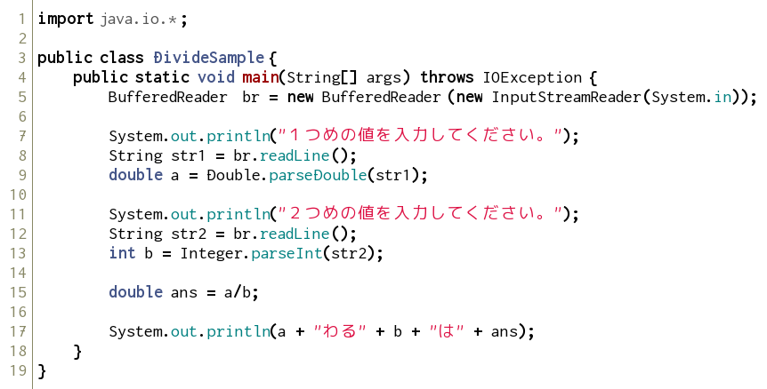
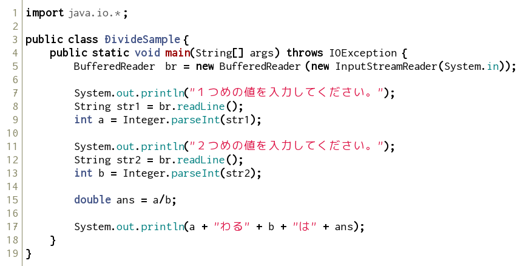

見やすいソースコードの書き方
----------------------------

見やすい・分かりやすいソースコードを書く癖をつけましょう。
見やすく・分かりやすいソースコードは、単純なミスを防げるだけでなく、プログラムの流れを直感的に捉えやすくなります。
これは、長いコードになればなるほど重要になってきます。

参考資料 [見やすいソースコードの書き方](../../appendix/coding_tips.html)

キーボードからの入力
--------------------

### 文字列の入力

以下のソースコードを打ち込み、コンパイルして実行してみましょう。

*Name.java*

実行すると、以下のようになります。

    名前を入力してください。

ここで、キーボードから何か入力し、リターンキーを打ちます。
この例では、`首都大`と入力しました。

実行結果

    名前を入力してください。
    首都大
    あなたの名前は、首都大ですね。

入力した文字列を出力することができました。

### 数値の入力

次に、数値の入力をしてみましょう。

*AdditionSample.java*

入力できたら、コンパイルして実行してみましょう。
ここでは、`5` と `7` を入力しました。

実行結果

    １つめの値を入力してください。
    5
    ２つめの値を入力してください。
    7
    5たす7は12

2つの値を入力すると、それの和が表示されるプログラムです。

### プログラムの簡単な解説

非常に簡単ですが、プログラムのポイントを説明します。

<dl>
<dt>8行目 String str1 = br.readLine();</dt>
<dd>キーボードから入力されたものを、文字列型（`String` 型）として取得。</dd>
<dt>9行目 int a = Integer.parseInt(str1);</dt>
<dd>文字列を、整数型（`int` 型）に変換。</dd>
</dl>

ここの内容をきちんと理解するには、Java言語のことを深くまで理解する必要があります。
もう少し詳しく知りたい場合は、以下を参照してください。

参考資料 [AdditionSample.javaの解説](../../appendix/addition_sample.html)

型変換とキャスト演算子
----------------------

### 型変換

次のようなプログラムを考えてみましょう。前のソースコードを少し改良しただけです。

*DivideSample.java*

このプログラムは、入力した２つの値の商を求めるプログラムです。
いろいろな値を入れて計算してみましょう。

それでは、次の場合を考えてみましょう。

実行結果

    １つめの値を入力してください。
    5
    ２つめの値を入力してください。
    2
    5わる2は2

もちろんこの答えは正しいのですが、答えを `2.5` と返してほしいときはどうすればよいのでしょうか。
それでは、以下のようにプログラムを改良してみましょう。

*DivideSample.java*

変数`a`, `b`, `ans` を `double` 型で宣言するよう変更しました。この `double` 型は、小数を含む計算する場合に用いられる変数型です。
よって、先ほどのように `5` と `2` を入力すると、`2.5` という答えが返ってきます。

次に、以下のように改良してみましょう。

*DivideSample.java*

変数 `b` を `int` 型にし、他の変数 `a`, `ans` は `double` 型です。`int` は整数を扱う場合に用いる変数型です。
この場合も、`2.5` という答えが返ってきます。
これは、１つの数式で、異なる型が使われた場合、**より大きな型**のサイズに合わせて計算するという決まりがあるからです。

基本データ型の大きさ

    double > float > long > int > short > byte

上の表を見れば分かるように、`ans` の値（つまり、`a/b` ）は、`double/int` であるので、`double` 型に統一されて計算されます。
よって、この場合でも `2.5` という答えが返ってきます。

### キャスト

では、次のように改良してみましょう。

*DivideSample.java*

今度は、変数 `ans` に代入する式に、 `(double)` が付け加わっています。
この場合も、`5` と `2` を入力すると、`2.5` が表示されます。

この `(double)` を **キャスト演算子** といい、強制的に型変換を行うことができます。

キャスト演算子

    (変数型)

より大きな型への変換だけではなく、小さな型へも変換ができます。
その場合、保存されているデータの一部が失われ、値が変わってしまうこともあります。

このソースコードの15行目 `double ans = (double) a / b` から、キャスト演算子を取り除くと（つまり、`double ans = a / b`）計算結果はどのように変化する、あるいは変化しないでしょうか。またそれはなぜでしょう。

練習問題
--------

### 問題１

上の `DivideSample.java` を改良して、以下のような結果を出力するプログラムを書いてみましょう。クラス名は `Calc` とします。

実行結果

    １つめの値を入力してください。
    5
    ２つめの値を入力してください。
    2
    5 + 2 = 7
    5 - 2 = 3
    5 * 2 = 10
    5 / 2 = 2 あまり 1

### 問題２

三角形の底辺と高さの値を入力することで、その三角形の面積を計算するプログラムを作りましょう。クラス名は `Triangle` とします。

実行結果

    三角形の底辺と高さの値を入力してください。
    5
    3
    三角形の面積は、7.5です。
