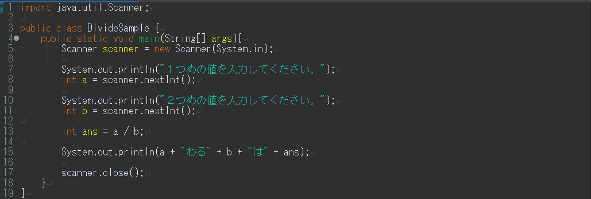
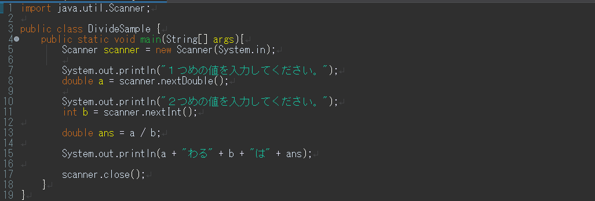
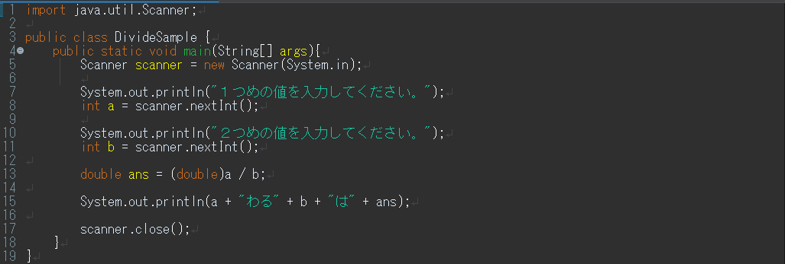

見やすいソースコードの書き方
----------------------------

見やすい・分かりやすいソースコードを書く癖をつけましょう。
見やすく・分かりやすいソースコードは、単純なミスを防げるだけでなく、プログラムの流れを直感的に捉えやすくなります。
これは、長いコードになればなるほど重要になってきます。

参考資料 [見やすいソースコードの書き方](../../appendix/coding_tips.html)

キーボードからの入力
--------------------

### 文字列の入力

以下のソースコードを打ち込み、コンパイルして実行してみましょう。

*Name.java* 

 

**※Eclipseを使っている場合**

- ソースコードの一行目に`package パッケージ名;`が自動で追加されます。削除せず、そのままにしておきましょう。

 

実行すると、以下のように表示されます。

    名前を入力してください。

Eclipseの場合は、一度下のコンソールビューをクリックします。
 それからキーボードで何か入力し、リターンキーを打ちます。
 この例では、`都立大`と入力しました。

*実行結果*

    名前を入力してください。
    都立大
    あなたの名前は、都立大ですね。

入力した文字列を出力することができました。

文字列の入力に関するプログラムを理解するには、後の章の「クラスとメソッド」を学習する必要がありますが、今後、以下のソースコードが繰り返し出てきますので、ここで解説しておきます。何となく文字列の入力の流れが分かったという程度で大丈夫です。

 この行では、java.util パッケージから Scanner クラスをインポートしています。Scannerはユーザー入力を受け取るために使用されます。すなわち、コンソールから文字列を入力することができるようにするための部品（Scanner）を入手しているイメージです。

 Scanner クラスのインスタンス（実態）を作成して、コンソールからの標準入力（System.in）を読み込んだ上で、Scanner クラスのオブジェクト変数である scanner に格納しています。

 ユーザーが入力した 1 行の文字列を読み取り、String クラスのオブジェクト変数であるstr に格納します。したがって、str の中には入力した文字列が入っています。

 使い終わった Scanner オブジェクトを閉じます。これはリソースの適切な管理のために大事なことです。

### 数値の入力

次に、数値の入力をしてみましょう。

*AdditionSample.java* 

入力できたら、コンパイルして実行してみましょう。
ここでは、`5` と `7` を入力しました。

*実行結果*

    １つめの値を入力してください。
    5
    ２つめの値を入力してください。
    7
    5たす7は12

2つの値を入力すると、それの和が表示されるプログラムです。

新しく出てきた Scanner クラスのメソッドについて説明をします。

 ユーザーが入力したデータを整数値として読み取り、int 型の変数 a に格納します。

 ユーザーが入力したデータを整数値として読み取り、int 型の変数 b に格納します。

様々なデータ型とキャスト演算子
----------------------

### 様々なデータ型

次のようなプログラムを考えてみましょう。前のソースコードを少し改良しただけです。

*DivideSample.java* 

このプログラムは、入力した２つの値の商を求めるプログラムです。
いろいろな値を入れて計算してみましょう。

それでは、次の場合を考えてみましょう。

*実行結果*

    １つめの値を入力してください。
    5
    ２つめの値を入力してください。
    2
    5わる2は2

もちろんこの答えは正しいのですが、答えを `2.5` と返してほしいときはどうすればよいのでしょうか。 
それでは、以下のようにプログラムを改良してみましょう。

*DivideSample.java* 

変数`a`, `b`, `ans` を `double` 型で宣言するよう変更しました。この `double` 型は、小数を含む計算する場合に用いられる変数型です。 
よって、先ほどのように `5` と `2` を入力すると、`2.5` という答えが返ってきます。

*実行結果*

    １つめの値を入力してください。
    5
    ２つめの値を入力してください。
    2
    5.0わる2.0は2.5

 ユーザーが入力したデータを小数として読み取り、double 型の変数 a に格納します。

 ユーザーが入力したデータを小数として読み取り、double 型の変数 b に格納します。

次に、以下のように改変してみましょう。

*DivideSample.java* 

変数 `b` だけを `int` 型に戻してみました。`int` は整数のデータ型ですが、この場合も、`2.5` という答えが返ってきます。 
これは、１つの数式で、異なる型が使われた場合、**より大きな型**のサイズに合わせて計算するという決まりがあるからです。

基本データ型の大きさ

    double > float > long > int > short > byte

先ほどの例では、`double/int` の形だったため、`double` 型に統一されて計算されます。 
よって、この場合でも `2.5` という答えが返ってきます。

### キャスト

では、次のように改良してみましょう。

*DivideSample.java* 

今度は、変数 `ans` に代入する式に、 `(double)` が付け加わっています。
この場合も、`5` と `2` を入力すると、`2.5` が表示されます。

*実行結果*

    １つめの値を入力してください。
    5
    ２つめの値を入力してください。
    2
    5わる2は2.5

この `(double)` を **キャスト演算子** といい、強制的に型変換を行うことができます。

キャスト演算子

    (変数型)

より大きな型への変換だけではなく、小さな型へも変換ができます。
その場合、保存されているデータの一部が失われ、値が変わってしまうこともあります。

このソースコードの15行目 `double ans = (double) a / b` からキャスト演算子を取り除き、`double ans = a / b`とすると、計算結果はどのようになるでしょうか。またそれはなぜでしょう。

 
これまで Scanner クラスの nextLine や nextDouble というメソッドが出てきましたが、Scanner クラスのメソッドの一部について用途を下の表にまとめます。これらメソッドを使うと様々な入力データに対応することができます。

| メソッド | 使い方 |
| -- | -- |
| Next | スペースもしくは改行文字までのデータを取得 |
| nextLine | 改行文字（Enterキー）までの１行のデータを取得 |
| nextInt | 整数のデータを取得 |
| nextDouble | 小数点を含む数値のデータを取得 |
| nextBoolean | 真偽型のデータを取得 |

練習問題
--------

### 問題１

上の `DivideSample.java` を改良して、以下のような結果を出力するプログラムを書いてみましょう。クラス名は `Calc` とします。

*実行結果*

    １つめの値を入力してください。
    5
    ２つめの値を入力してください。
    2
    5 + 2 = 7
    5 - 2 = 3
    5 * 2 = 10
    5 / 2 = 2 あまり 1

### 問題２

三角形の底辺と高さの値を入力することで、その三角形の面積を計算するプログラムを作りましょう。クラス名は `Triangle` とします。

*実行結果*

    三角形の底辺と高さの値を入力してください。
    5
    3
    三角形の面積は、7.5です。
