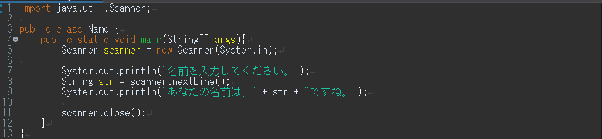

練習で使ったデータは必ず保存するようにしましょう

見やすいソースコードの書き方
--------------

見やすい・分かりやすいソースコードを書く癖をつけましょう。
見やすく・分かりやすいソースコードは、単純なミスを防げるだけでなく、プログラムの流れを直感的に捉えやすくなります。これは、長いコードになればなるほど重要になってきます。

<a href="goodsource.html" target="_blank">見やすいソースコードの書き方</a>

キーボードからの入力
--------------

### 文字列の入力

以下のソースコードを打ち込み、コンパイルして実行してみましょう。

Name.java

実行すると、以下のようになります。

~~~~
名前を入力してください。
~~~~

ここで、キーボードから何か入力し、リターンキーを打ちます。
この例では、「首都大」と入力しました。

実行結果

~~~~
名前を入力してください。
首都大
あなたの名前は、首都大ですね。
~~~~

入力した文字列を出力することができました。

### 数値の入力
次に、数値の入力をしてみましょう。

Calc.java

入力できたら、コンパイルして実行してみましょう。
ここでは、「5」と「7」を入力しました。

実行結果

~~~~
１つめの値を入力してください。
5
２つめの値を入力してください。
7
5たす7は12
~~~~

2つの値を入力すると、それの和が表示されるプログラムです。

### プログラムの簡単な解説
非常に簡単ですが、プログラムのポイントを説明します。

* 8行目 String str1 = br.readLine();
キーボードから入力されたものを、文字列型（String型）として取得。
* 9行目 int a = Integer.parseInt(str1);
文字列を、整数型（int型）に変換。

ここの内容をきちんと理解するには、Java言語のことを深くまで理解する必要があります。もう少し詳しく知りたい場合は、以下を参照してください。

<a href="calcjava.html" target="_blank">Calc.javaの解説</a>

型変換とキャスト演算子
--------------
### 型変換
次のようなプログラムを考えてみましょう。前のソースコードを少し改良しただけです。

Calc2.java

このプログラムは、入力した２つの値の商を求めるプログラムです。いろいろな値を入れて計算してみましょう。

それでは、次の場合を考えてみましょう。

実行結果

~~~~
１つめの値を入力してください。
5
２つめの値を入力してください。
2
5わる2は2
~~~~

もちろんこの答えは正しいのですが、答えを「2.5」と返してほしいときはどうすればよいのでしょうか。
それでは、以下のようにプログラムを改良してみましょう。

Calc2.java

変数a,b,ansをdouble型で宣言するよう変更しました。このdouble型は、小数を含む計算する場合に用いられる変数型です。
よって、先ほどのように5と2を入力すると、2.5という答えが返ってきます。

次に、以下のように改良してみましょう。

Calc2.java

変数bをint型にし、他の変数a,ansはdouble型です。intは整数を扱う場合に用いる変数型です。
この場合も、2.5という答えが返ってきます。
これは、「１つの数式で、異なる型が使われた場合、**より大きな型**のサイズに合わせて計算する」という決まりがあるからです。

基本データ型の大きさ

~~~~
double > float > long > int > short > byte
~~~~

上の表を見れば分かるように、ansの値（つまり、a/b）は、「（double型）/（int型）」であるので、double型に統一されて計算されます。よって、この場合でも2.5という答えが返ってきます。

### キャスト
では、次のように改良してみましょう。

Calc2.java

今度は、変数ansに代入する式に、 (double) が付け加わっています。この場合も、5と2を入力すると、2.5が表示されます。
この(double)を**キャスト演算子**といい、**強制的に型変換を行う**ことができます。

キャスト演算子

~~~~
(変数型)
~~~~

より大きな型への変換だけではなく、小さな型へも変換ができます。その場合、保存されているデータの一部が失われ、値が変わってしまうこともあります。
このソースコードの15行目（double ans = (double)a/b;）から、キャスト演算子を取り除くと（つまり、double ans = a/b;）計算結果はどのように変化する、あるいは変化しないでしょうか。またそれはなぜでしょう。

練習問題
--------------
### 問題１
上のCalc2.javaを改良して、以下のような結果を出力するプログラムを書いてみましょう。クラス名は「Keisan」とします。

実行結果

~~~~
１つめの値を入力してください。
5
２つめの値を入力してください。
2
5 + 2 = 7
5 - 2 = 3
5 * 2 = 10
5 / 2 = 2 あまり 1
~~~~

問題
--------------
三角形の底辺と高さの値を入力することで、その三角形の面積を計算するプログラムを作りましょう。クラス名は「Triangle」とします。

実行結果

~~~~
三角形の底辺と高さの値を入力してください。
5
3
三角形の面積は、7.5です。
~~~~
