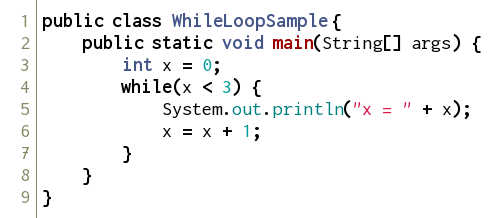
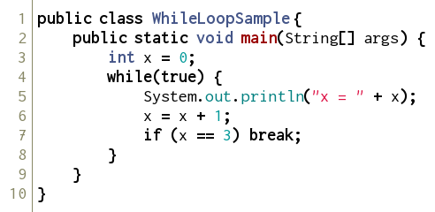
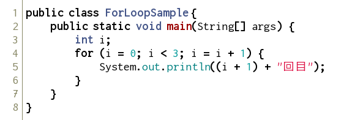
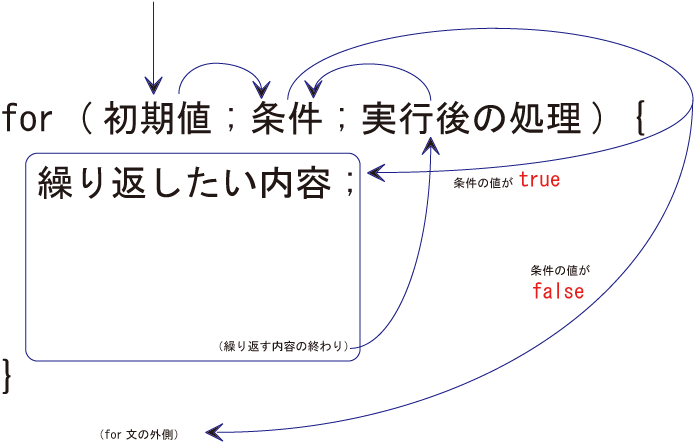
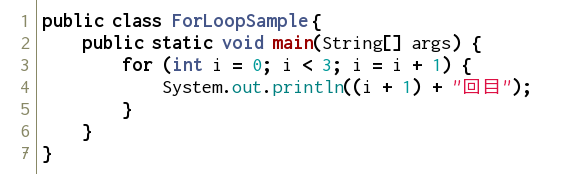

繰り返し - while文
------------------

### while文の基本

まず、以下のソースコードを打ち込み、コンパイルして実行してみましょう。

*WhileLoopSample.java* 

実行すると、以下のように表示されます。

*実行結果*

    x=0
    x=1
    x=2

while文を使うと、繰り返しを行うことができます。

while文

    while (条件) {
    	繰り返したい内容;
    }
    
    // 例
    while (x < 3) {
    	x = x + 1;
    }

[比較演算子](../04/index.html)

### break文

では、次のように改良してみましょう。

*WhileLoopSample.java* 

実行すると、以下のようになります。

*実行結果*

    x = 0
    x = 1
    x = 2

前のプログラムと実行結果は同じですが、
少し動作が違います。とくに、`while` 文を見てみましょう。
`while` 文の反復条件が `true` となっています。
そのため、永遠に反復し続けます。
いわゆる無限ループと呼ばれる状態です。
しかし、結果を見れば明らかなように、きちんと3回で止まっています。
これは、`break` 文によるものです。

break文

    break;

`break `文を実行すると、**ループから抜け出す** ことができます。
また、同じ行の `if` 文を見てみましょう。

    if (x == 3) break;

これは、以下のようなソースコードと同じになります。

    if (x == 3) {
    	break;
    }

`if` 文で実行したい命令が1行の場合、{}をつけずに書くことができます。
これは、`while` 文や下の `for` 文でも同じことが可能です。

繰り返し - for文
----------------

### for文の基本

決まった回数の反復を行う場合、より分かりやすい方法があります。
まず、以下のソースコードを打ち込み、コンパイルしてみましょう。

*ForLoopSample.java* 

実行すると、以下のようになります。

*実行結果*

    1回目
    2回目
    3回目

for文を使うと、繰り返しを行うことができます。

for文

    for (初期値; 反復条件; 実行後の処理) {
    	繰り返したい内容;
    }
    
    // 例
    for (i = 0; i < 3; i = i + 1) {
    	System.out.println((i + 1) + "回目");
    }

### プログラムの改良

では、次のようにプログラムを改良してみましょう。

*ForLoopSample.java* 

まず、`for` 文の中のみで使う変数は、上のように宣言することができます。
また、インクリメント演算子というものもあります。

インクリメント演算子

    変数++;
    もしくは、
    ++変数;

これは、`１増やす` という意味です。つまり、`i = i + 1` と書くことと同じです。
また、同様に `１減らす` つまり、`i = i - 1` という意味のデクリメント演算子というものもあります。

デクリメント演算子

    変数--;
    もしくは、
    --変数;

練習問題
--------------------

<ol>
<li>for文もしくはwhile文を用いて、１から入力された値までの和を出力するプログラムを書きましょう。

<em>実行結果</em>

<pre><code class="language-" data-lang="">値を入力してください。
10
1から10までの和は、55です。
</code></pre>

</li>
<li>値を入力すると、その値が素数かどうかを判定するプログラムを書きましょう。
ここで素数とは、「1と自分自身以外で割り切れない数」のことです。

<em>実行結果（１）</em>

<pre><code class="language-" data-lang="">値を入力してください。
7
7は素数です。
</code></pre>

<em>実行結果（２）</em>

<pre><code class="language-" data-lang="">値を入力してください。
8
8は素数ではありません。
</code></pre>

</li>
<li>
“******”を繰り返し標準出力して、高さが7、横が6の長方形を描画しましょう。ただし、while文, for文、do while文のいずれかを必ず使い、その中で標準出力をする命令は一回のみ使うこと。
 回答： 
　 ****** 
　 ****** 
　 ****** 
　 ****** 
　 ****** 
　 ****** 
　 ******
</li>
<li>
九九の表を表示するプログラムを作成しましょう．
</li>
<li>
ある整数xに対して、1+2+ …+ xを出力するプログラムを書きましょう。ただし、xの値が1未満のときは注意文を出力しましょう。
</li>
<li>
ある整数xに対して、1*2* …* xを計算するプログラムを書きましょう。ただし、xの値が1未満のときは注意文を出力しましょう。
</li>
<li>
変数nに任意の0でない自然数を入力し、nが偶数なら、nを2で割り、奇数ならnに3をかけて1を足す操作を繰り返すプログラムを作成し、その結果を観察しましょう。
</li>
<li>
n個の中からm個を選ぶ組み合わせを求めてください。ただし、n、mは共に正の整数とし、n &gt; mとする。
</li>
<li>
“*”を繰り返し標準出力して、高さが7、横が6の長方形を描画しましょう。ただし、while文、for文、do while文のいずれかを必ず使い、その中で標準出力をする命令は一回のみ使うこと。
 回答： 
　 ****** 
　 ****** 
　 ****** 
　 ****** 
　 ****** 
　 ****** 
　 ******
</li>
<li>
文字「 * 」を並べて、縦 10 文字、横 10 文字の三角形を描くプログラムを作成しましょう。
 回答： 
　 * 
　 ** 
　 *** 
　 **** 
　 ***** 
　 ****** 
　 ******* 
　 ******** 
　 ********* 
　 **********
</li>
<li>
11 という 10 進数の数値を 2 進数で表示するプログラムを作成しましょう。
</li>
<li>
入力された数字の次の月のカレンダーを表示するプログラムを作成しましょう。なお、うるう年や曜日による表示場所の変更を考慮する必要はありません。
</li>
<li>
1 から 100 までの整数のうち、平方数でも立方数でもないものを、すべて表示するプログラムをつくりましょう。
</li>
</ol>
