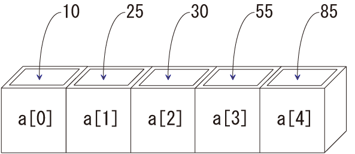

練習で使ったデータは必ず保存するようにしましょう

配列
--------------

### 配列の基本的な使い方
まず、以下のソースコードを打ち込み、コンパイルして実行してみましょう。

Hairetsu.java

実行すると、以下のようになります。

実行結果

~~~~
0番目のデータは、10です。
1番目のデータは、25です。
2番目のデータは、30です。
3番目のデータは、55です。
4番目のデータは、85です。
~~~~

変数をたくさん使いたい場合、配列を使うと便利です。

配列の宣言と生成（１）

~~~~
データ型　変数名[] ;
変数名 = new データ型[配列の個数] ;
~~~~

例：

~~~~
int a[];
a = new int[5];
~~~~

これは以下のように、1行で宣言することもできます。

配列の宣言と生成（２）

~~~~
データ型　変数名[] = new データ型[配列の個数];
~~~~

例：

~~~~
int a[] = new int[5];
~~~~

どちらで宣言しても同じです。
また、この例のように、代入する値が決まっているときは、以下のように宣言と同時に代入することもできます。

配列の宣言と生成（３）

~~~~
データ型　変数名[] = {値１,値２,・・・};
~~~~

例：

~~~~
int a[] = {10,25,30,55,85};
~~~~

注意
配列の添え字は**0**から始まります。
例えば、配列a[]を５つ宣言した場合は、a[0]からa[4]までの５つが使えます。

いろいろな配列の使い方
--------------
### for文との組み合わせ
では、以下のようなソースコードを入力し、実行してみましょう。

Hairetsu2.java

実行すると、例えば以下のようになります。

実行結果

~~~~
いくつ入力しますか？
3
1個目のデータを入力してください。
15
2個目のデータを入力してください。
23
3個目のデータを入力してください。
47
1個目のデータは、15です。
2個目のデータは、23です。
3個目のデータは、47です。
~~~~

for文と配列を組み合わせると、複数個の入力にも対応できるようになります。
また、配列の数を変数で与えることもできます。

### ２次元配列
配列のインデックスを２次元・３次元、あるいは多次元にして使うこともできます。
これについては、以下を参照してください。

<a href="array.html" target="_blank">多次元配列</a>

練習問題
--------------
### 問題１
人数とそれぞれの点数を入力し、平均点を出力するプログラムを書きましょう。さらに、平均点以上の点数と人数を表示させましょう。クラス名は「Exam」とします。

実行結果

~~~~
テストの受験者数を入力してください。
3
点数を入力してください。
67
89
34
平均点は63.333333333333333点です。
平均点以上は、67点、89点、の2人です。
~~~~

### 問題２
次のように、自分の点数と人数、他の人の点数を入力すると、順位を出力するプログラムを書きましょう。クラス名は「Exam2」とします。

実行結果

~~~~
あなた以外は何人ですか
4
あなたの得点を入力してください
56
他の人の得点を入力してください
32
44
67
38
あなたは第2位です
~~~~
