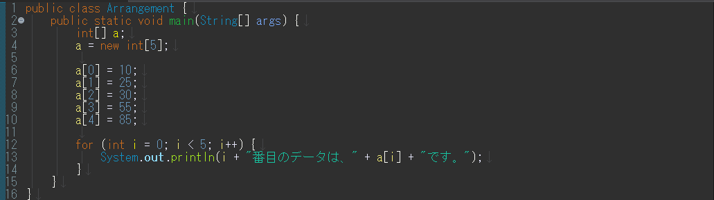
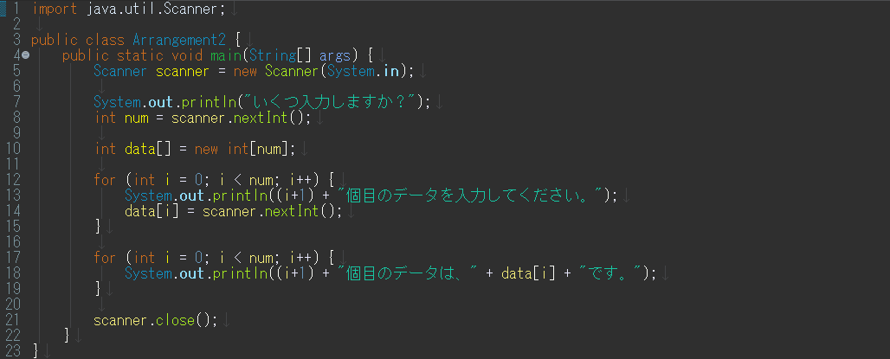

配列
--------------

### 配列の基本的な使い方

まず、以下のソースコードを打ち込み、コンパイルして実行してみましょう。

*Arrangement.java* 

実行すると、以下のようになります。

*実行結果*

    0番目のデータは、10です。
    1番目のデータは、25です。
    2番目のデータは、30です。
    3番目のデータは、55です。
    4番目のデータは、85です。

変数をたくさん使いたい場合、配列を使うと便利です。

配列の宣言と生成

    データ型 変数名[];
    変数名 = new データ型[配列の個数];
    
    // 例
    int a[];
    a = new int[5];

これは以下のように、1行で宣言することもできます。

    データ型　変数名[] = new データ型[配列の個数];
    
    // 例
    int a[] = new int[5];

どちらで宣言しても同じです。 
また、代入する値が決まっているときは、以下のように宣言と同時に代入することもできます。

    データ型　変数名[] = {値１,値２,・・・};
    
    // 例
    int a[] = {10,25,30,55,85};

注意
**配列の添え字は0から始まります。**
例えば、配列a[]を５つ宣言した場合は、a[0]からa[4]までの５つが使えます。

いろいろな配列の使い方
----------------------

### for文との組み合わせ

では、以下のようなソースコードを入力し、実行してみましょう。

*Arrangement2.java* 

実行すると、例えば以下のようになります。

*実行結果*

    いくつ入力しますか？
    3
    1個目のデータを入力してください。
    15
    2個目のデータを入力してください。
    23
    3個目のデータを入力してください。
    47
    1個目のデータは、15です。
    2個目のデータは、23です。
    3個目のデータは、47です。

`for` 文と配列を組み合わせると、複数個の入力にも対応できるようになります。
また、配列の数を変数で与えることもできます。

### ２次元配列

配列のインデックスを２次元・３次元、あるいは多次元にして使うこともできます。
これについては、以下を参照してください。

参考資料 [多次元配列](../../appendix/multidimensional_array.html)

練習問題
--------
<ol>
<li>

要素数が5個のリスト<code>Array</code>を4, 6, -3, 5, 2の順で初期化した後、2番目の要素を4番目の要素で除算するプログラムを作成しましょう。

</li>

<li>

要素が2つ以上あるリストを宣言し、リストのi番目の要素とj番目の要素を入れ替えるプログラムを作成しましょう。

例えば、<code>i=3</code>, <code>j=2</code>, <code>a[2]=6</code>, <code>a[3]=7</code>とすると, <code>a[2]=7</code>, <code>a[3]=6</code>となる。

</li>
<li>

次のように、自分の点数と人数、他の人の点数を入力すると、順位を出力するプログラムを書きましょう。クラス名は、CalcRank.javaとします。

<em>実行例</em>

<pre><code class="language-" data-lang="">あなた以外は何人ですか。
      4
    あなたの得点を入力してください。
      56
    他の人の得点を入力してください。
      32
      44
      67
      38
      あなたは第2位です。
</code></pre>

</li>
<li>

人数とそれぞれの点数を入力し、平均点を出力するプログラムを書きましょう。さらに、平均点以上の点数と人数を表示させましょう。クラス名は、CalcAverage.javaとします。

<em>実行例</em>

<pre><code class="language-" data-lang="">テストの受験者数を入力してください。
      3
   点数を入力してください。
      67
      89
      34
      平均は63.333333336点です。
      平均点以上は、67点、89点の2人です。
</code></pre>

</li>
<li>

0から９までの自然数が重複せずに格納されている要素数10のリストに対して、各要素を昇順に並べからえるプログラムを作成しましょう。

</li>
<li>
2×2行列A, Bを配列を用いて定義し、A+Bを行うプログラムを作成しましょう。
</li>
<li>
フィボナッチ数列を配列に格納し、出力するプログラムを書きましょう。
</li>
</ol>

