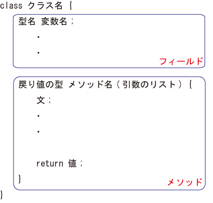
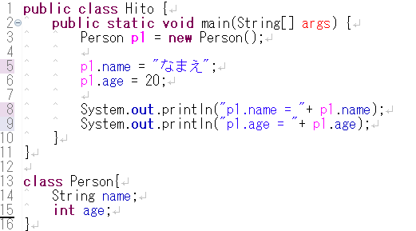

練習で使ったデータは必ず保存するようにしましょう

オブジェクト指向プログラミング
--------------

Javaの特徴である「オブジェクト指向プログラミング」の基礎に少し触れてみましょう。

まず、これから出てくる言葉の説明をしておきましょう。

* オブジェクト

プログラムで扱う情報と、それを実行できる機能を１つのまとまりにしたものです。

* クラス

いわば「設計図」のようなものです。

* インスタンス

クラスを元にして作成された実態のこと。設計図から実際に製造された「製品」のようなものです。

これだけ読んだだけではよく分からないかもしれませんが、実は既にこれらのものを使っています。

その例が、StringやBufferedReaderクラスです。

Stringは厳密には基本データ型ではなく、Stringクラスで定義されたオブジェクトです。

クラス
--------------
### クラスの基本

クラスには、大きく分けて2つの要素があります。それがフィールドと**メソッド**です。

フィールドとメソッドをあわせて、**メンバ**と呼ぶこともあります。

はじめに、フィールドについて説明します。

まずは、以下のソースコードを入力し、コンパイルして実行してみましょう。

Hito.java

実行すると、以下のようになります。

**実行結果**

~~~~
p1.name = なまえ
p1.age = 20
~~~~

さて、3行目を見てみましょう。

~~~~
Person p1 = new Person();
~~~~

これは、インスタンスの生成をしています。

分かりやすく言えば、「設計図（クラス）」から、実態となる「製品（インスタンス）」を作る、というような作業です。

**インスタンスの生成**

~~~~
クラス名 オブジェクト変数名 = new コンストラクタ名(パラメータ);

例：
Person p1 = new Person();
~~~~

ここで、**コンストラクタ**とは、初期化専用のメソッドのことです。

正確ではありませんが、「コンストラクタ名」には「クラス名」を書く、と覚えておきましょう。

ここまでの作業で、クラスを実際に使えるようになります。

次に、5,6行目を見てみましょう。

~~~~
p1.name="なまえ";
p1.age=20;
~~~~

Personクラスの変数nameとageに値を代入したりするには、**オブジェクト変数名.フィールド名**というかたちを用います。

ここで**フィールド**とは、クラスの持つデータのことです。つまり、クラスの持つ変数だと理解すればよいでしょう。

メソッド
--------------
### メソッドの基本

では、上のプログラムを少し改良してみましょう。

実行すると、以下のようになります。

実行結果

~~~~
名前は、首都大です。
年齢は、20歳です。
~~~~
8行目を見てみましょう。

~~~~
p1.show();
~~~~
これで、メソッドshow()を実行することができます。

その詳しい内容は、16-19行目に書かれています。

~~~~
void show() {
	System.out.println("名前は、" + name + "です。");
	System.out.println("年齢は、" + age + "歳です。");
}
~~~~

中の2行を見れば分かると思いますが、nameとageの値を出力しています。

メソッドは、以下のようにして呼び出します。
**メソッドの呼び出し**

~~~~
オブジェクト名.メソッド名(引数1,引数2,・・・);

例：
p1.show();
~~~~
呼び出すためには、その内容をあらかじめ書いておくことが必要です。

**メソッドの定義**

~~~~
戻り値の型 メソッド名(引数の型1 引数名1,・・・) {

   メソッドの内容;

   return 戻り値;

}

例：
void show() {
	System.out.println("名前は、" + name + "です。");
}
~~~~

ここで少し言葉の説明をしておきましょう。

* 引数

メソッド実行時に、メソッドに与える値のこと。その値の型とメソッド内での変数名を指定します。

呼び出し時等に与える実際の値を**実引数**、メソッド定義部で実引数に名前をつけたものを**仮引数**と呼ぶこともあります。

必要ない場合は、上の例のように、空欄にします。

* 戻り値

メソッドの実行結果として戻す値のこと。

通常、 **return 戻り値** という形で値を返します。

戻り値が必要ない場合は、上の例のように書かなくても良いです。この場合、戻り値の型は**void**とします。

いろいろな形のメソッド
--------------
### 戻り値をもつメソッド

では、前のプログラムを以下のように直してみましょう。

Hito.java

**実行結果**

~~~~
年齢は20歳です。
~~~~
8行目では、23-25行目のメソッドを呼び出しています。

そして、そのメソッドでの戻り値（age）を、tempに代入しています。

### 引数をもつメソッド

さらに、以下のように修正してみましょう。

Hito.java

実行結果

~~~~
年齢は20歳です。
5年後の年齢は、25歳です。
~~~~
このようにして、引数を与えることができます。

練習問題
--------------
### 問題１

上のHito.javaに、int型の引数2つを持ち、その和を返すメソッドaddを作成し、実行してみましょう。

### 問題２

次のようなクラスを作成しましょう。メインメソッドのあるクラス名を、「Zukei」とします。

* クラス名は「Circle」
* 半径を保持するint型の変数rを持つ
* rから面積を計算し、その値を返すメソッドarea
* rから円周を計算し、その値を返すメソッドcircuit
* int型の引数を持ち、rにその値を代入するメソッドinput_radius

そしてこのそれぞれのメソッドを使い、以下のような結果を表示させましょう。円周率は、3.14とします。

**実行結果**

~~~~
半径の値を入力してください。
3
面積は、28.26です。
円周は、18.84です。
~~~~
