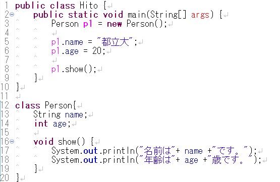
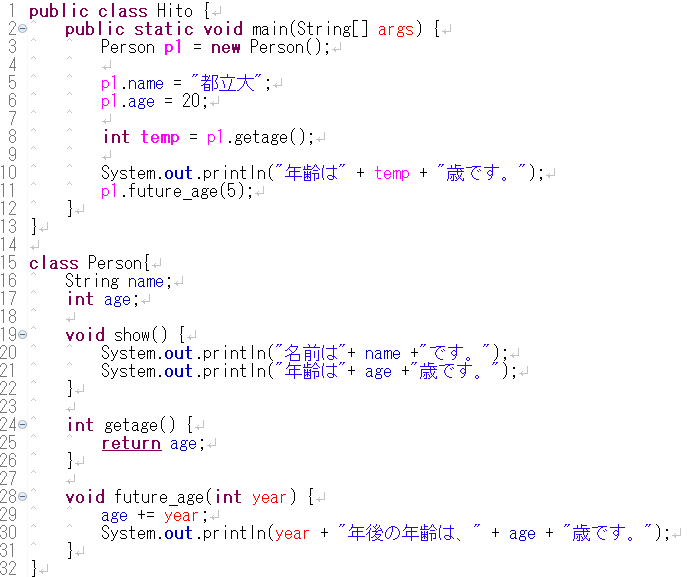

オブジェクト指向プログラミング
------------------------------

Javaの特徴である **オブジェクト指向プログラミング** の基礎に少し触れてみましょう。

まず、これから出てくる言葉の説明をしておきます。

<dl>
<dt>オブジェクト</dt>
<dd>プログラムで扱う情報と、それを実行できる機能を１つのまとまりにしたものです。</dd>
<dt>クラス</dt>
<dd>いわば「設計図」のようなものです。</dd>
<dt>インスタンス</dt>
<dd>クラスを元にして作成された実態のこと。
設計図から実際に製造された「製品」のようなものです。</dd>
</dl>

これだけ読んだだけではよく分からないかもしれませんが、実は既にこれらのものを使っています。
その例が、`String` や `BufferedReader` といったクラスです。

`String` は厳密には基本データ型ではなく、`String` クラスで定義されたオブジェクトです。

クラス
------

クラスには、大きく分けて2つの要素があります。それが **フィールド** と **メソッド** です。
フィールドとメソッドをあわせて、**メンバ** と呼ぶこともあります。

### フィールド

はじめに、フィールドについて説明します。
まずは、以下のソースコードを入力し、コンパイルして実行してみましょう。

*Hito.java* 

実行すると、以下のようになります。

*実行結果*

    p1.name = なまえ
    p1.age = 20

さて、3行目を見てみましょう。

    Person p1 = new Person();

ここで、`Person` クラスを用いてインスタンスを生成しています。
分かりやすく言えば、**設計図（クラス）** から、実態となる **製品（インスタンス）** を作る、というような作業です。

クラスに基づきインスタンスを生成する処理を **コンストラクタ** と呼びます。

    クラス名 オブジェクト変数名 = new コンストラクタ名(パラメータ);
    
    // 例
    Person p1 = new Person();

コンストラクタは、初期化専用のメソッドのことです。
正確ではありませんが、*コンストラクタ名* には *クラス名* を書く、と覚えておきましょう。

ここまでの作業で、クラスを実際に使えるようになります。

次に、5,6行目を見てみましょう。

    p1.name = "なまえ";
    p1.age = 20;

`Person` クラスの変数 `name` と `age` に値を代入したりするには、**オブジェクト変数名.フィールド名** というかたちを用います。

ここで **フィールド** とは、クラスの持つデータのことです。
つまり、クラスの持つ変数だと理解すればよいでしょう。

### メソッド

では、上のプログラムを少し改良してみましょう。

*Hito.java* 

実行すると、以下のようになります。

*実行結果*

    名前は、首都大です。
    年齢は、20歳です。

8行目を見てみましょう。

    p1.show();

これで、`Person` クラスのインスタンスである `p1` のメソッド `show()` を実行することができます。
そのメソッドの処理内容は、16-19行目に書かれています。

    void show() {
    	System.out.println("名前は、" + name + "です。");
    	System.out.println("年齢は、" + age + "歳です。");
    }

中の2行を見れば分かると思いますが、`name` と `age` の値を出力しています。

メソッドは、以下のようにして呼び出します。

    オブジェクト名.メソッド名(引数1,引数2,・・・);
    
    // 例
    p1.show();

呼び出すためには、その内容をあらかじめ書いておくことが必要です。
メソッドは次のように定義します。

    戻り値の型 メソッド名(引数の型1 引数名1,・・・) {
    	メソッドの内容;
    	return 戻り値;
    }
    
    // 例
    void show() {
    	System.out.println("名前は、" + name + "です。");
    }

ここで少し言葉の説明をしておきましょう。

<dl>
<dt>引数</dt>
<dd>メソッド実行時に、メソッドに与える値のことです。
その値の型とメソッド内での変数名を指定します。
呼び出し時等に与える実際の値を <strong>実引数</strong>、メソッド定義部で実引数に名前をつけたものを <strong>仮引数</strong> と呼ぶこともあります。
必要ない場合は、上の例のように、空欄にします。</dd>
<dt>戻り値</dt>
<dd>メソッドの実行結果として戻す値のことです。
通常、 <code>return 戻り値</code> という形で値を返します。
戻り値が必要ない場合は、上の例のように書かなくても良いです。
この場合、戻り値の型は <code>void</code> とします。</dd>
</dl>

いろいろな形のメソッド
----------------------

### 戻り値をもつメソッド

では、前のプログラムを以下のように直してみましょう。

*Hito.java* 

*実行結果*

    年齢は20歳です。

8行目では、23-25行目のメソッドを呼び出しています。
そして、そのメソッドでの戻り値 `age` を、`temp` に代入しています。

### 引数をもつメソッド

さらに、以下のように修正してみましょう。

*Hito.java* 

*実行結果*

    年齢は20歳です。
    5年後の年齢は、25歳です。

このようにして、引数を与えることができます。

練習問題
--------

### 問題１

上の `Hito.java` に、`int` 型の引数2つを持ち、その和を返すメソッド `add` を作成し、実行してみましょう。

### 問題２

次のようなクラスを作成しましょう。
メインメソッドのあるクラス名を、`Zukei` とします。

-   クラス名は `Circle`
-   半径を保持する `int` 型の変数 `r` を持つ
-   `r` から面積を計算し、その値を返すメソッド `area`
-   `r` から円周を計算し、その値を返すメソッド `circuit`
-   `int` 型の引数を持ち、`r` にその値を代入するメソッド `inputRadius`

そしてこのそれぞれのメソッドを使い、以下のような結果を表示させましょう。
円周率は、`3.14` とします。

*実行結果*

    半径の値を入力してください。
    3
    面積は、28.26です。
    円周は、18.84です。
