JMPについて
-----------

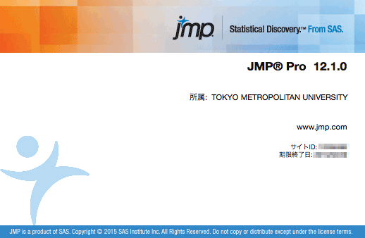

JMP（ジャンプ）は、[SAS Institute](./pic/http://www.sas.com/ja_jp/) が開発したビジュアル探索型データ分析ソフトウェアです。

Excelに比べると、容易に集計やグラフ作成、統計解析ができる機能を持っていると言われています。
高度な分析を行っても、統計量と共にグラフが自動的に表示されるので、データを視覚的に確認し、パターンを見つけることができます。

データを数値で表現する方法
--------------------------

### データの種類

#### 質的データ（特定の属性を表すデータ）

<dl>
<dt>名義尺度</dt>
<dd>カテゴリーを表し、データの区分にのみ意味があるものです。大小関係や順序関係は存在しません。
データのタイプは数字か文字です。例として、性別や血液型などがあげられます。</dd>
<dt>順序尺度</dt>
<dd>データの大小または、順位のみが意味を持つ尺度です。基本的には平均値や標準偏差は使用せず、中央値のみを主に使用します。
データタイプは数値か文字のどちらかで、値が数値であれば大きさで順序が決まり、文字であれば並び替え順序で大きさが決まります。
例として、年代や各種のスケールなどがあげられます。</dd>
</dl>

#### 量的データ（数量として得られるデータ）

量的データのことを基本的に連続尺度といいます。連続尺度には下記の二種類があります。

<dl>
<dt>間隔尺度</dt>
<dd>摂氏の温度（℃）や時刻などの順序情報と等間隔性を有する尺度です。加法減法に意味はありますが、乗除は意味がありません。
<dt>比例尺度</dt>
<dd>間隔尺度の性質に加えて、 0 を基点とすることができる尺度です。
テストの点数や身長・体重など多くの変数がこの尺度に当てはまります。数値はそのまま計算に用いることができ、乗除にも意味があります。 
（絶対温度（K）は原子の動いていない状態を0(基点)としているため比例尺度ですが、摂氏の温度（&#8451;）は水の凝固点に便宜上0を割り当てたものであり、
その0は"温度がない=無の値"を表している基点ではないため、間隔尺度となります。）</dd>
</dl>

例えば、統計を使って分析されることの多いデータのひとつにアンケートの回答があります。
分析の際に回答を「1：悪い」「2：普通」「3：良い」といった数値を割り当てますが、人によって「普通」という評価が「悪い」に近い場合と「良い」に近い場合がありうるため、等間隔とはいえませんが、順序だけは明確であるため、順序尺度であるといえます。
しかし、実際に分析を行う際には、数字を基に平均や分散、偏差などをもとめることがあります。このときは、間隔尺度として扱っているといえます。

基本統計量の算出
----------------

JMPでは、入力した統計データの基本統計量を即座に求めることができます。
しかしながら、得られた統計量にどのような意味があるのかを理解しないことには、統計解析の結果を考察することはできません。

実際に例題を通して、それぞれの基本統計量について学んでいきましょう。

### 練習問題

JMPを用いて次のデータを入力し、基本統計量を求めてみましょう。

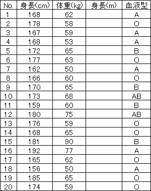

### JMPの起動

[スタート] - [すべてのプログラム] - [JMP 12] - [JMP Pro 12]とクリックします。

### データテーブルの新規作成

&#9312; メニューの[ファイル] - [新規作成] - [データテーブル]をクリックします。
または[データテーブルの新規作成]をクリックします。

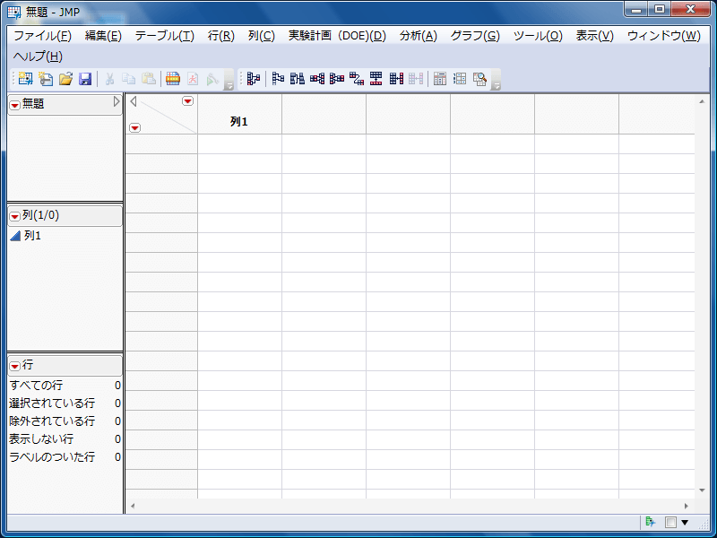

入力したデータはこまめに保存しておきましょう。今後の講でも同様です。

&#9313; ここでは `basis.JMP` で保存しておきます。

### 変数名とデータの入力

&#9312; [列名]（"列1"と書いてあるところ）をダブルクリックします。
そして，`身長(cm)`と入力し、[OK]をクリックします。

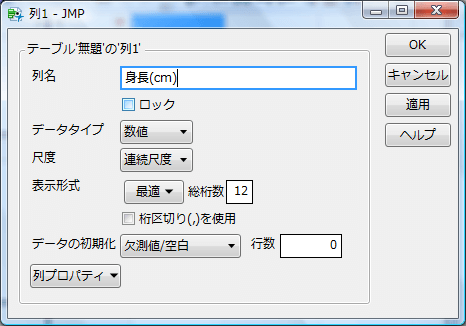

&#9313; データを入力します。

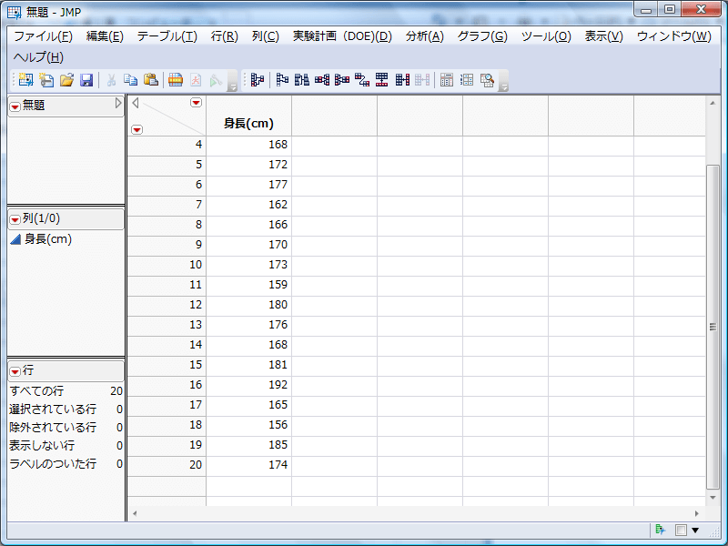

### 連続尺度のデータ入力

&#9312; メニューの[列] - [列の新規作成]をクリックします。
[列名]には `体重(kg)` と入力し、[OK]をクリックします。

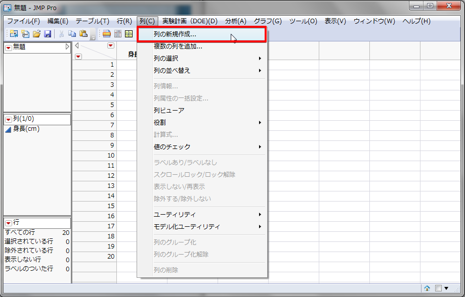

&#9313; データを入力します。

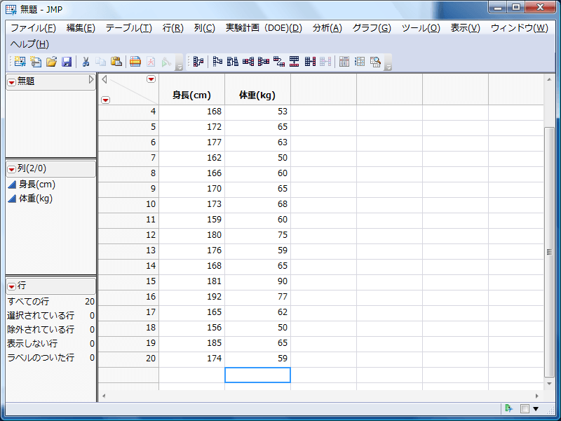

&#9314; メニューの[列] - [列の新規作成]をクリックします。
[列名]に `身長(m)` と入力します。

&#9315; [列プロパティ] - [計算式]とクリックします。

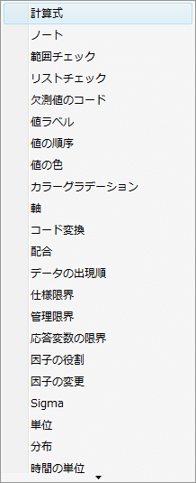

&#9316; [計算式の編集]をクリックします。

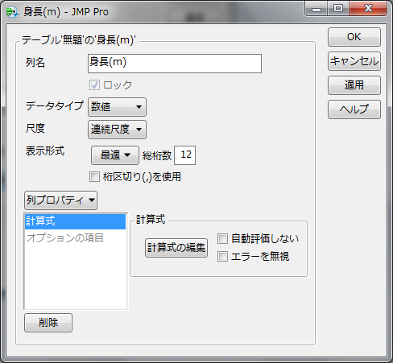

&#9317; "テーブル列"から[身長(cm)]を選択 - [&divide;]と押し、分母に `100` を入力して[Enter] - [OK]をクリックします。

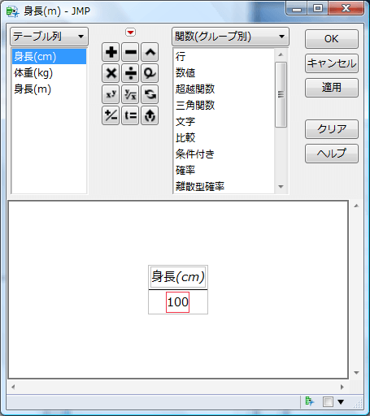

&#9318; 列プロパティで計算式が入力されたことを確認し、[OK]をクリックします。

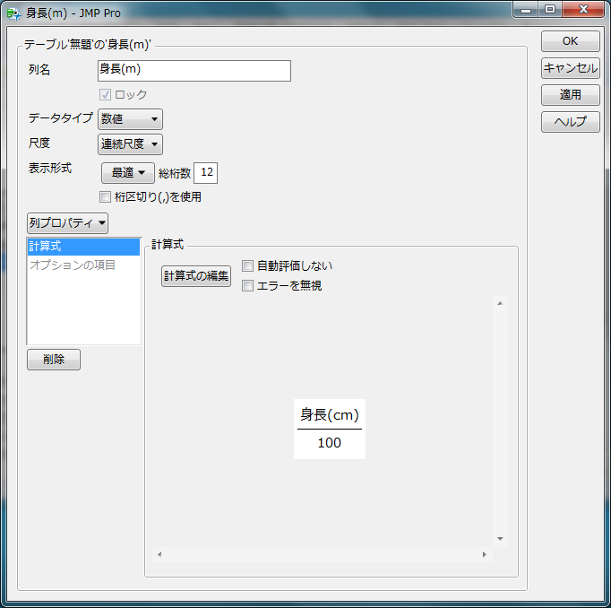

&#9319; すると列に計算結果が求まります。

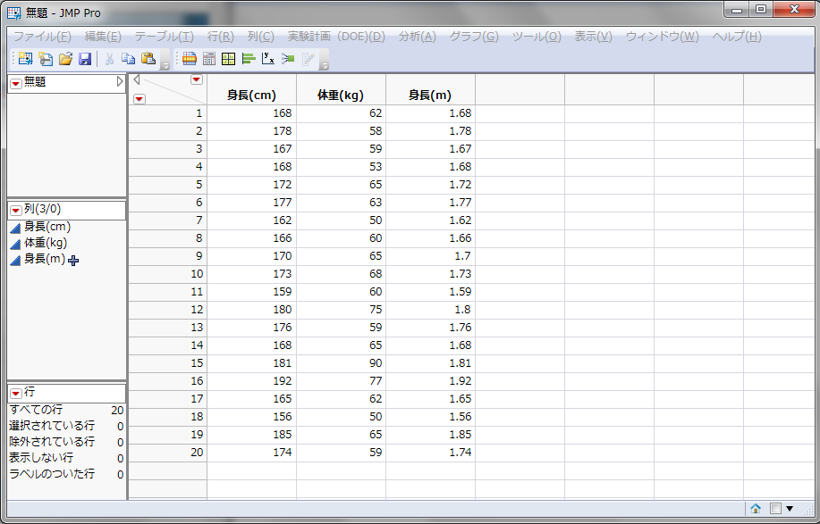

### 名義尺度のデータ入力

&#9312; メニューの[列] - [列の新規作成]とクリックし、[列名]を `血液型` とします。

&#9313; [データタイプ] - [文字]とクリックします。

&#9314; [尺度] - [名義尺度] - [OK]とクリックします。

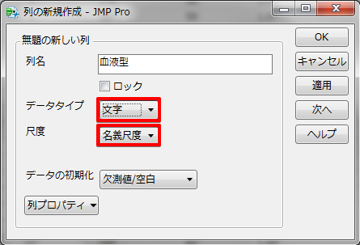

&#9315; データを入力します。

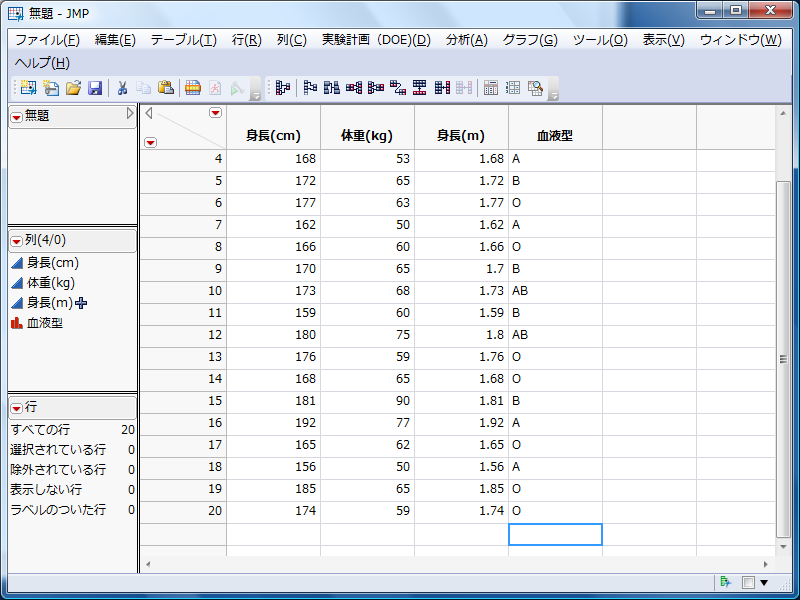

### 基本統計量の求め方

&#9312; 変数を選択した後、基本統計量を求めます。

&#9313; メニューの[分析] - [一変量の分布]を選択します。

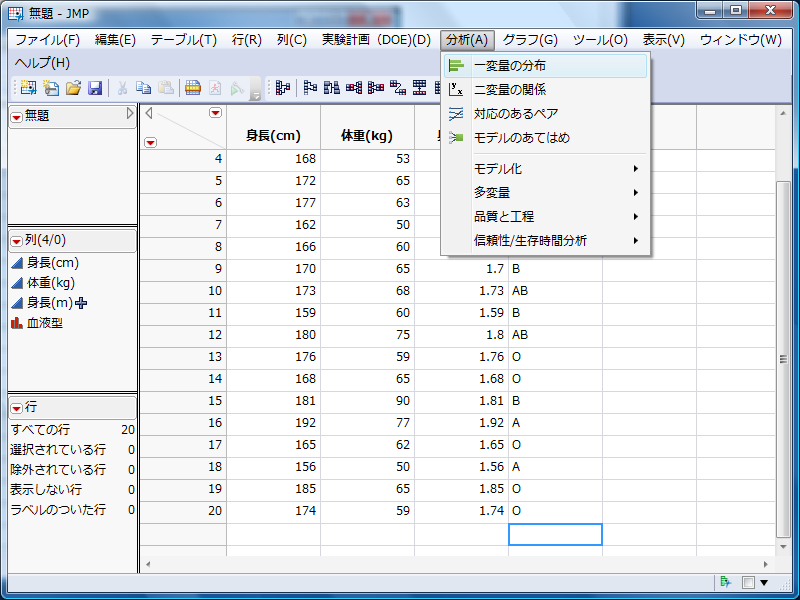

&#9314; "列の選択"のなかの[身長(cm)]をクリックして[Y，列]をクリックします。

&#9315; "列の選択"のなかの[体重(kg)]をクリックして[Y，列]をクリックします。

&#9316; "列の選択"のなかの[身長(m)]をクリックして[Y，列]をクリックします。

&#9317; "列の選択"のなかの[血液型]をクリックして[Y，列]をクリックします。
または、[身長(cm)]から[血液型]までマウスでドラッグして[Y，列]をクリックします

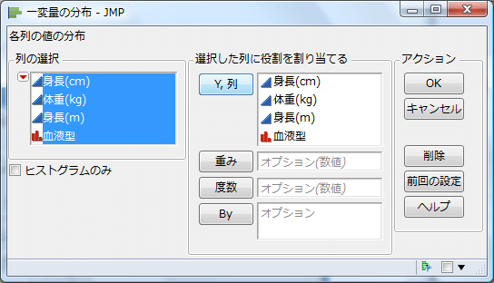

&#9318; [OK]をクリックします。

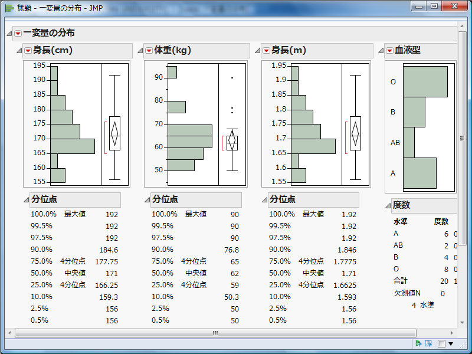

&#9319; これで基本統計量が求まりました。

### 基本統計量のすべての表示

&#9312; [列名]の左の▼をクリックして、[表示オプション]を開きます。

&#9313; [要約統計量のカスタマイズ]を選択します。

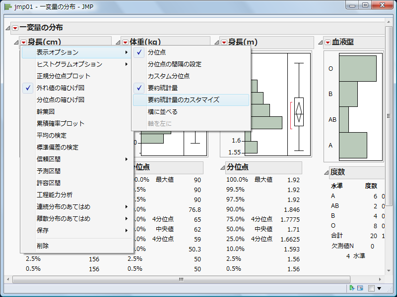

&#9314; [全ての要約統計量を選択] - [OK]をクリックします。

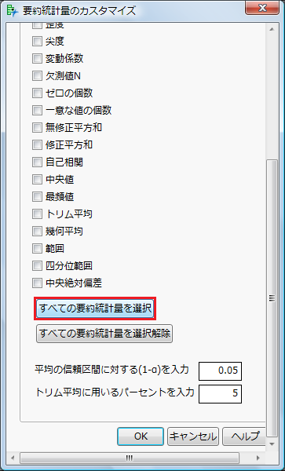

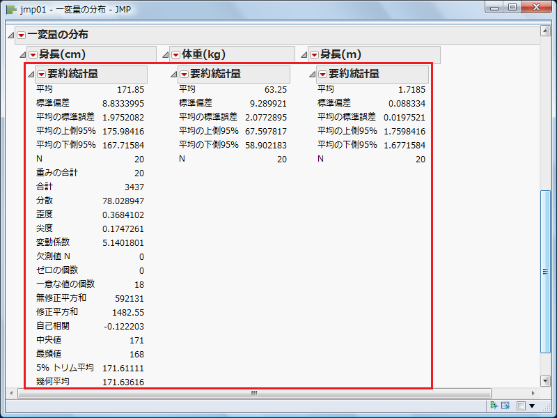

基本統計量の意味
----------------

名義・順序尺度の場合に表示される度数には、各水準の度数と全体に占める割合が表示されます。
連続尺度の場合に表示される要約統計量には、分位点、4 分位範囲、平均値、中央値、最頻値、範囲、分散、標準偏差、歪度、尖度などが示されます。

それぞれの基本統計量の意味は下記のとおりです。

#### 平均

列の変数の算術平均を表します。欠損値以外の合計値を値の数で割った値です。

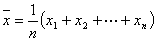

nは標本数、xiは各標本の値です。
例えば {1，3，4，6，7} の5個の標本があったとき、平均は (1 + 3 + 4 + 6 + 7) &divide; 5 = 2.2 です。

#### N

欠損値以外の値の数です。

#### 分位点（パーセンタイル）

75%の数字は、75パーセンタイルを意味し、その値以下の割合が75%となる数値を表します。
25および75パーセンタイルは**４分位点**とも言い、どの値までが全体の何パーセントを占めるかの見当をつけるのに用います。

#### 範囲（レンジ）

分布の存在する範囲を示します。範囲R = 最大値 - 最小値 で求めることができます。例えば {1，3，4，6，7} であれば範囲R = 7 - 1 = 6 です。

#### 最大値

欠損値を除く列内の最大値です。例えば {1，3，4，6，7} であれば 7 が最大値です。

#### 最小値

欠損値を除く列内の最小値です。例えば {1，3，4，6，7} であれば 1 が最小値です。

#### 中央値（メディアン）

50パーセンタイルとも言い、データを並べたときに全体の中央に位置する値です。例えば {1，3，4，6，7} であれば 4 が中央値です。

#### 最頻値（モード）

データの中で最大の度数を持つ値です。例えば {1，3，4，4，6，7} であれば 4 の数が最も多いので、 4 が最頻値になります。

#### 分散

JMPでは不偏分散を指し、偏差（各観測値 - 平均）を二乗することで符号を消し、その合計（偏差平方和）を N - 1 で割ったものです。
母集団が未知であることを前提としています。
一般的に標本の分散を求める場合、 N で割るよりも N - 1 で割ったほうが、母分散をよりよく推定できます。
平均値からのデータの散らばり具合を把握するのに用います。

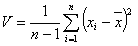

nは標本数、xiは各標本の値です。
例えば {1，3，4，6，7} であれば分散は {(1 - 2.2)2 + (3 - 2.2)2 + (4 - 2.2)2 + (6 - 2.2)2 + (7 - 2.2)2} &divide; (5 - 1) = 10.7 となります。

#### 標準偏差

JMPでは分散（不偏分散）の平方根をとった値で、分散同様散らばり具合の尺度になります。偏差の単位と次数が同じです。

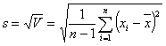

nは標本数、xiは各標本の値です。
例えば {1，3，4，6，7} であれば標準偏差は分散に平方根をとって、3.27 になります。

#### 歪度

データの分布の非対称性を測る尺度です。

- 歪度 = 0 : 左右対称
- 歪度 &gt; 0 : 右に裾がのびる
- 歪度 &lt; 0 : 左に裾がのびる

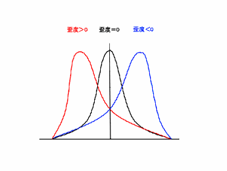

#### 尖度

データの分布の裾の長さを測る尺度です。

- 尖度 = 0 : 正規分布
- 尖度 &gt; 0 : 正規分布よりも尖っている
- 尖度 &lt; 0 : 正規分布よりも平坦である

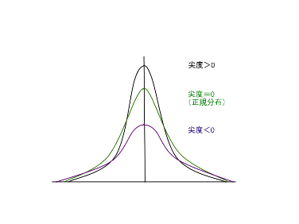

#### 変動係数

標準偏差を平均で割ったもの。平均を考慮した上で散らばり具合を相対的に比較するのに便利な指標です。

#### 欠損値

データが得られていない項目がある場合、有効でないことが明らかな値を入力します。JMPでは空白のままにしておきます。

課題
----

例題に列を加えてBMIを算出してみましょう。

BMIとは、BMI = 体重(kg) &divide; 身長(m)2 で求められる肥満の判定指数のことです。
