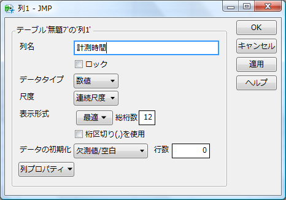
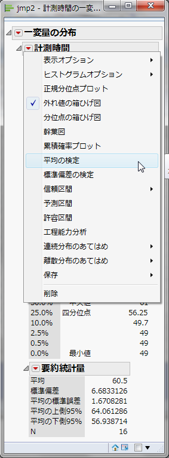

本教材に掲載する製品名は、一般に各開発メーカの商標、または登録商標です。

練習で使ったデータは必ず保存するようにしましょう

母平均に関する検定と推定
--------------

日頃、私たちが得られるデータは、母集団そのもののデータではなくて、母集団の中からいくつか抜き出してきた標本であることが多くなっています。
実際に私たちができるのは、その標本をもとに母集団を推測することです。

わかりやすくするために単純化した例を挙げます。

テレビ局Aが行った調査によれば、内閣の支持率が 40 %だったとします。これはそのテレビ局Aが日本国民全体の中から無作為に 2000 人を選出してアンケートを答えてもらった結果、その 2000 人の中で 40 %の人が内閣を支持したということです。これは決して日本国民全体の支持率ではありません。しかし、統計的には日本国民全体の支持率と推測できます。

つまり、母集団が日本国民全体となり、標本がアンケートを受けた 2000 人になります。標本平均が 40 %ですが、母平均はわかりません。それを標本平均によって推測したものが支持率 40 %です。

本講では、標本で得られた標本平均から母集団の平均（母平均）を検定したり、推定したりする方法を学んでいきましょう。

1つの母平均に関する検定（母標準偏差が既知のとき）
--------------
### 例題1

あるファストフード店のベテラン社員が、注文を受けてから商品を出すまでに平均 60 秒かかるとします。そこで、アルバイト店員に同様の時間を計測したところ、以下のデータを得ました。アルバイト店員は注文を受けてから商品を出すまでに平均 60 秒と判断して良いでしょうか。なお、従来の標準偏差の値は 10 秒で、店員が代わってもこの値は変わらないものとします。

表1：アルバイト店員が注文を受けてから商品を出すまでの計測時間（秒）

### 棄却検定法の流れ

例題を例にあげると、

1. 最初に“ベテラン社員”と“アルバイト店員”の平均が「等しい」という帰無仮説H0と、「等しくない」という対立仮説H1を考えます。
2. 平均と標準偏差などから検定統計量zを求めます。
3. 求めた検定統計量が生じる確率（p値）を求めます。
4. 有意水準α（アルファ）とp値を基準にして、どちらの仮説を採択するか決定します。

帰無仮説は、正しくないからこれを棄てるということを予測して設定した仮説（この場合、「等しい」）のことです。この仮説を退けるためには、この場合、「等しくない」ことが偶然でないことを示すことが必要であり、すなわち「ある小さな値（有意水準α）」以下でなければなりません。

### 仮説の設定

* 帰無仮説H0：μ＝60
* 対立仮説H1：μ≠60

### 有意水準αの設定

帰無仮説を棄てるための、めったに起こらない、偶然ではない確率は、経験的に 5 %か 1 %を用います。後者のほうが、より厳しい条件となります。今回の検定では、有意水準α＝0.05　とします。

詳しくは、第４講有意水準を参照してください。
 
### 検定統計量z値の算出（正規分布として考える）

以下の数式より求まります。

は標本平均、μ（ミュー）0は母平均、σ（シグマ）は母標準偏差、nは標本数です。

### p値の算出

有意水準αと比較する確率p値を計算します。p値は、標準正規分布において、|z|以上の値が発生する確率です。

### 判定

正規分布はこのようなグラフを描きます。このグラフで、p値を表す面積が有意水準の確率を表す面積より大きいか小さいかで帰無仮説の棄却を決定します。

1. p値≦有意水準α　→　帰無仮説H0を棄却する。
2. p値＞有意水準α　→　帰無仮説H0を棄却しない。

### JMPの操作

ここまで検定の理論について説明してきましたが、JMPを用いて例題1に取り掛かりましょう。

1. まず、表1のデータをJMPに入力していきます。列名は"計測時間"で連続尺度にします。

2. メニュー[分析] - [一変量の分布]を選択します。

3. [列の選択]の中の[計測時間]をクリック - [Y，列]をクリック - [OK]を押します。

4. [▼計測時間]の[▼]をクリック - [平均の検定]を選択します。

5. [仮説平均を指定] - "60"を入力します。

6. [真の標準偏差] - "10"を入力 - [OK]を押します。

### 出力結果

p値=0.8415 が求まりました。設定した有意水準αは 0.05 です。よって、p値＝0.8415＞有意水準α＝0.05 であるので、帰無仮説H0は棄却されません。したがって、母平均は 60 ではないとは言えません。

1つの母平均に関する検定（母標準偏差が未知のとき）
--------------
### 例題2

平成 20 年度学校保健統計調査の結果によると、6 歳男児の身長は全国平均（母平均μ0）が 116.7 cmであることが分かっています。ある地域の 6 歳男児 16 名の身長は以下の通りでした。この地域の 6 歳男児の身長は全国平均よりも高いと言えるでしょうか。

表2：ある地域の 6 歳男児の身長(cm)

参考：文部科学省（2008）平成20年度学校保健統計調査

今回は、例題1と違って母標準偏差が未知です。このような場合は、正規分布ではなくt分布というものを用います。 t分布は、正規分布同様の釣鐘型をしていますが、正規分布とは異なり、自由度φ（ファイ）によって形状を変えます。ただし自由度が 30 以上でほぼ正規分布と同一の形となります。

### 仮説の設定

帰無仮説H0：μ＝116.7

対立仮説H1：μ≠116.7

### 有意水準αの設定
有意水準α＝0.05 とします。

### 統計検定量t値の算出
以下の数式より求まります。

なおは標本平均、μ0は母平均、sは標本の標準偏差、nは標本数です。

### p値の算出
有意水準αと比較する確率p値を計算します。p値は、自由度φのt分布において、|t|以上の値が発生する確率です。

### 判定

t分布はこのようなグラフを描きます。このグラフで、p値を表す面積が有意水準の確率を表す面積より大きいか小さいかで帰無仮説の棄却を決定します。

なお、自由度によって、このt分布のグラフは変わってきます。

p値≦有意水準α　→　帰無仮説H0を棄却する。

p値＞有意水準α　→　帰無仮説H0を棄却しない。

### JMPの操作

JMPを使って、例題2に取り掛かりましょう。

1. まず、表2のデータをJMPに入力していきます。[列名]は"6歳男児身長"で[連続尺度]にします。

2. メニュー[分析] - [一変量の分布]を押します。

3. [列の選択]の中の[6歳男児身長]をクリック - [Y，列]をクリック - [OK]を押します。

4. [▼6歳男児身長]の[▼]をクリック - [平均の検定]を選択します。

5. [仮説平均を指定] - "116.7"を入力 - [OK]を押します。

### 出力結果

p値＝0.0165＜有意水準α＝0.05 であるから、帰無仮説H0は棄却されました。

ここで、標本平均 118.206 に対して、この地域の母平均を 116.7 としたところ確率は低かったので、この地域の母平均がそれ以下の値だと棄却されることは明らかです。 したがって、母平均は 116.7 より高い値であり、この地域の 6 歳男児の身長は全国平均よりも高いといえます。

1つの母平均に関する推定（母標準偏差が未知のとき）
--------------
最後に、標本から母平均を推定する方法を学びましょう。

## 区間推定

母平均や母分散を区間で推定します。

すなわち、推定したい母平均や母分散など（母数）を含んでいる範囲はどこからどこまでなのかを考えます。例えば、次のデータは、体重の母平均の取り得る範囲を示しています。 57kg ≦ μ ≦ 67kg （信頼率95%）→この区間が体重の母平均を含んでいる確率は95%です。

母平均μの（1－α）×100%信頼区間：

なお、は標本平均、sは標本の標準偏差、nは標本数、tn-1(α)は、自由度n-1のt分布における100×α%点を示します。（なお、tn-1(α)は両側確率αのｔの臨界値を示すものとする。）

それでは、例題2のある地域の６歳男児身長の母平均の取り得る範囲について、95％の信頼区間で考えてみましょう。

### JMPの操作

例題2の[6歳男児身長の一変量の分布]のウインドウから[▼6歳男児身長]の[▼]をクリック - [信頼区間]を選択 - "0.95"を押します。

### 出力結果

母平均μの95%信頼区間は、117.017 ≦ μ ≦ 119.3955 　（信頼下限μL ＝ 117.017、信頼上限μU ＝ 119.3955）

課題1
--------------
ある時期のガソリン（レギュラー： 1 リットル）の平均価格は 126.8 円でした。ところが、ある地域ではガソリンの価格がどうも平均価格より高いようです。ある地域におけるガソリンの価格のデータを集めると以下のようになりました。さて、ある地域のガソリンの価格は高いと言って良いでしょうか。

｛ 126.4 円， 127.3 円， 126.9 円， 127.4 円， 125.8 円， 127.2 円， 127.1 円， 128.0 円｝

課題2
--------------

ある時期の新生児の身長を 10 人分測ったところ、以下のようになりました。母平均を信頼区間 95 %で求めてみましょう。

｛ 49.1（㎝）， 52.4（㎝）， 56.1（㎝）， 47.7（㎝）， 49.8（㎝）， 53.2（㎝）， 54.6（㎝）， 51.5（㎝）， 55.9（㎝）， 48.4（㎝）｝
