本教材に掲載する製品名は、一般に各開発メーカの商標、または登録商標です。

練習で使ったデータは必ず保存するようにしましょう

母平均の差に関する検定と推定
--------------
扱う統計データは対応のないデータと対応のあるデータの2つに分けることができます。データを統計的に処理する場合、この対応のあるなしが重要な要素となってきます。
 
データを見る際には注意して見ましょう。

### 対応のないデータ

一方のグループのデータが、もう一方のグループのデータとは無関係な場合のデータです。グループ内のデータの順番を入れ替えることができます。

例：2つの病棟間の最高血圧、2つのクラスの得点など
この対応のないデータの場合は、まず、等分散性の検定を行います。その後に検定と推定を行います。

+ 等分散を仮定する（Studentのt検定）
 - 2つの母平均の差に関する検定
 - 2つの母平均の差の推定

+ 等分散を仮定しない(Welchのt検定)
 - 2つの母平均の差に関する検定
 - 2つの母平均の差の推定（省略）

### 対応のあるデータ

一方のグループのデータともう一方のグループのデータがペアになっている場合のデータです。グループ内のデータの順番を入れ替えることができません。

例：最高血圧と最低血圧、前期と後期の得点など
こちらは、等分散性の検定を行わず、検定と推定を行うことができます。

+ ２つの母平均の差に関する検定
+ ２つの母平均の差の推定
 
### 目的変数と説明変数
複数の変数を用いて、分析を行う場合、目的変数と説明変数という概念が必要になってくる場合があります。

* 目的変数(y)：被説明変数、従属変数

    回帰分析などにおいて予測や要因分析を行う変数のことです。物事の結果とも言えます。被説明変数、従属変数とも呼ばれます。回帰直線モデル(y＝a0＋a1x1＋…＋anxn)ではyに相当します。

* 説明変数(x)：独立変数

    目的変数に影響を与えていると考えられる変数のことです。物事の原因とも言えます。独立変数とも呼ばれます。回帰直線モデル(y＝a0＋a1x1＋…＋anxn)ではx1…xnに相当します。

等分散を仮定したときの2つの母平均の差の検定（対応のないデータ）
--------------
### 練習 1

ある学校のＡ組とＢ組のテスト結果について調べたところ、以下のような結果が得られました。Ａ組とＢ組ではクラスの平均点に差があるといえるでしょうか。

表 1 ：ある学校のテスト結果（点）

#### 仮説の設定

* 帰無仮説H0：&mu; A＝&mu; B　Ａ組とＢ組では平均点に差があるとはいえない
* 対立仮説H1：&mu; A≠&mu; B　Ａ組とＢ組では平均点に差がある

#### 有意水準&alpha;の設定

有意水準&alpha;＝0.05 とします。

#### 共通分散Vの算出

共通分散Ｖは以下の数式で求めることができます。

共通分散

SA、SB＝各グループの平方和、nA、nB＝各グループのデータ数、&phi;A＝nA－1、&phi;B＝nB－1

#### 検定統計量t値の算出

今回は、以下の数式で検定統計量t値は求まります。

#### p値の算出

有意水準と比較する確率p値を求めます。p値は、自由度&phi;A+&phi;Bのt分布において、|t|以上の値が発生する確率です。

#### 判定
p値&le;有意水準&alpha;　→　帰無仮説H0を棄却する。
p値＞有意水準&alpha;　→　帰無仮説H0を棄却しない。

#### JMPの操作

JMPを使って、練習 1 に取り掛かりましょう。

 1.まず、表 1 を入力しましょう。列を新規作成します。[列名]に"クラス"と入力し、データタイプを[文字]、尺度を[名義尺度]にします。

 2.さらに、2 列目に[列名]に"点数"、データタイプを[数値]、尺度を[連続尺度]で新規作成します。

 3.JMPでグループ分けをする場合、下記のような形になります。このようにデータを入力しましょう。

 4.メニュー[分析] - [二変量の関係]を選択します。

 5.[列の選択]の中にある[クラス]をクリック - [X,説明変数]をクリック - [列の選択]の中にある[点数]をクリック - [Y,目的変数]をクリック - [OK]を押します。

 6.[▼クラスによる点数の一元配置分析]の[▼]をクリック - [等分散性の検定]を選択します。

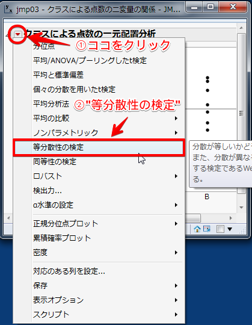

出力結果

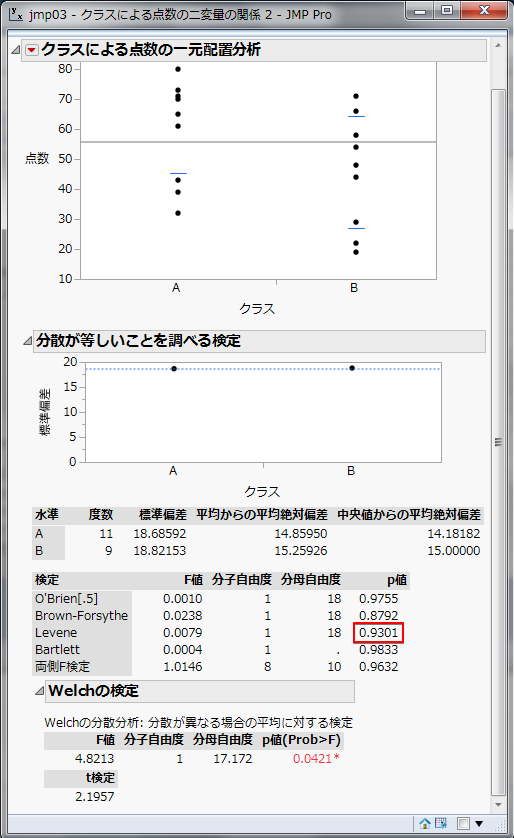

p値＝0.9301 が求まりました。設定した有意水準&alpha;は 0.05 です。よって、p値＝0.9301＞有意水準&alpha;＝0.05 であるので、等分散性があることがわかりました。

 7.続いて、[▼クラスによる点数の一元配置分析]の[▼]をクリック - [平均/ANOVA/プーリングしたt検定]を選択します。

出力結果

p値＝0.0413 が求まりました。設定した有意水準&alpha;は 0.05 です。よって、p値＝0.0413＜有意水準&alpha;＝0.05 であるので、帰無仮説H0は棄却されます。したがって、Ａ組とＢ組で点数の母平均には差があると判断します。

### JMPで検定結果を視覚的に見る方法

[▼クラスによる点数の一元配置分析]の[▼]をクリック - [平均の比較] - [各ペア,Studentのt検定]を選択します。

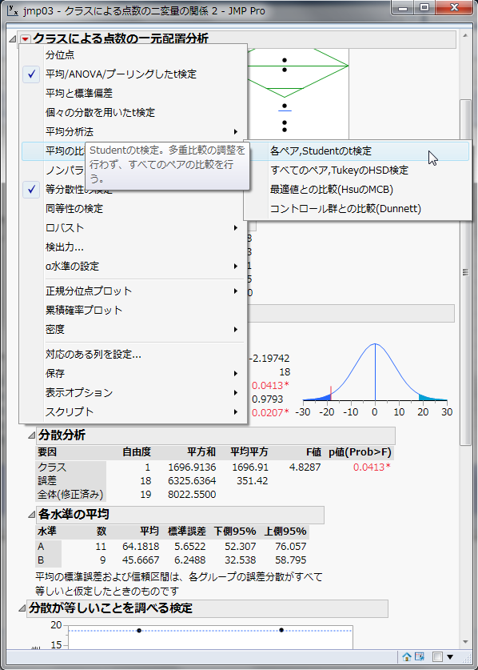

出力結果

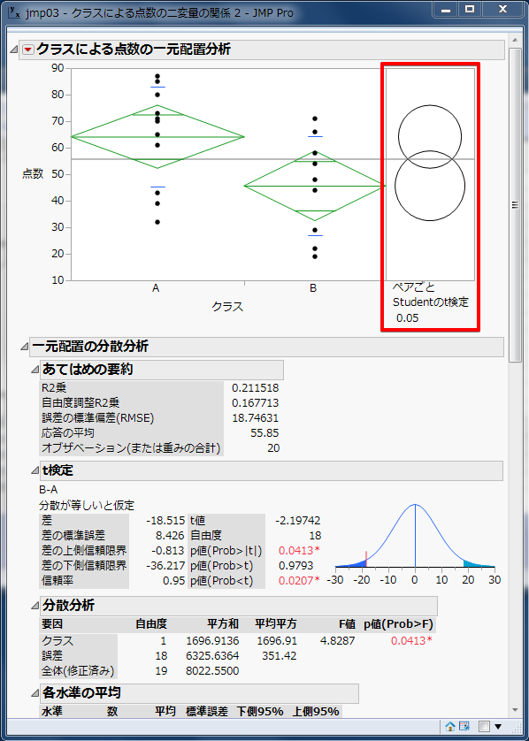

この2つの円の直径は 95 ％の信頼区間を表しています。この2つの円の重なり具合によって、有意差があるかどうかを見極めることができます。
有意差なし

有意差有り

等分散を仮定したときの2つの母平均の差の推定（対応のないデータ）
--------------
母平均の差&mu; A－&mu; Bの(1-&alpha;)×100 ％信頼区間は、以下の式で求められます。

#### JMPの操作

練習 1 を継続して用います。出力結果を見てください。

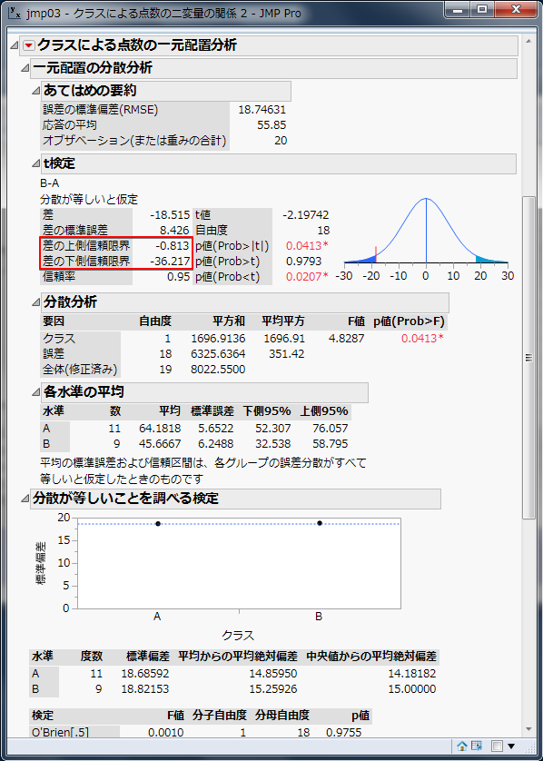

"t検定"から"差の上側信頼限界"と"差の下側信頼限定"を見ます。母平均の差&mu; A－&mu; Bの 95 ％信頼区間は、0.813＜&mu; A－&mu; B＜36.217 となります。

---

## 等分散を仮定しないときの2つの母平均の差の検定・推定（対応のないデータ）

※等分散を仮定しないときには検定のみになるので、推定に関しては省略する。

### 練習 2

ある学校のＣ組とＤ組のテスト結果について調べたところ、以下のような結果が得られました。Ｃ組とＤ組ではクラスの平均点に差があるといえるでしょうか。

表 2 ：ある学校のテスト結果（点）

#### 仮説の設定

* 帰無仮説H0：&mu; A＝&mu; B　Ｃ組とＤ組では平均点に差があるとはいえない
* 対立仮説H1：&mu; A≠&mu; B　Ｃ組とＤ組では平均点に差がある

#### 有意水準&alpha;の設定

有意水準&alpha;＝0.05 とします。

#### 検定統計量t値の算出（Welchのt検定）

今回は、以下の数式で検定統計量t値を求めます。

#### 等価自由度&phi;*の算出

以下の数式で、等価自由度&phi;*を求めます。

#### p値の算出

有意水準と比較する確率p値を求めます。p値は、自由度&phi; *において、|t|以上の値が発生する確率です。

#### 判定

p値&le; 有意水準&alpha;　→　帰無仮説H0を棄却する。

p値＞有意水準&alpha;　→　帰無仮説H0を棄却しない。

#### JMPの操作

JMPを用いて、練習 2 に取り掛かりましょう。

 1.まず、表 2 を入力しましょう。練習 1 と同じように、 1 列目は[列名]に"クラス"と入力し、データタイプを[文字]、尺度を[名義尺度]、 2 列目は[列名]に"点数"と入力し、データタイプを[数値]、尺度を[連続尺度]と選択して列を作成してください。

 2.メニュー[分析] - [二変量の関係]を選択します。

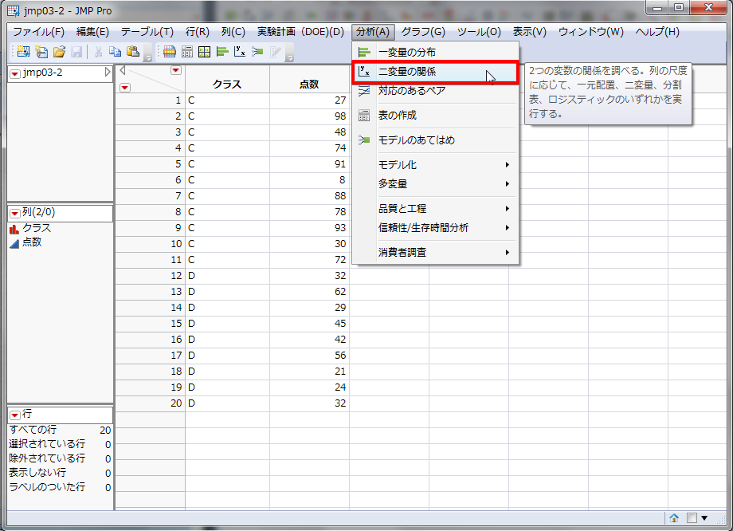

 3.[列の選択]の中にある[クラス]をクリック - [X,説明変数]をクリック - [列の選択]の中にある[点数]をクリック - [Y,目的変数]をクリック - [OK]を押します。

 4.[▼クラスによる点数の一元配置分析]の[▼]をクリック - [等分散性の検定]を選択します。

出力結果

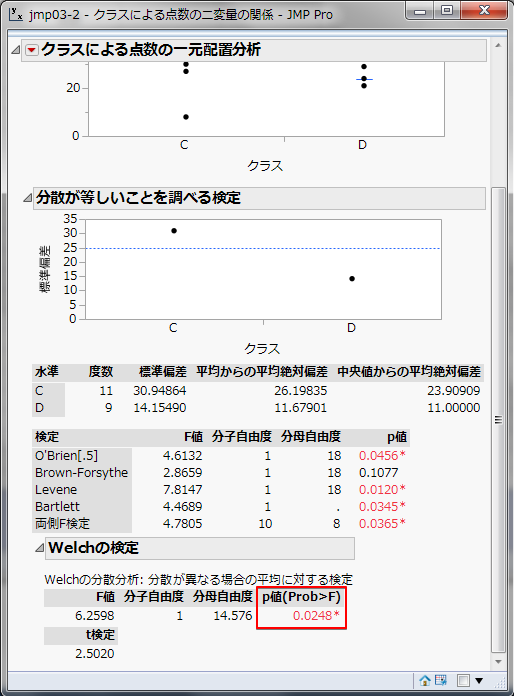

Welchの分散分析の部分から、p値＝0.0248 が求まりました。よって、p値＝0.0248＜有意水準&alpha;＝0.05 であるので、Ｃ組とＤ組では点数の母平均に違いがあると判断されたことになります。

2つの母平均の差の検定（対応のあるデータ）
--------------
### 練習 3

次のデータはある通年授業における、大学生 12 人の前期試験と後期試験の評点を示したものです。後期試験の成績（Ｂ）は、前期試験の成績（Ａ）よりも向上していると考えられるでしょうか。

表 3 ：試験の評点（点）

#### 仮説の設定

* 帰無仮説H0：&mu; B－&mu; A＝0　後期の成績は前期の成績より向上しているとはいえない
* 対立仮説H1：&mu; B－&mu; A＞0　後期の成績は前期の成績より向上している

#### 有意水準&alpha;の設定

有意水準&alpha;＝0.05 とします。

#### 各ペアごとの差の算出

前期の評点と後期の評点を1つのペアとして扱います。

di＝xAi－xBi

この式から、各ペアごとの差を求めます。さらに、差diの平均値と分散Vdの算出を行います。

#### 検定統計量t値の算出

今回は、以下の式で検定統計量t値が求まります。

#### p値の算出

有意水準と比較する確率p値を求めます。p値は、自由度&phi;＝n－1 のt分布において、|t|以上の値が発生する確率です。

#### 判定

p値&le;有意水準&alpha;　→　帰無仮説H0を棄却する。

p値＞有意水準&alpha;　→　帰無仮説H0を棄却しない。

#### JMPの操作

JMPを用いて、練習 3 に取り掛かりましょう。

1.まず、表 3 を入力します。
 * 1 列目は[列名]に"前期"と入力し、データタイプは[数値]、尺度は[連続尺度]
 * 2 列目は[列名]に"後期"と入力し、データタイプは[数値]、尺度は[連続尺度]
このように列を作成してください。

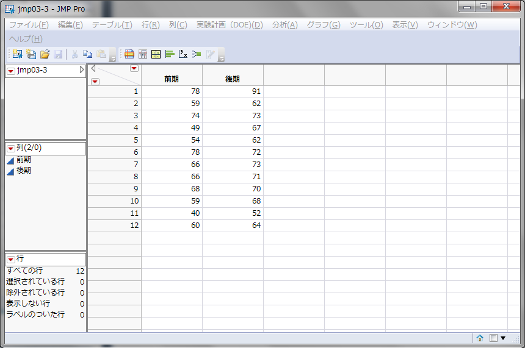

2.メニュー[分析] - [対応のあるペア]を選択します。

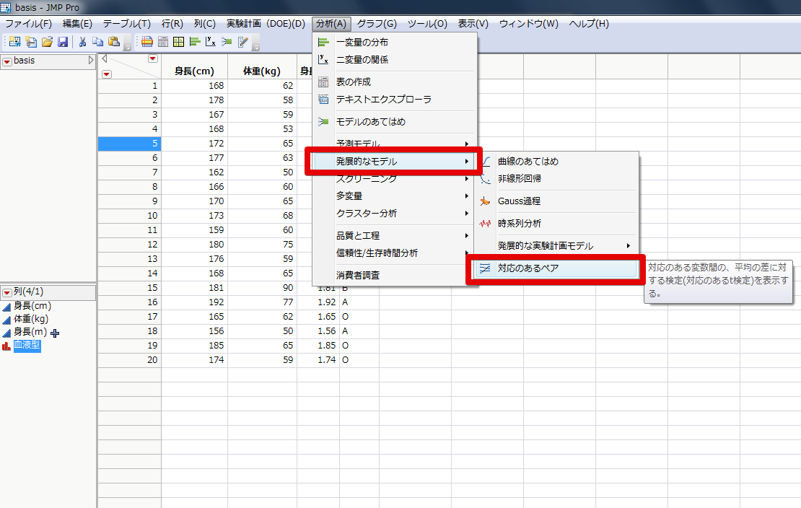

3.[列の選択]の中にある[前期]をクリック - [Y,対応のある応答]をクリック - [列の選択]の中にある[後期]をクリック - [Y,対応のある応答]をクリック - [OK]を押します。

出力結果

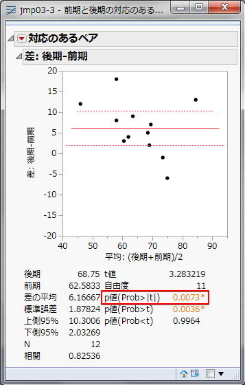

p値＝0.0073 が求まりました。よって、p値＝0.0073＜有意水準&alpha;＝0.05 であるので、帰無仮説H0は棄却されます。前期の平均点 60.5833 と後期の平均点 68.75 には有意差があることがわかり、後期試験の成績（Ｂ）は、前期試験の成績（Ａ）よりも向上していると判断できます。

2つの母平均の差の推定（対応のあるデータ）
--------------
母平均の差&mu; B－&mu; Aの(1－&alpha;)×100 ％信頼区間は、以下の通りです。

#### JMPの操作

練習3を継続して用います。出力結果を見てください。

"上側95％信頼限界"と"下側95％信頼限界"を読みます。母平均の差&mu; B－&mu; Aの 95 ％信頼区間は、2.03269＜&mu; B－&mu; A＜10.3006 になります。この間に 95 ％の確率で母平均の差があることになります。

課題 1
--------------

Ａ、Ｂの両地方で収穫した同種の大豆のタンパク質の含有率を調べたところ、次の結果が得られました。含有率の正規性を仮定して、地方差が認められるか、有意水準 5 ％で検定してください。

表 4 ：Ａ、Ｂ地方の大豆のタンパク質含有率（％） 

課題 2
--------------

次のデータはＡ市内のあるレストランとＢ市内のあるレストランのアルバイトの時給を示しています。2地域のレストランのアルバイトの時給に差はあるでしょうか。

表 5 ：Ａ市、Ｂ市のあるレストランのアルバイトの時給（円）

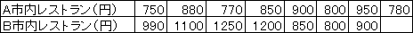

課題 3
--------------

次のデータは 7 人があるダイエット法によりダイエットを行った前後の体重を表しています。このダイエット法で体重の変化は見られたと言って良いでしょうか。また、2つの母平均の差を信頼率 95 ％で区間推定してください。

表 6 ：あるダイエット法の前後の体重(kg) 

