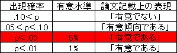
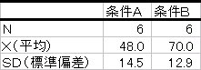
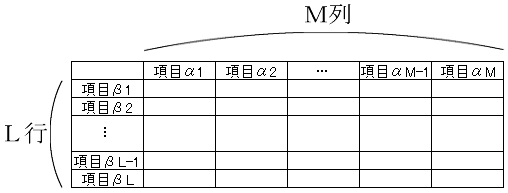
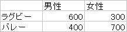
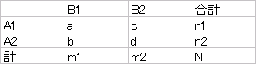
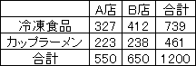
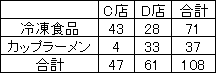
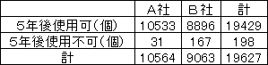
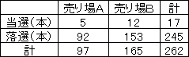

有意水準について
----------------

例えば、2つの平均値の差を検討したい場合、まず「2つの母平均に差はない」と仮定を立てます。これを帰無仮説といいます。
そして、データから統計検定量($z$値や$t$値など)を算出して、その統計検定量が出現する確率を求めます。
その際、その確率と比較する基準となる値を設けますが、これを有意水準と呼びます。

統計検定量の起こる確率がこの有意水準よりも小さいとき、偶然でなく、まれなことが起こった、
すなわち統計的に有意なことが起こったと考え、帰無仮説が誤りだったと考えます。
したがって、この場合、帰無仮説は棄却され、2つの母平均に差はないとはいえないという結論に至ります。
有意水準は、一般的には、 5 ％を用います。より小さな 1 ％を用いる場合もあります。
 ％に比べて、 1 ％の方がより条件としてはシビアになります。

### 論文表現

論文中で、母平均の差に関する検定を書くとこのようになります。

>   表は、条件Ａと条件Ｂの平均、および標準偏差を示したものである。
>   t検定の結果、両条件の平均の差は有意であった$( t(10) = 2.53,\ p < .05 )$。
>   したがって、条件Ａより、条件Ｂの方が優れた成績をあげるといえる。

分割表（クロス集計表）の分析
----------------------------

### 分割表とグラフ表現

分割表とは、縦横の各項目について、別々に考える表のことです。縦の項目を行と呼び、横の項目を列と呼びます。
縦の項目がＬ個、横の項目がＭ個ある表のことをＬ行Ｍ列分割表と呼びます。簡単にＬ&times;Ｍ分割表と呼ぶこともあります。

例えば、男性 1000 人、女性 1000 人にラグビーとバレーのどちらが好きか聞いたとします。
男性は 600 人がラグビー、 400 人がバレーと答えました。女性は 300 がラグビー、 700 人がバレーと答えました。
その回答を分割表にするとこのようになります。

これは縦にスポーツ競技、横に性別をとった２行２列分割表です。
この表を見れば、男性と女性がどれだけの人数がラグビーを好きか、バレーを好きかがわかります。

この分割表はクロス集計表と言われることもあります。

### 練習問題1

次のデータは、 ある地域の成人男性 25 人、女性 25 人の合計 50 人に、今住んでいる地域に愛着が有るか無いかの意見を聞き、その結果を表にしたものです。
このデータを集計し、分割表に整理しましょう。

表 1 ：ある地域の愛着に対する意見

### JMPの操作

&#9312; 表 1 のデータを入力します。列を新規作成します。

-   1 列目に[列名]を `性別` と入力し、データタイプを[文字]、尺度を[名義尺度]
-   2 列目に[列名]を `意見` と入力し、データタイプを[文字]、尺度を[名義尺度]

このように列を作成してください。







&#9313; メニュー[分析] - [二変量の関係]をクリックします。



&#9314; [列の選択]の中にある[性別]をクリック - [X,説明変数]をクリック - [列の選択]の中にある[意見]をクリック - [Y,目的変数]をクリック - [OK]をクリックします。





&#9314; [▼分割表]の[▼]をクリック - [度数]以外のチェックを外します。



#### 出力結果



このようにして分割表を表示することができます。

*このファイルは後にも使うので、消さないように！*

分割表の検定
------------

2 行 2 列分割表は 2 つの母比率の差で分析します。
検定法には、フィッシャー（Fisher）の正確検定とピアソン（Pearson）の&chi;2検定があります（「独立性の検定」とも言います）。

* 帰無仮説$H_0$：$A1(A2)$の発生する確率は、$B1$と$B2$で同じである
* 対立仮説$H_1$：$A1(A2)$の発生する確率は、$B1$と$B2$で同じではない

分割表の検定（集計結果型のデータの場合）
----------------------------------------

### 練習問題2

ある食品会社では、ある冷凍食品とカップラーメンをＡ店とＢ店で販売しています。
Ａ店とＢ店において、1ヶ月の各商品の売り上げ数に差があるかどうか調査を行いました。
その結果を整理したのが、次の 2 行 2 列分割表です。
Ａ店とＢ店で冷凍食品とカップラーメンの売り上げ数に違いがあるか検定してください。

表2：Ａ店とＢ店における各商品の売り上げ数の結果（個）

### 仮説の設定

* 帰無仮説$H_0$：Ａ店とＢ店で冷凍食品とカップラーメンの売り上げ数は同じである
* 対立仮説$H_1$：Ａ店とＢ店で冷凍食品とカップラーメンの売り上げ数は同じではない

### 有意水準$\alpha$の設定

有意水準$\alpha$ = 0.05 とします。

### 検定統計量$ \chi^2 $（カイじじょう）値の算出

今回は、以下の数式で求まります。

\begin{align}
  \chi ^2 = \frac{(ad-bc)^2 \times N}{n_1 \times n_2 \times m_1 \times m_2}
\end{align}

### 判定

<dl>
<dt>$\chi ^2 \geq \chi ^2(1, \alpha)$</dt>
<dd>帰無仮説$H_0$を棄却する</dd>
<dt>$\chi ^2 < \chi ^2(1, \alpha)$</dt>
<dd>帰無仮説$H_0$を棄却しない</dd>
</dl>

### JMPの操作

&#9312; まず、表 3 のデータをJMPに入力します。列を新規作成します。

-   1 列目は[列名]に `店舗` と入力し、データタイプは[文字]、尺度は[名義尺度]
-   2 列目は[列名]は `商品` と入力し、データタイプは[文字]、尺度は[名義尺度]
-   3 列目は[列名]は `売り上げ数` と入力し、データタイプは[数値]、尺度は[連続尺度]

このように列を作成してください。









&#9313; メニュー[分析] - [二変量の関係]をクリックします。



&#9314; [列の選択]の中にある[店舗]をクリック - [X,説明変数]をクリック - [列の選択]の中にある[商品]をクリック - [Y,目的変数]をクリック - [列の選択]の中にある[売り上げ数]をクリック - [度数]をクリック - [OK]をクリックします。



&#9315; [▼分割表]の[▼]をクリック - [度数]以外のチェックを外します。





#### 出力結果



$p$値 = 0.1631 が求まりました。
$p$値 = 0.1631 $>$ 有意水準$\alpha$ = 0.05 であるので、帰無仮説$H_0$は棄却されません。
よって、Ａ店とＢ店の売り上げ数に違いがあるとはいえません。

### 論文では

$i \times j$ 表の自由度 $= df = (i-1) \times (j-1)$ となります。
よって、論文中では、このようになります。

>   表 2 に関して、$\chi^2$検定を行ったところ、有意差は認められなかった（$\chi ^2 (1) = 1.945,\ p > .05$）。
>   よって、Ａ店とＢ店で冷凍食品とカップラーメンの売り上げ数に違いがあるとはいえない。

分割表の検定（生データの場合）
------------------------------

練習問題1 が生データに相当します。表 1 の出力結果を見ます。



$p$値 = 0.0833 $>$ 有意水準$\alpha$ = 0.05 であるので、帰無仮説$H_0$（男性と女性の意見は同じである）は棄却できません。
よって、男性と女性で地域の愛着に違いがあるとはいえません。

### 論文では

論文中では、このようになります。

>   表1をクロス集計した後、$\chi^2$検定を行ったところ、有意差は認められなかった（$\chi ^2 (1) = 3.00,\ p > .05$）。
>   よって、男性と女性で地域の愛着に違いがあるとはいえない。

分割表の検定（度数が 5 未満の場合）
-----------------------------------

度数が 5 未満のときはフィッシャーの検定を行います。

### 練習問題3

ある1日のＣ店とＤ店における冷凍食品とカップラーメンの売り上げ数に違いがあるか検定してください。

表 3 ：Ｃ店とＤ店における冷凍食品とカップラーメンの売り上げ数の結果（個）

### JMPの操作

練習問題2 と同じように操作してください。

&#9312; まず、表2のデータをJMPに入力します。列を新規作成します。

- 1 列目は[列名]に `店舗` と入力し、[データタイプ]は[文字]、[尺度]は[名義尺度]
- 2 列目は[列名]は `商品` と入力し、[データタイプ]は[文字]、[尺度]は[名義尺度]
- 3 列目は[列名]は `売り上げ数` と入力し、[データタイプ]は[数値]、[尺度]は[連続尺度]

このように列を作成してください。



&#9313; メニュー[分析] - [二変量の関係]をクリックします。



&#9314; [列の選択]の中にある[店舗]をクリック - [X,説明変数]をクリック - [列の選択]の中にある[商品]をクリック - [Y,目的変数]をクリック - [列の選択]の中にある[売り上げ数]をクリック - [度数]をクリック - [OK]をクリックします。



&#9315; [▼分割表]の[▼]をクリック - [度数]以外のチェックを外します。





#### 出力結果



$p$値$<$ .0001* が求まりました。$<$ .0001*は0.0001よりも十分に小さいという意味です。
$p$値$<$ 0.0001 $<$ 有意水準 $\alpha$ = 0.05 であるので、帰無仮説$H_0$（Ｃ店とＤ店で売り上げ数は同じである）は棄却されます。
よって、Ｃ店とＤ店で冷凍食品とカップラーメンの売り上げ数に違いがあるといえます。

### 論文では

論文中では、このようになります。

>   表3に関して、フィッシャーの検定を行ったところ、有意差（$p < .05$）が認められた。
>   よって、Ｃ店とＤ店で冷凍食品とカップラーメンの売り上げ数に違いがあるといえる。

課題1
------

次の表は、 2つのメーカーのデジタルカメラの 5 年後の状況を追跡調査した結果です。
Ａ、Ｂ社それぞれに使用ができなくなったカメラが出ています。
どちらのメーカーのデジタルカメラを購入したほうが長持ちする傾向があるのでしょうか、有意水準 5 ％で検定しなさい。
但し、不良品や事故により壊れた台数は除いてあります。

表 4 ： 5 年後のデジタルカメラの使用状況（個）

課題2
------

次の表は、ある 2つの宝くじ売り場の先月の当選・落選の本数です。
売り場の違いにより当選のしやすさには差が見られるでしょうか。
有意水準 5 ％で検定しなさい。（当選金額は全て同額です。）

表 5 ：ある 2つの宝くじ売り場の先月の当選状況（本）

