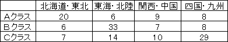
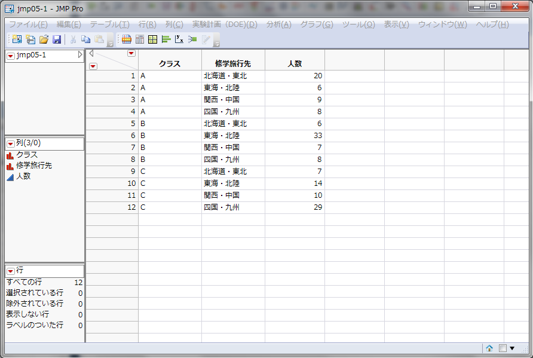
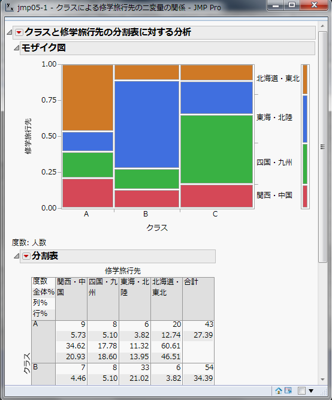
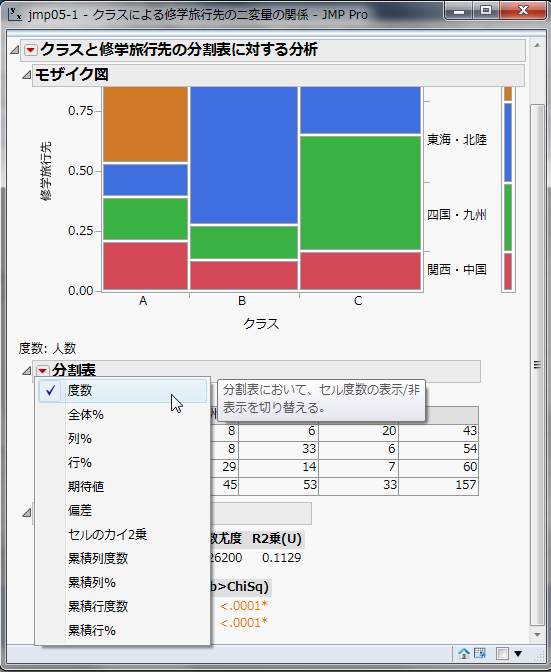
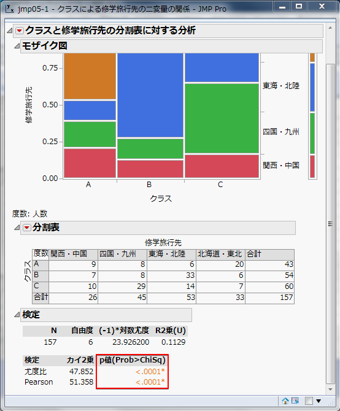
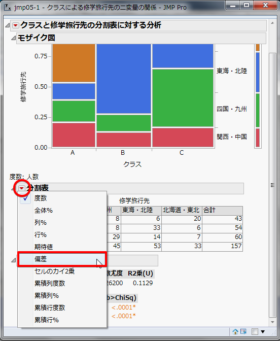
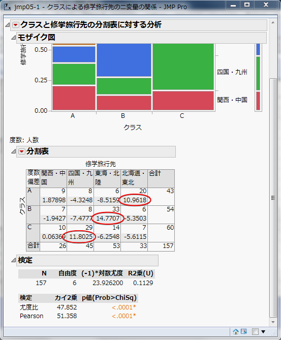
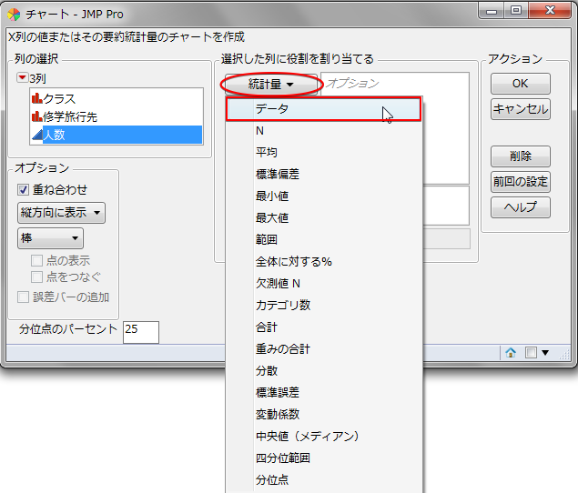

Ｍ行Ｎ列分割表の検定
--------------------

### 練習問題1

都内のある学校で、修学旅行先の希望調査を行いました。
クラスは、Ａ、Ｂ、Ｃの 3 クラスあります。調査結果を整理したのが、次の 3 行 4 列分割表です。
各クラスの希望の傾向は同じといえるでしょうか。検定してください。

表 1 ：各クラスの修学旅行先の希望数（人）

### 検定の手順

#### 仮説の設定

* 帰無仮説H0：各クラスの修学旅行先の希望の傾向は同じである
* 対立仮説H1：各クラスの修学旅行先の希望の傾向には違いがある

#### 有意水準&alpha;の設定

有意水準&alpha; = 0.05 とします。

#### 検定統計量&chi; 2値の算出

今回、検定統計量&chi; 2は以下の数式で求まります。

#### 自由度の算出

自由度&phi;は以下の数式で求まります。

#### 判定

<dl>
<dt>&chi;2 &ge; &chi;2(1,&alpha;)</dt>
<dd>帰無仮説H0を棄却する</dd>
<dt>&chi;2 &lt; &chi;2(1,&alpha;)</dt>
<dd>帰無仮説H0を棄却しない</dd>
</dl>

### JMPの操作

&#9312; まず、表 1 のデータをJMPに入力していきます。

-   [列名]に `クラス` と入力し、データタイプは[文字]、尺度は[名義尺度]
-   [列名]に `修学旅行先` と入力し、データタイプは[文字]、尺度は[名義尺度]
-   [列名]に `人数` と入力し、データタイプは[数値]、尺度は[連続尺度]

このように列を作成してください。

&#9313; メニュー[分析] - [二変量の関係]を選択します。

&#9314; [列の選択]の中の[クラス]をクリック - [X,説明変数]をクリック - [列の選択]の中の[修学旅行先]をクリック - [Y,目的変数]をクリック - [列の選択]の中の[人数]をクリック - [度数]をクリック - [OK]をクリックします。

&#9315; [▼分割表]の[▼]をクリック - [度数]以外のチェックを外します。

#### 出力結果

p値 &lt; 0.0001 が求まりました。p値 &lt; 0.0001 &lt; 有意水準&alpha; = 0.05 なので、帰無仮説H0は棄却されます。
よって、各クラスの修学旅行先の希望の傾向には違いがあるといえます。

&lt;.0001* とは、値が 0.0001よりも十分に小さいという意味です。

### 論文では

論文では以下のような文章になります。

>   表 1 に関して、&chi; 2検定を行ったところ、有意差が認められた(&chi; 2(6) = 51.358,p &lt; .05)。
>   よって、各クラスの修学旅行先の希望の傾向には違いがあるといえる。 

### Ｍ行Ｎ列分割表の残差（偏差）のチェック

[▼分割表]の[▼]をクリック - [偏差]をチェックします。

#### 出力結果

残差とはこの場合、実測度数と期待度数との差のことです。残差の絶対値が大きいところが特徴的であるといえます。

残差を見てみると、Ａクラスは北海道・東北が 10.9618 と高く、Ｂクラスは東海・北陸が 14.7707、Ｃクラスは四国・九州が 11.8025 とそれぞれ高い数値を出しています。
このことから、Ａクラスは北海道・東北、Ｂクラスは東海・北陸、Ｃクラスは四国・九州に行きたいという傾向があることがわかりました。

Ｍ行Ｎ列分割表のグラフ表現
--------------------------

練習問題1 のグラフを作成します。

行の項目を横軸に取った棒グラフを列の項目ごとに作成します。

### JMPの操作

&#9312; メニュー[グラフ] - [チャート]をクリックします。

&#9313; [列の選択]の中の[人数]をクリック - [統計量]をクリック - [データ]をクリック - [列の選択]の中の[修学旅行先]をクリック - [カテゴリ,X,水準]をクリックします。

&#9314; [ &gt; その他の役割]をクリック - [列の選択]の中の[クラス]をクリック - [グループ変数]をクリック - [OK]をクリックします。

#### 出力結果

グラフにすることで各項目ごとのパターンの違いを把握できます。
ここでも、Ａクラスは北海道・東北、Ｂクラスは東海・北陸、Ｃクラスは四国・九州が多いということがわかりました。

対応分析（コレスポンデンス分析）
--------------------------------

いくつかの新しいファクターを発見し、そのファクターをものさしとして、カテゴリーあるいはサンプルの類似性やポジショニングを明らかにします。

### JMPの操作

練習問題1 を継続して用います。
 1.[▼クラスと修学旅行先の分割表に対する分析]の[▼]をクリック - [対応分析]をチェックします。

#### 出力結果

このように対応分析によって、どのクラスと修学旅行に行きたい場所が対応しているかを視覚的に見ることができます。

課題1
------

次の表は、ある年とその 10 年後に同じ小学校で体力測定を行った際の総合評価の結果です。
この 10 年の間に、体力測定結果からどのような変化が起こっていると考えられるでしょうか。
また、変化がみられた場合は残差分析を行い、それに基づいた変化の特徴を述べてください。
但し、評価は体力測定の各項目を合成した数値による絶対評価で、この 10 年間に基準の変更はなく、全て同じ項目を用いた結果とします。
（表中の数値は人数、評価はＡが最も高い）

表 2 ：ある年と 10 年後の体力測定の結果（人）

課題2
------

Ａ大学にて、パソコンを持っている学生を対象に、自宅でのパソコンの使用に関する調査を行いました。
その結果が次の表です。
パソコンの使用頻度が高い学生とそうでない学生には所属学部に傾向の違いがあるのでしょうか。有意水準 5 ％で検定してください。

表 3 ：Ａ大学のパソコンの使用状況（人）

