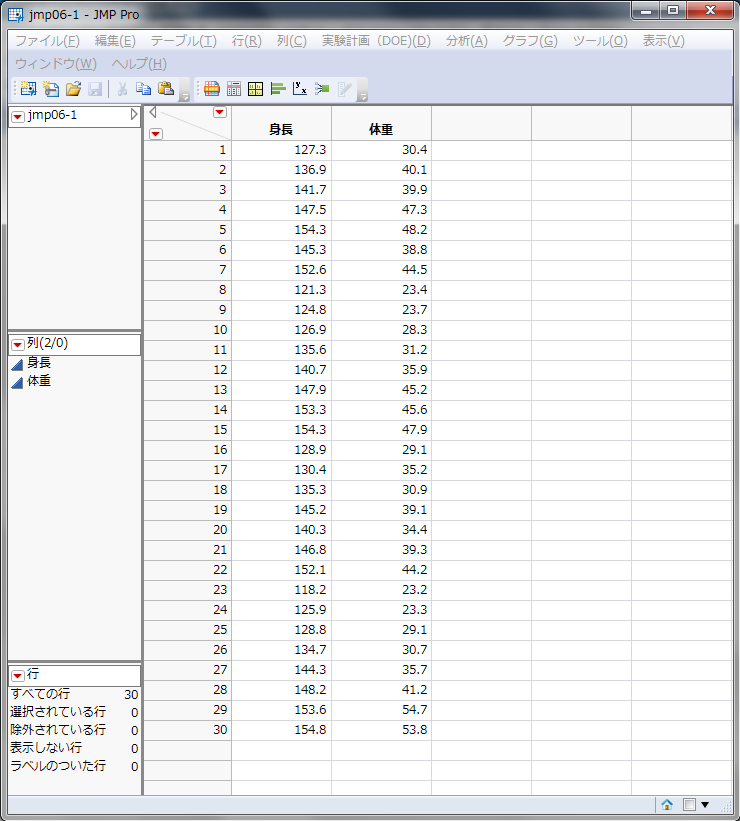
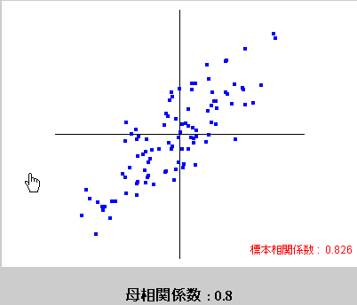
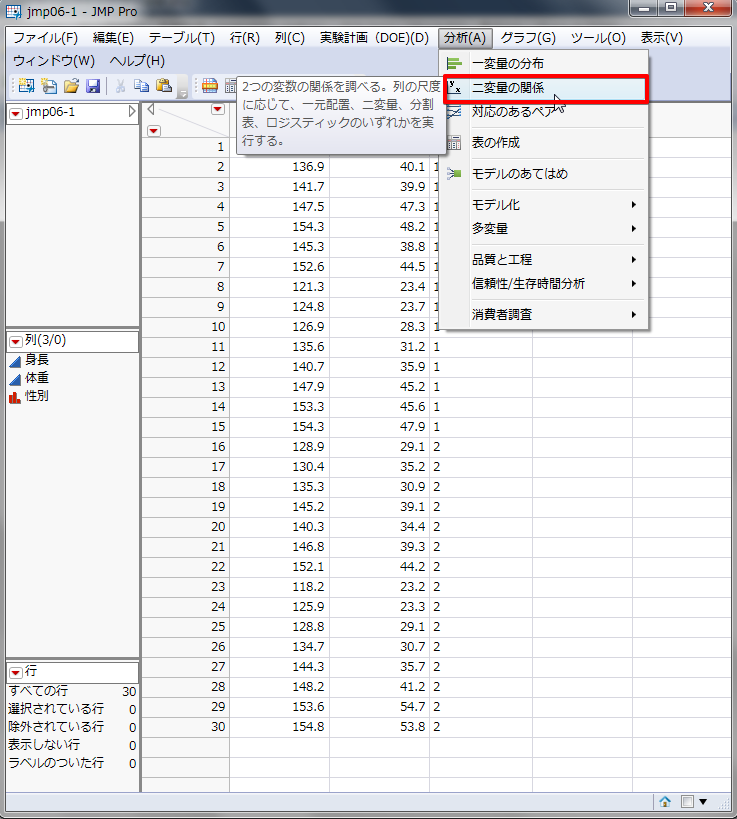
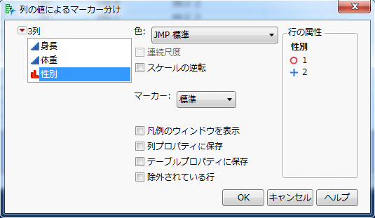
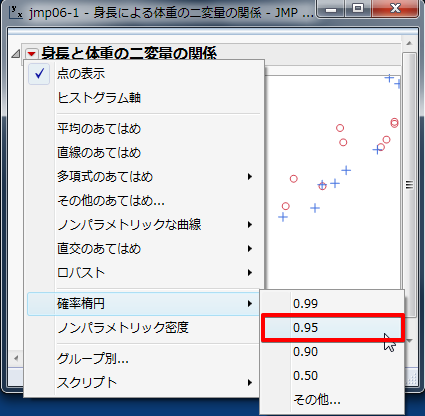
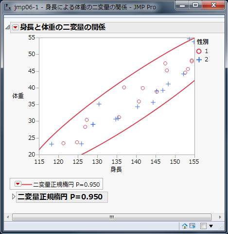
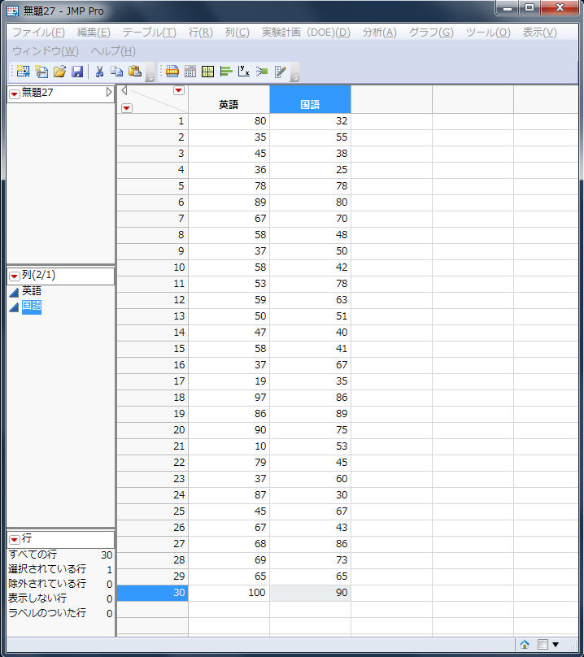
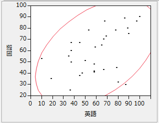

相関分析
--------

### 相関関係

2つの変数xとyがあるときに、xの変化に伴って、yも変化するような関係を「相関関係」といいます。
相関関係を調べるには散布図や相関係数を用います。

相関関係には正の相関関係と負の相関関係、無相関に分けられます。この正負は後で述べる相関係数によって変わります。

<dl>
<dt>正の相関関係</dt>
<dd>xが増加していったとき、yも増加している。xとyが比例している関係。</dd>
<dt>負の相関関係</dt>
<dd>xが増加していったとき、yは減少している。xとyが比例(傾きが負)している関係。</dd>
<dt>無相関</dt>
<dd>xとyに関係が見出せない。</dd>
</dl>

散布図
------

相関関係の有無を視覚的に表す図です。
2つの変数の内、一方を横軸にとり、もう一方を縦軸にとって、対応するデータを 1 点ずつプロットしていきます。

### 散布図の分析

散布図の分析では以下のような点に着目します。

* はずれ点がないか
* 2つの変数xとyの間にはどのような関係があるか
    * 直線
    * 曲線
    * 無関係
* グループが形成されているか

上図を見てみると、ある程度の点が身長 145～170、体重 40～70 の範囲でグループを形成しているように見えます。
そのグループは左下から右上がりになっていて、身長と体重には比例の関係があるように思われます。
体重 80 以上に幾つかはずれ点が見らますが、大幅に外れているとはいえなさそうです。

このように視覚的に分布を見ることによって、xとyの 2 変数の関係に方向性が見えてきます。
その方向性がデータをよく表しているかどうか、計算によって判定します。

### 練習問題1

次のデータは、ある小学校の児童30 人の身長（x）と体重（y）を測定したものです。
このデータをグラフで表現し、身長xと体重yの関係を把握してください。

表 1 ：30 人の身長と体重

文部科学省（2008）平成20年度学校保健統計調査

### JMPの操作

&#9312; まず、データをJMPに入力します。

* 1 列目は[列名]に `身長` と入力し、データタイプを[数値]、尺度を[連続尺度] 
* 2 列目は[列名]に `体重` と入力し、データタイプを[数値]、尺度を[連続尺度]

このように列を新規作成してください。

2 . メニュー[分析] - [二変量の関係]を選択します。

3 . [列の選択]の中にある[身長]をクリック - [X,説明変数]をクリック - [列の選択]の中にある[体重]をクリック - [Y,目的変数]をクリック - [OK]をクリックします。

#### 出力結果

出力された散布図を見ると、左下から右上がりに点が分布しているように見えます。
身長と体重には正の相関関係があるのかもしれません。それを確かめるために、次の項で相関係数を求めます。

相関係数
--------

相関係数は、相関関係の有無を数量的に調べるために用います。

>   相関係数rの範囲： -1 &le; r &le; 1

* 値が + のとき、正の相関関係があるといいます
* 値が - のとき、負の相関関係があるといいます
* 値が 0 に近い場合は、無相関であるといいます

相関係数rは以下の数式で求めることができます

また、相関係数の絶対値によって、その相関の強さがわかります。

 - 0.7&le;|r|強い相関あり

 - 0.4&le;|r| &lt; 0.7中程度の相関あり

 - 0.2&le;|r| &lt; 0.4弱い相関あり

 - |r| &lt; 0.2ほとんど相関なし

### 練習問題2

次のデータは、練習問題1 のデータに性別（1：男、2：女）の情報を追加したものです。
性別の違いがわかるような散布図を作成してください。

表 2 ：児童30 人の身長と体重

### JMPの操作

練習問題1 を継続して使用します。

&#9312; [列名]に `性別` と入力し、データタイプを[文字]、尺度を[名義尺度]で列を新規作成してください。

&#9313; メニュー[分析] - [二変量の関係]を選択します。

&#9314; [列の選択]の中にある[身長]をクリック - [X,説明変数]をクリック - [列の選択]の中にある[体重]をクリック - [Y,目的変数]をクリック - [OK]をクリックします。

&#9315; 散布図上で右クリック - メニュー内の[行の凡例]をクリックします。

&#9316; [性別]をクリック - マーカーに[標準]を選択 - [OK]をクリックします。

#### 出力結果

さらに、相関係数も算出します。

&#9317; [▼身長と体重の二変量の関係]の[▼]をクリック - [確率楕円]をクリック - [0.95]を選択します。

&#9318; [&gt; 相関]をクリックします。

#### 出力結果

相関係数r = 0.937538が求まりました。ここから、身長と体重には強い正の相関関係が成り立つということがわかります。
すなわち、身長が高くなるにつれて、体重は重くなっていくようだということがわかりました。

### 論文では

論文では下記のようになります。

>   表 2 に関して、相関係数を求めたところ、強い正の相関関係が認められた（r = 0.937538）。
>   よって、身長が高くなるにしたがって、体重は重くなる傾向があるといえる。

**なお、相関関係が見られたからといって、一方がもう片方の原因になっている、という因果関係が示されたわけではありませんので、注意しましょう。**

相関係数の検定
--------------

### 練習問題課題3

次のデータは、ある学校の生徒の国語と英語の期末テストの結果を 30 人分示したものです。
国語と英語の相関係数を求め、無相関の検定をしてください。

表 3 ： 生徒 30 人の国語と英語の期末テストの結果（点）

### 無相関の検定

幾つかの標本が得られたときに、その相関係数を求めます。
その標本から得られた相関係数rとは別に母集団の母相関係数&rho; （ロー）が存在します。

<dl>
<dt>母集団の相関係数</dt>
<dd>母相関係数&rho;</dd>
<dt>標本の相関係数</dt>
<dd>（標本）相関係数r</dd>
</dl>

標本は母集団全体を表しているわけではないので、母相関係数&rho; = 相関係数r とは言えません。
母相関係数&rho; = 0 でも相関のある標本が抽出された場合もありえます。

そこでまず、母相関係数&rho; = 0 かどうかを検定します。これを無相関の検定と言います。

#### 仮説の設定

* 帰無仮説H0：&rho; = 0　母相関係数は 0 である（相関係数が存在しない）
* 対立仮説H1：&rho; &ne; 0　母相関係数は 0 ではない（相関係数が存在する）

#### 有意水準&alpha; の設定

有意水準&alpha; = 0.05 とします。

#### 検定統計量t値の算出

今回は以下の数式で検定統計量t値を求められます。

#### p値の算出

有意水準と比較する確率p値を計算します。p値はt分布において、|t|以上の値が発生する確率です。

#### 判定

<dl>
<dt>p値 &le; 有意水準&alpha;</dt>
<dd>帰無仮説H0を棄却する</dd>
<dt>p値 &gt; 有意水準&alpha;</dt>
<dd>帰無仮説H0を棄却しない</dd>
</dl>

### JMPの操作

&#9312; まず、表 3 をJMPに入力します。

- [列名]に `英語` と入力し、データタイプは[数値]、尺度は[連続尺度]
- [列名]に `国語` と入力し、データタイプは[数値]、尺度は[連続尺度]

このように列を作成します。

&#9313; メニュー[分析] - [二変量の関係]を選択します。

&#9314; [列の選択]の中にある[英語]をクリック - [X,説明変数]をクリック - [列の選択]の中にある[国語]をクリック - [Y,目的変数]をクリック - [OK]をクリックします。

&#9315; 相関係数を算出します。[▼英語と国語の二変量の関係]の[▼]をクリック - [確率楕円]をクリック - [0.95]をクリックします。

&#9316; [&gt; 相関]をクリックします。

#### 出力結果

p値 = 0.0105が求まりました。p値 = 0.0105 &lt; 有意水準&alpha; = 0.05 なので帰無仮説H0は棄却されます。
すなわち、国語の点数と英語の点数の間には、相関係数が存在するということがわかりました。
また、相関係数は 0.460322 と正の中程度の相関が認められたので、国語の点数が増加すると英語の点数が増加すると判断されました。

### 論文では

論文では以下のような形になります。

>   国語と英語の平均および標準偏差(n = 30)
>   
>   上の表は、表 3 の国語の点数と英語の点数の平均および標準偏差を示したものである。
>   
>   また、上図はその散布図である。相関係数 = 0.460 であり、t検定を行ったところ有意であった（p &lt; .05）。
>   よって、国語の点数が増加すると英語の点数が増加するといえる。

課題
----

次の表は、あるクラスの生徒 10 名を対象に行った家庭での書籍数と国語の試験結果（得点）の調査をまとめた表です。
書籍数と国語の得点には相関関係が見られるでしょうか。相関係数を求め、無相関検定をし、相関関係を考察してください。

表 4 ：書籍数（冊）と得点（点）

