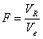
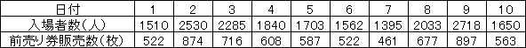

回帰分析
--------

### 変数の関係を探る流れ

相関分析では、２変数の関係がわかりました。
しかし、これだけでは因果関係は明らかではありません。
そこで、２つの変数間の関係式を作ることで因果関係を調べる分析を行います。
これが **回帰分析** です。

回帰分析では、例えば、x、yの2 変数について、xを説明変数、yを目的変数として関係を表す式を求めます。
ただし、関係式は完全にはxとyの関係を表しきれていない場合が多くあります。

<dl>
<dt>単回帰分析</dt>
<dd><pre>y = a + bx</pre>xからyを予測しようとする分析です</dd>
<dt>重回帰分析</dt>
<dd>２次以上で用います（今回は省略）<pre>y = a + bx + cx2</pre></dd>
</dl>

単回帰分析
----------

一方の変数の値から他方の変数の値を予測する直線を単回帰直線といいます。

#### 単回帰式の求め方

対になったデータxiとyi(i = 1, 2, &hellip; ,n)から単回帰式y = a + bx（a：切片、b：回帰係数）を求めるには以下の数式を用います。

&#9312; 

&#9313; 

#### 最小 2 乗法

回帰式は完全に 2 変数xとyの関係を表せているとは限りません。
得られたデータx、yの関係をできる限り的確に表すために直線y = a + bxと各データの距離を考えます。
i番目のデータ(xi,yi)とこの直線との距離をQiとすると、以下の数式になります。

このQiの合計を最小にすることによって、2 変数xとyの関係を表すのに最も適した直線式を求めることができます。
が最小の時に上記①式と②式から得られるbとaがそれぞれ回帰係数と切片になります。

### 練習問題

次のデータは、ある車種における中古車の価格と走行距離について 30 台分示したものです。
走行距離（x）から中古車の価格（y）を予測する次のような 1 次の回帰式を求めてください。

表 1 ：ある車種 30 台の中古車価格と走行距離

#### 仮説の設定

* 帰無仮説H0：回帰式は統計的に意味がない
* 対立仮説H1：回帰式は統計的に意味がある

#### 有意水準&alpha; の設定

有意水準&alpha; = 0.05とします。

#### JMPの操作

&#9312; まず、データをJMPに入力します。

- [列名]に `中古車価格` と入力し、データタイプは[数値]、尺度は[連続尺度]
- [列名]に `走行距離` と入力し、データタイプは[数値]、尺度は[連続尺度]

このように列を新規作成します。





&#9313; メニュー[分析] - [二変量の関係]を選択します。



&#9314; [列の選択]の中にある[走行距離]をクリック - [X,説明変数]をクリック - [列の選択]の中にある[中古車価格]をクリック - [Y,目的変数]をクリック - [OK]をクリックします。



&#9315; 回帰式を算出します。[▼走行距離と中古車価格の二変量の関係]の[▼]をクリック - [直線の当てはめ]を選択します。



#### 出力結果



出力結果から、回帰式 `y = 110.471471 - 3.3149947x` が求まりました。

### 回帰式の吟味

回帰式によって予測したyの値と、実際のyの値との差を**残差（誤差）**といいます。
この残差を用いて、作った回帰式に統計的な意味があるかどうかの検定を行うことができます。

#### 回帰の平方和SRと残差の平方和Seの計算

SRとSeはそれぞれ以下の数式で求めることができます。

#### 回帰の分散VRと残差の分散Veの計算

VRとVeはそれぞれ以下の数式で求めることができます。

#### 検定統計量F値の計算

今回、検定統計量F値は以下の数式で求めることができます。

#### 寄与率

目的変数yの変動のうち、説明変数xによって説明できる割合を寄与率R2、もしくは決定係数R2といいます。

>   0 &le; 寄与率R2 &le; 1

1 に近いほどうまく説明できていると判断します。

単回帰分析では、寄与率R2 = (相関係数r)2 となります。

#### p値の算出

有意水準&alpha; と比較する確率p値を計算します。p値はF分布において、F以上の値が発生する確率です。

#### 出力結果から



p値&lt; .0001*が求まっています。
p値&lt; .0001&lt; 有意水準&alpha; = 0.05なので、帰無仮説H0は棄却されます。
従って、回帰式は統計的に意味があることになります。

### 論文では

論文では以下のようになります。

> 回帰式に関して、F検定を行ったところ、有意であった（F(1,28) = 561.4005,p&lt; .05）。よって、回帰式は統計的に意味がある。

課題
----

次の表は、あるアミューズメント施設の入場者数と前売り券の販売枚数を 10 日にわたり調査した結果です。
入場者数を目的変数（ｙ）、前売り券の販売枚数を説明変数（ｘ）として、回帰直線を求め、その後、回帰式の検定を行ってください。
回帰式が有意である場合、前売り券が 700 枚売れたとき、当日入場者数はどのくらい見込めると予測できるでしょうか？

表 2 ：入場者数と前売り券販売枚数

