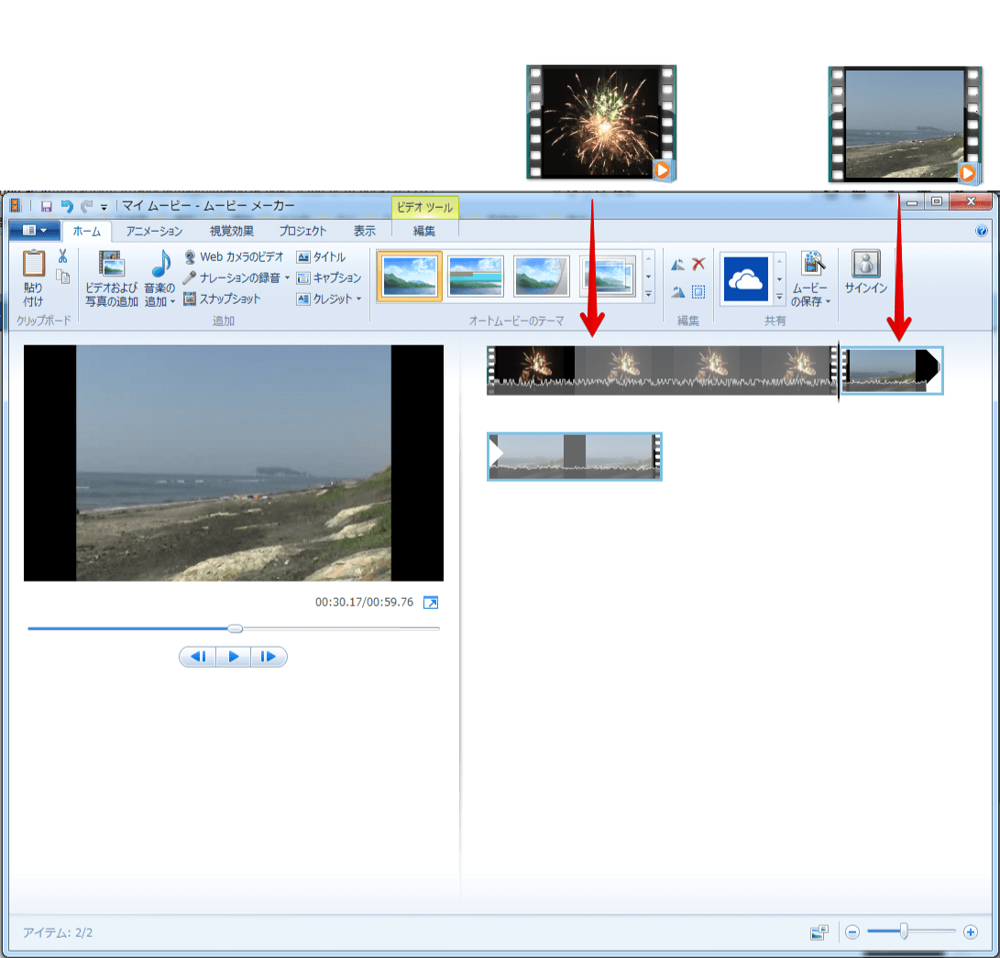
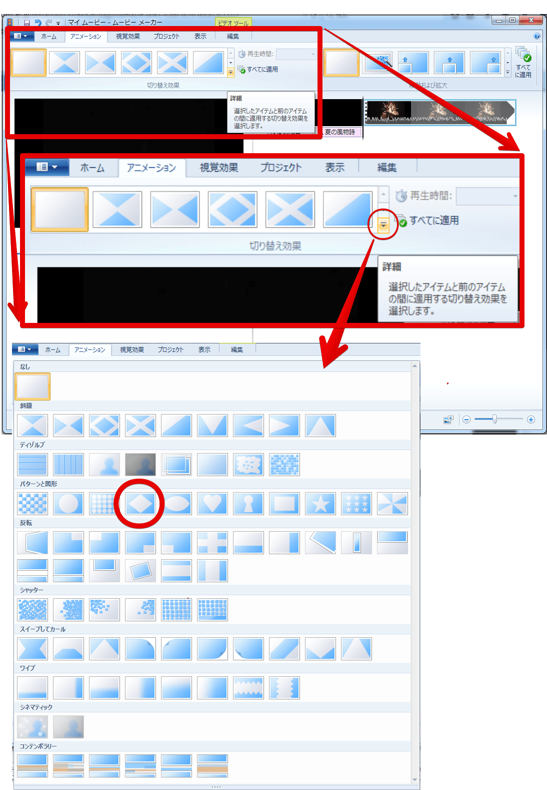
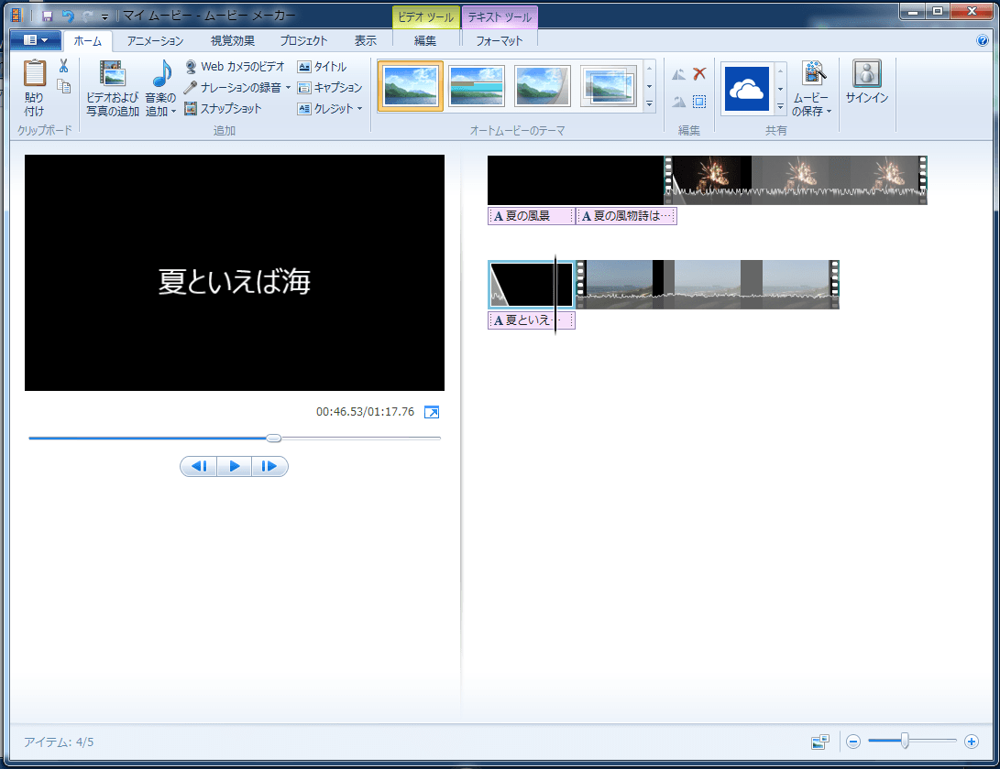
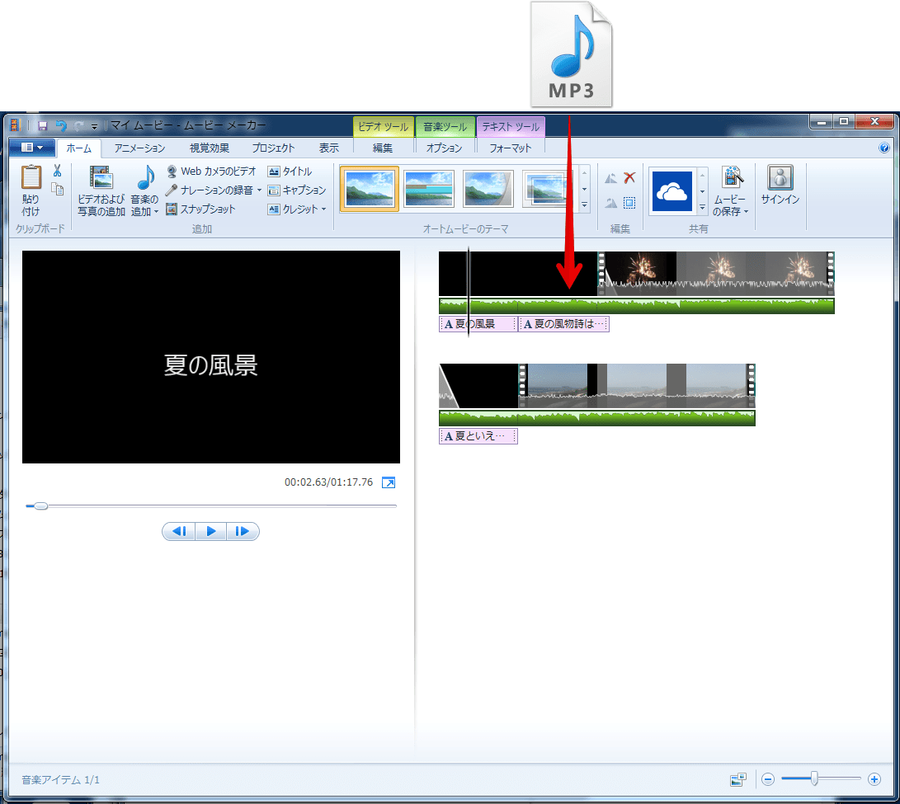
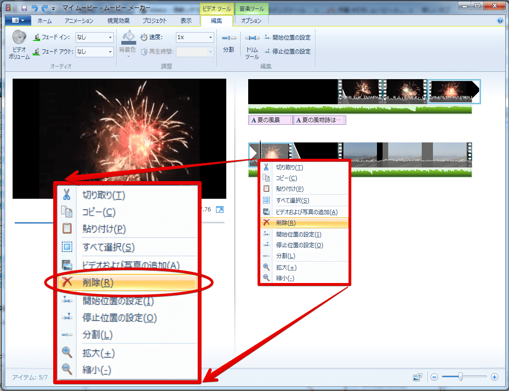
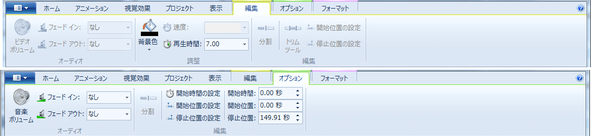

Windows ムービー メーカーについて
---------------------------------

Windows ムービー メーカーは動画編集ソフトの１つで、オリジナルの動画を作成するための基本的な機能を備えたソフトとして広く用いられています。
具体的には、自身で撮影した動画・画像ファイルや音楽ファイルを用いて、カット・切り替え・タイトルの追加などの編集をすることができます。
このような編集をすることにより動画の見栄えを良くしたり、動画の内容をより効果的に見せることができます。

動画編集ソフトは様々な種類があり、Windows ムービー メーカーにはない機能を持ったソフトもたくさんあります。
この講で動画編集の基本的な概念を学んだ後、自分たちの目的に合った動画を作れるソフトを探してみましょう。

-   [ムービー メーカー](http://windows.microsoft.com/ja-jp/windows-live/movie-maker)

Windows ムービー メーカーを使った動画の編集
-------------------------------------------

### 起動

まず、Windows ムービー メーカーを起動しましょう。

[スタートボタン]をクリックし、[すべてのプログラム]から[Windows Movie Maker] - [Windows Movie Maker]を選択します。

### ムービークリップの読み込み

Windows ムービー メーカーにムービークリップを読み込みましょう。
ムービークリップとは、拡張子が `.wmv` や `.mp4` 、 `.avi`などとなっている動画ファイルのことです。

#### サンプル動画

リンクを右クリックし、名前をつけて保存してください。

-   [花火](fireworks.wmv)
-   [海](sea.wmv)

ムービークリップを映したい順番にドラッグアンドドロップでWindows ムービー メーカーの右画面（ストーリーボード）に載せます。
もしくは[ホーム]リボン - [ビデオおよび写真の追加]から選択し読み込みます。

### タイトルの挿入

動画の最初にタイトルを挿入してみましょう。

ムービークリップ１を選択します。

[ホーム]リボン - [タイトル]をクリックします。

タイトルを入力します。

[フォーマット]リボン - [特殊効果]から、適当なものを選択します。

[特殊効果]を選択すると、タイトルの文字の動きが設定できます。

各ムービーの前にもタイトルをつけましょう。

ムービークリップ１をクリックして選択します。
[ホーム]リボン - [タイトル]をクリックし、先ほどと同じようにタイトルを入力します。

ムービークリップ２についても同様に、タイトルを挿入しましょう。

### 切り替え効果の挿入

切り替え効果とは、タイトルからムービークリップ・ムービークリップからムービークリップへ動画が切り替わる際に、どのように画面が切り替わるかを決める効果です。
切り替え効果をうまく使うことによって、動画の質をより高めることができます。

それでは早速、切り替え効果を使ってみましょう。

ムービークリップ１をクリックし、[アニメーション]リボンを選択します。
[切り替え効果]から適当な効果を選びます。

ムービークリップ２についても同様に、切り替え効果を設定しましょう。

### 見出しの挿入

見出しとは、設定したムービークリップに重ねてテキストを表示することができる機能です。

動画の中に見出しを入れてみましょう。
見出しを入れたいムービークリップを選択し、[ホーム]リボン - [見出し]をクリックします。

### 音声の追加

動画に音声を追加しましょう。楽曲や録音した音声などの音声ファイルをムービークリップに重ねることができます。

#### サンプル音声

リンクを右クリックし、名前をつけて保存してください。

-   [BGM](o9.mp3)

使用したい音声ファイルをドラッグアンドドロップでタイムラインに載せます。

動画と音声の細かいタイミングを合わせたいときは、それぞれの長さやタイミングをタイムラインで確認して微調整しましょう。

### ビデオクリップや音声の分割・削除

ムービークリップや音声のある部分だけを選択・削除したいときには分割を活用しましょう。

動画を再生し、分割したい時間で止めて、[編集]リボン - [分割]ボタンを押します。

分割し終えたら、削除したいムービークリップを右クリックして[削除]を選択します。
必要でない音声も同様にして削除できます。

### 音声の調整

ムービークリップに音声を重ねると、ムービークリップに元から備わっている音声と混ざります。
その２つの音声はそれぞれ調整することができます。また、フェードイン・フェードアウトしながら合成することもできます。

<dl>
<dt>フェードイン・フェードアウト</dt>
<dd>タイムラインの音声クリップの上で右クリックし、[フェードイン]または[フェードアウト]にチェックを入れます。</dd>
<dt>ビデオボリューム</dt>
<dd>[編集]リボン - [ビデオボリューム]から、選択したビデオのボリュームを調整できます。</dd>
<dt>音楽ボリューム</dt>
<dd>[オプション]リボン - [音楽ボリューム]から、選択した音楽のボリュームを調整できます。</dd>
</dl>

### 保存

作成段階の動画は、「プロジェクト」として次回またWindows ムービー メーカーで編集できる形式で保存することができます。
リボンの一番左側にある [ムービー メーカー] ボタン - [プロジェクトの保存]で保存することができます。

また、作成し終えた動画は「wmv」などの形式で動画ファイルとして保存することができます。
リボンの一番左側にある [ムービー メーカー] ボタン - [ムービーの保存]をクリック、解像度および画質の設定を選択し、ムービーを保存します。
動画の容量によっては保存に長時間を要する場合もあります。

**ムービーの保存をするためには、プロジェクトと使用したムービークリップを同じフォルダ内に保存しておく必要があります。**

参考リンク
----------

### 学外サイト

-   [ムービー メーカー](http://windows.microsoft.com/ja-jp/windows-live/movie-maker)

