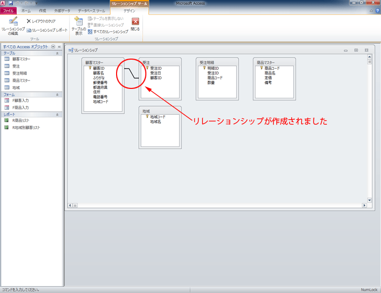

今回使うファイルです。ダウンロードしてください。

-   pencil.accdb
-   paper.accdb

リレーションシップ
--------------
### 1.  主キーと外部キー

データを効率よく管理し、かつ矛盾したデータの入力を防ぐために、テーブルをいくつかに分けます。

他のテーブルの上方を参照するためにリレーションシップ（関係づけ）を作成します。

リレーションシップを作るには、共通のフィールドが必要です。

リレーションシップを形成する際に 1 件のレコードに対し、複数件のレコードを対応させる場合、 1 件のレコードが入力されている方を一側テーブルと言い、複数件のレコードが入力されている方を多側テーブルと言います。

メインとなる一側テーブルには、主キーを設定します。多側テーブルの同様の情報が入力されたフィールドを外部キーと呼び、主キーと外部キーを一致させることによってリレーションシップを形成します。

### 2. リレーションシップの種類

-   一対多リレーションシップ

最も使用頻度の多いリレーションシップです。

一側テーブルからの 1 件のレコードと多側テーブルからの複数件のレコードを組み合わせたリレーションシップです。上の画像が例としてあげられます。

-   一対一リレーションシップ

一側テーブルからの 1 件のレコードと多側テーブルからの 1 件のレコードを組み合わせたリレーションシップです。

-   多対多リレーションシップ

一側テーブルからの 1 件のレコードと多側テーブルからの複数件のレコードを組み合わせ、また、多側テーブルからの複数件のレコードと別の一側テーブルからの 1 件のレコードを組み合わせたリレーションシップです。

一つめの一側テーブルの主キーと多側テーブルの外部キーがリレーションシップされ、さらに別の一側テーブルの主キーと多側テーブルの外部キーがリレーションシップします。

上に戻る

---
## リレーションシップを作成する

今回から"pencil.accdb"を使用します。ダウンロードして開いてください。

### "pencil.accdb"からリレーションシップを作成していきます。

### 1. [データベース ツール]タブ - [リレーションシップ] - [リレーションシップ]を押します。

### 2. [リレーションシップ ツール] - [デザイン]タブ - [リレーションシップ] - [テーブルの表示]を押します。

### 3. "テーブルの表示"ウィンドウから以下のテーブルを選択 - [追加]をクリック - [閉じる]を押します。

-   顧客マスター
-   受注
-   受注明細
-   商品マスター
-   地域

### 4. "顧客マスター"テーブルの全てのフィールドリストが見えるようにサイズを拡大します。

### 5. "受注"テーブルのフィールドリストの下に"地域"テーブルのフィールドリストを移動します。

### 6. "顧客マスター"テーブルの"顧客ＩＤ"フィールドを"受注"テーブルの"顧客ＩＤ"フィールドにドラッグアンドドロップします。

### 7. [作成]を押します。

### 8. 結合線を確認してください。

### 9. 同様に以下のリレーションシップを作成します。

    -   "受注"テーブルと"受注明細"テーブル："受注ＩＤ"フィールド
    -   "受注明細"テーブルと"商品マスター"テーブル："商品コード"フィールド
    -   "地域"テーブルと"顧客マスター"テーブル："地域コード"フィールド

### 10. 上書き保存をして、リレーションシップのウィンドウを閉じます。

上に戻る

---
## クエリでテーブルを結合する

"顧客マスター"、"受注"、"受注明細"、"商品マスター"の各テーブルを使って、受注した商品の詳細を一覧で表示します。

### 1. [作成]タブ - [クエリ] - [クエリデザイン]を押します。

### 2. テーブルタブから以下のテーブルを選択 - [追加]をクリック - [閉じる]を押します。

    -   顧客マスター
    -   受注
    -   受注明細
    -   商品マスター

### 3. "クエリ1"ウィンドウを最大化し、見やすくします。
### 4. 結合線を確認します。

### 5. "受注明細"の"受注ＩＤ"をダブルクリックします。

### 6. 同様に以下のテーブルから以下のフィールドを追加してください。

    -   "受注"テーブル："受注日"フィールド
    -   "受注"テーブル："顧客ＩＤ"フィールド
    -   "顧客マスター"テーブル："顧客名"フィールド
    -   "受注明細"テーブル："商品コード"フィールド
    -   "商品マスター"テーブル："商品名"フィールド
    -   "商品マスター"テーブル："定価"フィールド
    -   "受注明細"テーブル："数量"フィールド

### 7. [クエリツール] - [デザイン]タブ - [結果] - ボタンをクリックします。

### 8. "Ｑ受注登録"と入力して、名前を付けて保存します。

上に戻る

---
## クエリでデータを変更する

### 1. "Ｑ受注登録"の一番上のレコードの"顧客ＩＤ"フィールドの値を"1"に変更 - [Enter]キーを押します。

### 2. "顧客名"フィールドが"山本伊平"に変わりました。

### 3. 一番上のレコードの"商品コード"フィールドの値を"K-200"に変更 - [Enter]キーを押します。

### 4. "商品名"フィールドが"コピー用紙"に変わりました。

### 5. 上書き保存をして、レコードを保存します。

上に戻る

---
## 演算フィールドを追加する

### 1. "デザインビュー"に切り替えます。

### 2. "数量"フィールドの右側に"金額:定価*数量"と入力 - [Enter]キーを押し、 [クエリツール] - [デザイン]タブ - [結果] - を押します。

### 3. "金額"フィールドが追加されました。

### 4. 上書き保存をします。

上に戻る

---
## 課題 1

### "paper.accdb"にもリレーションシップを設定します。授業の初めにダウンロードした"paper.accdb"を開き、以下の指示に従って、リレーションシップを作成してください。

-   以下のテーブルをリレーションシップウィンドウに追加してください。

    -   顧客マスター
    -   受注
    -   受注明細
    -   商品マスター
    -   地域

-   以下のフィールド間でリレーションシップを設定してください。

 - "顧客マスター"テーブルと"受注"テーブル："顧客ＩＤ"フィールド
 - "受注"テーブルと"受注明細"テーブル："受注ＩＤ"フィールド
 - "受注明細"テーブルと"商品マスター"テーブル："商品コード"フィールド
 - "地域"テーブルと"顧客マスター"テーブル："地域コード"フィールド

-   リレーションシップを保存します。
-   以下の要素からなるクエリを作成します。

    -   "受注明細"テーブル："受注ＩＤ"フィールド
    -   "受注"テーブル："受注日"フィールド
    -   "受注"テーブル："顧客ＩＤ"フィールド
    -   "顧客マスター"テーブル："顧客名"フィールド
    -   "受注明細"テーブル："商品コード"フィールド
    -   "商品マスター"テーブル："商品名"フィールド
    -   "商品マスター"テーブル："定価"フィールド
    -   "受注明細"テーブル："数量"フィールド

-   作成したら、リレーションシップが正常に作動しているかどうかを調べるために以下の変更を加えます。
-   一番上のレコード（受注IDが1、顧客名が伊東祐子、商品コードがB-500）の"顧客ID"フィールドの値を"15"に変更し、"顧客名"フィールドが"畠山慶"になることを確認します。
-   同じレコードの"商品コード"を"S-400"に変更し、"商品名"が"鉛筆"になり、"定価"が"\1,200"になることを確認します。
-   最後に、演算フィールドを追加します。
-   デザインビューに切り替え、"数量"フィールドの右側に、表示名を"金額"とし、数量と定価と8%の消費税を掛け合わせたものを追加してください。

> ヒント：消費税が8%だと、消費税分は元の金額に0.08を掛けたものです。では、最終的な値段は何倍になりますか？
> 操作が分からなければ第12講で"年会費"をどうやって作ったのか思い出してみましょう。

-   [実行]を押して、"金額"フィールドが追加され、一番上のレコード（受注IDが３、顧客名が長野業平、商品コードがB-500）のものが"14040"になることを確認します。
-   "受注明細クエリ"として保存し、閉じます。

上に戻る
作成者：首都大学東京 大学教育センター 情報教育担当
