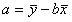

回帰分析
--------

### 変数の関係を探る流れ

-   相関分析では、2 変数の関係がわかった
-   しかし、因果関係は明らかではない
-   そこで、2つの変数間の関係式を作る
-   **回帰分析**
    -   例えば、x、yの2変数について、xを説明変数、yを目的変数として関係を表す式を求める。
    -   ただし、関係式は完全にはxとyの関係を表しきれていない場合が多い。

<dl>
<dt>単回帰分析</dt>
<dd>y = a + bx &rarr; xからyを予測</dd>
<dt>重回帰分析</dt>
<dd>2 次以上は重回帰分析を用いる（今回は省略）</dd>
<dd>y = a + bx + cx2</dd>
</dl>

単回帰分析
----------

一方の変数の値から他方の変数の値を予測する直線を単回帰直線といいます。

### 単回帰式の求め方

対になったデータ *xi* と *yi* (i = 1,2,&hellip;,n) から単回帰式 *y* = a + b<i>x</i> (a : 切片、b : 回帰係数) を求めるには以下の数式を用います。

&#9312; 

&#9313; 

### 最小 2 乗法

回帰式は完全に 2 変数 *x* と *y* の関係を表せているとは限りません。
得られたデータ *x* 、 *y* の関係をできうる限り的確に表すために直線 *y* = a + b<i>x</i> と各データの距離を考えます。

i番目のデータ (*xi*, *yi*) とこの直線との距離を *Qi* とすると、以下の数式になります。



この *Qi* の合計 &Sigma;*Qi* を最小にすることによって、2 変数 *x* と *y* の関係を表すのに最も適した直線式を求めることができます。
&Sigma;*Qi* が最小の時に上記&#9312;式と&#9313;式から得られる b と a がそれぞれ回帰係数と切片になります。

### 練習 1

次のデータは、A国とB国の軍事支出を示したものです。
A国の軍事支出（x）からB国の軍事支出（y）を予測する次のような 1 次の回帰式を求めてください。

表 1  : A国とB国の軍事支出



### 仮説の設定

-   帰無仮説 H0 : 回帰式は統計的に意味がない
-   対立仮説 H1 : 回帰式は統計的に意味がある

### 有意水準 *&alpha;* の設定

有意水準 *&alpha;* = 0.05とします。

### Excelの操作

&#9312; まず、表１を参考にデータをExcelに入力します。



&#9313; [データ]リボン−[分析]タブ−[データ分析]をクリックします。

&#9314; [分析ツール]−[回帰分析]−[OK]を押します。





&#9315; 入力Y範囲にB国のデータ(C2〜C20)、入力X範囲にA国のデータ(B2〜B20)をそれぞれ選択します。

&#9316; 出力先は、[出力オプション]−[一覧の出力先]より適当な所(今回はB25)を選択してください。



出力結果



出力結果から回帰式を求めます。

*y* = a + b<i>x</i> のa(切片)は切片の係数 = 74.14119、b(傾き)はX値1の係数 = 0.587361と結果から読み取れます。

よって出力結果から、回帰式 *y* = 74.14119 + 0.587361<i>x</i> が求まりました。

### 回帰式の吟味

回帰式によって予測した *y* の値と、実際のyの値との差を**残差（誤差）**といいます。
この残差を用いて、作った回帰式に統計的な意味があるかどうかの検定を行うことができます。

<dl>
<dt>回帰の平方和 <i>SR</i> と残差の平方和 <i>Se</i> の計算</dt>
<dd><i>SR</i> と <i>Se</i> はそれぞれ以下の数式で求めることができます。</dd>
<dd></dd>
<dd></dd>
<dt>回帰の分散 <i>VR</i> と残差の分散 <i>Ve</i> の計算</dt>
<dd><i>VR</i> と <i>Ve</i> はそれぞれ以下の数式で求めることができます。</dd>
<dd></dd>
<dd></dd>
<dt>検定統計量F値の計算</dt>
<dd>今回、検定統計量F値は以下の数式で求めることができます。</dd>
<dd></dd>
</dl>

### 寄与率

目的変数yの変動のうち、説明変数xによって説明できる割合を寄与率 *R^2* 、もしくは決定係数 *R^2* といいます。



-   0 &le; 寄与率 *R^2* &le; 1
    -   1 に近いほどうまく説明できている
-   単回帰分析では、寄与率 *R^2* = (相関係数 *r*)^2 になる

### p値の算出

有意水準 *&alpha;* と比較する確率 *p* 値を計算します。
*p* 値はF分布において、F以上の値が発生する確率です。

### 出力結果から



*p* 値 = 有意Fの値 = 3.59 &times; 10^-9 = 0.00000000359 &lt; 有意水準 *&alpha;* = 0.05より、帰無仮説 H0 は棄却されます。
従って、回帰式は統計的に意味があることになります。

課題 1
------

上で求めた回帰式を相関分析の項を参考にして、グラフで表してみましょう。

