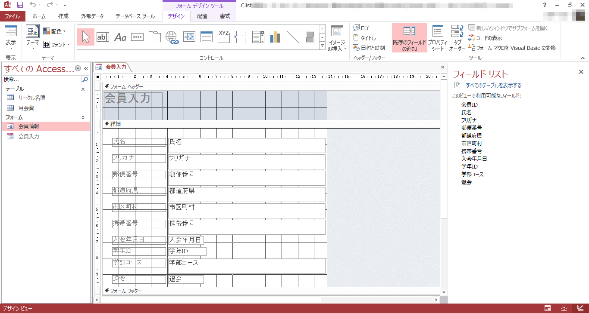
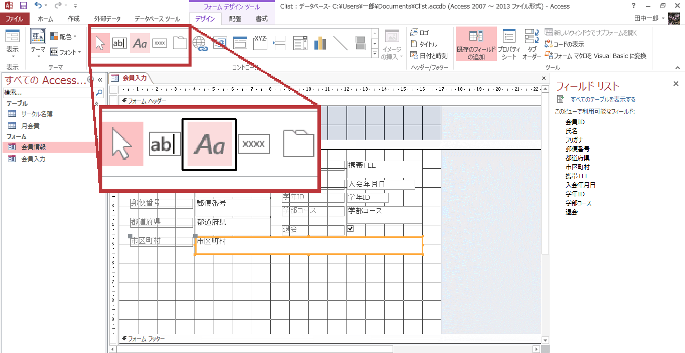
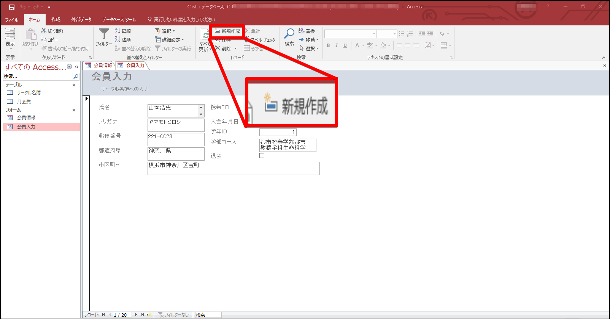
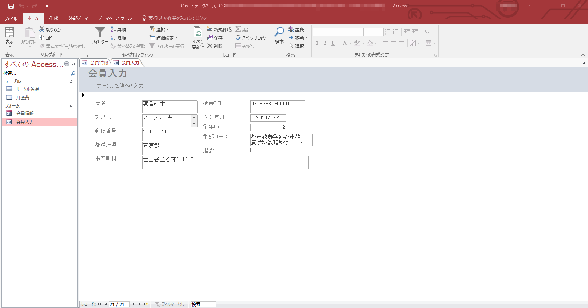
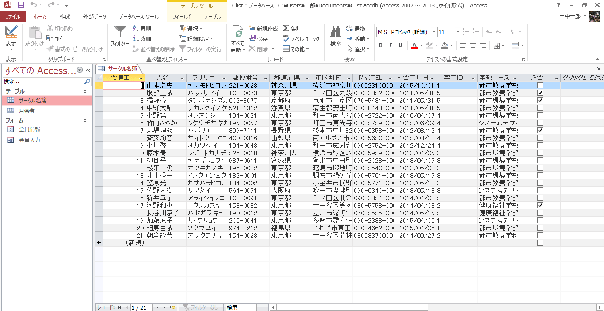

フォーム
--------------
前回から引き続いて、"Clist.accdb"を使用します。開いてください。

### フォームを新規に作成する

1. "サークル名簿"を選択しておき、[作成]タブ - [フォーム] - [フォーム]をクリックします。

2. このようにフォームが作られました。上書き保存を押して、"会員情報"で保存しましょう。

### フォームウィザードでフォームを作成する

1. [フォーム] - [フォームウィザード]を押します。

2. テーブル/クエリを[テーブル：サークル名簿]を選択 - 以下のフィールドを選択可能なフィールドから選択したフィールドへと移します。
    -   氏名
    -   シメイ
    -   郵便番号
    -   都道府県
    -   市区町村
    -   自宅TEL
    -   入会年月日
    -   学年ＩＤ
    -   学部コース
    -   退会

3. [次へ]を押します。

4. "単票形式"にチェックをつけたまま、[次へ]を押します。

5. 好きなスタイルを選択し[次へ]を押します。

6. "会員入力"と入力し、"フォームを開いてデータを入力する"を選択して、[完了]を押します。

このようにフォームが作成されました。

### コントロールの配置とサイズ変更

1. "会員入力"を開き、"デザインビュー"に切り替えます。

2. 背景の境界線をメモリの17付近まで広げます。

3. "氏名"フィールドの右端をメモリの8付近まで縮めます。

4. その他の項目も同様に縮めます。

5. "自宅TEL"から"退会"までを選択し、右上に移動します。

6. "市町村区"のテキストボックスを選択し、右に広げます。

### コントロールの追加

1. [デザインビュー]に切り替えます。
2. [フォームデザインツール] - [デザイン] - [コントロール] - [ラベル]をクリック - "フォーム ヘッダー"のセクション内で任意の範囲を選択し、コントロールを追加します。

3. コントロール内に"サークル名簿への入力"と入力 - [Enter]キーを押して、確定します。

4. もう一度、"サークル名簿への入力"のコントロールをアクティブにします - "プロパティシート"の[書式]タブにある"フォントサイズ"を"10"に変更 - コントロールの領域を適当に調節します。

5. フォームビューに戻り、上書き保存してください。

### フォームで新しいレコードを入力

1. レコードの
を押します。

2. 以下のデータを入力してください。
    -   氏名：朝倉紗希
    -   郵便番号：154-0023
    -   市区町村：世田谷区若林4-42-0
    -   自宅TEL：03-5837-0000
    -   学年ＩＤ：2
    -   学部コース：都市教養学部都市教養学科数理科学コース

3. 閉じて、サークル名簿を開きます。

---

課題 1
--------------
"congress"の"会員名簿"テーブルを基に次の指示に従ってフォームを作成してください。

1. "会員名簿"テーブルを基に、[フォーム]を使って単票形式のフォームを作成してください。作成したフォームに"会員情報"という名前を付けて保存してください。
2. "会員情報"フォームを閉じます。
3. "会員名簿"テーブルを基に、[フォームウィザード]を使って、以下のような単票形式のフォームを作成してください。
    -   表示するフィールド：会員ＩＤを除く全て
    -   スタイル：フレッシュ
    -   フォーム名：会員入力
4. 全てのフィールドのサイズを縮めます。位置の目安は水平ルーラーの目盛りの"9"にしてください。
5. "自宅TEL"、"入会年月日"、"会員タイプ"、"職種"、"退会"を他のフィールドの横に動かしてください。位置の目安は水平ルーラーの目盛りの"10"にしてください。
6. "市区町村"のテキストボックスのサイズを広げる。位置の目安は水平ルーラーの目盛りの"11"にしてください。
7. タイトルの下に"会員名簿への入力"というラベルを追加してください。フォントサイズは"10"ポイントに変更します。
8. フォームを上書き保存し、"会員入力"フォームを閉じます。
