本教材に掲載する製品名は、一般に各開発メーカの商標、または登録商標です。

練習で使ったデータは必ず保存するようにしましょう

レポート
--------------
前回から引き続いて、"Clist.accdb"を使用します。開いてください。

### レポートウィザードでレポートを作成する

1. [作成]タブ - [レポート] - [レポート ウィザード]を押します。
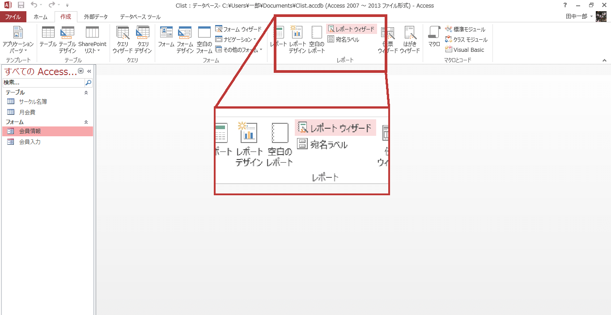

2. "テーブル/クエリ"から[テーブル：サークル名簿]を選択 - 以下のフィールドを選択可能なフィールドから選択したフィールドに移動します。
    -   会員ＩＤ
    -   氏名
    -   入会年月日

3. [次へ]を押します。
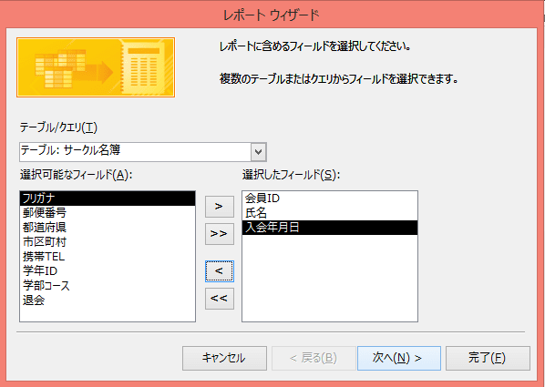

4. [次へ]を押します。
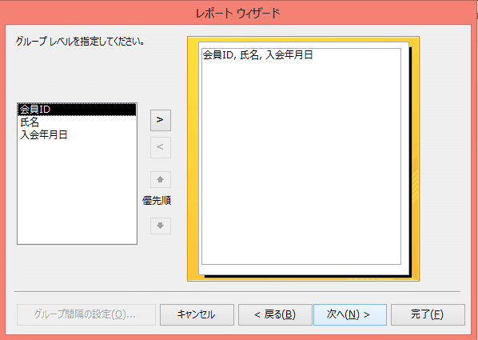

5. [次へ]を押します。
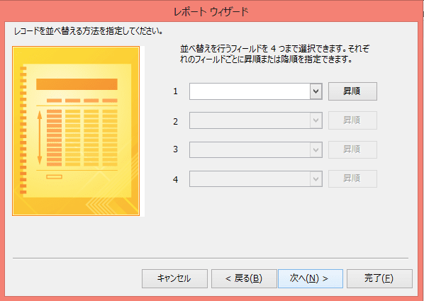

6. レイアウトの"表形式"にチェックを付けます - [次へ]を押します。
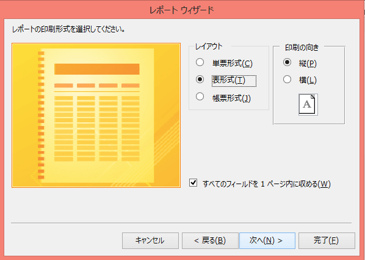

7. 好きなスタイルを選択し、[次へ]を押します。

8. "入会日リスト"と入力 - "レポートをプレビューする"にチェック - [完了]を押します。

これで、入会日のリストを報告書として作成することができました。
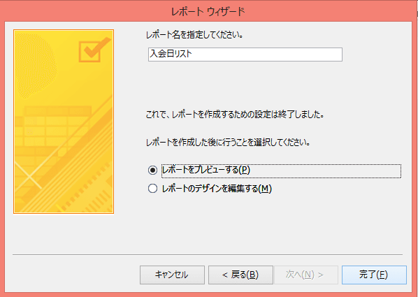
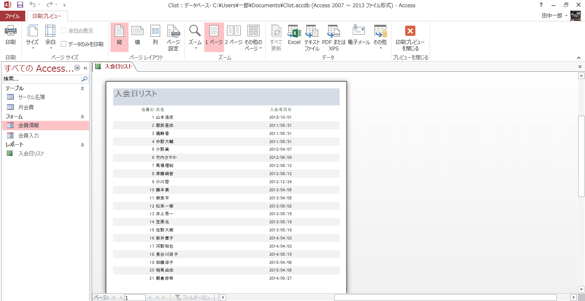

### 印刷プレビューを閉じる

レポートを"印刷プレビュー"で表示するとコマンドタブの構成が変わってしまいます。 [印刷プレビュー]タブ - [プレビューを閉じる] - [印刷プレビューを閉じる]で元の表示に戻すことが可能です。
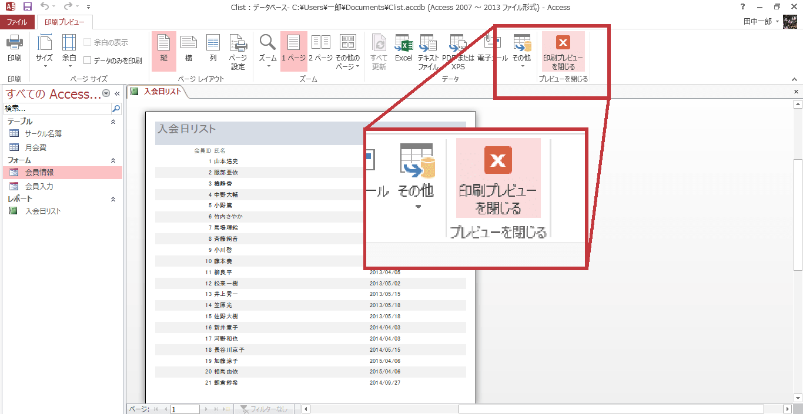

### レポートの編集（コントロールのサイズ変更）

1. [デザインビュー]を押して、切り替えます。
2. ページヘッダーセクションの"氏名"ラベルをアクティブにします。"氏名"ラベルを水平ルーラー（横方向）の目盛りの"5"の直下まで縮めます。
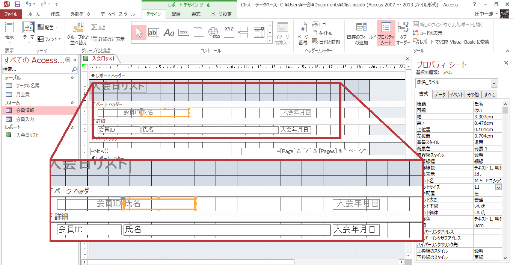

3. 上書き保存して、[レポート ビュー]に切り替えます。
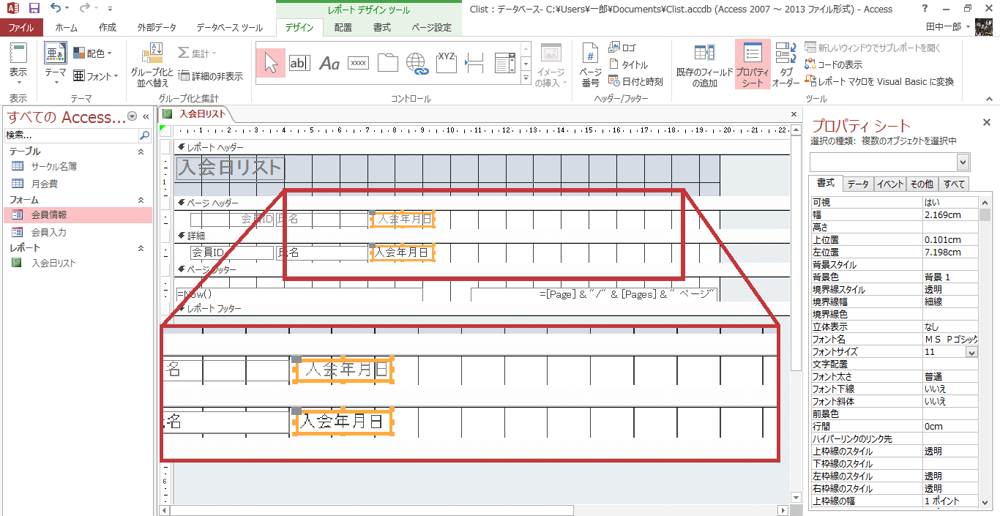

このようにして、"氏名"の領域を適切な長さにすることができました。

### 宛名ラベルの作成

1. "サークル名簿"を選択しておきます。
2. [作成]タブ - [レポート] - [宛名ラベル]を押します。
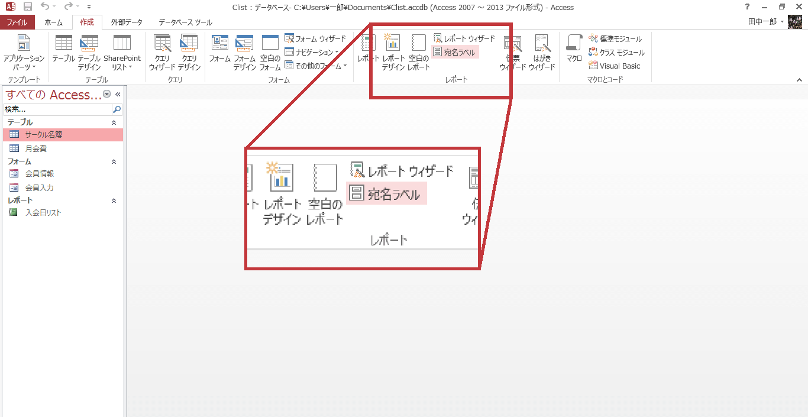

3. メーカーから[A-ONE]を選択 - 製品番号[AOne 28175]を選択 - [次へ]を押します。
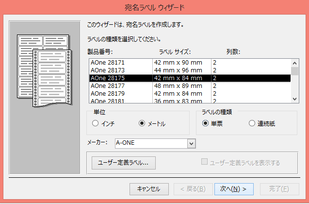

4. [次へ]を押します。
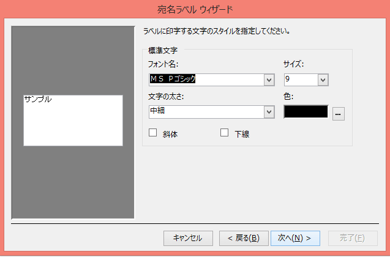

5. ラベルのレイアウトに"〒"と入力します。
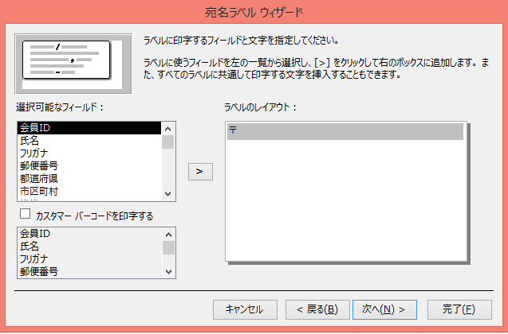

6. 選択可能なフィールドから[郵便番号]をラベルのレイアウトの"〒"の横に移します。

7. ラベルのレイアウト内で、2 行目にカーソルを移動 - 選択可能なフィールドから[都道府県]と[市区町村]をラベルのレイアウトに移します。
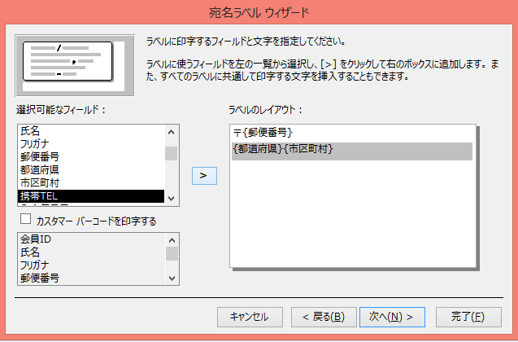

8. 同様に、以下の図のようにレイアウトを完成させてください。完成したら、[次へ]を押します。
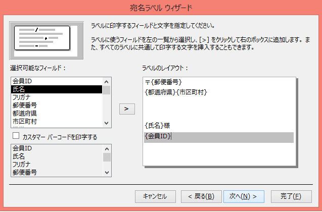

9. [次へ]を押します。
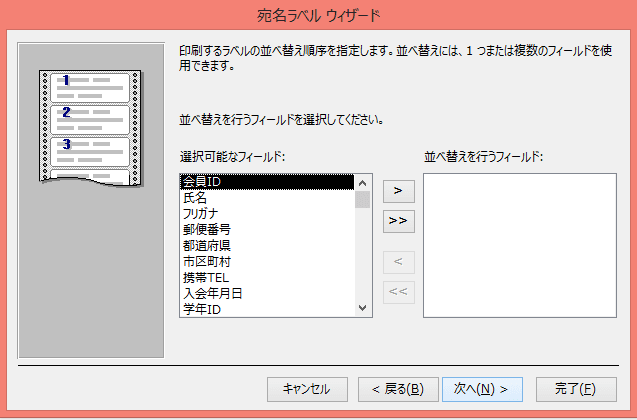

10. レポート名に"宛名ラベル"と入力 - "ラベルのプレビューを見る"にチェック - [完了]を押します。
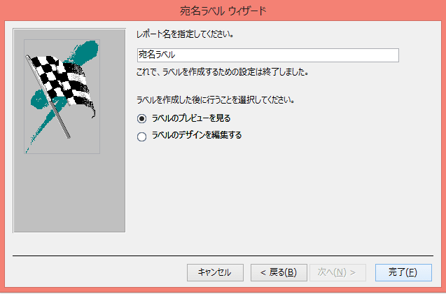
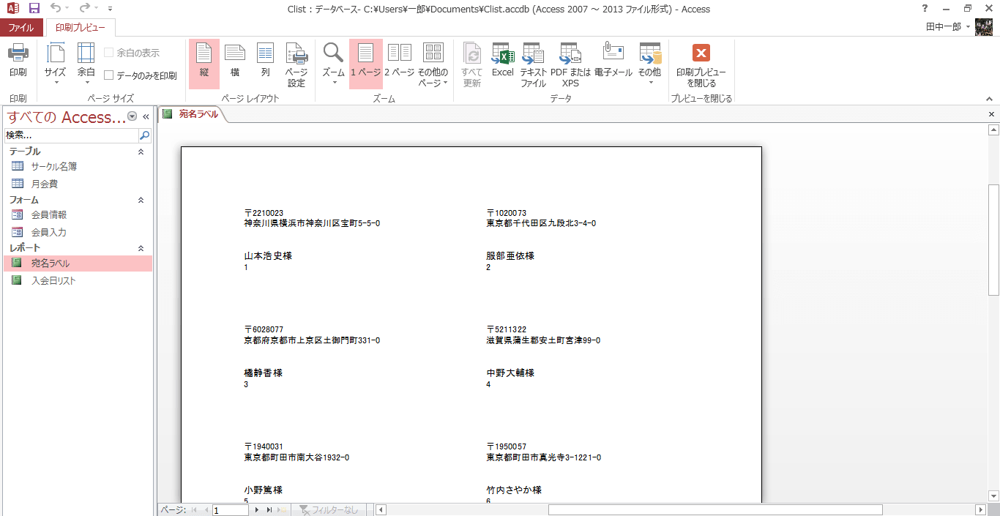

これで、封筒に貼る宛名を作ることができました。

### 宛名ラベルの編集

1. [デザインビュー]に切り替えます。
2. 「=Trim([氏名] & "様")」ラベルをクリック - "プロパティ シート" - "書式"タブ - "フォントサイズ"を"12"に設定します。
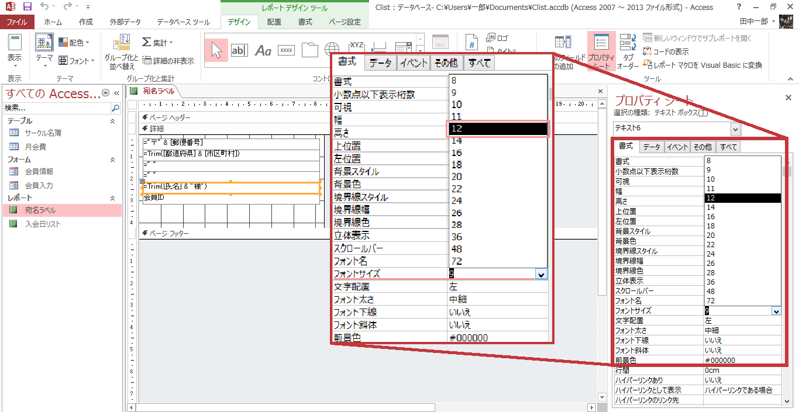

3. "会員ＩＤ"ラベルを選択し、[ホーム]タブ - [表示] - [印刷プレビュー]を押します。
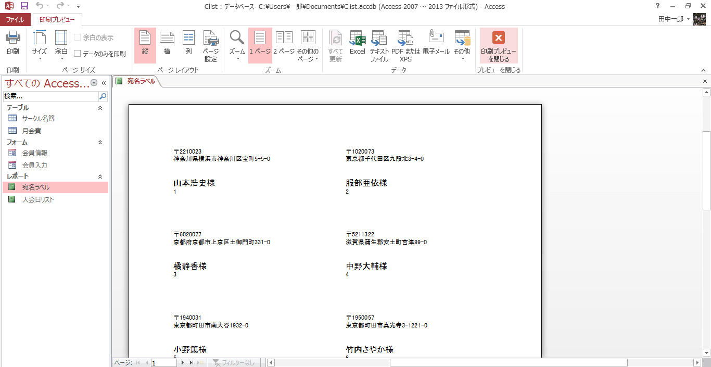

これを印刷して、張り付ければ、手紙を簡単に出すことができます。

課題 1
--------------
レポートを作成してください。

1. "会員名簿"テーブルを基にレポートウィザードを使って、表形式のレポートを作成してください。
    -   表示するフィールド：会員ＩＤ、氏名、入会年月日
    -   スタイル：フレッシュ
    -   レポート名：入会日リスト
2. "入会日リスト"レポートを閉じます。
3. "会員名簿"テーブルを基に宛名ラベルを作成してください
    -   ラベルのメーカー：A-ONE
    -   ラベルの種類：AONE28175
    -   ラベルのレイアウト  
   ・ 1 行目　〒{郵便番号}  
   ・ 2 行目　{都道府県}{市区町村}  
   ・ 4 行目　{氏名} 様  
    -   レポート名：宛名ラベル
4. "氏名"ラベルのフォントサイズを"12"ポイント、配置を中央揃えに変更し、上書き保存します。
5. "宛名ラベル"レポートを閉じます。
