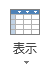

クエリ
------

前回から引き続いて、"Clist.accdb"を使用します。開いてください。

### デザインビューでクエリを作成する

&#9312; [作成]タブ - [クエリ] - [クエリデザイン]をクリックします。

&#9313; テーブルから"サークル名簿"を選択 - [追加]をクリックします。

&#9314; クエリ デザイン ウィンドウにテーブルが追加されました。[閉じる]をクリックします。

&#9315; "サークル名簿"の"会員ＩＤ"をダブルクリックします。すると、フィールドに会員ＩＤが追加されます。

&#9316; 同様に以下を追加します。

-   氏名
-   フリガナ
-   入会年月日
-   学部コース
-   退会

&#9317;  （[表示]）もしくは  （[実行]）をクリックします。

&#9318;  をクリックして、"入会日と所属"という名前でクエリを保存します。

このようにして、"入会年月日"と"学部コース"、"退会"情報に特化したクエリを作ることができました。

### 並べ替えを設定する

&#9312; "デザインビュー"に切り替えます。

&#9313; "フリガナ"フィールドの並べ替えをクリック - "昇順"を選択します。

&#9314;  もしくは  をクリックし表示を切り替え、上書き保存します。

"フリガナ"の昇順、すなわちアイウエオ順に並べ替えられました。

### 単一条件で抽出する

&#9312; [作成]タブ - [クエリ] - [クエリデザイン]をクリックします。

&#9313; テーブルから"サークル名簿"を選択 - [追加]をクリックします。

&#9314; フィールドリストのタイトルバーである"サークル名簿"をダブルクリックします。すると、サークル名簿内の全てのフィールドが選択状態になります。

&#9315; 選択したもの全てをデザイングリッドにドラッグアンドドロップします。

&#9316; "フリガナ"フィールドを選択 - キーボードの[Delete]キーを押して削除します。

&#9317; 同様に"携帯TEL"フィールドも削除します。

&#9318; "都道府県"フィールドの抽出条件に"東京都"と入力 - [Enter]キーを押します。

&#9319;  もしくは  をクリックします。

これで、東京都の会員だけが抽出されました。"東京都会員"と入力して、保存します。

### OR条件で抽出する

&#9312; "デザインビュー"に切り替えます。

&#9313; "都道府県"フィールドの「または」に"神奈川県"と入力 - [Enter]キーを押します。

&#9314;  もしくは  をクリックします。

これで、東京都と神奈川県の会員だけが抽出されました。

### AND条件で抽出する

&#9312; "デザインビュー"に切り替えます。

&#9313; "都道府県"フィールドの「または」に入力されている"神奈川県"を選択 - [Delete]キーを押して、削除します。

&#9314; "退会"フィールドの抽出条件に半角で"yes"と入力 - [Enter]キーを押します。

&#9315;  もしくは  をクリックします。

これで、東京都でかつ退会した会員だけが抽出されました。

### ワイルドカードを利用して抽出する

「＊（ワイルドカード)」は、任意の文字列を表しています。つまり、"学部コース"フィールドに"都市教養学部*"と入力すると、先頭に"都市教養学部"がついていればその後ろの文字列に関係なく抽出します。

&#9312; "デザインビュー"に切り替えます。

&#9313; "都道府県"フィールドの抽出条件に入力されている"東京都"を削除 - "退会"フィールドの抽出条件に入力されている"Yes"を削除します。

&#9314; "学部コース"フィールドの抽出条件に"都市教養学部*"と入力 - [Enter]キーを押します。

&#9315;  もしくは  をクリックします。

これで、都市教養学部の会員だけが抽出されました。

### 一定範囲を指定してデータを抽出する

&#9312; "デザインビュー"に切り替えます。

&#9313; "学部コース"フィールドの抽出条件に入力してある"Like"都市教養学部*""を削除します。

&#9314; "入会年月日"フィールドの抽出条件に半角で"Between #2013/1/1# And #2013/12/31#"と入力 - [Enter]キーを押します。

&#9315;  もしくは  をクリックします。

これで、2013 年 1 月 1 日から 2013 年 12 月 31 日までに入会した会員だけが抽出されました。[ファイル]タブ - [オブジェクトに名前を付けて保存]をクリックし、"2007年入会会員"という名前で保存します。

課題
----

"congress"の"会員名簿"テーブルを基に次の指示に従ってクエリを作成し、並べ替えや条件の設定を行ってください。

-   "会員名簿"テーブルを基に、デザインビューでクエリを作成して実行し、名前を付けて保存してください。
-   表示するフィールド：会員ＩＤ、氏名、シメイ、入会年月日、職種、退会
-   クエリ名：入会日と職種
-   "入会日と職種"クエリに抽出条件と並べ替えを設定して実行し、名前を付けて保存してください。
-   抽出条件："職種"が"大学"から始まる語で、"退会"が"No"の会員
    -   ヒント：ワイルドカードを使いましょう。
-   並べ替え："シメイ"の昇順
-   クエリ名：大学関係者
-   "大学関係者"クエリの抽出条件を削除した後に、以下のように変更して実行し、名前を付けて保存し直してください。
-   抽出条件："入会年月日"が"2009/1/1"から"2009/12/31"までの会員（元々の抽出条件は削除）
-   クエリ名：2009年入会会員
-   "2009年入会会員"クエリを閉じます。
