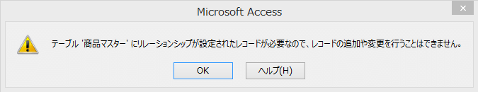
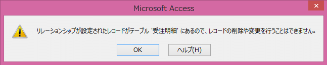
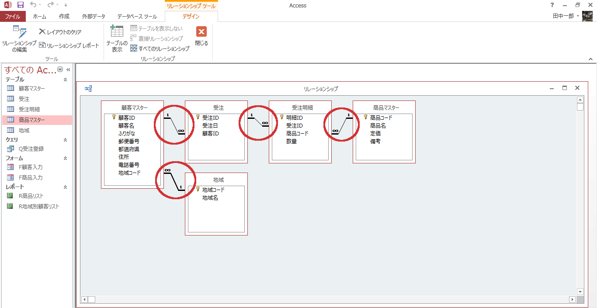
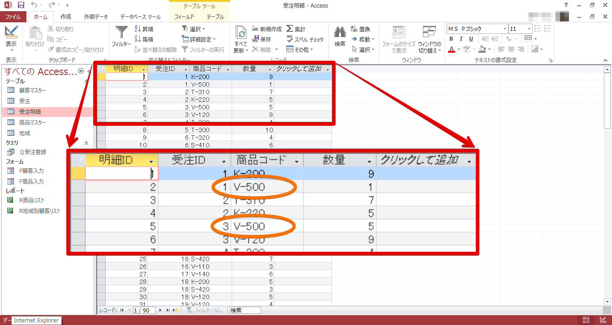
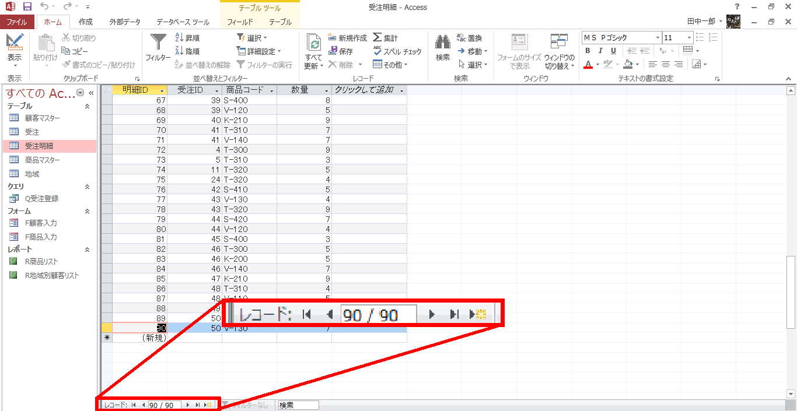
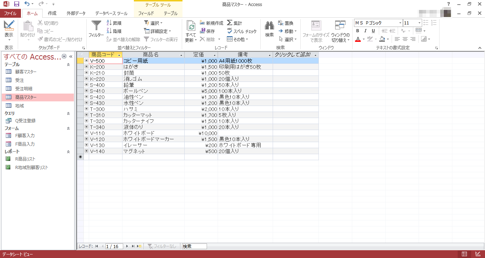
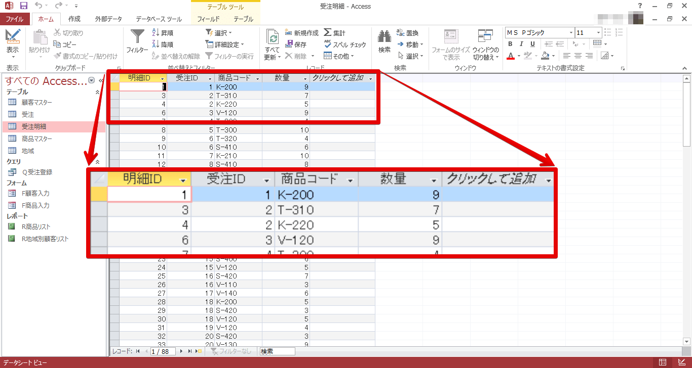

参照整合性
----------

レコードの入力や削除をしても、テーブル間のデータの結びつきは正しいまま保たれます。

多側テーブルに、一側テーブルのどのレコードとも結びつかないレコードはありません。

### 多側テーブルでの外部キーの入力の制限

多側テーブルの外部キーフィールドに、一側テーブルに存在しないデータを入力することはできません。

### 一側テーブルでの主キーの更新・削除の制限

一側テーブルの主キーと多側テーブルの外部キーに同じデータが存在しており、それらが結びついている場合、一側テーブルの主キーフィールドを更新・削除することはできません。

前回から引き続いて、"pencil.accdb"を使用します。開いてください。

### 参照整合性を設定する

&#9312; [データベース ツール]タブ - [リレーションシップ] - [リレーションシップ]をクリックします。

&#9313; 適当な結合線をダブルクリックします。

&#9314; "参照整合性"にチェック - [OK]をクリックします。

一側テーブルに"1"とつき、多側テーブルに"∞"がつきます。

&#9315; 同様に全ての結合線に関して、"参照整合性"にチェックを入れます。

### 多側テーブルでの外部キーの入力の制限を確認する

&#9312; "受注明細"を開きます。

&#9313; 先頭のレコードの"商品コード"フィールドの値を"S-500"に変更します。

&#9314;.  ([更新])をクリックします。

&#9315; "商品マスター"テーブルに"S-500"がないので、エラーがおきました。

&#9316; [OK]をクリック - [Escape]キーを押して閉じます。

### 一側テーブルでの主キーの更新の制限を確認する

&#9312; "商品マスター"を開きます。

&#9313; 先頭のレコードの"商品コード"フィールドの値を"V-500"に変更します。

&#9314; をクリックします。

&#9315; "受注明細"テーブルで"B-500"を使用しているので、エラーがおきました。

&#9316; [OK]をクリック - [Escape]キーを押します。

### 一側テーブルでの主キーの削除の制限を確認する

&#9312; 先頭のレコードを削除します。先頭のレコードを選択し、右クリック - [レコードの削除]をクリックします。

&#9313; "受注明細"テーブルで"B-500"を使用しているので、エラーが起きました。

&#9314; [OK]をクリックします。

連鎖更新と連鎖削除
------------------

参照整合性に加えて、連鎖更新、連鎖を設定すると、データの整合性を維持したままデータの更新や削除を行うことができます。

#### 連鎖更新

#### 連鎖削除

### 連鎖更新と連鎖削除を設定する

&#9312; [データベース ツール]タブ - [リレーションシップ] - [リレーションシップ]をクリックします。

&#9313; 適当な結合線をダブルクリックします。

&#9314; "フィールドの連鎖更新"と"レコードの連鎖削除"にチェック - [OK]を押します。

&#9315; 全ての結合線に関して、"フィールドの連鎖更新"と"レコードの連鎖削除"にチェックを付けます。

### 連鎖更新を確認する

&#9312; オブジェクトの中の[テーブル]を選択 - "受注明細"を開きます。

2 件目と 5 件目のレコードの"商品コード"フィールドの値が"B-500"であることを確認してください。

&#9313; 次に"商品マスター"を開きます。

&#9314; "商品コード"の"B-500"を"V-500"に変更します。

 を押します。

&#9315; "受注明細"の 2 件目と 5 件目のレコードの"商品コード"フィールドの値が"V-500"に変わったことを確認します。

これで連鎖更新を確認することができました。

### 連鎖削除を確認する

&#9312; "受注明細"を開きます。

2 件目と 5 件目のレコードの"V-500"であることを確認します。

&#9313; 一番下までスクロールした後に、レコードが 90 件表示されていることを確認します。

&#9314; "受注明細"を閉じます。

&#9315; 次に"商品マスター"を開きます。

&#9316; "商品コード"フィールドの値が"V-500"のレコードを削除します。

&#9317; [はい]をクリックします。

&#9318; "商品マスター"を閉じます。

&#9319; もう一度"受注明細"を開きます。

&#9320; 元の 2 件目と 5 件目のレコードだった"V-500"が削除されていることを確認します。

&#9321; 一番下までスクロールした後に、レコードが 88 件表示されていることを確認します。

&#9322; 閉じます。

課題
----

前回課題として扱った"paper.accdb"のリレーションシップにも参照整合性と連鎖更新・連鎖削除を設定します。

1. リレーションシップウィンドウを開き全ての結合線に参照整合性と連鎖更新・連鎖削除を追加してください。
2. 参照整合性と連鎖更新・連鎖削除が設定されたかを確認するために、以下の操作を行ってください。
    -   "受注明細"テーブルで"B-500"のあるレコードを確認してください。
    -   "商品マスター"テーブルで"消しゴム"の商品コードを"P-530"に変更してください。
    -   再び"受注明細"テーブルで元々"B-500"だったレコードが"P-530"に置き換わっているのを確認してください。
    -   さらに"受注明細"テーブルで"S-400"のあるレコードを確認してください。
    -   "商品マスター"テーブルで"鉛筆"のレコードを削除してください。
    -   再び"受注明細"テーブルで元々"S-400"だったレコードが削除されているのを確認してください。
