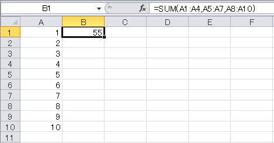

Microsoft Excelには非常に多くの関数が用意されています。

関数の書式
----------

演算子の項でも触れましたが、数式は `=` （半角イコール）から始まります。

例えば、関数SUMの場合について考えてみましょう。

上は**「A1」から「A10」までの区間("a1:a10"で表現)**の総和を求める関数 `SUM()` の利用例です。以下の計算でも同じ結果となります。

その他のよく使う関数としては、平均値 `AVERAGE()` 、最高値 `MAX()` 、最低値 `MIN()` 等があります。

その他の関数
------------

空白セルを選択し、数式バーの左にある  をクリックすると、以下のような一覧表が表示されます。ここから必要な関数を探すと良いでしょう。

